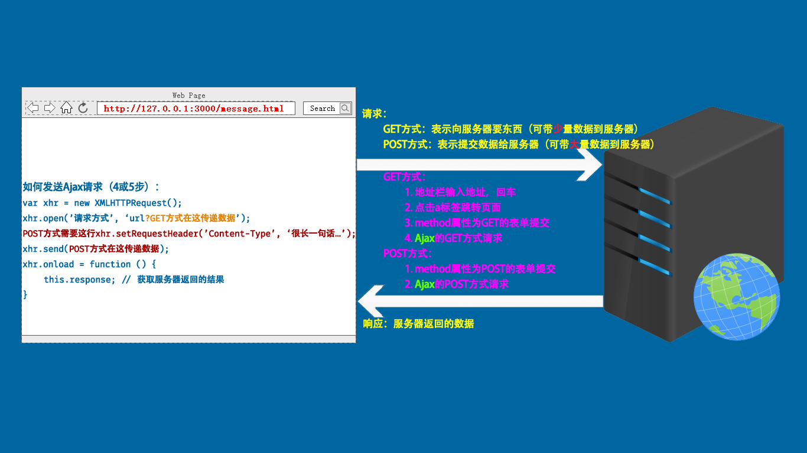
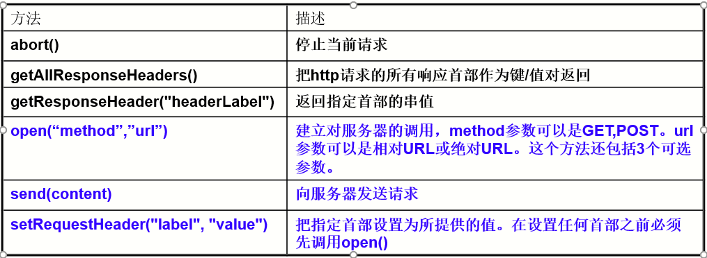
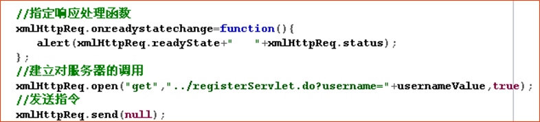
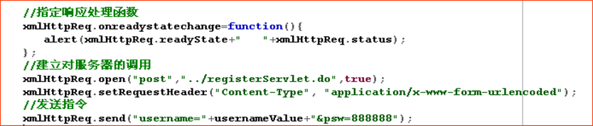
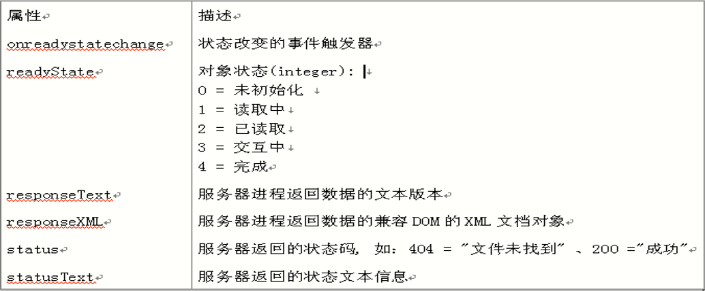
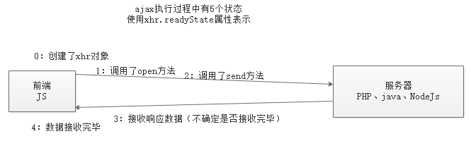
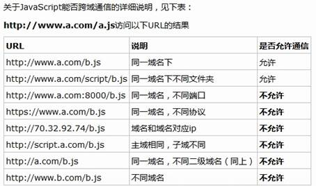

# Ajax

- Ajax是一种技术、是能够使浏览器和服务器进行交互（请求响应）的一种技术。
- Ajax也是一套内置在浏览器端的API，核心对象是 `XMLHttpRequest` ，通过这些API的调用，可以实现发送Ajax类型的请求和收取服务器端响应的数据。
- **Ajax通过在后台与服务器进行少量数据交换，AJAX 可以使网页实现异步更新。这意味着可以在不重新加载整个网页的情况下，对网页的某部分进行更新**。传统的网页（不使用 AJAX）如果需要更新内容，必须重载整个网页页面。

访问服务器方法

- 127.0.0.1  始终可以访问到本机的服务器；
- localhost  始终可以访问到本机的服务器；



### 实现Ajax的步骤

**1.创建XMLHttpRequest对象**

-  **面试题如何创建核心对象(代码实现背来下)：**

**2.注册监听**

- 利用XMLHttpRequest对象的onreadystatechange属性：用于监听服务器端的状态。
- 利用XMLHttpRequest对象的readyState属性：获取服务器端的状态。
- 利用XMLHttpRequest对象的status属性：获取状态码(404等)。

**3.建立连接**

- **利用XMLHttpRequest对象的open()方法；**

**4.发送请求**

- **利用XMLHttpRequest对象的send()方法**；
  - 如果请求类型是GET方式，send()方法不起作用；
  - 如果请求类型是POST方式，send()方法起作用；

#### 对象方法：



##### open(method, url, async)

- XMLHttpRequest 对象的 open 方法允许程序员用一个Ajax调用向服务器发送请求。
- method：请求类型，类似 “GET”或”POST”的字符串。
  - **若只想从服务器检索一个文件，不需要发送任何数据。使用GET**(可以在GET请求里通过附加在URL上的查询字符串来发送数据，数据大小限制为2000个字符)。
  - **若需要向服务器发送数据，用POST；**
-  url： 要请求的地址（字符串类型）。
-   async：是否异步（布尔类型）。
  - 其作用就是设置此次请求是否采用异步方式执行，默认为 `true`，表示异步操作。如果需要同步执行可以通过传递 `false` 实现；(开发中不会用同步方式)；
  - 异步方式执行时，不会阻塞后续代码的执行；而同步方式执行时，会阻塞后续代码的执行；
- 在IE浏览器下，会把多个XMLHttpRequest请求的结果缓存在同一个URL。如果对每个请求的响应不同，这会带来不好的结果。把**当前时间戳追加到URL的最后,就能确保URL的惟一性**，从而避免浏览器缓存结果。

```
IE缓存问题解决方案：
让每次请求的URL都不同；
不同的查询字符串(请求参数)会被浏览器认为是不同的地址，浏览器会忽略客户端缓存。；
var xhr = new XMLHttpRequest()
xhr.open('GET', '/time?t=' + Date.now())
xhr.send(null)
xhr.onload = function () {
  console.log(this.responseText)
}
```

##### send(data)：

- send 方法可为已经待命的请求发送指令。

- data：要发送的数据（字符串类型）。
  - **若选用的是 GET 请求，则不会发送任何数据， 给 send 方法传递 null 即可**：request.send(null);
  - **当向send()方法提供参数时，要确保open()中指定的方法是POST**，如果没有数据请求发送使用null。

##### setRequestHeader(header,value)方法：

- header： 首部的名字（字符串类型）；vlaue：  首部的值（字符串类型）；

- 当浏览器向服务器请求页面时，它会伴随这个请求发送一组首部信息。这些首部信息是一系列描述请求的元数据(metadata)。首部信息用来声明一个请求是 GET 还是 POST。
- Ajax 请求中，发送首部信息的工作可以由 setRequestHeader完成。

- **如果用 POST 请求向服务器发送数据，需要将 “Content-type” 的首部设置为 “application/x-www-form-urlencoded”.它会告知服务器正在发送数据，并且数据已经符合URL编码了。**
- **该方法必须在open()之后才能调用**

**完整的 Ajax 的 GET 请求示例：**



#### GET 请求传参

- 什么时候需要带请求参数
  - 请求参数又叫做查询字符串；
  - 一般用于告诉服务器此次请求的详细目的，比如查询什么、删除哪条记录等；
- URL 携带查询字符串
  - 查询字符串(querystring)：
    - URL中==问号后面==携带的就是 get 请求传参的数据，叫做查询字符串；
    - 格式：aa=xxx&bb=yyyy；
    - 查询字符串只适合传输少量数据。

```js
//代码演示：
<input type="button" id="btn" value="发送请求">
<script>
// 点击按钮的时候，发送ajax请求
document.getElementById('btn').onclick = function () {
	// 1. 创建xhr对象
	var xhr = new XMLHttpRequest();
	// 2. 调用open，设置请求（方式、url）
	xhr.open('GET', '/query-get?id=11&age=22');
	// 3. 调用send，发送请求
	xhr.send(null);
	// 4. 当请求响应过程结束后，才获取服务器响应的结果
	xhr.onload = function () {
		console.log(this.response);
}};
</script>
```

完整的 Ajax 的 POST 请求示例：**

**案例-验证用户名**

```js
使用的接口是 POST方式的checkUser，参数必须为username，值是注册的用户名；服务器上目前已有zhangsan、lisi、wangwu三个用户了。
<body>
<input type="text" id="user"><span id="msg"></span>
<script>
// 当输入框失去焦点的时候，向接口checkUser发送ajax请求，验证用户名
	document.getElementById('user').onblur = function () {
	// 获取输入的值
	var user = this.value;
	// 发送ajax请求
	var xhr = new XMLHttpRequest();
	xhr.open('POST', '/checkUser');
	xhr.setRequestHeader('Content-Type', 'application/x-www-form-urlencoded');
	xhr.send('username=' + user);
	xhr.onload = function () {
	// console.log(this.response); // 如果返回true，说明用户名已被占用
		if (this.response === 'true') {
			document.getElementById('msg').innerHTML = '<font color="red">sorry，用户名已被占用</font>';
            } else {
			document.getElementById('msg').innerHTML = '<font color="green">恭喜，用户名可用</font>';
			}
		}
	}
</script>
</body>
```

#### 对象属性：



##### 1.onreadystatechange（触发事件）:

- 当readyState的值改变时自动触发执行其对应的函数（回调函数）。

- 该事件处理函数由服务器触发，而不是用户。

- 在 Ajax 执行过程中，服务器会通知客户端当前的通信状态。这依靠更新 XMLHttpRequest 对象的 readyState 来实现。改变 readyState 属性是服务器对客户端连接操作的一种方式。

##### 2.readyState属性：



- readyState 属性表示Ajax请求的当前状态。它的值用数字代表。
  - 0 代表未初始化。 还没有调用 open 方法；
  - 1 代表正在加载。 open 方法已被调用，但 send 方法还没有被调用；
  - 2 代表已加载完毕。send 已被调用。请求已经开始；
  - 3 代表交互中。服务器正在发送响应；
  - 4代表完成。响应发送完毕；
- 每次 readyState 值的改变，都会触发 readystatechange 事件。如果把 onreadystatechange 事件处理函数赋给一个函数，那么每次 readyState 值的改变都会引发该函数的执行。
- readyState 值的变化会因浏览器的不同而有所差异。但是，当请求结束的时候，每个浏览器都会把 readyState 的值统一设为 4。 

##### 3.status属性：

- 服务器发送的每一个响应也都带有首部信息。三位数的状态码是服务器发送的响应中最重要的首部信息，并且属于超文本传输协议中的一部分。

- 常用状态码及其含义：
  - 404 没找到页面(not found)；
  - 403 禁止访问(forbidden)；
  - 500 内部服务器出错(internal service error)；
  - 200 一切正常(ok)；
  - 304 没有被修改(not modified)(服务器返回304状态，表示源文件没有被修改 )；

- 在 XMLHttpRequest 对象中，服务器发送的状态码都保存在 status 属性里。通过把这个值和 200 或 304 比较，可以确保服务器是否已发送了一个成功的响应；

##### 4.responseText属性：

- XMLHttpRequest 的 responseText 属性包含了从服务器发送的数据。它是一个HTML,XML或普通文本，这取决于服务器发送的内容。
- 当 readyState 属性值变成 4 时, responseText 属性才可用，表明 Ajax 请求已经结束

##### 5.responseXML属性：

如果服务器返回的是 XML， 那么数据将储存在 responseXML 属性中。
只用服务器发送了带有正确首部信息的数据时， responseXML 属性才是可用的。 MIME 类型必须为 text/xml；

***xhr对象分块接收数据；***

```js
var xhr = new XMLHttpRequest()；

xhr.onreadystatechange = function () {
    conso.log('数据：' + this.responseText.length); // 数据非常长，输出它的长度看效果即可
    console.log('Ajax状态：' + this.readyState);  // 3表示正在接收数据，最后一次4表示接收完毕
}
// 这里调用 /big-data 接口，它返回100万次时间戳
xhr.open('GET', '/big-data')
xhr.send()；
```

****

#### Onprogress（过程--事件）

-  xhr 对象中的一个事件，当正在接收服务器返回数据的时候，它会触发。

**事件补充**

- onload -- 当readyState等于4的时候触发。只有请求成功了才触发。
- onprogress -- 当readyState等于3的时候触发（数据正在返回途中的时候触发）。
- onloadstart() -- 当开始发送请求的时候触发，要放到send之前。
- onloadend() -- 当请求响应过程结束的时候触发。无论成功还是失败都会触发。

```js
<p style="display: none;">玩命加载中...</p>

    <script>
        var xhr = new XMLHttpRequest();

        // 当数据正在接收的时候，会触发。它可能会触发多次
        xhr.onprogress = function () {
            // 此时，ajax的状态值为 3
            // console.log(this.response.length);
            console.log('正在下载数据，请稍后');
        }

        // 当数据完全接收后，会触发
        xhr.onload = function () {
            console.log('接收完毕，成功接收了所有的数据');
        }

        // 当ajax请求开始的时候，会触发
        xhr.onloadstart = function () {
            document.querySelector('p').style.display = 'block';
            console.log('请求开始了');
        }

        // 当ajax请求结束的时候，会触发
        xhr.onloadend = function () {
            document.querySelector('p').style.display = 'none';
            console.log('结束了，也不知道请求成功了还是失败了');
        }

        // 这里调用 /big-data 接口，它返回100万次时间戳
        xhr.open('GET', '/big-data');
        xhr.send();
    </script>
```

#### 创建XHR对象的兼容方案

```
XMLHttpRequest 在老版本浏览器（IE5/6）中有兼容问题，可以通过另外一种方式代替。
var xhr = window.XMLHttpRequest ? new XMLHttpRequest() : new ActiveXObject('Microsoft.XMLHTTP')
// xhr 的成员相同，即后续的open、send方法一样使用onreadystatechange
```

####  responseType（处理JSON数据）

- responseType，表示预期服务器返回的数据的类型，当设置了该属性后，通过 `response` 接收数据的时候，会根据该属性的值来自动处理结果为JS能够识别的数据。
- 当设置了 `responseType='json'`  后，使用 `response` 来接收服务器返回的数据时，会自动处理 JSON 数据为 JS 数组，免去了 `JSON.parse()` 这一步。

**responseType的可选值**

- 空，表示文本，和text一样。空为默认值
- text -- 文本
- json -- JSON格式数据
- document -- 文档对象。（当服务器返回的结果是XML类型的时候，需要指定为document）

```js
var xhr = new XMLHttpRequest();
xhr.onload = function () {
    // 因为指定了responseType为json。所以ajax会自动将服务器返回的结果当做json来处理
    // 会自动调用JSON.parse来将结果处理成JS数据
    console.log(this.response);
}
xhr.open('GET', '/getMsg');
// send之前，指定预期服务器返回数据的类型
xhr.responseType = 'json'; // 可选的值 '' 、 text 、 json 、 document
xhr.send();
```

### Form表单对象

#### FormData对象

- FormData是h5中新增的一个内置对象。
- formDate对象用以将数据编译成键值对，以便用`XMLHttpRequest`来发送数据。其主要用于发送表单数据，但亦可用于发送带键数据(keyed data)，而独立于表单使用。
- 以前AJAX操作只能提交字符串，现在可以提交**二进制**的数据。
- **上述使用FormData的时候，form表单中的各项必须有name属性。没有name属性是收集不到数据的**

**使用方法一（有form表单）**

```js
<form id="fm">
    <input type="text" name="user"><br>
    <input type="password" name="pwd"><br>
    <input type="radio" name="sex" value="男" checked>男
    <input type="radio" name="sex" value="女">女<br>
    <input type="file" name="pic"><br/>
    <input type="button" id="btn" value="提交">
</form>

<script>
    // 当点击提交按钮的时候，需要把表单各项的值，提交给fd接口。
        document.getElementById('btn').onclick = function () {
            // 获取各项值
            /* var user = document.getElementsByName('user')[0].value;
            var pwd = document.getElementsByName('pwd')[0].value; */

            // FormData 专门用于收集表单各项值
            // 1. 有表单，找到表单
            var form = document.getElementById('fm');
            // 2. 实例化FormData，将表单的DOM对象传入即可
            var fd = new FormData(form); // fd对象中包含了表单所有的值

            // 将各项值发送给fd接口
            var xhr = new XMLHttpRequest();
            xhr.open('POST', '/fd');
            // xhr.setRequestHeader('Content-Type', 'application/x-www-form-urlencoded');
            xhr.responseType = 'json';
            xhr.send(fd);
            xhr.onload = function () {
                console.log(this.response);
            }
        }
</script>
```

**使用方法二（没有form表单）**

```js
<input type="text" id="user"><br>
<input type="password" id="pwd"><br>
<input type="file" id="pic"><br/>
<input type="button" id="btn" value="提交">

<script>
    // 点击提交按钮的时候，把数据发送给fd接口
        document.getElementById('btn').onclick = function () {
            // 收集表单数据
            // 1. 先实例化FormData
            var fd = new FormData();
            // 2. 调用FormData内置的方法append，向fd对象中，添加值
            // fd.append(key, value);
            fd.append('username', document.getElementById('user').value);
            fd.append('pwd', document.getElementById('pwd').value);
            // 如果是文件的话，必须使用文件对象
            var file = document.getElementById('pic');
            // console.dir(file);
            var fileObj = file.files[0];
            // fd.append('myfile', 文件对象);
            fd.append('myfile', fileObj);

            var xhr = new XMLHttpRequest();
            xhr.open('POST', '/fd');
            xhr.responseType = 'json';
            xhr.send(fd);
            xhr.onload = function () {
                console.log(this.response);
            }
        }
</script>
```

**jQuery中使用FormData：**

```js
	<form id="fm">
        <input type="text" name="user"><br>
        <input type="password" name="pwd"><br>
        <input type="radio" name="sex" value="男" checked>男
        <input type="radio" name="sex" value="女">女<br>
        <input type="file" name="pic"><br />
        <input type="button" id="btn" value="提交">
    </form>

    <script src="/jquery.js"></script>
    <script>

        $('#btn').click(function () {
            var fm = $('#fm');
            var fd = new FormData(fm[0]); // 这里fm必须是DOM对象
            console.log(fd);

            $.ajax({
                type: 'post',
                url: '/fd',

                // 如果data使用的是对象，ajax方法会把对象转成字符串，
                // 即把{name: 'zs', age: 18}转成name=zs&age=18
                // data: {name: 'zs', age: 18}, 
                data: fd,
                // processData: false, 表示不让jQuery把fd对象转成字符串，而是直接发送fd对象
                processData: false,
                // contentType：false，表示不让jQuery去设置content-type，让FormData去处理
                contentType: false,
                success: function (res) {
                    console.log(res);
                }
            });
        });

        // xhr.send('name=zs&age=18');
    </script>
```

#### Serialize对象（jQuery提供）

```
语法：$('form').serialize();
```

- 根据表单各项的name属性获取的，所以表单各项应该也有name属性。
- 获取的结果是一个字符串，类似于username=xxx&password=yyy。

#### SerializeArray对象（jQuery提供）

```
语法：$('form').serializeArray();
```

- 根据表单各项的name属性获取的，所以表单各项应该也有name属性。

- serializeArray() 方法通过序列化表单值来创建对象数组（名称和值）。
- 输出以数组形式序列化表单值的结果，此方法返回的是 JSON 对象而非 JSON 字符串。

#### FormData与Serialize二者的区别

- **Serialize获取的数据是一个字符串，适用于编码格式为'Content-Type', 'application/x-www-form-urlencoded'的表单。**

- **FormData获取的数据是一个对象，适用于编码格式为mutiple/form-data的表单数据。**
- **Serialize只能够收集文本类型的数据，不能用于上传文件。**
- **FormData既能够获取到文本类型的数据，也能够获取到文本类型的数据，适用于上传数据。**

XML(了解)

- XML: e==X==tension ==M==arkup ==L==anguage   可扩展标记语言；一种数据描述手段；

```js
XML语法规范：
- 和html写法差不多
- 有且只有一个根标签
- 标签区分大小写
- 标签必须闭合
- 属性值必须加引号

==如果服务器返回的是XML格式的数据，JS收到数据之后，把收到的数据当做document对象来处理即可==。
<?xml version="1.0" encoding="UTF-8" ?>
<students>
	<stu id="1">
    	<name>张三</name>
        <age>18</age>
        <sex>男</sex>
        <other height="175cm" weight="65kg" />
    </stu>
</students>
```

## 模版引擎

- 模板引擎实际上就是一个 API，目的就是将服务器返回的数据显示到HTML页面中。

- 模板引擎：artTemplate：https://aui.github.io/art-template/；

### 使用模板引擎步骤

1. 准备一个存放数据的盒子，引入template-web.js文件；
2. 定义模板，一定要指定script的id和type属性；
3. 调用template函数，为模板分配数据，template函数有两个参数一个返回值；
   1. 参数1：模板的id；
   2. 参数2：**分配的数据，必须是一个JS对象的形式；**
   3. 一个返回值：是数据和模板标签组合好的结果；
4. 将 “拼接” 好的结果放到准备好的盒子中；

```js
<!-- 使用模板引擎-1.加载js文件 -->
<script src="./assets/template-web.js"></script>
<!-- 使用模板引擎-2.设置模板 -->
<script id="test" type="text/html">
        <h1>{{title}}</h1>
</script>

<script>
    // 使用模板引擎-3.调用template函数
    // var 模板和数据组合好的结果 = template(模板id, 模板中使用的数据必须是js对象类型);
    var data = {
        title: '这是模板引擎的例子'
    };
    // “拼接”；调用插件提供的方法template。将数据和模板组合起来。
    var html = template('test', data);
    document.body.innerHTML = html;
</script>
```

### 模板语法

- 输出普通数据（字符串、数值等）

```js
// 模板写法
{{var}}

// template函数写法
var html = template('id', {
    var: 'hello world'
});
```

- 条件

```js
// 模板写法
{{if age > 18}}
	大于18
{{else}}
	小于18
{{/if}}
// template函数写法
var html = template('id', {
    age: 20
});
```

- 循环


```js
// 模板写法
{{each arr}}
	{{$index}} -- 数组的下标
	{{$value}} -- 数组的值
{{/each}}
// template函数写法
var html = template('id', {
    arr: ['apple', 'banana', 'orange']
});
```

- 完整的代码：


```js
<script src="./assets/template-web.js"></script>

    <!-- 1. 定义模板 -->
    <script id="abc" type="text/html">
        <h1>{{name}}</h1>
        <p>我是{{nickname}}，我有一辆{{car}}，我今年{{age}}岁了</p>
        {{if age >= 18}}
            <p>欢迎来玩~</p>
        {{else}}
            <p>未成年人禁止进入</p>
        {{/if}}
        <p>我有好几个女朋友，分别是：</p>
        <ul>
            {{each girls}}
            <li>{{$index}} -- {{$value}}</li>
            {{/each}}
        </ul>
    </script>

    <script>
        // 2. 调用template函数
        var str = template('abc', {
            name: '狗哥',
            nickname: '北狗最光阴',
            car: '宝马',
            age: 31,
            girls: ['王婆', '金莲', '西门大官人', '李师师', '赛金花']
        });
        console.log(str);
        document.body.innerHTML = str;
    </script>
```

## jQuery 中封装的 AJAX

jQuery 中有一套专门针对 AJAX 的封装，功能十分完善，经常使用，需要着重注意。

参考：

- http://www.jquery123.com/category/ajax/
- http://www.w3school.com.cn/jquery/jquery_ref_ajax.asp

### $.ajax 

常用选项参数介绍：

- cache: 设置ie浏览器的缓存问题， cache: false 不缓存;
- url：请求地址;
- type：请求方法，默认为 `get`;
- dataType：预期服务端响应数据类型;
- contentType：请求体内容类型，如果是POST请求，默认 `application/x-www-form-urlencoded`;
- data：（object|string）传递到服务端的数据;
- timeout：请求超时时间;
- beforeSend：请求发起之前触发;
- complete：请求完成触发（不管成功与否）;
- success：请求成功之后触发（响应状态码 200）;
- error：请求失败触发;
- processData：是否让jQuery帮我们将发送给服务器的数据进行处理（默认：true表示将对象处理成字符串）;

基本的使用：

```js
$.ajax({
  url: '/time',
  type: 'get',
  dataType: 'json',
  data: { id: 1, age: 666, name: 'zs' },
  beforeSend: function (xhr) {
    console.log('before send')
  },
  success: function (data) {
    console.log(data)
  },
  error: function (xhr) {
    console.log(xhr)
  },
  complete: function (xhr) {
    console.log('request completed')
  }
})
```

### jQuery封装的发送Ajax请求的快捷方法

**GET 请求快捷方法**

`$.get(url, [data], [callback], [dataType])`

`$.get({settings})`

**POST 请求快捷方法**

`$.post(url, [data], [callback], [dataType])`

`$.post({settings})`

```js
<script src="./jquery.js"></script>
<script>
    // $.get(请求的接口, 发送到服务器的数据, 用于处理服务器返回结果的函数, 预期服务器返回数据的类型);

    /* $.get('/time', function (result) {
            console.log(result);
        }); */

    /* $.get('/query-get', {id: 123, age: 345}, function (result) {
            console.log(result);
        }, 'json'); */

    $.post('/query-post', {id: 123, age: 345}, function (result) {
        console.log(result);
    }, 'json');

</script>
```

### 全局事件处理

> 每次Ajax请求都需要的事件，比如给一个请求响应过程进度提示，可以使用全局事件处理。反过来说，通过全局事件处理的事件，后续的每个ajax请求都会触发。

- 语法
  - `$.ajaxSetup({事件: 处理函数, 事件:处理函数, ...});`

```js
// 设置全局事件处理
$.ajaxSetup({
    // 设置发送请求前的事件
    beforeSend: function () {
        // 这里可以提示，玩命加载中...
    },
    // 设置完全接收响应数据后的事件
    complete: function () {
        // 这里可以去掉“玩命加载中...”
    }
});
```

- 进度提示插件--NProgress
  - https://github.com/rstacruz/nprogress

参考链接：

> http://www.jquery123.com/category/ajax/global-ajax-event-handlers/

## Ajax跨域请求

### 同源政策（策略）

- 它的含义是指，A 网站设置的 Cookie，B 网站不能打开，除非这两个网页同源。所谓同源指的是三个相同。
  - 协议相同（http https）；
  - 域名相同；
  - 端口相同（http默认80端口，https默认443端口）；



- 随着互联网的发展，同源政策越来越严格。目前，如果非同源，共有三种行为受到限制。
  - Cookie无法读取。
  - DOM 无法获得。
  - AJAX 请求无效（可以发送，但浏览器会拒绝接受响应）。

### 跨域请求

- 在发送Ajax请求的时候，请求的地址只要违反了同源政策，那么就属于跨域请求。

#### 实现跨域请求的方案--JSONP

- **JSON** with **P**adding，是一种借助于 `script` 标签发送跨域请求的技巧。
- 其原理就是在客户端借助 `script` 标签请求服务端的一个地址，服务端的这个地址返回一段带有调用某个全局函数调用的 JavaScript 脚本（而非一段 HTML），将原本需要返回给客户端的数据通过参数传递给这个函数，函数中就可以得到原本服务端想要返回的数据。
- 以后绝大多数情况都是采用 JSONP 的手段完成不同源地址之间的跨域请求。

#### jQuery封装的ajax方法跨域请求

- 方法：必须要指定dataType为jsonp；

```js
<!-- 使用jQuery提供的ajax方法，实现跨域请求 -->
<script>
    $.ajax({
        type: 'GET',
        // data: {}, // 发送给4000网站的数据
        // url: 'http://127.0.0.1:4000/getHeroes?callback=?', // ? 可以理解为下面的success方法。
        url: 'http://127.0.0.1:4000/getHeroes',
        success: function (result) {
            // result就是4000服务器返回的数据
            console.log(result);
        },
        dataType: 'jsonp' // 必须要指定dataType为jsonp
    });
</script>
```

#### 实现跨域请求的方案--CORS

- 通过在**被请求的路由中**设置header头，可以实现跨域。不过这种方式只有最新的浏览器（IE10）才支持。

- Cross Origin Resource Share，跨域资源共享。

- 前端发送ajax请求，还是照常发送即可，不需要做任何设置就行。

- 这种方案无需客户端作出任何变化（客户端不用改代码），只是在被请求的服务端响应的时候添加一个 `Access-Control-Allow-Origin` 的响应头，表示这个资源是否允许指定域请求。

  ```js
   res.setHeader('Access-Control-Allow-Origin', '允许请求的网址');
  ```

  

