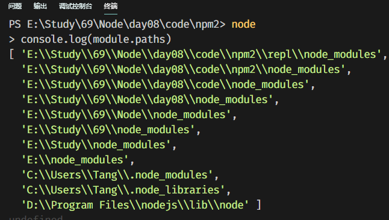

# ECMAScript 6

## ECMAScript 6 介绍

- JS包含下面三个方面:ECMAScript（语法标准）   DOM（操作标签的一套API）   BOM（浏览器对象）；
- ES6 是新的 JS 的代码规范，提供了一些新特性，使我们可以开发大型应用；

### ES6的优点

- 提供了更加方便的新语法，**弥补**JS 语言本身的**缺陷**，新增了便捷的语法；
- 给内置对象增加了更多的方法；
- ES6 让 JS 可以开发复杂的大型项目，成为企业级开发语言；
- 新的前端项目中大量使用 ES6 的新语法；

## ECMAScript 6 新增语法

### let 和 const

- **let**
  - let 定义变量，变量不可以再次定义，但可以改变其值；
  - 具有块级作用域；
  - 没有变量提升，必须先定义再使用；
  - let声明的变量不会压到window对象中，是独立的；

```js
// 1.变量不可以再次定义，但可以改变其值；
	let a=2233;
	a=2222;
	console.log(a); //输出a为2222;
	let a=5555;
	console.log(a); //输出为Uncaught SyntaxError: Identifier 'a' has already been declared;

// 2.具有块级作用域，（块就是括号）；
	{
    	let age=18;
    	console.log(age);   //输出为 18
	}
    	console.log(age);       //输出为Uncaught ReferenceError: age is not defined
	for (let i = 0; i < 3; i++) {
    	}
	console.log(i);    //// 报错，此作用域中没有i的定义;
 
//3.没有变量提升,必须先定义再使用;
	console.log(age);   //未捕获的ReferenceError：在初始化之前无法访问'age';
    let age='男';

//4.let声明的变量不会压到window对象中,是独立的;
   let age=18;
   console.log(window.age); //输出为undefined;
```

> 如果使用var声明了变量，也不能再次用let声明了，反之也是不行的。实际开发要么全部使用var，要么全部使用let。

- **const**
  - 使用const关键字定义常量，常量名一般大写;
  - 常量是不可变的，一旦定义，则不能修改其值;
  - 初始化常量时，必须给初始值;
  - 具有块级作用域;
  - 没有变量提升，必须先定义再使用;
  - 常量也是独立的，定义后不会压入到window对象中;

```js
//2.一旦定义，则不能修改其值;
	const A=333;
    A=2222;     //输出Assignment to constant variable;
//3.初始化常量时,必须给初始值;
	const B;   // Missing initializer in const declaration;
```

- 小结

  | 关键字 | 变量提升 | 块级作用域 | 初始值 | 更改值 | 通过window调用 |
  | :----: | :------: | :--------: | :----: | :----: | :------------: |
  |  let   |    ×     |     √      |   -    |  Yes   |       No       |
  | const  |    ×     |     √      |  Yes   |   No   |       No       |
  |  var   |    √     |     ×      |   -    |  Yes   |      Yes       |

###  解构赋值

- ES 6 允许按照一定**模式**，从数组和对象中提取值，对变量进行赋值，这被称为解构（Destructuring）。

#### 数组的解构

- 作用：方便获取数组中的某些项。

```js
let arr=[10,5,9,6]
// 情况1，变量少，值多(再变量,值相同下输出正常);
let [a,b,c]=arr;
console.log(a,b,c); //输出10,5,9;

// 情况2，变量多，值少;
let[g,h,i,j,k]=arr;
console.log(g,h,i,j,k); //输出10 5 9 6 undefined;

// 情况3，按需取值;
let[, ,n,]=arr;
console.log(n); //输出为9;

// 情况4，剩余值;
let cn = ['zhangsan', 18, ['175cm', '65kg']];
let[, ,[s,z]]=cn;
console.log(s,z);    // 175cm 65kg;
```

#### 对象的解构

- 作用:方便解析对象中的某些属性的值。

```js
//情况1，默认要求变量名和属性名一样
let{name,age}={name:'张扬',age:18};
console.log(name,age);  //输出张扬 18;

// 情况2，可以通过:为变量改名
let {a,b:c}={a:'hellow',b:'world'};
console.log(a,c);   // hello, world

// 情况3，变量名和属性名一致即可获取到值，不一定要一一对应;
let {b}={a:'hellow',b:'world'};
console.log(b); //输出为world;

// 情况4，剩余值
let obj={name:'张扬',age:18,gender:'男'};
let{name,...a}=obj;
console.log(name,a);    //输出张扬 b为{age: 18 gender: "男"}

//情况5，复杂的情况，只要符合模式，即可解构;
    let obj={
        name:'张扬',
        age:18,
        dog:{
            name:'毛毛',
            age:3,
        }
    };
    let{dog:{name,age}}=obj;
    console.log(name,age);  //输出毛毛 3
```

```js
// 实际应用：假设从服务器上获取的数据如下
let response = {
    data: ['a', 'b', 'c'],
    meta: {
        code: 200,
        msg: '获取数据成功'
    }
}
// 如何获取到 code 和 msg
let { meta: { code, msg } } = response;
console.log(code, msg); // 200, 获取数据成功；
```

### 函数

#### 箭头函数

- ES6 中允许使用箭头定义函数 (=>  goes to)，目的是**简化函数的定义**并且里面的this也比较特殊。

基本定义：

```js
// 非箭头函数
let fn = function (x) {
    return x * 2;
}
// 箭头函数，等同于上面的函数
let fn = (x) => {
    return x * 2;
}
```

特点：

- 形参只有一个，可以省略小括号；

  ```js
  let fn= x =>{
  	return x * 2;
  }
  ```

- 函数体只有一句话，可以省略大括号，并且表示返回函数体的内容;

  ```js
  let fn = (x, y) => {
      return x + y;
  }
  // 等同于
  let fn = (x, y) => x + y;
  ```

- 箭头函数内部没有 arguments;

  ```js
  let fn = () => {
      console.log(arguments); // 报错，arguments is not defined;
  };
  fn(1, 2);
  ```

- 箭头函数内部的 `this` 指向外部作用域中的 `this` ，或者可以认为箭头函数没有自己的 `this`;

  ```js
  var name = 'lisi'; // 测试时，这里必须用var，因为用let声明的变量不能使用window调用
  let obj = {
      name: 'zhangsan',
      fn : () => {
          console.log(this); // window对象
          console.log(this.name); // lisi
      }
  };
  obj.fn();
  ```

- 箭头函数不能作为构造函数；

  ```js
  let Person = () => {
  	
  };
  let obj = new Person(); // 报错，Person is not a constructor
  // 换个角度理解，箭头函数中都没有自己的this，怎么处理成员，所以不能当构造函数；
  ```

####  参数的默认值

- ES6 之前函数不能设置参数的默认值；

  ```js
  // ES5 中给参数设置默认值的变通做法
  function fn(x, y) {
      y = y || 'world';
      console.log(x, y);
  }
  fn(1)
  // ES6 中给函数设置默认值
  function fn(x, y = 'world') {
      console.log(x, y);
  }
  fn(2)
  fn(2,3)
  ```

  #### rest 参数

- rest 参数：剩余参数，以 … 修饰最后一个参数，把多余的参数都放到一个**数组**中。可以替代 arguments 的使用；

  ```js
  function fn(a, b, ...values) {
      console.log(a); // 6
      console.log(b); // 1
      console.log(values); // [100, 9, 10]
  }// 调用
  console.log(fn(6, 1, 100, 9, 10));
  ```

  > **注意：rest 参数只能是最后一个参数**

## 内置对象的扩展

### Array 的扩展

#### 扩展运算符

- 可以看成 rest 参数的逆运算，也可以看做是 **...** 可以把数组中的每一项展开。

```js
   //合并两个数组
    let arr1=[1,2];
    let arr2=[3,5];
    let arr3=[...arr1,...arr2];
    console.log(arr3);  // [1, 2, 3, 5]
    // 把数组展开作为参数，可以替代 apply
    // 求数组的最大值
    let arr=[6,99,10,5];
    let max=Math.max(...arr);
    console.log(max);   // 等同于 Math.max(6, 99, 10, 1);
```

#### Array.from()

- 把伪数组转换成数组；
- 伪数组必须有length属性，没有length将得到一个空数组；
- 转换后的数组长度，是根据伪数组的length决定的；

```js
  let fakeArr={
        0:'a',
        1:'b',
        2:'c',
        length:3,
    };
    let arr=Array.from(fakeArr);
    console.log(arr);
    // 转数组的对象必须有length值，因为得到的数组的成员个数是length指定的个数
// 上例中，如果length为2，则得到的数组为 ['a', 'b']
```

#### forEach遍历数组

- 要为forEach传递一个函数进来；
- 为forEach传递的函数有三个形参，分别表示数组的值、下标、当前的数组；

```js
// [xxx,xxx].forEach(function (value, index, arr) {
    // value 表示数组的值
    // index 表示数组的下标、索引
    // arr 表示当前的数组
// });

[3, 8, 4, 9].forEach(function (v, i, a) {
    console.log(v); // 表示数组的值 ，输出的结果是 3,8,4,9
    // console.log(i); // 表示数组的下标
    // console.log(a); // 表示数组
});

// 如果不需要下标和当前的数组，只使用value即可
// 函数可以使用箭头函数
[3, 8, 4, 9].forEach((item) => {
    console.log(item);
});
// 下面的意思是循环，在循环数组的时候，输出数组的每个值
[3, 8, 4, 9].forEach(item => console.log(item));
```

#### 数组实例的 find() 和 findIndex()

> - find和findIndex方法，会遍历传递进来的数组。
> - 回调函数有三个参数，分别表示数组的值、索引及整个数组。
> - 回调函数中return的是一个条件，find和findIndex方法的返回值就是满足这个条件的第一个元素或索引。
> - **find** 找到数组中第一个满足条件的成员并**返回该成员**，如果找不到返回**undefined**。
> - **findIndex** 找到数组中第一个满足条件的成员并**返回该成员的索引**，如果找不到返回 **-1**。

```js
// 用法：找数组中特定的数字；
	let arr = [1, 2, 4, 0, -4, -6, -7];
    let result = arr.find(function (item, index, self) {
        return item > 3;	//遍历过程中，根据这个条件去查找
    })
    console.log(result);  //输出4
```

#### 数组实例的 includes()

> - 判断数组是否包含某个值，返回 true / false；
> - 参数1，必须，表示查找的内容；
> - 参数2，可选，表示开始查找的位置，0表示开头的位置；

```js
	let arr=[1,4,3,9];
    console.log(arr.includes(4));   	// true;
    console.log(arr.includes(4,2));    // false， 从2的位置开始查，所以没有找到4;
```

#### String的扩展--模板字符串

> - 模板字符串解决了字符串拼接不便的问题
> - 模板字符串使用反引号 **`** 括起来内容
> - 模板字符串中的内容可以换行
> - 变量在模板字符串中使用 `${name}` 来表示，不用加 + 符号

```js
let name = 'zs';
let age = 18;
// 拼接多个变量，在模板字符串中使用占位的方式，更易懂
let str = `我是${name}，今年${age}`;
```

#### includes(), startsWith(), endsWith()区别

- `includes(str, [position])`		 返回布尔值，表示是否找到了参数字符串。
- `startsWidth(str, [position])` 返回布尔值，表示参数字符串是否在原字符串的头部或指定位置。
- `endsWith(str, [length])`            返回布尔值，表示参数字符串是否在原字符串的尾部或指定位置。

```js
console.log('hello world'.startsWith('l', 2)); // 指定位置的字符是l，返回true;
console.log('hello world'.endsWith('d')); // 未指定位置，结尾是d，返回true;
```

#### repeat()

- `repeat`方法返回一个新字符串，表示将原字符串重复`n`次。

```js
	let html = '<li>itheima</li>';
    html = html.repeat(10);
    console.log(html);	//输出<li>itheima</li>*10次
```

#### trim()

- `trim()` 方法可以去掉字符串两边的空白。

```js
console.log('    hello        '.trim()); // hello
```

###  Number的扩展

ES6 将全局方法`parseInt()`和`parseFloat()`，移植到`Number`对象上面，功能完全保持不变。

- Number.parseInt()
- Number.parseFloat()

```js
console.log(parseInt('123abc'))
// ES6中，将parseInt移植到了Number对象上;
console.log(Number.parseInt('123abc'))
```

### Set

ES6 提供了新的数据结构 Set。它类似于数组，但是==成员的值都是唯一的==，没有重复的值。

- `Set`本身是一个构造函数，用来生成 Set 数据结构。
- Set的特点就是该对象里面的成员不会有重复。

- Set 的成员
  - `size`：属性获取 set中成员的个数，相当于数组中的 length。
  - `add(value)`：添加某个值，返回 Set 结构本身。
  - `delete(value)`：删除某个值，返回一个布尔值，表示删除是否成功。
  - `has(value)`：返回一个布尔值，表示该值是否为`Set`的成员。
  - `clear()`：清除所有成员，没有返回值。

```js
let s=new Set();
    s.add(3);
    s.add(6);
    s.add(6);// Set对象中的成员都是唯一的，前面添加过6了，所以这里添加无效;
    console.log(s);	//输出成员个数2;
    console.log(s); // {3, 6};
```

另外初始化Set的时候，也可以为其传入数组或字符串，得到的Set对象中的成员不会有重复。

根据这个特点可以完成数组或字符串去重。

```js
// Set 可以通过一个数组初始化
let set=new Set([1,2,3,5,2,3]);
console.log(set);   //Set(4){1.2.3.5}
// 数组去重
let arr=[...set];    // 方式一
console.log(arr);   //输出[1,2,3,5]
console.log(Array.from(set)); //方式二 from是将伪数组变为数组;输出[1,2,3,5];

// 完成字符串去重;
let str=[...new Set('abcddcd')].join('');
console.log(str);   //abcd
```

## 定义对象的简洁方式

<!--04-语法-简洁的定义对象的方式-->

```js
let name = 'zhangsan', age = 20, gender = '女';
let obj = {
    name: name, // 原来的写法
    age, // 对象属性和变量名相同，可以省略后面的 “:age”，下面的gender同理
    gender,
    fn1: () => {  // 常规的箭头函数写法
        console.log(123);
    },
    fn2 () { // 可以省略 “:” 和 “=>”
        console.log(456);
    }
};
console.log(obj.age); // 20
obj.fn2(); // 456
```

### Promise - ES6新对象

#### 回调地狱

- JS中或node中，都大量的使用了回调函数进行异步操作，而异步操作什么时候返回结果是不可控的，如果我们希望几个异步请求按照顺序来执行，那么就需要将这些异步操作嵌套起来，嵌套的层数特别多，就叫做回调地狱。

下面的案例就有回调地狱的意思：

- 案例：有 a.txt、b.txt、c.txt三个文件，使用fs模板按照顺序来读取里面的内容，代码：

  ```js
  // 将读取的a、b、c里面的内容，按照顺序输出
  const fs = require('fs');
  
  // 读取a文件
  fs.readFile('./a.txt', 'utf-8', (err, data) => {
      if (err) throw err;
      console.log(data.length);
      // 读取b文件
      fs.readFile('./b.txt', 'utf-8', (err, data) => {
          if (err) throw err;
          console.log(data);
          // 读取c文件
          fs.readFile('./c.txt', 'utf-8', (err, data) => {
              if (err) throw err;
              console.log(data);
          });
      });
  });
  ```

> 案例中，只有三个文件，试想如果需要按照顺序读取的文件非常多，那么嵌套的代码将会多的可怕，这就是回调地狱的意思。

#### Promise简介

- Promise对象可以解决回调地狱的问题；
- Promise 是异步编程的一种解决方案，比传统的解决方案（回调函数和事件）更合理和更强大；
- Promise可以理解为一个容器，里面可以编写异步请求的代码；
- 从语法上说，Promise 是一个对象；

```js
const fs = require('fs');
// promise 承诺

// 使用Promise分为两大部分

// 1. 定义一个承诺
let p = new Promise((resolve, reject) => {
    // resolve -- 解决，完成了; 是一个函数
    // reject  -- 拒绝，失败了; 是一个函数
    // 异步操作的代码，它就是一个承诺
    fs.readFile('./a.txt', 'utf-8', (err, data) => {
        if (err) {
            reject(err);
        } else {
            resolve(data.length);
        }
    });
});

// 2. 兑现承诺
// p.then(
//     (data) => {}, // 函数类似的参数，用于获取承诺成功后的数据
//     (err) => {} // 函数类型的参数，用于或承诺失败后的错误信息
// );
p.then(
    (data) => {
        console.log(data);
    },
    (err) => {
        console.log(err);
    }
);
```

#### then方法的链式调用

- 前一个then里面返回的字符串，会被下一个then方法接收到。但是没有意义；

- 前一个then里面返回的Promise对象，并且调用resolve的时候传递了数据，数据会被下一个then接收到

- 前一个then里面如果没有调用resolve，则后续的then不会接收到任何值

  ```js
  const fs = require('fs');
  // promise 承诺
  
  new Promise((resolve, reject) => {
      fs.readFile('./a.txt', 'utf-8', (err, data) => {
          err ? reject(err) : resolve(data.length);
      });
  })
  .then((a) => {
      console.log(a);
      return new Promise((resolve, reject) => {
          fs.readFile('./a.txt', 'utf-8', (err, data) => {
              err ? reject(err) : resolve(data.length);
          });
      });
  })
  .then((b) => {
      console.log(b);
      return new Promise((resolve, reject) => {
          fs.readFile('./a.txt', 'utf-8', (err, data) => {
              err ? reject(err) : resolve(data.length);
          });
      });
  })
  .then((c) => {
      console.log(c)
  })
  .catch((err) => {
      console.log(err);
  });
  ```

  > catch 方法可以统一获取错误信息

#### 封装按顺序异步读取文件的函数

```js
function readFile(path) {
    return new Promise((resolve, reject) => {
        fs.readFile(path, 'utf-8', (err, data) => {
            err ? reject(err) : resolve(data.length);
        })
    });
}


readFile('./a.txt')
.then((a) => {
    console.log(a);
    return readFile('./b.txt');
})
.then((b) => {
    console.log(b);
    return readFile('./c.txt');
})
.then((c) => {
    console.log(c)
})
.catch((err) => {
    console.log(err);
});
```

#### async 和 await 修饰符

异步操作是 JavaScript 编程的麻烦事，麻烦到一直有人提出各种各样的方案，试图解决这个问题。

从最早的回调函数，到 Promise 对象，再到 Generator 函数，每次都有所改进，但又让人觉得不彻底。它们都有额外的复杂性，都需要理解抽象的底层运行机制。

异步I/O不就是读取一个文件吗，干嘛要搞得这么复杂？**异步编程的最高境界，就是根本不用关心它是不是异步。**

==async 函数就是隧道尽头的亮光，很多人认为它是异步操作的终极解决方案==。

ES7提供了async和await关键字。await和async关键词能够将异步请求的结果以返回值的方式返回给我们。

- async 修饰的函数，表示该函数里面有异步操作
- await和async需要配合使用，没有async修饰的函数中使用await是没有意义的
- await需要定义在async函数内部，await后面跟的一般都是一个异步操作
- await修饰的异步操作，可以使用返回值的方式去接收异步操作的结果
- 如果有哪一个await操作出错了，会中断async函数的执行

总结来说：**async 表示函数里有异步操作，await 表示紧跟在后面的表达式需要等待结果**。

```js
const fs = require('fs');
// 将异步读取文件的代码封装
function readFile (path) {
    return new Promise((resolve, reject) => {
        fs.readFile(path, 'utf-8', (err, data) => {
            err ? reject(err) : resolve(data.length);
        });
    })
}

async function aa () {
    let a = await readFile('./a.txt');
    let b = await readFile('./b.txt');
    let c = await readFile('./c.txt');
    console.log(b);
    console.log(a);
    console.log(c);
}

aa();
```

## npm知识点

- npm是node包管理器,首次本地安装,需要先初始化。

初始化：

> npm init -y
>
> npm init --yes
>
> npm init

全局安装：

- 全局安装的一般都是命令，全局安装之后，在任何文件夹都可以使用这个命令。
- 全局安装的东西，不能通过require加载。

> 安装命令
>
> npm i 包名 -g
>
> npm install 包名 -g
>
> 卸载命令
>
> npm un 包名 -g
>
> npm uninstall 包名 -g

本地安装：

>  安装命令
> npm i 包名
> npm install 包名
>  卸载命令
> npm un 包名
> npm uninstall 包名

### 安装第三方包

安装第三方包：

>  老版本的node安装，后面加 --save,是为了把安装的第三方模块在package.json中做记录，新版不用
>
>  npm install 包名 --save
>
>  正常的安装
>
>  npm install 包名
>
>  一次安装多个包，名字之间用空格隔开
>
>  npm install 包名1 包名2 包名3
>
>  npm i express mysql art-template
>
>  指定包的版本进行安装
>
>  npm install 包名@版本号
>
>  npm i 包名(简写)

从缓存目录安装包：

>  查看缓存目录：
>
>  npm config get cache
>
>  从缓存目录下载包
>
>  --cache-min 后面跟的是时间，单位是分钟，超过这个时间才去服务器下载
>
>  npm install 包名 --cache-min 9999999

查看全局安装目录：

>  查看全局安装时的安装目录
> npm root -g

### 切换 npm 镜像源

- npm 存储包文件的服务器在国外，速度很慢，所以我们需要解决这个问题。
- 国内淘宝的开发团队把 npm 在国内做了一个备份，网址是：http://npm.taobao.org/。

>  查看当前的源
>
>  npm config ls
>
>  在上面命令的结果有，有下面一行，该行记录的网站就是我们安装第三方模块的网站 "https://registry.npmjs.org/"
>
>  下载包的时候切换源
>
>  npm install express --registry=https://registry.npm.taobao.org
>  全局设置
>
>  npm config set registry https://registry.npm.taobao.org
>
>  原始的路径
>
>  https://registry.npmjs.org/
>
>  nrm 是管理镜像源的模块，通过nrm来管理镜像源
>
>  npm i nrm   自行查询如何使用 

### package.json

在初始化之后，会生成一个package.json文件。

- 创建 `package.json`

  ```bash
  npm init 
  npm init -y
  ```

- main

  main 字段指定了加载的入口文件

- dependencies  依赖(复数)

  - 指定了当前项目所依赖（需要）的包
  - 软件的版本号 jQuery@3.3.1
    1. 大版本.次要版本.小版本
    2. **小版本**：当项目在进行了局部修改或 bug 修正时，修正版本号加 1
    3. **次要版本**：当项目在原有的基础上增加了部分功能时，主版本号不变，子版本号加 1
    4. **大版本**：当项目在进行了重大修改或局部修正累积较多，而导致项目整体发生全局变化时，主版本号加 1

  ```json
  "dependencies": {
      "art-template": "^4.14.2",
      "body-parser": "^1.18.3",
      "express": "^4.16.4",
      "express-art-template": "^1.0.1"
   }
  ```

  - `dependencies` 字段指定了项目运行所依赖的模块
  - **==使用 `npm install` 可以安装所有的依赖==**
  - 该对象的各个成员，分别由模块名和对应的版本要求组成，表示依赖的模块及其版本范围。
    - **指定版本**：比如`1.2.2`，遵循“大版本.次要版本.小版本”的格式规定，安装时只安装指定版本。
    - **波浪号（tilde）+指定版本**：比如`~1.2.2`，表示安装1.2.x的最新版本（不低于1.2.2），但是不安装1.3.x，也就是说安装时不改变大版本号和次要版本号。
    - **插入号（caret）+指定版本**：比如ˆ1.2.2，表示安装1.x.x的最新版本（不低于1.2.2），但是不安装2.x.x

- scripts

  `scripts`指定了运行脚本命令的 npm **命令行**缩写，比如start指定了运行`npm run start`时，所要执行的命令。

  ```bash
  "scripts": {
      "test": "echo \"Error: no test specified\" && exit 1",
      "start": "node app.js",
      "t": "dir c:\\"
   }
  ```

  运行 `scripts`

  ```bash
  npm run t
  npm run start
  # 只有 start 可以简化调用
  npm start
  
  ```

依赖的作用：

- 记录项目必须的包。
- 发送给别人的时候，不需要发送比较大的 `node_modules` 文件夹。只需要发送给你 `package.json` 即可，你只需要执行 `npm install` 即可安装所有的包。

###  一个神秘的文件夹 node_modules

- 我们下载第三方包的时候，会自动把下载的第三方包，放到 `node_modules` 中。使用第三方包的时候直接 `require('第三方包的名字')`。
- 我们自己写的包也可以放到此文件夹，**加载的时候直接写包名**即可。
- `require`  的加载顺序
  - 打印 module 对象；
  - 包加载的过程，按照 `module.paths` 中的路径一级一级往上查找；
  - 第一次 `require()` 加载完毕，会把 模块/包 **缓存**起来，再次 `require()` 的时候直接从缓存加载；



### require 的加载机制

- `require` 优先加载**缓存**中的模块
- 如果缓存中没有模块，优先加载**核心模块（node自带的模块，fs、path、http）**，并缓存
- 如果有**相对路径**，则根据路径加载**文件模块**，并缓存
  - `require('./main')`  省略扩展名的情况
  - 先加载 `main.js`，如果没有再加载 `main.json`，如果没有再加载 `main.node`(c/c++编写的模块)
- 如果不是文件模块，也不是核心模块，则加载**第三方模块（下载的，比如express/mysql等）**
- node 会去 node_modules 目录中找（找跟你引用的名称一样的目录），例如这里 `require('moment')`
- 如果在 node_modules 目录中找到 `moment` 目录，则加载该模块并缓存
- 如果过程都找不到，node 则取上一级目录下找 `node_modules` 目录，规则同上
- 如果一直找到代码文件的根路径还找不到，则报错

### ES6降级处理

因为 ES 6 有浏览器兼容性问题，可以使用一些工具进行降级处理，例如：**babel**

- 降级处理 babel 的使用步骤

  1. 安装 Node.js
  2. 命令行中安装 babel
  3. 配置文件 `.babelrc`
  4. 运行

- 项目初始化 (项目文件夹不能有中文)

  ```bash
  npm init -y
  ```

- 在命令行中，安装 babel [babel官网](https://babeljs.io)

  ```bash
  npm install  @babel/core @babel/cli @babel/preset-env
  ```

- 配置文件 `.babelrc` (手工创建这个文件)

  babel 的降级处理配置

  ```json
  {
    "presets": ["@babel/preset-env"]
  }
  ```

- 在命令行中，运行

  ```bash
  # 把转换的结果输出到指定的文件
  npx babel index.js -o test.js
  # 把转换的结果输出到指定的目录
  npx babel 包含有js的原目录 -d 转换后的新目录
  ```

