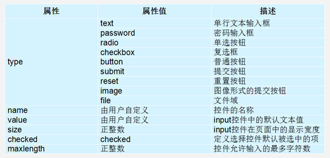

# HTML标签

# 1.HTML基本标签

​	HTML:超文本标记语言；

## 字符集的问题


​	**meata标签的作用就是指定当前网页的字符集**

​	常用解决网页上的乱码的现象  在head标签中添加<meta charset="GBK”"/>

那么在企业开发中我们因该使用GBK(GB2312)还是UTF-8呢？

-如果网站仅仅包含中文，推荐使用GB2312，因为它的提及更小，访问速度更快；

-如果网站除了中文以外，还包含其他国家的语言，推荐使用UTF-8；

-推荐直接使用UTF-8即可。

​	**注意点：**在HTML文件中指定的字符集必须要和保存这个文件的字符集一致，否则还是会出现乱码。

​	所以仅仅指定字符集不一定能解决出现乱码的问题，还是需要保存文件的时候，文件保存的格式和指定的字符集一致才能保证没有出现乱码的问题。                                             

## DTD文档声明


​	任何一个标准的HTML网页，第一行一定是DTD文档声明，也就是说DTD文档说明必须写在HTML的第一行，且不区分大小写。

​	第一行必须要有DTD文字声明<!DTDCTYPE html>；

## 1.基本标签

### 1.H标签（标题）

​	H标签是用来给文本添加标题语义的，而不是用来修改文本的样式,H标签只有6个,且标签从大到小,在企业开发一般情况中只有一个H1标签(和SEO有关)。

### 2.Hr标签（分割线）

​	Hr就是在浏览器中添加一条分割线 ` <hr/>`  在HTML5中写不写斜杠都可以。

### 3.img标签

​	Img标签格式：`` 显示图片 如果img标签指定的宽高，那么系统就会按照指定的宽高来显示。通俗的说就是指定一个宽度，另外的高度就会自动生成。``;

​	Title 用于告诉浏览器，挡鼠标悬停在图片上时，需要弹出描述框显示什么内容。使用方法``;

​	Alt其实是英文alternate 的缩写，它的作用就是用于告诉浏览器，当需要显示的图片找不到是显示什么  例如``;

### 4.Br标签（换行）

​	br标签，如何在HTML中换行？可以使用br标签；多个br标签使用就会换多行。

### 5.文本格式化标签

​	`b，I，s ，u `只有使用强调的意思,而`strong(加粗) em(倾斜) del(删除线) ins(下划线) `语义更加强烈；

### 6.A标签的基本使用及属性

​	a标签作用：控制页面与页面之间的跳转的;
​      ` <a href="指定需要跳转的目标界面">需要展现给用户查看的内容</a>`;

注意点： 1.a标签不仅可以让文字可以点击，还0.可以让图片也能够被点击(默认打开)；

​                2.一个a标签必须有一个href属性，否则a标签不知道要跳转到什么地方；
​                3.如果通过a标签的href属性指定一个地址，那么必须在地址前面加上http://或者是https：//；

### 7.Base标签

​	作用：专门用来统一的指定当前网页中所有的超链接需要如何打开。
​	注意点：1、base标签必须写在head标签的开始标签和接受标签之间。

​			2、就近原则，a标签中的target比base中的target更高级。

​			3、base标签放到head下边。

### 8.列表标签

HTML中列表标签的分类
       1无序列表（最多）（unordered list)；

<ul>
    <li>定义想要的内容</li>
</ul>

​	2有序列表（最少）(orderedlist)；

​       3定义列表（其次）(definitionlist)；

```html
 <dl>
      <dt>	</dt>
      <dd>	</dd>
</dl> 
//先通过dt标签定义列表中的所有标题，然后通过dd标签给每个标题添加描述信息;
```
### 9.表格标签


```html
<table>
	<tr>
       <td>单元内的文字</td>
   	</tr>
</table>
```

2.表格标签作用：用来给一堆数据添加表格语义
	 其实表格是一种数据的展现形式，当数据量非常大的时候，表格这种展现形式被认为是最为清晰的一种展现形式。

​       1.宽度（width）和高度（height）的属性：可以给table和td标签使用。
​        2.水平对齐（align）和垂直对齐（valign）的属性：就只有table标签不能使用valign。
​        3.外边距（cellspacing）和内边距（cellpadding）的属性：只能给table标签使用。

3.细线表格的制作方式： border   border=”1；
        1.给table标签设置bgcolor；
        2.给tr标签设置bgcolor；
        3.给table标签设置cellspacing="1px ；

​       4.align=”center”如果用在table上,是整个表格居中的方式,如果用在tr,th上是整行整列的居中。 

注意点：table标签和tr标签以及td标签都支持bgcolor属性。

4.**表格标题**
        在表格标签中提供了一个专门用来设置表格的标题，这个标签叫做caption。只要将标       题写在caption标签中，那么标题就会自动相对于表格的宽度居中。
        注意点：1.caption一定要写在table标签中，否则无效。

​                     2.caption一定要紧跟在table标签后面
 5.**标题单元格标签**
​               表格标签照片那个提供了一个标签专门用力存储每一列的标题，这个标签叫做th标签，只要将当前的标题存储在这个标签中就会自动居中+加粗文字。
​        到此为止我们就发现，其实表格中有两种单元格，一种是td，一种是th。td是专门用来存储数据的，th是专门用用来存储当前的标题的。

6.**caption:指定表格的标题(放在表格中,table下面)**
        thead作用：指定表格的表头信息(thead放在整个tr上边包裹整个tr的双标签)；
        tbody作用：指定表格的主体信息；
        tfoot作用：指定表格的附加信息；

7.**水平方向上的单元格合并(跨列合并)**
        可以给td标签添加一个colspan属性，来指定把某一个单元格当做多个单元格来看待；

```html
例如：	<td colspan="2"></td>；
```

8.**垂直向下的单元格合并(跨行合并)**

​	可以给td标签添加一个rowspan属性，来指定把某一个单元格当做多个单元格来看待；

```html
例如：	<td rowspan="2"></td>；
```

​      **含义：**把当前单元格当做两个单元格来看待；

**注意点：**
        1.由于把某一个单元格当做了多个单元来看到，所以就会多出一些单元格，所以需要删掉一些单元格才能正常显示；

           2. 横行竖列一定要记住单元格合并永远是先上后下或者先左后右，而不能向前或向上合并；

### 10.表单标签



​	作用：表单就是专门用来收集信息的。

```html
格式：
   <form>
          <表单元素>
   </form>
```
**常见的表单元素**

#####   1.明文输入框（可以看见）

```html
	<input type="text">;	placeholder占位符(用于控制输入框文字属性)；
```

#####   2.暗文输入框（看不见）

```html
	<input type="password">;
```

#####   3.给输入框设置默认值

```html
	<input type="text" value="（想设置的默认值）">;（在input标签里加上value标签）；
```

#####   4.单选框

```html
	<input type="radio">；
```

1. 在默认情况下单选框不会互斥，要想单选框互斥那么必须给每一个单选框标签都设置一个name属性，然后name属性还必须设置相同的值；
2. 如果要让单选框默认选中某一个框子，那么可以给input标签添加一个checked属性；
3. 在HTML中如果属性的取值和属性的名称一样可以只写一个（尽量不要忽略取值）；

```html
案例：       
	<input type="checkbox" checked="checked">唱歌(默认选择)
	<input type="checkbox" checked="checked">跳舞(默认选择)
	<input type="checkbox" checked="checked">绘画(默认选择)
	<input type="checkbox">篮球
	<input type="checkbox">足球
```

##### 5.按钮（表单标签）

​	**1.普通按钮	<input type="button" value="">**

​	**2.图片按钮	<input type="image" src="">**

​	**3.重置按钮	<input type="reset"> (清空表单中的内容）;**

​	**4.提交按钮	<input type="submit"> **

​	**5.隐藏域       <input type="hidden">（配合提交按钮，在后台提交数据，用户看不到）；**

提交按钮将表单中的数据提交到远程服务器需要具备的条件：

 	1. 给form标签添加action属性，通过其提交到指定服务器 action="http//:..."；
 	2. 给需要提交的元素添加name元素 name="username"（值可以随便写）；

#### 6.lable标签

**Label标签为input元素定义标注(标签)**

- label标签需要配合input使用 label for=”id”,for=input ”id属性的值”；

-  label标签作用:用于绑定一个表单元素,当点击label标签的时候,被绑定 的表单元素就会获得输入焦点。(便于用户体验)；

#### 7.Textrarea控件（文本域）

```html
用法：<textarea cols="每行中的字符数" rows="显示的行数">文本内容</ textarea>；
```

#### 8.下拉菜单(select)

使用select控件定义下拉菜单的基本语法格式如下:

```html
<select>

	<option>选项1</option>
	<option>选项2</option>
	<option>选项3</option>
</select>
```

**注意：**

​       1.<select></select>中至少应包含一对<option></option>。

​       2.在option 中定义selected =" selected "时，当前项即为默认选中项。

#### 9.表单域

- 在HTML中，form标签被用于定义表单域，即创建一个表单，以实现用户信息的收集和传递，form中的所有内容都会被提交给服务器。创建表单的基本语法格式如下：

```
	<form action="url地址" method="提交方式" name="表单名称">
    	（各种表单控件）；
	</form>
```

- 常用属性： 
  - Action 在表单收集到信息后，需要将信息传递给服务器进行处理，action属性用于指定接收并处理表单数据的服务器程序的url地址。
  - method 用于设置表单数据的提交方式，其取值为get或post。
  - name 用于指定表单的名称，以区分同一个页面中的多个表单。
  - 注意： 每个表单都应该有自己表单域。

# CSS3

CSS样式三种:行内式（内联样式）；内部样式表（内嵌样式表）；外部样式表（外链式）；

## CSS属性

### 1.文本样式

#### font-size（字号大小）

- 属性值：normal、bold、bolder、lighter、100~900（100的整数倍）多喜欢用于数字表示；
- font-size推荐使用像素值px(现在网页普遍使用14px)；

#### font-family（字体）

- 宋体(\5B8B\4F53)   微软雅黑(\5FAE\8F6F\96C5\9ED1)；

#### font-weight（字体粗细）

- 用于定义字体的粗细，其可用属性值：normal（400）、bold（700）、bolder、lighter；

#### font-style（字体风格）

- normal：默认值，浏览器会显示标准的字体样式；
- italic：浏览器会显示斜体的字体样式；
- oblique：浏览器会显示倾斜的字体样式；

#### letter-spacing （控制文字距离）

- 控制字(母)和字(母)之间的距离 值越大,间距越大,可以为负值；

#### line-height（行间距）

- 用于设置行间距，就是行与行之间的距离；

#### font（文字连写）

```html
{font: font-style  font-weight  font-size/line-height  font-family;}(必须保留font-size和font-family属性)
```

#### text-indent（首行缩进）

- 常用em(一个em一个汉字)；

#### text-align（文本水平对齐方式）

- 文本水平对齐方式:left,center,right；

#### text-decoration（文本的装饰）

- none (默认)   定义标准的文本， 取消下划线；
- underline      定义文本下的一条线，下划线 也是我们链接自带；
- overline         定义文本上的一条线；
- line-through 定义穿过文本下的一条线；

#### line-height（行高）

- 如果行高等height高度文字会垂直居中;如果行高大于高度文字偏下;如果行高小于高度文字偏上；

### 外观属性

#### background（背景）

##### Color三种方法

预定的颜色值 ；rgb代码rgb(255,0,0)；十六进制如(#FF6600)；

##### 背景颜色:background-color

- transparent (颜色透明);

##### 背景图片:background-image

- none(无背景) | url (图片地址);

##### 背景平铺:background-repeat

- repeat | no-repeat | repeat-x | repeat-y (背景在X,Y轴平铺);

##### 背景位置:background-position

- 1.length(百分数)；2.top , center , ,left , center ,right(方位名词)；

##### 背景固定滚动:background-attachment

- scroll(背景图像随对象滚动) ；fixed(背景图像固定)；

##### 背景简写:background

- 背景颜色 背景图片地址 背景平铺 背景滚动 背景位置；

##### 背景尺寸:backgroud-size

- 该属性提供2个参数值(特性值cover和contain除外)。 
  - cover：  将背景图像等比缩放到完全覆盖容器，背景图像有可能超出容器。 
  - contain：  将背景图像等比缩放到宽度或高度与容器的宽度或高度相等，背景图像始终被包含在容器内。
- 如果提供两个具体的值(百分比或者像素值)，第一个定义背景图像宽度,第二个定义背景图像高度；
- 如果只提供一个值，该值将用于定义背景图像的宽度，第2个值默认为auto，此时背景图宽度等比缩放；

##### 背景线型渐变

- background-image: linear-gradient(to 方向,颜色, 颜色);

##### 多背景图片

- background:url(test1.jpg) no-repeat  10px 20px/50px 60px, url(test2.jpg) no-repeat  10px 20px/70px 90px;
- 注意， 背景颜色只能设置一次，且由于写在前面的背景会叠在之后的背景之上，所以背景色通常都定义在最后一组上，避免背景色将图像盖住。

##### 精灵技术

- CSS的精灵图需要配合背景图片(background-image)和背景定位(background-position)来使用。

- background-position属性进行背景定位。其中最关键的是使用background-position 属性精确地定位。

  ```css
  <style>
  	.box{
  		width: 86px;
  		height: 28px;
  		background-image: url(images/weibo.png);
  		background-position: -425px -200px;
  		}
  </style>
  <div class="box"></div>
  ```

#### 元素的显示与隐藏

##### 1.display（显示）

- display 设置或检索对象是否及如何显示。特点：隐藏之后，不再保留位置。
- display : none 隐藏对象；它相反的是 display：block除了转换为块级元素之外，同时还有显示元素的意思。

##### 2.visibility（可见性）

- 设置或检索是否显示对象。1.visible：对象可视 ；2.hidden ：对象隐藏；特点： 隐藏之后，继续保留原有位置。

##### 3.overflow（溢出）

- 检索或设置当对象的内容超过其指定高度及宽度时如何管理内容。
  - visible : 　不剪切内容也不添加滚动条。
  - auto : 　 超出自动显示滚动条，不超出不显示滚动条。
  - hidden : 　不显示超过对象尺寸的内容，超出的部分隐藏掉。
  - scroll : 　不管超出内容否，总是显示滚动条。

#### 用户界面样式

##### 1.cursor（鼠标样式）

- 设置或检索在对象上移动的鼠标指针采用何种系统预定义的光标形状。 cursor :  default  小白 | pointer  小手  | move  移动  |  text  文本。

##### 2.outline（轮廓 ）

- 绘制于元素周围的一条线，位于边框边缘的外围，可起到突出元素的作用。最直接的写法是： outline: 0; 或者outline: none。

##### 3.resize（防止拖拽文本域）

- resize：none 这个单词可以防止火狐，谷歌等浏览器随意的拖动文本域。

##### 4.white-space（溢出的文字隐藏）

- white-space设置或检索对象内文本显示方式。通常我们使用于强制一行显示内容 。

##### 5.text-overflow （文字溢出）

- 先强制一行内显示文本 white-space: nowrap;
- 超出的部分隐藏  overflow: hidden;
- 文字用省略号替代超出的部分 text-overflow: ellipsis;

##### 6.vertical-align（行内块垂直对齐方式）

- 设置或检索对象内容的垂直对其方式。	vertical-align : baseline |top |middle |bottom；
- vertical-align 不影响块级元素中的内容对齐，它只针对于行内元素或者行内块元素，特别是行内块元素,通常用来控制图片/表单与文字的对齐。

##### 7.CSS过渡动画

- 含义:过渡就是从一种状态到另一种状态,过渡需要出发条件，通常过渡写在开始状态。

## CSS3新特性

### 2D转换

#### 1.位移语法：transform: translate(x,y)

1. translate最多设置2个值，第一个值是水平，第二个值是垂直。
2. translate偏移的位置，参照的是自身原有的位置。
3. translate若设置负值时，会实现逆方向移动。
4. 若设置一个值时，只有水平方向有效。
5. 可以设置百分比，百分比参照的是自身的大小。

#### 2.旋转语法：transform:rotate(角度deg) 

- 正值：顺时针旋转；负值：逆时针旋转；

#### 3.旋转源点设置语法：transform-origin: 水平 垂直;

- 默认是按照中心点旋转的；
- 水平取值：left| center| right |像素；
- 垂直取值：top | center| bottom|像素；

#### 4.缩放语法：transform:scale(number,number)

1. 最多设置2个值，第一个值表示缩放宽度，第二值表示高度；
2. 缩小：若设置的值大于0小于1表示缩小；
3. 放大：若大于1表示放大多少倍；
4. 若设置一个值时，表示宽高一起缩放多少倍；

### 动画

#### 1.定义动画

```css
@keyframes 动画序列名称 {
	 from/0% {
      开始状态
  }  
 	to/100% {
      结束状态
  }}
```

#### 2.调用动画

##### animation-name（名称）

- 规定 @keyframes 动画的名称；

##### animation-duration（持续时间）

- 规定动画完成一个周期所花费的时间；

##### animation-timing-function（运动曲线）

- 规定动画的速度曲线。默认是 "ease" 缓冲，linear匀速，steps步长；

##### animation-delay（延迟时间）

- 规定动画何时开始。默认是 0；

##### animation-iteration-count（动画次数）

- 规定动画被播放的次数。默认是 1。还有 infinite；

##### animation-direction（是否逆播)

- 动画是否在下一周期逆向地播放。默认是 "normal"，alternate逆播放；

##### animation-play-state（运行暂停）

- 规定动画是否正在运行或暂停。默认是 "running"。还有“paused”；

##### animation-fill-mode(结束状态)

- 规定动画结束后状态，保持 forwards 回到起始 backwards；

##### animation: （连写）

- 动画的名称 动画持续的时间 运动的曲线 延迟时间 动画的次数 是否可以逆播 是否保持结束状态；

### 3D转换

#### 3D介绍

- 特点:近大远小。物体后面遮挡不可见；

#### 3维坐标系

- x轴：水平向右      注意： x 右边是正值，左边是负值 ；
- y轴：垂直向下      注意： y 下面是正值，上面是负值；
- z轴：垂直屏幕      注意： 往外面是正值，往里面是负值；

#### 位移

- transform: translateX/Y/Z(数值px)；

#### 透视语法：perspective: 像素值;

- 透视要设置给父元素；
- 设置3d透视，可以实现近大远小效果；
- 给设置了transform属性元素的上级元素设置透视即可；

#### 旋转 transform: rotateX/Y/Z(角度); 

- 对于立方体是由多个盒子旋转和位移组成的，多个盒子需要有一个父盒子；
- 若要显示立体空间，需要给父盒子设置样式属性：transform-style: preserve-3d；

## 显示模式

- 标签显示模式的转换:display；

### 块级元素

#### 介绍

- 每个块元素通常都会独自占据整行或多整行,可以设置宽高，对齐等属性,常用于网页布局和网页结构的搭建。

- ```html
  常见的块元素<h1>~<h6>、<p>、<div>、<ul>、<ol>、<li>；
  ```

#### 特点

1. 总是从新行开始；
2. 高度，行高、外边距以及内边距都可以控制；
3. 宽度默认是容器的100%；
4. 可以容纳内联元素和其他块元素；
5. 是一个容器及盒子，里面可以放行内或者块级元素；

### 行内元素

#### 介绍

- 行内元素（内联元素）不占有独立的区域，仅仅靠自身的字体大小和图像尺寸来支撑结构，一般不可以设置宽度、高度、对齐等属性，常用于控制页面中文本的样式。

- ```html
  常见的行内元素有<a>、<strong>、<b>、<em>、<i>、<del>、<s>、<ins>、<u>、<span>等，其中<span>标签最典型的行内元素。
  ```

#### 特点

1. 和相邻行内元素在一行上。
2. 高、宽无效，但水平方向的padding和margin可以设置，垂直方向的无效。
3. 默认宽度就是它本身内容的宽度。
4. 行内元素只能容纳文本或则其他行内元素。

### 行内块元素

#### 介绍

- 行内块元素可以对它们设置宽高和对齐属性。

- ```html
  行内块元素中的标签、<input />、<td>；
  ```

#### 特点

1. 和相邻行内元素（行内块）在一行上,但是之间会有空白缝隙。
2. 默认宽度就是它本身内容的宽度。
3. 高度，行高、外边距以及内边距都可以控制。


## 盒子模型

### border（盒子边框）

- border : border-width (宽度)|| border-style (样式)|| border-color(颜色)；
- border-style：
  - double：边框为双实线；
  - dotted：边框为点线；
  - dashed：边框为虚线 ；
  - none：没有边框即忽略所有边框的宽度（默认值）；
  - **solid：边框为单实线(最为常用的)；**

#### 圆角边框

- 语法格式：border-radius: 50%;   让一个正方形变成圆圈。

### padding（内边距 ）

- padding属性用于设置内边距。指边框与内容区域之间的距离。
- 如果没有给一个块元素指定宽度， 此时，如果给这个块元素指定左右padding， 则不会撑宽盒子。

### margin（外边距）

- margin属性用于设置外边距。margin就是控制盒子和盒子之间的距离；
- 可以让一个块元素实现水平居中，需要满足一下两个条件：
  - 必须是块级元素；盒子必须指定了宽度（width）；
  - 然后给左右的外边距都设置为auto，就可使块级元素水平居中；

### 盒子阴影


- box-shadow：水平阴影 垂直阴影 模糊距离（虚实）阴影尺寸（影子大小）阴影颜色  内/外阴影；

## CSS布局

- CSS布局三种机制:普通流、浮动和定位；

### Float（浮动及清除浮动）

#### 浮动

##### 浮动作用

- 浮动最早是用来控制图片，实现文字环绕图片的效果。
- 让多个盒子(div)水平排列成一行，使得浮动成为布局的重要手段。
- 浮动语法:float:left/right。

##### 浮动特点:

- 浮：加了浮动的盒子是浮起来的，漂浮在其他标准流盒子的上面。 
- 漏：加了浮动的盒子是不占位置的，它原来的位置漏给了标准流的盒子。
- 特：注意1. 浮动的盒子需要和标准流的父级搭配使用；2. 浮动可以使元素具有行内块特性。

#### 清除浮动

##### 1.额外标签法

- 通过在浮动元素末尾添加一个空的标签例如 <div style="clear:both"></div>，或则其他标签等亦可;

##### 2.父级添加overflow属性方法

- 可以给父级添加： overflow为 hidden| auto| scroll  都可以实现。
- 缺点：内容增多时候容易造成不会自动换行导致内容被隐藏掉，无法显示需要溢出的元素。

##### 3.使用after伪元素清除浮动法

```css
clearfix:before/after {
	content: ""; display: block; height: 0; clear: both; visibility: hidden;  
	} 
clearfix {*zoom: 1;}
```

### position（定位）

#### 作用

- 概念：定位 = 定位模式 + 边偏移，将盒子定在某一个位置。
- 左右箭头压在图片上，方便用户交互；hot、new 压在盒子上方,吸引用户的眼球。

#### 边偏移border

- 在 CSS 中，通过 top、botto,left和right属性定义元素的边偏移；
- 相对定位是元素相对于它在标准流中的位置 + 边偏移属性来设置元素的位置。（自恋型）；

#### 1 静态定位(static)不脱标

- 静态定位是元素的默认定位方式，也就是说网页中所有元素默认都是静态定位的 —— 按照标准流特性摆放位置。在不需要定位元素时，元素的定位属性就是 static 的。

#### 2 相对定位(relative)不脱标

- 以自己在标准流位置的左上角为基点 + 边偏移属性定位元素新的位置；

2. 原来在标准流的区域继续占有，后面的盒子仍然以标准流的方式对待它；

#### 3 绝对定位(absolute)完全脱标

- 完全脱标 —— 完全不占位置。
- 父元素要有定位 —— 父元素在标准流中的位置 + 边偏移属性来设置元素的位置。
  - 如果当前父元素没有定位（相对、绝对或固定有定位的父元素)；
  - 如果所有父元素都没有定位，则以浏览器为准定）；如果父亲有定位，则以父亲为准；

#### 4 子绝父相

- 父元素相对定位不脱标,在标准流占据位置,子元素绝对定位,可以移动到父元素的任意位置；
- 父元素占位置,下边盒子不能上来,布局正常；

#### 5 固定定位(fixed)完全脱标

- 完全脱标1.完全不占位置；
- 只认浏览器的可视窗口 浏览器可视窗口 + 边偏移属性来设置元素的位置；
  - 跟父元素没有任何关系；2.不随滚动条滚动。

## 三大特性

### CSS层叠性

- 所谓层叠性是指多种CSS样式的叠加,是浏览器处理冲突的一个能力,如果一个属性通过两个相同选择器设置到同一个元素上，那么这个时候一个属性就会将另一个属性层叠掉。

### CSS继承性

- 所谓继承性是指书写CSS样式表时，子标签会继承父标签的某些样式，如文本颜色和字号想要设置一个可继承的属性，只需将它应用于父元素即可。
- 注意:a标签不能继承父元素的文字颜色；标题标签不会继承父元素的文字大小。

### CSS优先级


- 总结：权重是优先级的算法，层叠是优先级的表现；

## 常见选择器

- 标签选择器（元素选择器）：标签名{属性1:属性值1; 属性2:属性值2; }；
- 类选择器：Class  {   属性1:属性值1; 属性2:属性值2; }；
- 多类名选择器：我们可以给标签指定多个类名，<div class=“多个类名">；
- ID选择器：#id名 {属性1:属性值1; 属性2:属性值2;}；
- 通配符选择器："*" 它是所有选择器中作用范围最广的，能匹配页面中所有的元素;

### 复合选择器

#### 后代选择器

- 后代选择器又称为包含选择器，用来选择元素或元素组的后代，其写法就是把外层标签写在前面，内层标签写在后面，中间用空格分隔。当标签发生嵌套时，内层标签就成为外层标签的后代。
- 后代选择器：用来选择元素或元素组的后代是选择所有的子孙后代；较多，div p { color：red;}； 

#### 子元素选择器

- 子元素选择器只能选择作为某元素子元素的元素。其写法就是把父级标签写在前面，子级标签写在后面，中间跟一个 >; 进行连接，符号左右两侧各保留一个空格；
- 子代选择器：选择作为某元素子元素的元素,只选亲儿子；较少   .nav>p { color: red; } ；

#### 交集选择器

- 交集选择器 是 并且的意思。  即...又...的意思   比如p.one 选择的是： 类名为 .one的段落标签。(用的相对较少,不建议)；
- 交集选择器：选择两个标签交集的部分；较少 a:link {color: red;}   

#### 并集选择器

- 并集选择器和的意思，就是说，只要逗号隔开的，所有选择器都会执行后面样式。比如  .one, p {color: #F00;}表示 .one 和 p，这两个选择器都会执行颜色为红色。  (通常用于集体声明)；
- 并集选择器：选择某些相同样式的选择器,可以用于集体声明；较多  .nav, .header {color: red;} ；

### 伪类选择器

1. :active  选定的链接 ；:link  未访问的链接；:visited  已访问的链接；:hover  鼠标移动到链接上 ；

### 特殊选择器

#### 结构伪类选择器

##### 1.E:first-child

- 选择父元素的第一个子元素E。

##### 2.E:last-child

- 选择父元素的最后一个子元素E。

##### 3.E:nth-child(n)

- 匹配父元素的第n个子元素E，假设该子元素不是E，则选择器无效。

##### 4.E:nth-last-child(n)

- 匹配父元素的倒数第n个子元素E，假设该子元素不是E，则选择器无效。

##### 5.E:nth-of-type(n)

- 匹配同类型中的第n个同级兄弟元素E。

#### 占位符选择器

- E::placeholder ；修改占位符样式。

#### 属性选择器

- 通过属性来选择标签 [href="abc.html"]；

# Web移动开发

## CSS扩展语言LESS

### 简介:

1. Less（Leaner Style Sheets 的缩写）是一门 CSS 扩展语言，它扩展了CSS的动态特性。 CSS 预处理器；
2. 常见的CSS预处理器：Sass、Less、Stylus；
3. 预处理器是程序中处理输入数据，产生能用来输入到其他程序的数据的程序；

### 变量:

- 简介:
  - 变量是指没有固定的值，可以改变的。
  - 我们CSS中的一些颜色和数值等经常使用，可以设置为变量；			
- 变量名:值;@bg:#333;	引用:.box_1 { background-color: @bg;}

### 运算:

- 1.Less提供了加（+）、减（-）、乘（*）、除（/）算术运算。2.任何数字、颜色或者变量都可以参与运算。注意：运算符中间左右有个空格隔开； 
- 2.取值:  1.如果两个值之间只有一个值有单位，则运算结果就取该单位。2.对于两个不同的单位的值之间的运算，运算结果的值取第一个值的单位； 

## 移动开发

### 理想视口

- 我们移动端布局想要的是理想视口就是手机屏幕有多宽，我们的布局视口就有多宽；

- 想要理想视口，我们需要给我们移动端页面添加meta视口标签；

- ```html
  配置方式:<meta name="viewport" content="width=device-width, user-scalable=no,initial-scale=1.0, maximum-scale=1.0, minimum-scale=1.0">
  ```

### 二倍图

- 在标准的viewport设置中，使用倍图来提高图片质量，解决在高清设备中的模糊问题；

### 背景缩放

- 语法：background-size: 背景图片宽度 背景图片高度；
- 单位：像素|百分比|cover|contain；
  - cover把背景图像扩展至足够大，以使背景图像完全覆盖背景区域；
  - contain把图像图像扩展至最大尺寸，以使其宽度和高度完全适应内容区域；
  - 百分比，参照背景图所在的盒子大小；

### CSS3盒子模型

- 传统模式宽度计算：盒子的宽度=CSS中设置的width+border+padding ；
- CSS3盒子模型：盒子的宽度=CSS中设置的宽度width里面包含了border和padding；
- 也就是说，我们的CSS3中的盒子模型， padding和border不会撑大盒子了；

### 总结

- 现在市场常见的移动端开发有单独制作移动端页面和响应式页面两种方案；
- 现在市场主流的选择还是单独制作移动端页面；

## 流式布局

#### 介绍

1. 流式布局，就是百分比布局，也称非固定像素布局。(常见页面京东)；
2. 通过盒子的宽度设置成百分比来根据屏幕的宽度来进行伸缩，不受固定像素的限制，内容向两侧填充；
3. 流式布局方式是移动web开发使用的比较常见的布局方式；
4. max-width  最大宽度（max-height  最大高度）；
5. min-width  最小宽度（min-height  最小高度）；

#### 二倍图精灵图使用方式

1. 在firework里面把精灵图等比例缩放为原来的一半；
2. 之后根据大小 测量坐标；
3. 注意代码里面background-size也要写： 精灵图原来宽度的一半；

#### 新增图片格式

- 1.DPG图片压缩技术(京东自主研发图片压缩技术)；
- 2.webq图片格式(谷歌研发加快图片加载速度图片格式)；

## Flex布局

### flex布局原理

1. flex 是 flexible Box的缩写，意为"弹性布局"，用来为盒状模型提供最大的灵活性，任何一个容器都可以指定为 flex 布局。
2. 当我们为父盒子设为 flex 布局以后，子元素的 float、clear 和 vertical-align 属性将失效。
3. 总结：就是通过给父盒子添加flex属性，来控制子盒子的位置和排列方式。

### flex布局父项常见属性

#### flex-direction：设置主轴的方向

1. row 默认值从左到右 	row-reverse从右到左；
2. column默认值从上到下	column-reverse从下到上；

#### justify-content：设置主轴上的子元素排列方式 

1. flex-start 默认值从头部开始,如果主轴是X轴,则从左到右	flex-end 从尾部开始排列；
2. center 在主轴居中对齐(如果主轴是 X轴则水平居中)；
3. space-around 平分剩余空间；
4. space-between 先两边贴边,再平分剩余空间(重要)；

#### flex-wrap：设置子元素是否换行

1. nowrap 默认值不换行；wrap 换行；

#### align-content：设置侧轴上的子元素的排列方式(多行)

1. flex-start：默认值在侧轴的头部开始排列；
2. flex-end：在侧轴的尾部开始排列；
3. center：在侧轴的中间显示；
4. space-around：子项在侧轴平分剩余空间；
5. space-between：子项在侧轴先分布在两头,再平分剩余空间；
6. stretch：设置子项元素高度平分父元素高度；

#### align-items：设置侧轴上的子元素排列方式(单行)

1. flex-start：从上到下(默认值)；
2. flex-end：从下到上；
3. center：挤在一起居中(垂直居中)；
4. stretch：拉伸；

#### flex-flow：复合属性

1. 相当于同时设置了 flex-direction 和 flex-wrap；
2. 用法flex-flow:row/column	wrap/nowrap;

### flex布局子项常见属性

#### 子项属性介绍

1. flex 子项目占的份数；
2. align-self 控制子项自己在侧轴的排列方式；
3. order属性定义子项的排列顺序(前后顺序)；

#### flex属性

1. flex属性定义子项目分配容器的剩余空间,用flex来表示占多少份数；
2. 类名 {flex: <number> | 百分百; /* default 0 */}；

#### align-self： 控制子项自己在侧轴上的排列方式

1. align-self 属性允许单个项目有与其他项目不一样的对齐方式,可覆盖 align-items 属性。默认值为 auto，表示继承父元素的 align-items 属性,如果没有父元素,则等同于 stretch。
2. 类名 {/* 设置自己在侧轴上的排列方式 */  align-self: flex-end; }

#### order ：定义项目的排列顺序

1. 类名 {order: <number>;}；
2. 数值越小，排列越靠前，默认为0；

#### flex布局：最为重要的三个属性

1. 确认主轴: flex-direction;
2. 侧轴对齐: align-items:center;
3. 划分份数：flex:1;

## Rem布局

#### 介绍

- rem布局，最为直观的效果，页面全部元素现实等比缩放，包括文字，盒子大小。

#### 媒体查询

- 简介: 是一个查询屏幕的过程，通过查询当前屏幕尺寸属于哪个范围，从而有哪个范围的样式生效；
- @media mediatype(screen手机/all所有设备/print打印机) and(且)/not(非)/only (仅)(media feature)    {  CSS-Code;{	}}

#### rem初体验

- rem布局的核心：rem+媒体查询；
- 优点:
  - 等比计算：计算出来的rem前面的那个比例，这个比例在各个档位下，一直不变，变的是rem背后的那个值;
  - 唯一控制；只要用rem作为单位，当 HTML字体大小发生改变，使用rem单位元素都会发生改变;
  - 档位划分：媒体查询，里面设置要变化的内容 ;
  - 里面设置：语法上设置HTML字体大小其实设置rem单位背后的值 ;

#### rem布局操作步骤

第一步：

- 原稿实现：先拿到设计稿（只有一份）：750px；页面上所有的元素，在750px设计稿上进行测量，代码实现；（流式、flex）所有的属性都写死，写成固定的px值；

第二步：用rem替换px

- 准备各个档位下的rem：提前准备好各个档位下的HTML 的font-size大小；
- 拿到当前设计稿屏幕尺寸对应的rem背后的值；
- 达到目标：那么，屏变化时，1rem也会变化，自然就是等比缩放；我们需要手动设置这两个范围媒体查询:
  - CSS文件:没有行内权重高,需要它提高权重!!!
- 因为我现在是750px的设计稿，可以得到750px这个尺寸属于的档位下的HTML的font-size大小；也就是750px设计稿下的1rem值背后的代表的值是多少；
- 计算比例：把页面刚才所有的元素的PX值替换为 rem 比例值；（82px  82rem/75= 1.785rem ）;

## 响应式布局

#### 介绍

- 响应式布局通过同一份代码快速、有效适配手机、平板、PC设备；

#### 档位划分

- w<768 超小屏幕（手机，学习rem布局里面的档位划分都是在这个范围）；
- 768<= w <992  小屏设备（平板）；
- 992<= w <1200  中等屏幕（桌面显示器）；
- 1200<=w 大宽屏设备（大桌面显示器）；

#### 版心

- 所有的子元素都是归于版心控制，那么不同版心，就意味着子元素要以不同的布局达到合理的要求；
- 除超小屏以外：版心的宽度设置都是小于当前档位最小界值，比如 min-width: 768px，版心是750px；
- 原因：两边留空，体验好。


