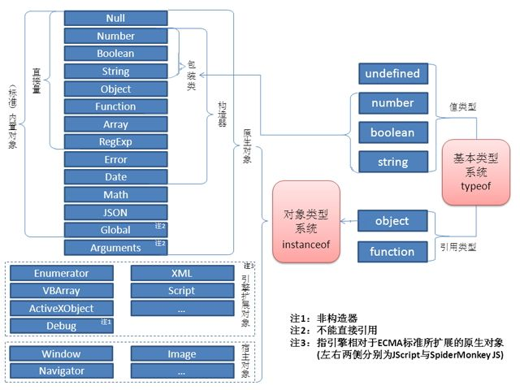
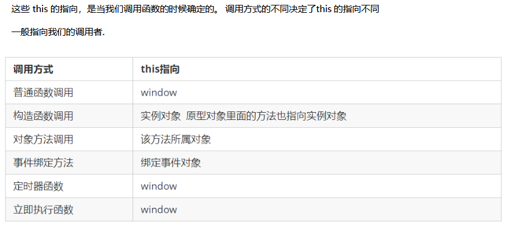

JS基础

# 1.变量

1. 语义: var a = 数据；根据业务场景设置变量名，推荐驼峰。

# 2.数据类型

1. 字符串类型、数字类型、布尔类型、null(值)、undefined类型（值）；
2. 查看数据类型：typeof  数据；typeof(数据)，返回数据类型；

# 3.数据转化

1. Number():转化成数字类型；
2. String()：给你的数据两边加一个单双引号；转化成字符串；
3. toString()：null /undefined不能用这个方法；
4. Boolean():返回布尔值；存在(ture)或者不存在(flase)；

# 4.操作符

### 1.运算

##### 1.常规：数字类型；

##### 2.非常规：

- 字符串
  - 字符串遇见+：把它临近数据类型转字符串类型，形成拼接；
  - 字符串遇见其他（- * / %）：隐式转化为数字类型；
  - 其他类型：布尔值、null(值)、undefined。

### 2.比较

1. **常规**：需要两边都是数字类型；
2. **非常规**：转化为数字类型，进行比较；

### 3.逻辑

1. 需要什么类型进行判断？布尔类型，若不是，要隐式转化为布尔类型；

```js
1.// && 且 ：全部满足 

// 常规：需要Boolean值进行逻辑判断；
// 返回：把最后一个满足的结果，返回过来；
// console.log(true && true)

2.// || 或：满足一个条件即可；
```

​    2.返回：成立或者不成立条件判断上的位置的数据返回;   null&&1------>null；

### 4.赋值

​     配合运算操作符，简写；

### 5.优先级

1. 括号先算；
2. 其次算算术：++a优先；
3. 再次算比较  > ==；
4. 然后算逻辑 && ||；
5. 最后算赋值 =；

# 5.结构

## 1.分支结构

### 1.if结构

##### 1.作用：

​	不同的条件，采取不同的行为；

##### 2.格式：

```js
if(条件表达式){
   //当条件表达式的结果是 true 时执行的代码
}
else {
  //当条件表达式的结果是 false 时执行的代码
}
```

### 2.switch-case结构

##### 1.作用：

​	**主要用于多个固定值之间的判断，只能做固定值的判断；**

##### 2.格式：

```js
switch （数据）{
  case 固定值1: 
    // 当数据 === 固定值1时执行的代码; 先看类型，看值；
    // 表示当前 情况结束；
    break;
  default : 
    // 当数据和上面的所有固定值都相等的时候执行的代码
    break;
}
```

### 3.三元表达式

1. **作用：有值会返回；语法：if else 的简写；有返回值；**
2. 格式：var a = 表达式1 ? 表达式2 : 表达式3；
3. 表达式1代表条件，表达式2代表如果满足表达式1就输出，表达式3代表如果不满则条件则输出；

### 4.补充

1.  **if else 多用于判断一个区间、不固定值的判断；**
2. **switch-case：多用于固定值的判断；**

## 2.循环结构

### 1.作用

1. 只要有重复的思想在里面，就要用到循环；
2. 程序的世界中大量的逻辑就是 分支和循环；阿里百秀，新闻列表，循环；

### 2.while循环

##### 1.格式：	

```js
// 条件表达式结果需要布尔值，若不是Boolean值，隐式转化；
while (条件表达式){
	// 循环体就是重复执行的代码
}
```

##### 2.特点：

​	**设置为true，容易卡死；设置false，直接就不执行。**

### 3.for循环

##### 1.格式：

​    for(初始化表达式; 条件表达式; 自增表达式){循环体}；

##### 2.执行过程：

1. 执行初始化表达式；
2. 执行条件表达式；
3. 如果条件表达式结果为false,结束循环,继续执行循环后面代码；
4. 如果条件表达式的结果为true，执行循环体；
5. 执行自增表达式；
6. 重复2~5的步骤，直到条件表达式的结果为false，结束循环；

### 4.do-while循环

##### 1.格式：

```js
do {
//循环体
	}while(条件表达式)
	// 记录输出的次数
	var count = 0;
	// 只要次数不够3次，就循环的输出
	do {
	  console.log('班长很漂亮');
 	 // 让次数+1
 	 count++;
	}while (count < 3)
```

##### 2.特点:

​    至少会执行一次；写true也会卡死；

### 5.break和continue

##### 1.作用：

​    满足条件退出；关键字退出：某些情况下，我们不一定要循环从头到尾执行，这个时候就要使用  break和continue控制循环的次数；

##### 2.总结：

- **break用于结束整个循环**

- **continue用于结束整个循环中的一次，结束当前这次循环；**

- **break和continue后面的代码都不会执行，执行前面的代码；**

  ```js
案例:1.// break
  /*电梯一共有6层，现在我们要上电梯，我们的教室在3楼，电梯只要到3楼就可以了。*/
  for(var i = 1; i <= 6 ; i++ ){
      console.log('现在是'+i+'楼');
      if(i == 3){
          console.log('3楼到了，电梯停了，请下电梯。');
          // 程序 执行到 3，执行了四次就结束了；
          break;
      }
  }
  2.// continue
  // 电梯一共有6层，除了3楼没人下去，其他楼层都有人下去(3楼不停，其他楼层都要停)
  for(var i = 1; i <= 6; i++){
      if(i == 3){
          // 执行到 3 时。当前次的程序后面的全部跳过；继续执行后面的次数；
          continiue;
      }
      console.log(i+'楼到了，电梯停了，请下电梯。');      
  }
  ```

# 6.数组

#### 1.介绍

​	数组是一个有顺序、有长度的数据集合；

#### 2.存值

1. 数组中的数据使用索引管理；
2. 索引：序号、顺序、排位、位置、下标；
3. 索引从0开始；

#### 3.取值

1. 把数据取出来，得知道你要取哪个位置上的数据把；
2. 数据取值同样使用索引取；

#### 4.遍历

1. 求成绩总和：一个一个地把数组里面的数组取出来了，从索引 0 到最后一个索引
2. 索引从0开始到结束的过程，有重复的思想，需要用到循环；

#### 5.数组长度

1. 存取数据：涉及到就是数组的顺序问题，通过索引去存取；
2. 数组长度：数组中一共存放了多少个数据；
3. console.log(arr.length); // 数组.length 就是数组的长度;

#### 6.案例

```js
1.求数组中所有数字的总和的平均值
- 总和：循环遍历，加在一个变量上得到；
- 均值：总和 / 个数；（arr.length）// 还可以更简单
var sum = 0;
for(var i =0; i < arr.length; i++){
  sum += arr[i];
}
console.log(sum);

// 求平均分
// 平均分= 总分 / 数组的长度
var avg = sum / arr.length;
2.求数组中的最大值及索引
// 分析：找打最大值的时候，记录下最大值的下标就行了。
var max_index = 0;
var max = arr[max_index];
for(var i =0; i < arr.length; i++){
  if(max < arr[i]){
    max = arr[i];
    max_index = i;
  }
}
```

#### 7.清空数组： arr.length = 0;

#### 8.数组的构造函数

1. 数组在JS中还可以使用另一种方式创建，这个方式我们称为 ： 构造函数
2. 构造函数：能构造一个你需要的东西（对象）；
3. 格式：var arr = new Array(10,20);

## Array[数组]

### 1.对元素操作

#### 1.push  从数组后面推入一个元素或多个元素

#### 2.pop  删除数组最后一个元素

#### 3.unshift  从数组前面添加一个或多个元素

#### 4.shift  用于将数组的第一个元素移除

#### 5.splice  可进行数组任何位置的增删改

#### 6.reverse() 方法用于颠倒数组中元素的顺序

```js
// 数组的splice方法用于从数组的指定位置移除、添加、替换元素
var arr = ['a','b','c','d','e'];

arr.splice(3,1); 
console.log(arr);
// 对原数组操作；
// 作用：从索引3开始移除，总共移除1个元素 ；
// 返回 被移除数据的数组；

arr.splice(3,0,7,8); 
// 在c的后面添加7和8两个元素；
// 作用：从索引3开始添加，移除0个元素，把7，8加入；
// 返回：一个空数组；
// 操作原数组；

arr.splice(1,1,0);
console.log(arr)
// 作用：从索引1开始替换，总共替换1个，用0替换 ；
// 返回：被替换元素的数组；
```

### 2.与字符串互转

#### 1.join 

​	用于将数组中的多元素以指定分隔符连接成一个字符串；

```js
var arr = ['刘备','关羽','张飞'];
var str = arr.join('|'); 
console.log(str);  // 刘备|关羽|张飞
```

#### 2.split 

​	字符串的方法：转数组，后面为分隔的字符

```js
// 这个方法用于将一个字符串以指定的符号分割成数组
var str = '刘备|关羽|张飞';
var arr = str.split('|');
console.log(arr);// ["刘备", "关羽", "张飞"]
```

### 3.查找元素

#### 1.indexOf

​	根据**元素查找索引**，如果这个元素在数组中，返回索引，否则返回-1，找元素在不在数组内部;

```js
var arr = [10,20,30];
console.log(arr.indexOf(30));  //输出2
console.log(arr.indexOf(40));   //输出-1
```

#### 2.findIndex

​	方法用于查找**满足条件的第一个元素的索引**，如果没有，则返回-1；

```js
var arr = [10, 20, 30];
var res1 = arr.findIndex(function (item) {
  return item >= 20;
});		// 返回 满足条件的第一个元素的的索引；
console.log(res1);  
var res2 = arr.findIndex(function (item) {
  return item >= 50;
});
console.log(res2);  //输出 -1；
```

### 4.遍历数组

#### 1.forEach：遍历数组

```js
// 数组的 forEach 方法用于遍历数组
var arr_1 = [10,20,30,40,50];
// forEach方法需要一个参数是一个函数，这个函数接收3个参数，
// item是数组中的每个元素，index是item的索引,arr表示当前数组；
// 对本数组操作，没有返回值；
arr_1.forEach(function(item,index,arr){
  console.log(item,index);
});
```

#### 2.filter ：筛选数组

​	筛选出数组中满足条件的数组，**返回是一个新的数组**；

```js
// 数组的filter方法用于将数组中满足条件的元素筛选出来；
// 筛选出数组中 小于 2000 的数据；
var arr_1 = [1500,1800,2200,300,2600,800];
var res = arr_1.filter(function(item,index,arr){
  return item < 2000;
});
console.log(res);  // 输出[1500, 1800, 300, 800]；
// fitler方法的的参数要求是函数，这个函数接收2个参数：item是数组中每个元素，index是item对应索引,arr代表当前数组
```

### 5.拼接与截取

#### 1.concat：拼接数组

​    **不改变原数组，创建新数组返回;**

```js
// 数组的concat方法的作用是把多个数组合并成一个新的数组；
var arr1 = [1,2,3];
var arr2 = [4,5,6];
var res = arr1.concat(arr2);
console.log(res);//输出[1,2,3,4,5,6]；
```

#### 2.slice： 截取数组

​    **不对原数组操作，返回的是新的数组；**

```js
var arr = ['a','b','c','d','e'];
// 表示 从下标1（包括），截取到下标为4(不包括),
var res = arr.slice(1, 4);
// 如果不给第二个参数，默认就是把从start开始，到length结束的所有的元素截取
var arr_1 = arr_2.slice(1);
```

### 6.复制数组

```js
// 1.复制一个数组
var arr_1 = [];
arr.forEach(function(item, index) {
   arr_1.push(item);
  });
// 2.复制一个数组
var arr_1 = arr.filter(function(item,index,arr){
  return item;
});
// 3.复制一个数组
var arr_1 = arr.concat();
// 4.复制一个数组：如果省略两个参数，start默认是0，end默认是length
var arr_1 = arr.slice();
// 5.复制一个数组
var arr_1 = [];
for (let index = 0; index < arr.length; index++) {
   arr_1[index] = arr[index];
}
```

## 7.函数

### 1.作用

1. 函数：我们把一段相对独立的具有特定功能的代码块封装起来，形成一个独立实体，起个名字（函数名），在后续开发中可以随时反复调用；
2. 作用：封装（包起来）一段代码，将来可以随时拿来使用；封装：**功能要单一**；

### 2.格式

```js
function 关键字 用于声明函数
 tellStroy 函数名
function tellStroy(参数){
   里面叫函数体：我们封装，我们想随时随地拿来使用的东西；}
  tellStroy(); 
```

### 3参数

##### 1.作用：

​     对于函数，这些参数都是形式上的参数，它就是代替位置，相当于是变量在这占了个坑；至于这个参数真实背后代表什么值，我们现在还不知道；

##### 2.参数不赋值：

​	**变量**：函数内部的变量，没有赋值，默认为undefined；和我们的变量一模一样；

##### 3.形参与实参：

1. **形参**：形式上参数，函数内部声明的变量，只能在内部使用，用于参与逻辑过程；
2. **实参**：调用函数时，真实参与运算的数据，可以为传入数据，也可以传变量；
3. 要传入的数据是简单数据类型数据，形参与实参相互不影响；

### 4.返回值(Return)

##### 1.含义：

1. **函数的返回值**：函数执行完毕，会得到一个结果，这个结果就是函数的返回值；
2. 默认情况下，函数返回undefined，如果想改变这个返回值，需要使用`return`关键字；

##### 2.修改返回值作用：

1. **修改函数的返回值，若后面有值，则返回，若没有值；默认还是undefined;**
2. **终止函数的执行**；

### 5.Arguments(伪数组)

1. arguments：获取所有实参的对象,函数内部的变量（不是我们声明的，也不需要我们声明）；

2. arguments:这个东西看起来样子像数组，但是其实不是一个数组，我们管它叫 伪数组。它具有数组的长度和顺序等特征。本质为对象;

3.  arguments: 伪数组可以循环遍历；

   ##### 案例：

   ```js
   function getSum(){
     var sum = 0;
     for(var i = 0; i < arguments.length ; i++){
       sum += arguments[i];
     }
     return sum;
   }
   getSum(1,2,3);// 输出 6
   getSum(1,2,3,4,5); // 输出15
   ```

### 6.函数类型

- 在js中，只要是一种数据类型的，都可以作为函数的参数;
- 所有函数都是Function 的实例(对象) ；函数也属于对象；

#### 1.命名函数

```js
function fn() {  }	fn();
```

#### 2.函数表达式

#####    匿名函数

- 声明变量，赋值为函数；

- 没有名字的函数，但是在js的语法中，是不允许匿名函数单独存在的，要配合其它语法使用;

```js
匿名函数:function (参数){函数体}
var fn = function(a,b){return a + b;}
```

#####   自调用函数（自执行函数）

- 匿名函数的另外一种使用方法；很多时候，我们需要加载页面后，自动执行一个函数；

```js
自调用函数:(function(形参){  console.log(10);  })(实参);
```

#### 3.回调函数

- 函数也是数据类型，也可以作为别的函数的参数；

```js
// fn 只不过在函数内部是一个形参，内部变量；
function f1(a,fn){
  console.log(a);
  函数的调用，在函数名的后面加括号；
  内部的函数对外面的函数叫回调函数；
  fn(); }
```

#### 4.实例化对象函数

- 参数必须为字符串格式，这种方式执行效率低，也不方便书写，因此较少使用；

```js
语法：new Function()   var fn = new Function('参数1','参数2'..., '函数体')；
案例：var fn = new Function('a','b','console.log(a,b);');		fn(123,456);	
```

#### 5.高阶函数

- 高阶函数是对其他函数进行操作的函数，它接收函数作为参数或将函数作为返回值输出。

```js
此时fn就是一个高阶函数
函数也是一种数据类型，同样可以作为参数，传递给另外一个参数使用。最典型的就是作为回调函数。
同理函数也可以作为返回值传递回来
案例：接收函数作为参数；
	function fn(callback){
		callback&&callback();
	}
	fn(function(){
		alert('hi')
	})
案例：将函数作为返回值输出；
	function fn(){
		return function() {}
	}
	fn();
```

### 7.作用域

##### 1.含义：

​	作用范围，能生效的范围；

##### 2.全局：

1. **全局作用域**：能在页面的任何位置都可以访问;
2. **全局变量**：在全局作用域下声明的变量；

##### 3.局部：

1. **局部作用域**：只能在局部的作用域范围进行访问；
2. **局部变量**：在局部作用域下声明的变量；

#### 变量作用域

- 函数内部可以使用全局变量；函数外部不可以使用局部变量。
- 当函数执行完毕，本作用域内的局部变量会销毁。

#### 闭包（closure）

- **闭包作用：延伸变量的作用范围。**
- 闭包：指有权访问另一个函数作用域中变量的函数。一个作用域可以访问另外一个函数内部的**局部变量**。
- 注意:只能访问内部的局部变量。

```js
// fn1 就是闭包函数；
function fn1(){
	var num = 10;
	function fn2(){
		console.log(num); //输出为10；
	}
	fn2()
}
fn1();
```

```js
案例1：如何再函数外面访问到函数内部的变量 ? ? ?
function fn () {
		var i = 7;
		return function () {
			console.log(i);
		}}
var n = fn();
n();	//n()输出；
```

```js
案例2：注册事件练习：打印索引值；
var lis = document.querySelectorAll('li');
	for (var i = 0; i < lis.length; i++) {
		(function (index) {
			lis[index].onclick = function () {
				console.log(index);
			}
		})(i);
}
```

### 8.预解析

##### 1.含义：

​	在作用域内，你声明的变量在任何地方都可以访问。是任何地方；

##### 2.预解析：

​	提前、解析(分析)会把初始化的声明的变量、函数，全部提升到当前作用域的最顶端；

##### 3.变量提升：

1. 从概念的字面意义上说，变量提升意味着变量和函数的声明会在物理层面移动到代码的最前面，但这么说并不准确。实际上变量和函数声明在代码里的位置是不会动的，而是在编译阶段被放入内存中。

2. 找到当前作用域的顶端，提升上去;

   ##### 案例：

   ```js
   var num;
   function fun() {
       var num;
       console.log(num);
       num = 20;
   }
     赋值；
   num = 10;
     函数调用；
   fun(); 最后输出 undefined；
   ```

### 函数的调用方式

####   this指向

- this：当前调用者；



#### 改变函数内部this指向

```js
JavaScript 为我们专门提供了一些函数方法来帮我们处理函数内部this 的指向问题，常用的有bind()、call()、apply() 三种方法。
```

#####   1.call 方法（用于继承）

```js
1.call() 方法调用一个对象。简单理解为调用函数的方式，但是它可以改变函数的this 指向。
2.fun.call(this, arg1, arg2, ...)
3.this：在fun 函数运行时指定的this 值;
4.arg1，arg2：传递的其他参数;
5.返回值就是函数的返回值，因为它就是调用函数;
```

```js
function Father () {this}
function Son () { Father.call(this,1,2) }
因此当我们想改变this 指向，同时想调用这个函数的时候，可以使用call，比如继承;
```

##### 2.apply 方法（用于数组）

```js
1.fun.apply(this, [Array]):调用函数;
2.this：在fun函数运行时指定的this值;
3.Array：传递的值，必须包含在数组里面
4.返回值就是函数的返回值，因为它就是调用函数;
5.因此apply 主要跟数组有关系，比如使用Math.max() 求数组的最大值;
```

```js
案例：求数组中最大值；
var arr = [23,45,56,23,54];
var n = Math.max.apply(null,arr);
console.log(n);
```

##### 3.bind 方法（用于只改变this指向）

```
1.bind() 方法不会调用函数。但是能改变函数内部this 指向;
2.fun.bind(this, arg1, arg2, ...);
3.this：在fun 函数运行时指定的this 值;
4.arg1，arg2：传递的其他参数;
5.返回由指定的this 值和初始化参数改造的原函数拷贝;
6.因此当我们只是想改变this 指向，并且不想调用这个函数的时候，可以使用bind;
```

```js
案例：设置按钮倒计时；
<input type="button" value="点击发送信息">
var btn = document.querySelector('input');
	btn.onclick = function () {
		this.disabled = true;
		window.setTimeout(function () {
			this.disabled = false;
				}.bind(btn),2000);
	}
```

##### 总结

```
相同点:  都可以改变函数内部的this指向;
区别点:  
1.call 和apply  会调用函数, 并且改变函数内部this指向;
2.call 和apply 传递的参数不一样，call 传递参数aru1, aru2..形式，apply 必须数组形式[arg]
3.bind  不会调用函数, 可以改变函数内部this指向;
主要应用场景:  
1.call 经常做继承.;
2.apply 经常跟数组有关系.比如借助于数学对象实现数组最大值最小值;
3.bind  不调用函数,但是还想改变this指向. 比如改变定时器内部的this指向;
```

# 8.对象

### 1.介绍

​	对象：使用属性描述事物的特征，使用方法来描述行为， 就是对象这种语法。所以，**对象就是属性和方法的集合;**

##### 特点：

- **实现高效开发**：我们只要知道对象（工具）有什么属性和方法，不需要知道对象里面是如何实现的。在别人已经提供好的方法的基础上，再次实现我们想要的效果，开发过程将大大缩短。
- **便于维护**：因为你是单个对象（工具），我可以随时对你进行改造，修改；满足我的需要；

### 2.语法

##### 1.创建

- 构造函数：

  ```js
  var obj = new Object(); // 这是一个没有属性和方法的对象
  console.log(obj);
  ```

- 字面量：

  ```js
  var obj = {}; // 这也是一个没有属性和方法对象，其本质和构造函数创建的对象是一样的
  console.log(obj,typeof obj);
  ```

##### 2.添加

- 通过字面量初始化对象时，初始化属性;

  ```js
    // 如果一开始，你知道对象内部的属性和方法，初始化声明
    var obj = {
      // 语法：属性名:属性值
      // 多个属性名和值之间用, 隔开；
      name: "狗蛋",
      age: 12,
      // 方法名:函数
      sayName: function() {
        console.log(obj.name);
      }
    };
    // 声明方式：键值对的方式声明；
    // 语法：对象["属性名"]  = 属性值；
    var obj = {};
    obj["name"] = "狗蛋";
    obj["age"] = 45;
  ```

  

- 一个属性和一个值叫**键值对**;
- 多个键值之间使用逗号分隔，键的方式添加属性;

##### 3.获取

- 点属性访问

```javascript
// 得到对象的名字,属性可以当成变量使用
console.log(obj.name);
// 调用对象的方法，方法的本质是函数
obj.sayName();
```

- 键的方式访问属性

```js
console.log(obj['name']);
obj['sayName']();
```

- **两种属性访问方式,日常中我们常用点属性访问方式;**

##### 4.遍历

- 数组可以遍历；对象也可以遍历；

```js
// 遍历：数组遍历（循环）
// 遍历：对象遍历（对象上这些方法一个个过一次，也是某种意义上的循环）
// key：泛指 代表 对象上的每对键值对的 键；
  for (var key in obj) {
    // console.log(key);

// 获取方式：obj.key 为什么会输出 undefined；
// 把obj.key 这个key 当做一个属性名；
    console.log(key, obj[key]);
  }
```

### 3.拓展性

1. ##### 对象-拓展Math的n-m的随机整数

**语法：**

- 1.实现具体过程；

- 2.抽象为函数

- 3.给Math添加一个方法；

   

  ```js
   // 3.拓展Math新的方法
  	`求得n到M随机一个数值?`
    Math.getRandom = function(n, m) {
      var res = Math.random() * (m - n + 1);
      // 向下取整 [0,m-n]
      res = Math.floor(res);
        
  // res [0,40];  加10之前；
  res = res + n;
  
  // res [10,50];
  // console.log(res);
  // 
  return res;
    }
  ```

### 4.简单类型和复杂类型

#### 1.简单类型的储存

```js
var a = 10;
var b = a;
b = 20;
console.log(a,b); //输出 10，20 也就是说，a的值不会受到b的值的改变而影响
```

- 简单类型数据存储在内存的栈空间中，复杂类型的数据存储在内存的堆空间中;
- 把一个变量赋值给另一个变量的时候，其实是把栈空间的数据(格子内的值复制了)复制了一份;
- 当另一个数据发生变化，会根据变量找到对应的栈内存上盒子的内容，进行修改；
- 此时，简单类型的的变量赋值给另一个变量，当另一个变量改变了，不会影响原来的变量；

#### 2.复杂类型的储存

```js
var obj1 = {
  name : '狗蛋'
};
var obj2 = obj1;
obj2.name = '翠花';
console.log(obj1.name,obj2.name); 
// 输出 两个翠花 ， 也就是说，obj1的name属性受到了obj2的name属性影响
```

- 复杂类型在内存的储存，赋值给其他变量，也是把格子内的内容复制了一份;

- 格子里是地址；相当于两个对象内容存的是同一份地址；

- 当另一个变量发生变化时，修改的是同一个堆内存地址上的数据，所以obj1和obj2修改的其实是同一个对象;

## Object [对象]

### 1.语法

```js
var obj = {}; // 字面写的这些数据，知道它的数据类型；
var obj_1 = new Object();

// 对象.属性 = 值;
obj.name = '狗蛋';
// 键值对
obj['age'] = 10;

obj.name
obj['age']

for(var name in obj){
  console.log(name);
  // 只能通过键的方式获取值
  console.log(obj[name]);
}
```

### 2.复制

```js
var obj_1 = {
    a:1,
    b:2
};
// 可以这样么？
var obj_2 = obj_1;

var obj_2 = {}
for(var key in obj_1){
  obj_2[key] = obj_1[key]
}
```

## String[字符串]

#### 1.查找

##### 1.indexOf  

- 字符串中是否存在指定字符存在就返回找到的下标，没有就-1；
- lastIndexOf用法和indexOf一样，只不过是从后面开始找；

```js
// 这个方法用于查找某个字符串是否包含于另一个字符串
var str = '我爱中华人民共和国';
console.log(str.indexOf('中华'));
```

#### 2.charAt：

```js
// 这个方法用于获取字符串中位于指定位置的字符
var str = '我爱中华人民共和国';
console.log(str.charAt(2));//输出：中；
```

#### 2.转为数组

#### 1.split

- split 字符串转数字，后面的分隔的字符；


```js
// 这个方法用于将一个字符串以指定的符号分割成数组
var str = '刘备|关羽|张飞';
var arr = str.split('|');
console.log(arr);//输出：["刘备", "关羽", "张飞"]
```

#### 3.拼接与截取

#### 1.concat 拼接

```js
// 这个方法用于连接多个字符串，其作用相当于 + 操作符
var res = "abc".concat('def','ghi');
console.log(res);
```

#### 2.substring 

- 截取字符串，不操作原字符串；返回截取出来的字符串；


```javascript
// 这个方法用于获取字符串中的部分字符
var str = '我爱中华人民共和国';

// 从索引2开始，到索引4结束，得到之间的字符，不包含索引4的字符
var res = str.substring(2,4);
console.log(res); //输出：中华；
```

#### 3.slice 

```js
// 这个方法用于获取字符串中的部分字符
var str = '我爱中华人民共和国';
var res = str.slice(2,4);// 从索引2开始，到索引4结束，得到之间的字符，不包含索引4的字符
console.log(res); //输出：中华；

// 看起来和substring 没有啥区别，
// slice()可以设置参数为负数，slice()方法在遇到负的参数的时候，会将这个负值与字符串的长度相加。
console.log(str.slice(-6,7)); //输出：华人民共；
```

#### 4.substr 

```javascript
// 这个方法用于获取字符串中的部分字符
var str = '我爱中华人民共和国';
var res = str.substr(2,2);// 索引2开始，总共获取2个字符，第二个参数为个数
```


# 9.内置对象

- 对象：属性和方法的集合体；我们关注如何使用就可以；
- 内置：JS语法给我封装好了一些对象，里面提供了很多常用、实用的属性和方法；

## Math[数学]

- **Math.random(x)**  这个方法的作用是生成一个 [0,1) 之间的**随机浮点数**;
- **Math.ceil(x)**  把一个浮点数进行**向上取整**；
- **Math.floor(x)**  把一个浮点数进行**向下取整**；
- **Math.round(x)  **把一个浮点数进行**四舍五入取整**；
- **Math.abs(x)**  求一个数的**绝对值正数**；
- **Math.max(x,y...)**  求多个数字中的**最大值**;
- **Math.min(x,y...)**  求多个数字中的**最小值**;

##### 

```js
//案例:刷新页面，页面改变颜色； 
function getcolor() {
        var res = Math.random() * 256;
        res = Math.floor(res);
        return res;
    }
    function div_color() {
        return `rgb(${getcolor()},${getcolor()},${getcolor()})`;
    }
    document.write(`<div style="background:${div_color()}"></div>`);
    document.write(`<div style="background:${div_color()}"></div>`);
```

## Date [日期]

- ##### 语法：

```js
var date = new Date(); // 得到的是当前时间的日期对象
```

- ##### 获取年月日时分秒

  ```js
  console.log(date.getFullYear());// 年份
  console.log(date.getMonth())+1; // 月份，从0开始
  // 当前日 为什么不是getDay() 英语：日期date，day某天；
  console.log(date.getDate()); 
  console.log(date.getHours()); // 小时，0-23
  console.log(date.getMinutes()); // 分钟 ， 0-59
  console.log(date.getSeconds()); // 秒数 ， 0-59
  console.log(date.getMilliseconds()); // 毫秒 0-999 ， 1秒 = 1000毫秒
  ```

- ##### 创建一个指定日期的对象

  ```js
  // 给一个日期格式字符串
  var date = new Date('2019-01-01');
  // 分别传入年月日时分秒。注意传入的月份是从0开始算的
  var date = new Date(2019,0,1,12,33,12);
  ```

- ##### 获取从1970年1月1日到现在的总毫秒数，常说的时间戳止

  ```js
  var date = new Date();
  console.log(date.valueOf());
  console.log(date.getTime());
  ```

  

# JS高级

## 面向对象

### 面向过程：POP(Process-oriented programming)

#### 介绍

- 面向过程就是分析出解决问题所需要的步骤，然后用函数把这些步骤一步一步实现，使用的时候再一个一个的依次调用就可以了。

### 面向对象：OOP (Object Oriented Programming)

#### 介绍

- 面向对象是把事务分解成为一个个对象，然后由对象之间分工与合作。

#### 三大特性

- 封装性：功能封装好，拿来即用即可；
- 继承性：具有继承性；
- 多态性：多个功能之间可以单独用，相互不影响其他；

### 二者区别

- 面向过程：小项目；面向对象 ：多人合作大项目；

### 二者优缺点

##### 面向过程：

- 优点：性能比面向对象高，步骤练习紧密；
- 缺点：不好维护，不易多次使用及扩展；

##### 面向对象：

- 优点：易维护，可复用，可扩展，灵活性高；
- 缺点：性能没有面向过程高；

## ES6中的类和对象

**类：抽象**

- 抽取，把对象的属性和行为封装成一个类；
- 对类进行实例化, 获取类的对象；

**对象：具体**

- 在JavaScript 中，对象是一组无序的相关属性和方法的集合，所有的事物都是对象，例如字符串、数值、数组、函数等。

### 类class

- **语法：class 类名 {constructor(){}   方法名(){}}；**
- 注意**类名首字母大写**；类要抽取公共属性方法，定义一个类；

- 声明：在ES6中新增加了类的概念，可以使用class关键字声明一个类，之后以这个类来实例化对象。【构造函数实例化对象】;

- 类**抽象了对象的公共部分**，它**泛指某一大类**（class）;
- 对象特指某一个，通过类实例化一个**具体的对象**;

- 例如：人==》类；  姚明==》对象；

#### 类constructor构造函数

##### 作用

- 构造函数作用，接收参数，返回实例对象，new的时候主动执行;
- constructor() 方法是类的构造函数(默认方法)，用于传递参数,返回实例对象，通过new命令生成对象实例时，自动调用该方法。
- 如果没有显示定义, 类内部会自动给我们创建一个constructor() ；
- **this代表当前实例化对象，谁new就代表谁**；

#### 类添加方法

- **类中定义属性，调用方法都得用this；**
- **方法之间不能加逗号分隔**，同时方法不需要添加function 关键字；

**总结：类有对象的公共属性和方法，用class创建，class里面包含constructor和方法，我们把公共属性放到constructor里面，把公共方法直接往后写既可，但是注意不要加逗号；**

### 类的继承

#### extends

```js
语法：
​	class Father {}

​	class Son extends Father{}
注意：是子类继承父类;
```

#### super（关键字）

##### 作用

- super关键字**用于访问和调用对象父类上的函数**。可以调用父类的构造函数，也可以调用父类的普通函数；

##### 调用父类构造函数

```js
class F { constructor(name, age){} }

class S extends F { constructor (name, age) { super(name,age); } }
注意:子类在构造函数中使用super,必须放到this前面(必须先调用父类的构造方法,在使用子类构造方法);
```

##### 调用父类普通函数

```js
class F { constructor(name, age){} say () {} }

class S extends F { constructor (name, age) { super(name,age); } say () { super.say() } }
```

**总结：super调用父类的属性和方法，那么查找属性和方法的原则就近原则;**

### 注意

- 在ES6中类没有变量提升，所以必须先定义类，才能通过类实例化对象；
- 类里面的共有属性和方法一定要加this使用；类里面的this指向问题；
- constructor 里面的this指向实例对象, 方法里面的this 指向这个方法的调用者；

```js
class Button {
	constructor () {
		var btn = document.querySelector('input');
		btn.onclick = this.cli;//注意不要加括号，加括号就是执行方法了。
	}
	cli () {
		console.log('点击了');
	}
}
var anniu = new Button();
```

#### 类里面的this指向

- 构造函数的this指向实例对象；
- 普通函数(方法)的this是调用者，谁调用this是谁；

注意：方法之间不能加逗号分隔，同时方法不需要添加function 关键字;

## ES5中构造函数、对象

### 静态、实例成员

- JavaScript 的构造函数中可以添加一些成员，可以在构造函数本身上添加，也可以在构造函数内部的this 上添加。通过这两种方式添加的成员，就分别称为静态成员和实例成员。
- 静态成员：在构造函数本上添加的成员称为静态成员，只能由构造函数本身来访问；
- 实例成员：在构造函数内部创建的对象成员称为实例成员，只能由实例化的对象来访问；

### 构造函数

- **构造函数是一种特殊的函数，主要用来初始化对象，即为对象成员变量赋初始值**。它总与new 一起使用。我们可以把对象中一些公共的属性和方法抽取出来，然后封装到这个函数里面。

- 注意：构造函数用于创建某一类对象，其首字母要大写；构造函数要和new 一起使用才有意义；

**new在执行时会做四件事**

1. 在内存中创建一个新的空对象。
2. 让this指向这个新的对象。
3. 执行构造函数里面的代码，给这个新对象添加属性和方法。
4. 返回这个新对象（所以构造函数里面不需要return）。

### Prototype--原型对象

**原型对象作用：为了共享方法，从而节省内存。**

- **注意：每一个构造函数都有prototype属性。**
- **总结：所有的公共属性写到构造函数里面，所有的公共方法写到原型对象里。**
- Prototype就是一个对象，它所有的属性和方法都会被构造函数所拥有。我们把这些不变的方法，直接定义在prototype对象上，这样所有对象的实例可以共享这些方法。

```js
function Star (uname, age) {  
	this.uname = uname;
	this.age = age;
	this.sing = function () {
	console.log(this.name + '在唱歌');
		}//这样添加方法浪费内存，不可取。
----------------------------------两种添加方法--------------------------
	}
	Star.prototype.sing = function () {
	console.log(this.uname + '在唱歌');
	}	//利用构造函数的prototype属性，节省内存！！！

	var zxc = new Star('周星驰', 22);
	var ldh = new Star('刘德华', 22);
	// console.log( Star.prototype );
	ldh.sing();
	zxc.sing();
```

### __ proto __--对象原型

**作用：每一个对象都有一个对象原型，作用是指向原型对象prototype。**

- **注意：构造函数、对象实例、原型对象三者都有一个属性proto**；之所以我们对象用构造函数prototype原型对象的属性和方法，就是因为可以用proto对象原型获取。
- **__ proto __对象原型的意义就是为对象查找机制提供一个方向**。但是它是非标准属性，实际开发不可使用这个属性，它只是内部指向prototype原型对象。

### constructor--构造函数

**作用：指回原来的构造函数本身。**

- 注意：构造函数、原型对象、对象原型、都有一个属性constructor，对象的方法都在构造函数的原型对象中设置，如果有多个对象的方法，我们可以个原型对象采取对象形式赋值，但是这样就会覆盖构造函数原型对象原来的内容，这样修改后的原型对象constructor就不再指向当前构造函数了。此时，我们可以在修改后的原型对象中，添加一个constructor指向原来的构造函数。

### 构造函数、实例、原型对象三者之间的关系


- prototype：原型对象，每一个构造函数都有这个属性；
- __ proto __：对象原型，每一个实例对象都有这个属性，这个属性的作用就是指向prototype；
- constructor：构造函数，prototype，__ proto __都有这个属性，这个属性的作用指回构造函数；

**案例：如果传入一个对象给原型对象添加方法呢？**

```
Star.prototype = {
    sing : function () {},
    dance: function () {}
};
此时会覆盖原先prototype中的内容，传入一个新的对象，那么此时就不知道构造函数是哪个了
所以我们要指回构造函数：constructor：构造函数；
```

静态成员，实例成员：

​	静态成员：构造函数上成员，不需要new直接就可以使用；

​	实例成员：构造函数内部成员；需要new才可以使用；

### JavaScript 的成员查找机制(规则)

```js
当访问一个对象的属性（包括方法）时，首先查找这个对象自身有没有该属性。
如果没有就查找它的原型（也就是__proto__指向的prototype 原型对象）。
如果还没有就查找原型对象的原型（Object的原型对象）。
依此类推一直找到Object 为止（null）。
__proto__对象原型的意义就在于为对象成员查找机制提供一个方向，或者说一条路线。

// console.log(Star.prototype.__proto__.__proto__);
// console.log(Object.prototype);
```

### 继承

**总结：用构造函数实线属性继承，用原型对象实线方法继承**；

```
ES6之前并没有给我们提供extends 继承。我们可以通过构造函数+原型对象模拟实现继承，被称为组合继承。
```

#### 属性的继承

```
调用方法call()
调用这个函数, 并且修改函数运行时的this 指向；
Father.call(this，uname,age ...);call把父类的this指向子类；
this ：当前调用函数this 的指向对象；
uname,age：传递的其他参数；
```

```js
function Father (uname, age) {
	this.uname = uname,		// this指向父类的实例对象；
	this.age = age;
}// 只要把父类的this指向子类的this既可；

function Son (uname,age,score) {
	Father.call(this,uname,age); //this指向子类构造函数;
	this.score = score;
}
	var obj = new Son('张三丰',22,99);
	console.log(obj);
```

#### 方法的继承

实现方法：**把父类的实例对象保存给子类的原型对象；**

```
一般情况下，对象的方法都在构造函数的原型对象中设置，通过构造函数无法继承父类方法。核心原理：
①将子类所共享的方法提取出来，让子类的prototype 原型对象= new 父类()；  
②本质：子类原型对象等于是实例化父类，因为父类实例化之后另外开辟空间，就不会影响原来父类原型对象；
③将子类的constructor 重新指向子类的构造函数；
```

**注意：实现继承后，让Son指回原构造函数；**

```js
function Father () {
	}
	Father.prototype.chang = function () {
	console.log('唱歌');
	}

	function Son () {
	}
	Son.prototype = new Father();		 //子类原型对象等于是实例化父类;
	Son.prototype.constructor = Son;	//重新指向子类的构造函数;
	//自己已有的方法
	Son.prototype.score = function () {
		console.log('考试');
	}
	var s = new Son();
	s.chang();s.score();			//输出子方法
	console.log(Son.prototype);		//打印子方法；
	console.log(Father.prototype);	//打印父方法；
```

### 类的本质

> class本质还是function;
> 类的所有方法都定义在类的prototype属性上;
> 类创建的实例,里面也有__proto__ 指向类的prototype原型对象;
>
> 所以ES6的类它的绝大部分功能，ES5都可以做到，新的class写法只是让对象原型的写法更加清晰、更像面向对象编程的语法而已。

```js
class Star {}
console.log( typeof Star );	//打印为函数；
var obj = new Star();
console.log(obj.__proto__);	//打印二者属性为一样；
```

## ES5中新增方法

```
ES5 中给我们新增了一些方法，可以很方便的操作数组或者字符串，这些方法主要包括：数组方法;字符串方法;
```

### 数组方法

```
迭代(遍历)方法：forEach()、map()、filter()、some()、every()；
这些方法都是遍历数组的。
```

#### forEach()--遍历数组

```js
array.forEach(function(currentValue, index, arr))
currentValue：数组当前项的值；
index：数组当前项的索引；
arr：数组对象本身；
```

#### filter()--筛选数组

```js
array.filter(function(currentValue, index, arr))
filter()方法创建一个新的数组,新数组中的元素是通过检查指定数组中符合条件的所有元素,主要用于筛选数组
注意它直接返回一个新数组；
```

```js
var arr = [1,6,23,99,77,66,89];
var reArr = arr.filter(function (ele,i) {
	return ele % 2 == 0;	// 筛选
	});
console.log(reArr);
```

#### some()--检测数组是否满足指定条件

```js
array.some(function(currentValue, index, arr)) 【注意：找到或者满足条件立刻停止】
some() 方法用于检测数组中的元素是否满足指定条件. 通俗点查找数组中是否有满足条件的元素;
注意它返回值是布尔值, 如果查找到这个元素, 就返回true,如果查找不到就返回false;
如果找到第一个满足条件的元素,则终止循环. 不在继续查找;
```

```js
var arr = [100,200,300,400];
var re = arr.some(function (elm,i,arr) {
	// console.log(elm,i,arr);
	console.log(i);
	return elm >= 200;
});
console.log(re);
```

#### 字符串方法

```
str.trim()
trim：删除字符串两侧的空白符;
```

```
var str=' a b c ' ;			console.log( str.trim() );
var str = ' abc def aaa bbb ';
案例:将数组的每一项连接起来;
var arr = str.split(' ');// split分割字符串，返回是一个数组;
var newStr = arr.join('');// 把数组每一项连起来，返回一个字符串newStr;
```

## 严格模式

- JS两种模式：1.正常模式；2.严格模式；


- 严格模式含义：
  - JavaScript 除了提供正常模式外，还提供了严格模式（strictmode）。ES5 的严格模式是采用具有限制性JavaScript 变体的一种方式，即在严格的条件下运行JS 代码。

- 严格模式在IE10 以上版本的浏览器中才会被支持，旧版本浏览器中会被忽略。

- 严格模式对正常的JavaScript 语义做了一些更改。

严格模式作用：

1. 消除了Javascript语法的一些不合理、不严谨之处，减少了一些怪异行为。【例如变量，不声明就报错】。
2. 消除代码运行的一些不安全之处，保证代码运行的安全。
3. 3.提高编译器效率，增加运行速度。
4. 4.禁用了在ECMAScript的未来版本中可能会定义的一些语法，为未来新版本的Javascript做好铺垫。比如   一些保留字如：(class, enum, export, extends, import, super )不能做变量名。

### 开启严格模式

  **开启严格模式："use strict"**

- 严格模式可以应用到整个脚本或个别函数中。因此在使用时，我们可以将严格模式分为为脚本开启严格模式和为函数开启严格模式两种情况。

#### 为脚本开启严格模式

```js
整个脚本文件开启严格模式，需要在所有语句之前放个特定语句“use strict”;（或‘use strict’;）。

<script>	"use strict";	console.log("这是严格模式。");		</script>
因为"use strict"加了引号，所以老版本的浏览器会把它当作一行普通字符串而忽略。
```

#### 为函数开启严格模式

```js
要给函数开启严格模式，需要把“use strict”(或'use strict'; ) 声明放在函数体所有语句之前。

function fn(){"use strict";return "这是严格模式。";}
将"use strict"放在函数体的第一行，则整个函数以"严格模式"运行。
```

#### 严格模式中的变化

#####   变量规定

- **变量申明必须加var，而且不准删除变量；**

> 1.在正常模式中，如果一个变量没有声明就赋值，默认是全局变量。严格模式禁止这种用法，变量都必须先用var命令声明，然后再使用。n = 3;
>
> 2.严禁删除已经声明变量。例如，delete x; 语法是错误的。

#####   this 指向问题

- **严格模式下，普通函数this是undefined；**

> 1.全局作用域函数中的this 指向window 对象；严格模式下全局作用域中函数中的this是undefined；
>
> 2.以前构造函数时不加new可以调用,当普通函数，this指向全局对象；严格模式下,如果构造函数不加new调用, this 指向的是undefined，如果给他赋值则会报错；new 实例化的构造函数指向创建的对象实例。
>
> 3.定时器this还是指向window ；事件、对象还是指向调用者。

##### 函数变化

- **参数不能重名；**

> 1.函数不能有重名的参数。
> 错误写法:
> function fn (a,a) {console.log(a+a);}
> fn(1,2);
> 2.更多严格模式要求参考：https://developer.mozilla.org/zhCN/docs/Web/JavaScript/Reference/Strict_mode

## 递归

- 含义：如果一个函数在内部可以调用其本身，那么这个函数就是递归函数。简单理解:函数内部自己调用自己, 这个函数就是递归函数。
- 实质：函数调用函数其本身。

- **注意：递归函数的作用和循环效果一样，由于递归很容易发生“栈溢出”错误（stack overflow），所以必须要加退出条件return。**

```js
案例1：利用递归求1~n的阶乘；
//利用递归函数求1~n的阶乘 1 * 2 * 3 * 4 * ..n
 function fn(n) {
     if (n == 1) { //结束条件
       return 1;
     }
     return n * fn(n - 1);
 }
 console.log(fn(5));
```

```js
案例：利用递归求斐波那契数列
// 利用递归函数求斐波那契数列(兔子序列)  1、1、2、3、5、8、13、21...
// 用户输入一个数字 n 就可以求出 这个数字对应的兔子序列值
// 我们只需要知道用户输入的n 的前面两项(n-1 n-2)就可以计算出n 对应的序列值
function fb(n) {
  if (n === 1 || n === 2) {
        return 1;
  }
  return fb(n - 1) + fb(n - 2);
}
console.log(fb(3));
```

```
案例：利用递归遍历数据
var data = [
			{
				id : 1,
				name : '家电',
				shop : [
					{
						id : 11,
						name : '洗衣机',
						shop : [
							{
								id : 111,
								name : '海尔',
								shop : [
									{
										id : 1111,
										name : 'a',
									},
									{
										id : 1112,
										name : 'b',
									}
								]
							},
							{
								id : 112,
								name : '美的'
							}
						]
					},
					{
						id : 12,
						name : '冰箱'
					}
				]
			},
			{
				id : 2,
				name : '服饰'
			}
		];

		// 查找数据，根据id
		function fn (data, id) {// id=11
			var arr = {};
			// 在data里面查找id
			data.forEach(function (ele,i) {
				// ele = {}
				if (ele.id == id) {
					// console.log(ele);
					arr = ele;
				}else if (ele.shop && ele.shop.length > 0) {/// ele.shop==[{},{}]
					arr = fn(ele.shop, id);
				}

			});

			return arr;

		}

		console.log( fn(data, 1112) );
```


## 深拷贝和浅拷贝

- ​	**拷贝不能直接赋值，对象赋值的是地址！**

### 浅拷贝

- 浅拷贝只拷贝最外面一层！

```js
var obj = {
	name : '张三丰',
	age : 22
};
var newObj = {};
for (key in obj) {
	newObj[key] = obj[key];
}
	console.log(newObj);
		
es6：新方法
Object.assign(target, sources);
console.log(newObj);
```

### 深拷贝

```js
ar obj = {
	name : '1张三丰',
	age : 22,
	messige : {
		sex : '男',
		score : 16
		},
	color : ['red','purple','qing']
}	
var newObj = {};
function kaobei (newObj,obj) {
	for (key in obj) {
		if (obj[key] instanceof Array) {
			newObj[key] = [];
			kaobei(newObj[key],obj[key]);
			} 
        else if (obj[key] instanceof Object) {
			newObj[key] = {};
			kaobei(newObj[key],obj[key])
		} 
        else {
			ewObj[key] = obj[key];
		}
	}
}
	obj.messige.sex = 99;
	kaobei(newObj,obj);
	console.log(newObj);
```

## 正则表达式

### 正则表达式概述

- 正则表达式（ Regular Expression ）是用于匹配字符串中字符组合的模式。在JavaScript中，正则表达式也是对象。
- 作用：检索关键字，过滤敏感字符，表单验证。

- 正则表通常被用来检索、替换那些符合某个模式（规则）的文本，例如验证表单：用户名表单只能输入英文字母、数字或者下划线， 昵称输入框中可以输入中文(匹配)。此外，正则表达式还常用于过滤掉页面内容中的一些敏感词(替换)，或从字符串中获取我们想要的特定部分(提取)等 。

### 正则表达式的特点

> 1. 灵活性、逻辑性和功能性非常的强。
> 2. 可以迅速地用极简单的方式达到字符串的复杂控制。
> 3. 对于刚接触的人来说，比较晦涩难懂。比如：^\w+([-+.]\w+)@\w+([-.]\w+).\w+([-.]\w+)*$
> 4. 实际开发,一般都是直接复制写好的正则表达式. 但是要求会使用正则表达式并且根据实际情况修改正则表达式.   比如用户名:   /^[a-z0-9_-]{3,16}$/

### 正则表达式在js中的使用

#### 创建正则表达式

```js
在 JavaScript 中，可以通过两种方式创建一个正则表达式。
方式一：通过调用RegExp对象的构造函数创建 
var regexp = new RegExp(/123/);
 console.log(regexp);

方式二：利用字面量创建正则表达式
var rg = /abc/; 含义：只要包含abc就可以
```


### 测试正则表达式 

```js
test() 正则对象方法，用于检测字符串是否符合该规则，该对象会返回 true 或 false，其参数是测试字符串
注意正则里面没有引号!!!
regexObj.test(str);
regexObj：正则表达式
str：用户输入字符串

var rg = /123/;
console.log(rg.test(123));//匹配字符中是否出现123  出现结果为true;
console.log(rg.test('abc'));//匹配字符中是否出现123 未出现结果为false;
```


### 正则表达式中的特殊字符

正则表达式的组成

> 正则表达式可以由简单的字符构成，比如 /abc/，也可以是简单和特殊字符的组合，比如 /ab*c/ 。其中特殊字符也被称为元字符，在正则表达式中是具有特殊意义的专用符号，如 ^ 、$ 、+ 等。
>
> 正则表达式：简单字符 和 特殊字符【元字符】
>
> 特殊字符非常多，可以参考： 
>
> MDN：https://developer.mozilla.org/zh-CN/docs/Web/JavaScript/Guide/Regular_Expressions
> jQuery 手册：正则表达式部分
>
> 正则测试工具 ： http://tool.oschina.net/regex

#### 边界符

> 正则表达式中的边界符（位置符）用来提示字符所处的位置，主要有两个字符
>
> ^ : 表示匹配行首的文本（以谁开始）【/^abc/：以abc为开头】
>
> $：表示匹配行尾的文本（以谁结束）【/^abc$/：只能是abc】

**如果 ^和 $ 在一起，表示必须是精确匹配。**

```js
var rg = /abc/; // 正则表达式里面不需要加引号 不管是数字型还是字符串型
// /abc/ 只要包含有abc这个字符串返回的都是true
console.log(rg.test('aabcd'));//true

var reg = /^abc/;
console.log(reg.test('abcd')); // true

var reg1 = /^abc$/; // 精确匹配 要求必须是 abc字符串才符合规范
console.log(reg1.test('abc')); // true
```

#### 字符类

```
符类表示有一系列字符可供选择，只要匹配其中一个就可以了。所有可供选择的字符都放在方括号内。
```

#### [] 方括号

```
表示有一系列字符可供选择，只要匹配其中一个就可以了【多选1】

var rg = /[abc]/; // 只要包含有a 或者 包含有b 或者包含有c 都返回为true;
console.log(rg.test('andy')); //true

var rg1 = /^[abc]$/; // 三选一 只有是a 或者是 b  或者是c 这三个字母才返回 true
console.log(rg1.test('a')); //true

var reg = /^[a-z]$/ //26个英文字母任何一个字母返回 true  - 表示的是a 到z 的范围；
console.log(reg.test('a'));//true

//字符组合
var reg1 = /^[a-zA-Z0-9]$/; // 26个英文字母(大写和小写都可以)任何一个字母返回 true  

//取反 方括号内部加上 ^ 表示取反，只要包含方括号内的字符，都返回 false 。
var reg2 = /^[^a-zA-Z0-9]$/;
console.log(reg2.test('!'));//true
/^[^a-z]$/：两个^，括号外面的是便边界，括号里面的是取反的含义
```

#### 量词符

```
词符用来设定某个模式出现的次数。
```

```
量词		说明
*		重复0次或更多次【>=0次】/^[a-z]*$/
+		重复1次或更多次【>=1次】【/^[a-z]+$/】
?		重复0次或1次
{n}		重复n次
{n,}	重复n次或更多次
{n,m}	重复n到m次
注意：{n,m}n和m之间不准有空格；
```

#### 用户名表单验证

功能需求:

1. 如果用户名输入合法, 则后面提示信息为:  用户名合法,并且颜色为绿色
2. 如果用户名输入不合法, 则后面提示信息为:  用户名不符合规范, 并且颜色为红色

```
var input = document.querySelector('input');
var span = document.querySelector('span');
var reg = /^[a-zA-Z0-9_-]{6,16}$/;
	input.onblur = function () {
		if (reg.test(this.value)) {
			span.innerHTML = '输入正确';
			span.className = 'right';
		}
		else {
			span.innerHTML = '错误内容';
			span.className = 'error';
		}
}
```

#### 括号总结

```
1.大括号  量词符.  里面表示重复次数

2.中括号 字符集合。匹配方括号中的任意字符. 

3.小括号表示优先级

正则表达式在线测试 ： https://c.runoob.com
```

### 预定义类


```
预定义类指的是某些常见模式的简写方式.
```

### 验证案例：

**手机验证**

```js
var tel = document.getElementById('tel');
var regtel = /^[1][3|4|5|7|8][0-9]{9}$/;
tel.onblur = function () {

	if (regtel.test(tel.value)) {
		this.nextElementSibling.className = 'success';
		this.nextElementSibling.innerHTML = '手机输入正确<i class="success_icon"></i>';
		console.log(123);
	} else {
		tel.nextElementSibling.className = 'error';
		tel.nextElementSibling.innerHTML = '手机输入错误<i class="error_icon"></i>';
		console.log(456)
	}

}
```

**QQ验证：**

```js
var regqq = /^[1-9][0-9]{4,}$/;

var regtel = /^1[3|4|5|7|8][0-9]{9}$/;
var regqq = /^[1-9][0-9]{4,}$/;
    
    function jiance (obj, reg) {
        obj.onblur = function () {
            if (reg.test(this.value)) {
                this.nextElementSibling.className = 'success';
                this.nextElementSibling.innerHTML = '<i class="success_icon"></i> 手机输入正确';
            } else {
                this.nextElementSibling.className = 'error';
                this.nextElementSibling.innerHTML = '<i class="error_icon"></i> 手机输入错误';
            }
        }
    }

    jiance(tel,regtel);
    jiance(qq,regqq);
```

**昵称验证：**

```
var nikName = /^[\u4e00-\u9fa5]{2,8}$/;
```

**短信验证：**

```
var regmsg = /^[0-9]{6}$/;
```

### replace替换：

- 作用：屏蔽敏感字符；

```
[](/表达式/[修饰符]
g：全局匹配
i：忽略大小写
gi：全局+忽略)
```

```js
var btn = document.querySelector('input');
	var txt = document.getElementById('txt');
	var ul = document.querySelector('ul');
	btn.onclick = function () {
		var newLi = document.createElement('li');
		var val = txt.value;
		val = val.replace(/搞基/g,'**');
		newLi.innerText = val;
	ul.appendChild(newLi)
}
```

