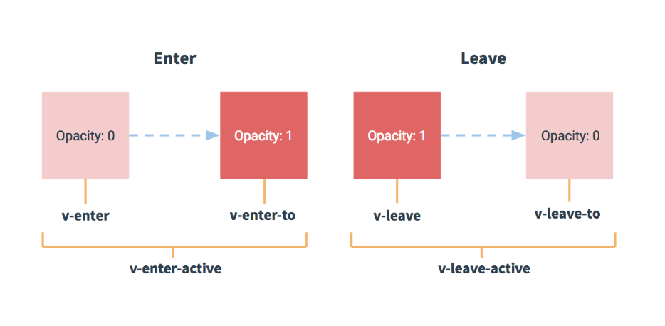
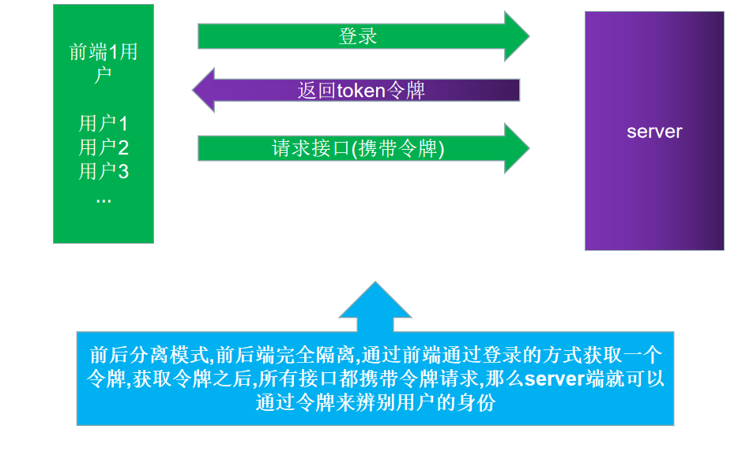
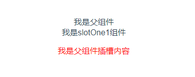
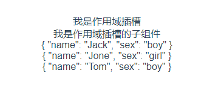

# Vue笔记

## Vue基础

Vue的认识

- Vue是一个优秀的**前端框架**，开发者按照Vue的规范进行开发。

### Vue的特点

- 数据驱动**视图**可以让我们只关注数据，完全解耦：数据和视图  =>响应式数据 => 数据变化 =>视图一定变化。
- **MVVM** 双向绑定  => v-model => 数据变化 => 视图变化   视图变化 => 数据变化 ；
- 当下各种新框架都采用了**类Vue**或者**类React**的语法去作为主语法，微信小程序/MpVue/uni-app ；
- 通过指令增强了html功能新特性，开发者一般只需要关注数据。

### 实例化Vue对象

步骤：

```html
1. body中,设置Vue管理的视图<div id="app"></div>
2. 引入vue.js
3. 实例化Vue对象 new Vue();
4. 设置Vue实例的选项:如el、data...     
	new Vue({选项:值});
5. 在<div id='app'></div>中通过{{ }}使用data中的数据
```

### Vue实例选项

#### el（管理视图）

- **作用**：当前Vue实例管理所管理的html视图；
- **值**：**通常**是id选择器(或者是HTMLElement实例)  ，而且el一旦确定,就不再更改；
- **注意**：
  - el管理的视图不能是HTML和body。
  - class选择器 只匹配第一个满足条件的元素（Vue实例 => 管理视图 1对1）。

```js
new Vue({
// el: '#app' ,  id选择器
// el: '.app',   class选择器
el: document.getElementById("#app") // dom对象
})
```

#### data（数据）

**`数据驱动视图`**=> 数据变化 => 视图一定变化  所以只需要关注数据；

- Vue实例的数据对象，是响应式数据(数据驱动视图) 数据变化 => 视图变化；
- 可以通过**vm.$data**访问原始数据对象；
- Vue 实例也代理了 data 对象上所有的属性，因此访问**vm.a**等价于访问 **vm.$data.a**；
- 视图中绑定的数据必须**显式**的初始化到data中；
- 数据对象的更新方式 直接 采用**实例.属性 = 值**；

```js
var vm = new Vue({
el:"#app",
data:{showMessage: false,}
})
console.log(vm.showMessage)
vm.showMessage = true
```

#### methods（方法的集合）

- methods是一个**对象**；可以直接通过 Vue 实例对象访问这些方法，或者在**插值表达式中使用**。
- 方法中的 `this` 自动绑定为 Vue 实例。同样所有的方法也被代理到了Vue实例对象上，都可通过this访问。
- 在data中命名时 不能和methods中的方法重名。
- 注意：不应该使用`箭头函数`来定义methods函数(例如：plus: () => this.a++)；
  - 理由是箭头函数绑定了`父级作用域`的上下文，所以 this 将不会按照期望指向 Vue 实例，`this.a`将是 undefined；

```js
new Vue({
el:"#app",
data:{
name:"Hello world",
name2:"Hello world2"
},
methods:{
fn1:function(){
  // 常规写法
  console.log(this.name)
  this.fn2() // 调用方法2
},
fn2() {console.log(this.name2)	// es6 写法
}}
})
```

#### 插值表达式

- 作用:会将绑定的数据实时的显示出来：数据变化后=>所有绑定插值表达式的部分都会更新；
- 形式：通过 {{ 插值表达式 }}包裹的形式；
- 通过任何方式修改所绑定的数据，所显示的数据都会被实时替换(**响应式数据**)**数据驱动视图**；
- 插值表达式可以进行多种操作；例如：(进行js表达式、三元运算符、方法调用等)；
- 注意：Vue实例上代理了data中所有的属性和methods中的方法，而我们的el作用的视图直接可使用这些**属性和方法**；但是并不需要**写this.属性 和 this.方法()**；

```html
<!-- js表达式 -->
<p>{{ 1 + 2 + 3 }}</p>
<!-- name为data中的数据 -->
<p>{{ name + ':消息' }}</p> 
<!-- count 为data中的数据 -->
<p>{{ count === 1 ? "成立" : "不成立" }}</p>
<!-- 方法调用 -->
<!-- fn为methods中的方法 -->
<p>{{ fn() }}</p>
```

#### 计算属性

**介绍**

- 场景:当(插值表达式/v-bind表达式)过于复杂的情况下，可以采用计算属性对于任何`复杂逻辑`**都可以采用计算属性**，简单逻辑也可以采用计算属性；
- 使用: 在Vue实例选项中定义: computed:{ (key)计算属性名: `带返回值`的函数 }；
- 说明：计算属性的值 依赖 数据对象中的值  数据对象发生改变 => 计算属性发生改变=> 视图改变；
- 计算属性每计算一次都会有结果缓存，如果 data中的数据没变化，则直接从缓存中取数据；如果 data中变化了，则会执行 新的计算方法 => 缓存；
- 计算属性会每次比较`data更新`前后的值，如果前后一致则不会引起视图变化；

**methods和计算属性的区别**

- methods每次都会执行；性能计算属性比较差；
- 计算属性是有缓存机制的，更智能化，更有效率；
- 计算属性不需要调用形式的写法；而methods方法必须采用方法()调用的形式；

##### 基本使用

- 由于计算属性中要return值需要立刻返回，所以计算属性方法: `必须写同步代码`；
- 注意：**ajax/setTimeout** 不能写在计算属性中；

```js
computed: {
nameReverse() {
return this.name.split("").reverse().join("");
}} // 定义计算属性
//当数据对象中name发生变化时,计算属性也会重新计算计算=> 改变页面视图
```

#### watch（监听数据）

- 场景：当需要根据`数据变化`进行相应业务操作, 且该操作是`异步操作`时, `计算属性不能再使用`,可以使用监听watch特性。
- watch选项不需要返回值、不需要return，只需要在函数体中执行对应的逻辑即可。
- watch:  {  data属性名(监视谁写谁的名字): function(newValue(新值),oldValue(旧值)){} } ；

**计算属性和watch的区别**：

- 计算属性必须要有返回值，所以说不能写异步请求，因为有人用它的返回值(插值表达式)；
- watch选项中可以写很多逻辑，不需要返回值，因为没有人用它的返回值；

```js
watch: {
//newValue是最新的值 oldValue为后面的旧值
city(newValue, oldValue) {
this.list = this.list.map(item => ({
city: item.name,
count: newValue
}));
}
}
```

#### 钩子函数

- 生命周期是指Vue实例或者组件从诞生到消亡经历的每一个阶段，在这些阶段的前后可以设置一些函数当做事件来调用。
- 钩子函数，就是一个vue实例被生成后调用这个函数。一个vue实例被生成后还要绑定到某个html元素上，之后还要进行编译，然后再插入到document中。
- 每一个阶段都会有一个钩子函数，方便开发者在不同阶段处理不同逻辑。


```js
 beforeCreate (实例被创建前)
 created(实例被创建后)
 beforeMount(文档被挂载前)
 mounted(文档被挂载后)
 beforeUpdate(数据变化 页面更新前)
 updated(数据变化 页面更新后)
 beforeDestory(视图销毁前)
 destoryed(视图销毁后)
```

##### created

- created:在模板渲染成html前调用，即通常初始化某些属性值，然后再渲染成视图。
- 在created的时候，视图中的html并没有渲染出来，所以此时如果直接去操作html的dom节点，一定找不到相关的元素。
- 作用：created函数一般用于调用ajax，获取页面初始化所需的数据。

##### mounted

- mounted:在模板渲染成html后调用，通常是初始化页面完成后，再对html的dom节点进行一些需要的操作。

### Vue的指令

#### 指令的介绍

- 指令 (Directives) 是带有 **v-** 前缀的特殊特性。 v- 相当于标识  ng-   wx- ；

- 指令特性的值预期是**单个 JavaScript 表达式**；

- 指令的职责是，当表达式的值改变时，将其产生的连带影响，**响应式**地作用于 DOM；

- 指令位置:  **起始标签**；

  ```html
  <p v-text="'我是p标签的内容'"></p>
  ```

#### Vue系统指令

##### v-text 和 v-html（更新内容）

- 两个指令很像innerText和nnerHTML；
- **v-text:更新标签中的内容；**
- v-text与插值表达式区别：
  - v-text  更新**整个**标签中的内容；
  - 插值表达式: 更新标签中**局部**的内容；
- **v-html:更新标签中的内容/标签；**
- v-html可以渲染内容中的HTML标签(尽量避免使用，容易造成危险不太安全。)；
- v-text 和 v-html区别：v-text指令的值会替换标签内容，而v-html指令的值(包括标签字符串)会替换掉标签的内容；

```js
<div id="app">
  <p>{{str}}</p>
  <p v-text="str">我是p标签中的内容</p>
  <p v-text="strhtml">我是p标签中的内容</p>
  <p v-html="str"></p>
  <p v-html="strhtml">我是p标签中的内容</p>
</div>
<script src="./vue.js"></script>
<script>
	new Vue({
		el: '#app',
		data: {str: 'abc',strhtml: '<span>content</span>'}
     });
</script>
```

##### v-if 和 v-show（条件渲染）

- 场景:  需要**根据条件**决定元素是否显示及使用以上指令。
- 使用: v-if 和 v-show 后面的表达式返回的布尔值来决定该元素显示隐藏。
- **区别**：
  - v-if 是直接决定元素的添加或者删除；而 v-show 只是根据样式来决定显示隐藏。
  - v-if 有更高的切换开销，而 v-show 有更高的初始渲染开销。
  - 如果在运行时条件很少改变，则使用 v-if 较好；如果切换频繁前者开销更大； 

- 如果多个元素需要 v-if或者v-show 控制，可以用**template**标签来包裹多个元素，v-if作用在template上，最终template不会形成任何元素。

```js
<div id="app">
<!-- 如果isShow的值是true ,就显示p标签 -->
<p v-if="isShow">我是p标签中的内容</p>
<p v-show="isShow">我是p标签中的内容</p>
</div>
<script src="./vue.js"></script>
<script>
new Vue({
   el: '#app',
   data: {isShow: false}
});
</script>
```

##### v-on（绑定事件）

- 场景: 使用v-on指令给元素绑定事件；
- 使用: 绑定 v-on:事件名.修饰符(可不写)="方法名" 可使用@事件名="方法名的方式"（写括号和不写括号有区别）；
- **注意**：方法名中可以采用$event的方式传形参，也可以直接写事件名，默认第一个参数为event事件参数；
- `.once`  只触发一次回调。
- `.prevent` 调用 `event.preventDefault()`。
- 事件传参有两种形式 ：
  - 匿名传参：当只写方法名时，方法中默认第一个参数就是event(事件参数)；
  - 显示传参：当写方法名()，如果想要获取event,必须显示的用$event传到方法里；

```js
<div id="app">
<!-- v-on:xx事件名='当触发xx事件时执行的语句' -->
<!-- 执行一段js语句:可以使用data中的属性 -->
<button v-on:click="count += 1">增加 1</button>
<!-- v-on的简写方法 -->
<button @click="count += 1">增加 1</button>
<!-- 执行一个方法 -->
<button @click="add">增加 1</button>
<!-- 执行一个方法、这种写法可以传形参 -->
<button @click="fn1(count)">执行fn1方法</button>
<!-- 执行一个方法、这种写法可以传形参,特殊的形参$event -->
<button @click="fn1($event)">执行fn1方法</button>
<hr>
<!-- v-on修饰符 如 once: 只执行一次 -->
<button @click.once="fn1">只执行一次</button>

<p>上面的按钮被点击了 {{ count }} 次。</p>
</div>
<script src="./vue.js"></script>
<script>
new Vue({
  el: '#app',
  data: {
      count: 0,
      items: ['a', 'b', 'c']
  },
  methods: {
      add: function() {
          this.count += 1;
      },
      fn1: function(count) {
          console.log(count);
          console.log('fn1方法被执行');
      }
  }
});
</script>
```

##### v-for（循环数组与对象）

- 作用：列表渲染，当遇到相似的标签结构时,就用v-for去渲染；

- v-for 指令：需要使用 `item in items` 或者 `item of items` 形式的特殊语法；items 是源数据数组 /对象；

  ```js
  item in items   // item为当前遍历属性数组项的值;
  (item, key, index) in  items //item为当前遍历属性对象的值 key为当前属性名的值  index为当前索引的值
  ```

- **注意**：
  - v-for写的位置应该是重复的标签上，不是其父级元素上需要注意；(循环生成谁，就在谁的标签上写v-for)；
  - 如果 v-for 中同样有多个元素，但是不想增加额外标签，同样可以用**template**；

###### key

- 场景：列表数据变动会导致视图列表重新更新，为了提升性能方便更新需要提供一个属性key；
- 使用：通常是给列表数据中的唯一值 也可以用**索引值**；
- key通常是一个唯一值 => 身份证(循环项的身份证)；

```
<li v-for="(item,index) in list" :key="index">{{item}}---{{index}}</li>
养成好习惯:建议在写v-for时 设置:key="唯一值";
```

###### v-if和v-for（同时用）

-  v-for 的优先级大于v-if ,所有v-if才能使用v-for的变量；

```html
<p v-if="index>1" v-for="(item,index) in list"></p>
<!--以上代码执行: 会将数组中前两个元素忽略掉-->
```

```js
 <!-- 循环数组的用法 -->	
<div id="app">
 <!-- v-for作用:列表渲染,当遇到相似的标签结构时,就用v-for去渲染
 v-for="数组中的元素 in data中的数组名"-->
 <p v-for="item in list">{{item}}</p>
</div>
<script src="./vue.js"></script>
<script>
 new Vue({
     el: '#app',
     data: {list: ['a', 'b', 'c'],},
 })
</script>

<!-- 循环对象的用法 -->
<div id="app">
<!-- (v,k,i)in 对象(数组和对象) v:值，k:键，i:对象中每对key-value的索引 从0开始（ v,k,i是参数名,）-->
<p v-for="(value,key,i) in per">{{value}}----{{key}}--{{i}}</p>
</div>
<script src="./vue.js"></script>
<script>
new Vue({
    el: '#app',
    data: {per: {name: '老王',age: 38,gender: '男'}}
})
```

##### v-bind（绑定标签属性）

- 作用：绑定标签上的任何属性；
- 场景：当标签上的属性是变量/动态/需要改变的；
- 语法：<p :属性="数据对象中的属性名"></p>；

```html
<p v-bind:id="ID"></p>   // ID为数据对象中的变量值;
<p :id="ID"></p>  // 简写
```

###### 绑定class对象

- 语法 :class="{ class名称": 布尔值 }"；
- 注意：绑定class和原生class会进行合并;

```html
<p :class="{left:showClass}">内容</p>
```

###### 绑定class数组语法

- 语法 :class="[class变量1,class变量2..]"；

```html
<p :class="[activeClass,selectClass]" class="default">内容</p>
```

###### 绑定style对象语法

- 语法 :style="{css属性名: 变量}"；
- css属性名需要写成驼峰格式。例如：(font-size要写成 fontSize)。
- 注意：
  - 绑定属性变量也可以直接输入属性样式，必须要加单引号。
  - 原有的style不受影响，但是后面的样式会顶替到前面的样式。因为合并时原生样式在前面。

```html
<p :style="{fontSize:fontsize}"></p>
```

###### 绑定style数组语法

- 语法  :style="[对象1,对象2...]"；
- **注意**：对象可以是多个属性的集合同样里面的css属性需要遵从小驼峰命名的规则。

```html
  <p :style="[a,b,c]" style="color:red">内容</p>
```

##### v-model（绑定表单数据）

- 作用：表单元素的绑定；
- 特点：双向数据绑定；
  - 数据发生变化可以更新到界面 =>响应式数据；
  - 通过界面可以更改数据   表单数据变化 =>通过v-model =>数据变化；

- 注意：v-model会**忽略所有表单元素的value、checked、selected特性的初始值**，而总是**将Vue实例的数据作为来源**，应该在data选项中声明初始值。

###### v-model（语法糖原理）

- 分析：表单数据改变 =>数据发生改变    数据改变 =>页面数据变化。

```html
<div id="app">
<input type="text" @input="changeInput" :value="name" />
{{ name }}
</div>
<script src="./vue.js"></script>
<script> 
var vm = new Vue({
el: "#app",
data: {
name: "张三"
},
methods: {
changeInput(event) {
  // 值发生改变时 会触发这个方法
  //  取value值
  this.name = event.target.value;
}
}
});
</script>
```

###### 绑定其他表单数据

- 表单元素：input  textarea checkbox radio  select；
- 注意：
  - checkbox在input标签中需要是指value值；
  - 所有表单元素一旦绑定v-model就会忽略掉原有的value值，checked值、selected值需要从数据对象中取默认值。

```html
任务：
1.checkbox绑定一个属性 nameCheckbox 实现 checkbox同步
2.多个checkbox绑定同一个属性 nameCheckboxs 实现 checkbox同步:北京、上海、天津
3.select绑定属性nameSelect 实现同步:北京、上海、天津 
<div id="app">
<p>{{ nameCheckbox }}</p>
<input type="checkbox" v-model="nameCheckbox" />您是否成年？
<p>{{ nameCheckboxs }}</p>
<input type="checkbox" value="bj" v-model="nameCheckboxs" />北京
<p>{{ nameSelect }}</p>
<select name="" id="" v-model="nameSelect">
	<option value="北京">北京</option>
</select>
</div>
<script src="./vue.js"></script>
<script>
var vm = new Vue({
	el: "#app",
	data: {
		nameCheckbox: true,nameCheckboxs: [],nameSelect: "上海"},
});
</script>
```

##### v-cloak（解决页面闪烁）

- 场景：解决页面初次渲染时，页面模板闪屏现象。
- 注意：可以一次性将v-cloak引用在实例视图上，避免多次写入标签。

```html
<div v-cloak id="app">
<p>{{ name }}</p>
 <!--写入style样式中-->
[v-cloak] {
 display: none;
}
```

##### v-once（渲染一次）

- 作用: 使得所在元素只渲染一次。
- 场景:静态化数据 。

```html
 <p v-once>{{ name }}</p>
```

##### ref （操作 DOM）

- 作用：通过ref特性可以获取元素的dom对象；
- 使用：给元素定义ref属性，然后通过$refs.名称来获取dom对象；
- $refs是Vue实例的属性；
- $data/$event => $开头的属性和方法都是Vue实例的方法和属性；

```js
<input type="text" ref="myInput" /> // 定义ref
<!--vue实例方法：-->
focus() {
this.$refs.myInput.focus();
}  // 获取dom对象 聚焦
```

##### 在 CSS过渡和动画中自动应用class

- Vue 提供`transition`的封装组件，在元素更新、移除、新增情形中，可以给任何元素和组件添加进入/离开过渡。
- 用法：我们需要动画的标签外面嵌套`transition`标签 ,并且设置name属性。



> class状态 
>
> 1. v-enter：定义进入过渡的开始状态。
> 2. v-enter-active：定义进入过渡生效时的状态。
> 3. v-enter-to: 2.1.8版及以上 定义进入过渡的结束状态。
> 4. v-leave: 定义离开过渡的开始状态。
> 5. v-leave-active：定义离开过渡生效时的状态。
> 6. v-leave-to: 2.1.8版及以上 定义离开过渡的结束状态。
> 7.  注意：v要替换成transition组件的name属性值；先要编写元素的最终展示样式。

```js
<transition name="test">
	<div v-if="show">动态显示的内容</div>
</transition>
<style>
.test-enter{opacity: 0;}	
.teste-enter-active{transition: all 1s;}
.test-enter-to{opacity: 1;}
</style>
```

### 自定义指令

- 使用场景：需要对普通 DOM 元素进行操作，这时候就会用到自定义指令。
- 分类：`全局注册`和`局部注册`；

#### 全局自定义指令

- 在创建 Vue 实例之前定义全局自定义指令 Vue.directive()；
- Vue.directive('指令的名称'，{ inserted: (使用指令的DOM对象,表达式对象) => { 具体的DOM操作 } } )；
- 表达式对象 => value  => 表达式计算结果的值；
- 在视图中通过"v-自定义指令名"去使用指令；
- 注意：指令名称要全部小写；

```js
 // 定义指令
//  自定义指令是不需要加v-前缀的
// 第二个参数为一个对象  对象中要实现 inserted的方法
// inserted中的参数为当前指令所在元素的dom对象
Vue.directive("focus", {
        inserted(dom,expression) {
          dom.focus();
        }
 });
```

#### 局部自定义指令

- 需要注册在当前实例上directives:{}；

```js
directives: {
focus: {
inserted(dom,expression) {
dom.focus();
}
}
} // 局部自定义指令实现
```

### 组件

**介绍**

- 组件特点：组件是一个**特殊的Vue实例**；
- vue实例有`el`选项，组件实例没有el但是`templete`页面结构；
- template 代表其页面结构 (`有且只要一个根元素`)；
- 每个组件都是`独立`的 运行作用域  `数据、逻辑没有任何关联`；
- 组件中data是个函数：data () {  return {  数据属性 } }；
- 注意：
  - 值得注意的是data和Vue实例的区别为 组件中data为一个函数，没有el选项；
  - template必须有且只有一个根元素；
  - data中必须为一个返回对象的函数；

```jsx
//全局组件使用方法:
Vue.component("content-a", {
        template: `<div>
        {{count}}
        </div>`,
        data() {
          return {
            count: 1
          };
        }
      });

//局部组件
new Vue({
el: "#app",
components:{
 "content-a": {
		template: `<div>{{count}}</div>`,
 data() {
   return {
     count: 1
   };
 }
}
})
```

#### 组件嵌套

- 我们在Vue实例中使用自定义组件，也可以在注册自定义组件时，嵌套另一个自定义组件，也就是父子组件的关系。

```js
var comA = {
template: `<div>我是子组件</div>`
};
var parentA = {
template: `<div>
我是父组件
<com-a></com-a>
</div>`,
components: {'com-a': comA }
};
var vm = new Vue({
el: "#app",
data: {},
methods: {},
components: {
'parent-a":parentA
}
});
```

**组件通信情况**

- 父传子：父组件可以将数据传给子组件 ；
- 子传父：子组件也可以传数据给父组件；
- 兄弟组件1传兄弟组件2 ；

##### 父传子（Props）

- props作用: 接收父组件传递的数据。
- props就是父组件给子组件标签上定义的属性。

```js
1. props是组件的选项  定义接收属性；
2. props的值可以是字符串数组 props:["list"]；
3. props数组里面的元素称之为prop(属性) 属性=?值；
4. prop的值来源于外部的(组件的外部)；
5. prop(我们这里是lists)是组件的属性->自定义标签的属性；
6. prop的赋值位置(在使用组件时,通过标签属性去赋值)；
7. prop的用法和data中的数据用法一样；
```

- 注意：

  - 在子组件中声明接收的属性；

  - 父组件传递给子组件的数据是`只读`的,即`只可以用,不可以改`；
  - 用props完成父组件给子组件传值，传值的属性都是定义在子组件的标签上，可以采用v-bind的形式传递动态值。

```js
//案例：在父组件中将 ["北京", "上海","天津"] 传递给子组件
<div id="app">
	<city :list="list"></city>
</div>
<script src="./vue.js"></script>
<script>
	Vue.component("city", {
		template: `<div><p v-for="item in list">{{item}}</p></div>`,
        props: ["list"]
	});
	var vm = new Vue({
        el: "#app",
        data: {list: ["北京", "上海", "天津"]},
        methods: {}
    });
</script>
```

##### 子传父（$emit）（需要补充）

- 子组件给父组件传值: 可通过在子组件中触发`$emit`事件，然后在当前组件实例中监视此事件进行追踪。
- **$emit是在当前组件实例抛出一个事件，监听谁的实例事件,就写在谁的标签上。**
- 注意：
  - $emit触发的事件只能在当前实例监听，因为是在当前实例触发的。
  - 如果props有驼峰命名的情况赋值时，需要拆成分割的形式否则无法传递。

```js
案例：
<script>
      // v-bind绑定class对象语法
	var obj = {
        template: `<li :class="{select:selectClass}" @click="transData" >{{cityname}}</li>`,
        props: ["cityname", "currentname"],
        methods: {
          transData() {
            //   data/methods/computed/props都代理给了Vue实例 this
            console.log(this.cityname);
            this.$emit("selectcity", this.cityname);
          }
        },
        computed: {
          selectClass() {
            //   必须有返回值
            return this.cityname === this.currentname; //如果相等,就意味着当前点击项和循环项相等返回true,返回false
          }
        }
      };
	var vm = new Vue({
        el: "#app",
        data: {
          list: ["北京", "上海", "天津"],
          currentCity: null // 当前点击的城市
        },
		methods: {
          receiveData(cityname) {
            this.currentCity = cityname;
          }
        },
        components: {
          "city-li": obj
        }
      });
    </script>
```

### 过滤器

#### 过滤器的文档分析

- 场景：data中的数据格式(日期格式/货币格式/大小写等)需要数据时；
- 使用位置：{{}}和v-bind="表达式 | 过滤器名称"；
- 具体用法：{{msg | 过滤器名字}}；
- 分类：本地(局部)和全局；所有实例均可使用 Vue局部 过滤器只有当前实例才可以使用；
- 全局与局部区别：注册位置不同,应用范围不同；
- 局部过滤器：
  - 本地：通过el/data/methods`选项filters`；
  - 局部：在Vue实例上的选项上filters => 所有过滤器集合 =>当前实例使用。

- 全局过滤器：
  - 全局: 在new Vue上面 Vue.filter()  => 所有实例都可以使用。

#### 全局过滤器

- 过程：
  1. 在创建Vue实例之前定义全局过滤器Vue.filter()；
  2. Vue.filter('该过滤器的名字'，(要过滤的数据)=>{return 对数据的处理结果})；
  3. 在视图中通过{{数据 | 过滤器的名字}} 或者v-bind使用过滤器；

- 注意：
  - 可使用多种表达式形式全局过滤器多个Vue实例可共享使用；
  - 过滤的数据必须return输出；

```js
Vue.filter("toUpper", function(value) {
return value.charAt(0).toUpperCase() + value.substr(1);
});// 过滤器核心代码
```

#### 局部过滤器

- 过程：
  1. 在vue实例对象的选项中配置过滤器filters:{}；
  2. (key)过滤器的名字：(value)(要过滤的数据)=>{return 过滤的结果}；
  3. 在视图中使用过滤器：{{被过滤的数据 | 过滤器的名字}}；
- 注意：局部过滤器只能用在当前Vue实例视图上；过滤的数据必须return输出；

```js
filters: {
toUpper(value) {
  return value.charAt(0).toUpperCase() + value.substr(1);
}}
```

##### 过滤器传参和串联使用

- 传参：过滤器可以传递参数,**第一个参数永远是前面传递过来的过滤值**；
- 过滤器也可以多个串行起来并排使用；
- 调试：debugger => 会在调试时 自动进入 该断点  => 调试完毕之后 debugger要删除；

```js
// index为传入的参数 
toUpper(value, index) {
   return value
     .split("")
     .map(function(item, i) {
       if (i === index) {
         return item.toUpperCase();
       }
       return item;
     })
     .join("");
 }
} // 根据传入的索引找到对应的字母换成大写字母
```

- 串行使用过滤器

```html
<p>{{ text | toUpper(2) | reverse }}</p> // 语法 多个过滤器用 | 分割
```

### Vue实现发送网络请求

**发送网络请求**

- 在Vue.js中发送网络请求本质还是ajax，我们可以使用插件方便操作。
- axios：**不是vue的插件**，可以在任何地方使用，推荐使用。
- 既可以在浏览器端又可以在node.js中使用的发送http请求的库，`支持Promise`，不支持jsonp；如果遇到jsonp请求，可以使用插件jsonp实现。

#### axios使用

**使用过程**：

- 引入方式：本地引入，npm；

```js
//第一种写法:
axios.get(url).then((res) => {
// 请求成功会来到这res响应体
}).catch((err) => {
// 请求失败会来到这处理err对象
})	
//第二种写法:  用来解决回调地狱
axios({
    method:"" ,	//默认为get请求
    url:"",
    data:""
}).then(reslut =>{}).catch(error=>{})	//请求成功会来result响应体,失败会来error响应体;
//第三种写法: 用于替代Promise链式调用   -----下面中有介绍
async function(){
  let result = await axios({
       url:"",
   })
   this.list=result.data 
}
```

##### axios统一导入

- 在入口main.js文件中引入axios,并给全局Vue对象的原型链赋值。

```js
Vue.prototype.$http = Axios; //所有的实例都直接共享拥有了 这个方法
this.$http.post("http://localhost:3000/heroes", this.formData)
```

##### 设置baseUrl

- axios中配置统一的请求路径头；给axios中的baseUrl设置常态值。

```js
Axios.defaults.baseURL = "http://localhost:3000"; // 设置共享的方法
```

### axios拦截器

#### token

- token是一个用户自定义的任意字符串，目前开发中，token都是在服务端生成并且token的值会保存到服务器后台。只有服务器和客户端知道这个字符串。
- token就成了两者之间的秘钥，它可以让服务器确认请求是来自客户端还是恶意的第三方。
- token是在用户登录的时候产生的，在前台登录某一个系统并且获得一个token之后，前台需要将该token设置在请求头上，以确保之后的每一次请求都是带着该`令牌`的。



#### token验证的流程

> 1. 客户端使用用户名跟密码请求登录
> 2. 服务端收到请求，去验证用户名和密码（后台根据请求去数据库查找是否有该用户）
> 3. 验证成功后，服务端会签发一个token(该token值一般都会存入Redis数据库中)，再把这个token发送给客户端
> 4. 客户端收到token之后,(一般存储在localStorage中)
> 5. 客户端每次向服务端请求资源的时候需要带着服务端签发的token
> 6. 服务端收到请求，然后去验证客户端请求里面带着的token，如果验证成功，就向客户端返回请求的数据

#### axios拦截 token验证

axios的拦截器是一个作用非常大，非常好用的东西。分为请求拦截器和响应拦截器两种。

##### 请求拦截器

- 作用：在请求发送前进行一些操作。例如：在每个请求体里加上token统一做了处理。

```js
axios.interceptors.request.use(function (config) {
  // 在发送请求之前做些业务处理，例如加入token
  let token = window.localStorage.getItem('user-token') // 获取token
  //config 的选项对象  axios默认选项
  config.headers['Authorization'] = `Bearer ${token}`   //加入token
    return config;
  }, function (error) {
    // 对请求错误做处理
    return Promise.reject(error);
  });
```

##### 响应拦截器

- 作用：在接收到响应后进行一些操作。例如：对相应数据做处理或者在服务器返回登录状态失效，需要重新登录的时候，跳转到登录页。

```js
import { Message } from 'element-ui'	//再引用elementui下
// 响应拦截 响应数据 回来 到达then方法之前
axios.interceptors.response.use(function (response) {
    // 对响应数据做处理，例如:对接收数据做处理、跳转到登录页
	return response.data ? response.data : {}	
    return response;
  }, function (error) {
    // 对响应错误做处理
     let status = error.response.status
  let message = '未知错误'
  switch (status) {
    case 401:
      message = 'token过期或未出'
      window.localStorage.clear() // 清空缓存
      router.push('/login') // this.$router.push()
      break
    case 404:
      message = '手机号不正确'
      break
    default:
      break
  }
  Message({ message })
  //希望 在异常处理函数中将所有的错误都处理完毕 不再进入catch  终止错误
    return Promise.reject(error);// 终止当前的错误
  });
```

### async和await新异步方案应用

- 作用：用于替代Promise链式调用；编程从异步变成同步。
- async：它作为一个关键字放到函数前面，用于表示函数是一个函数函数，async就是异步的意思。异步函数也就意味着该函数的执行不会阻塞后面的代码。
- await：await就是等待的意思。它后面可以放任何表达式，我们更多的是放一个promise对象的表达式。
- 注意：await关键字只能放到async函数里面。否则会阻止后面的函数执行。
- await后面的promise只有resolve了才会执行下 。如果想要捕获reject，要在await函数外面包一层 try/catch。

```js
//小案例：这里我们可以看到，写异步代码就像写同步代码一样，再也没有回调地狱。
async function testResult() {
    let first = await doubleAfter2seconds(30);
    let second = await doubleAfter2seconds(50);
    let third = await doubleAfter2seconds(30);
    console.log(first + second + third);	//6秒后输出220
}
```

```js
//开发中：发送请求;
//同步写法
aysnc  getArticles(){
	let result = await this.updateAxios() 
}// 造成强制等待  
// 异步写法
getArticles(){
	this.updateAxios().then(result => {
		this.count = result
	}) 
}
```

#### json-server工具的使用

- 目的：没有后端的支撑下，前端难以为继，json-server可以快速构建一个后台的接口服务，供前端调用；
- json-server是一个命令行工具可以json文件变成接口文件；
- json-server遵循`restful`接口规则；
- 安装：npm i -g  json-server // 也可以采用yarn 和 cnpm；

```
新建一个json文件 db.json,并在相对目录下运行命令行命令
{
// brands 相等于 我们数据库中的一个表
"brands": [
{
"name": "苹果",
"date": "2018-05-30T08:07:20.089Z",
"id": 1
}
],
}
json-server --watch db.json	//用来访问接口；
```

### 单页应用 SPA

- single page application => 单页应用 =>Vue为单页应用而生。
- 传统模式：每个页面及其内容都需要从服务器`一次次请求`如果网络差，体验则会感觉很慢。
- SPA模式：`第一次加载`会将所有的资源都请求到页面，模块之间切换`不会再请求`服务器。

**SPA优缺点**

- 优点：
  - 速度快切换模块不需要经过网络请求，用户体验好；因为前端操作几乎感受不到网络的延迟。
  - 完全组件化开发，由于只有一个页面，所以原来属于单个页面的工作被归类为一个个组件。

- 缺点：
  - 首屏加载慢：解决方案：按需加载，不刷新页面之请求js模块。
  - 不利于SEO：解决方案：服务端渲染。

- SPA-实现原理：可以通过页面地址的锚链接来实现。

### Router路由

- Vue-Router是Vue.js官方的路由管理器。它和 Vue.js 的核心深度集成，让构建单页面应用变得易如反掌 。
- Vue-Router实现根据不同的`请求地址` 而`显示不同的组件`。
- 如果要使用 vue开发项目，`前端路由`功能`必须使用`，要用vue-router来实现。

#### Vue-router使用步骤

1. 导入vue和vue-router。

2. 设置HTML中的内容。

   ```js
   <!-- router-link 最终会被渲染成a标签，to指定路由的跳转地址 -->
   <router-link to="/users">用户管理</router-link>
   
   <!-- 路由匹配到的组件将渲染在这里 -->
   <router-view></router-view>
   ```

3. 创建组件。

   ```js
   // 创建组件
   // 组件也可以放到单独的js文件中
   var Users = {
     template: '<div>这是用户管理内容</div>'
   };
   //注意:项目开发中,需要使用全局注册Vue.use(Vuerouter)
   ```

4. 实例化路由对象，配置路由规则。

   ```js
   // 配置路由规则
   var router = new VueRouter({
   routes: [{ name: 'home', path: '/', component: Home },]
   });
   ```

5. vue实例挂载router实例。

   ```js
   var vm = new Vue({
   el: '#app',
   router
   });
   ```

#### router-view

- router-view组件是一个 functional 组件，渲染路径匹配到的视图组件。
- router-view渲染的组件还可以内嵌自己的 router-view，根据嵌套路径，渲染嵌套组件。

#### router-to属性赋值

- to有多种赋值方式。

```js
<!-- 常规跳转 -->
<!-- <router-link to="/sport">体育</router-link> -->
<!-- 变量 -->
<!-- <router-link :to="path">体育</router-link> -->
<!-- 根据对象name跳转 -->
<!-- <router-link :to="{name:'abcdefg'}">体育</router-link> -->
<!-- 根据对象path跳转 -->
<!-- <router-link :to="{path:'/sport'}">体育</router-link> -->
<!-- 带参数的跳转 -->
<router-link :to="{name:'abcdefg',params:{a:1}}">体育</router-link>
```

#### 动态路由

- 使用场景：点击`列表页跳转到详情页`时，跳转的链接需要`携带参数`，会导致页面path不同；当`页面path不同`却需要对应`同一个组件`时,需要用到`动态路由`这一概念。

##### 实现步骤

1. 路由规则中增加参数，在path最后增加参数。

   ```js
   注意这里的id相当于我们给路由加了参数：叫做：id
   { name: 'users', path: '/users/:id', component: Users },
   ```

2. 通过router-link传参，在路径上传入具体的值(实参)。

   ```js
   <router-link to="/users/120">用户管理</router-link>
   ```

3. 在组件内部可以使用，`this.$route`获取当前路由对象，并通过`params`获取定义的参数。

   ```js
   var Users = {
   template: '<div>这是用户管理内容 {{ $route.params.id }}</div>',
   mounted() {
   console.log(this.$route.params.id);
   }};
   ```

#### router重定向

- 场景: 当希望某个页面被强制中转时，可采用redirect 进行路由重定向设置。

- **重定向拦截谁就在谁的路由中写redirect**。
- 你希望它去哪就写谁的地址 path。

```js
{
path: "/",
redirect: "/home" // 默认时候强制跳转home页面
}
```

#### router编程式导航

- 跳转不同的组件,不仅仅可以用router-link还可以采用`代码行为`。
- **this.$router可以拿到当前路由对象的实例**。

##### this.$router与this.route的区别

- **this.$router：表示全局路由器对象，项目中通过router路由参数注入路由之后，在任何一个页面都可以通过此方法获取到路由器对象，并调用其push()、go()等方法**；
- **this.$route：表示当前正在用于跳转的路由器对象，可以调用其name、path、query、params等方法**；

##### router路由对象实例方法

###### push

- push：相当于往历史记录里推了一条记录，如果点击返回会回到上一次的地址，相当于 to属性。

###### replace

- replace：相当于替换了当前的记录，历史记录并没有多但是地址会变。
  - 同样是跳转到指定的url，但是这个方法不会向history里面添加新的记录，点击返回，会跳转到上上一个页面。

###### go()

- go(数字)：代表希望是前进还是回退，当数字大于0时就是前进n(数字)次，小于0时，就是后退n(数字)次。

```js
goHome() {
	this.$router.push("/home");			 // 跳转到home页面(简写);
	this.$router.push({path: "/home"});	//等价于  to="{path:'/home'}";
     this.$router.go(-3); // 回退3步
}
```

##### route路由对象属性

###### $route.path

- 字符串，对应当前路由的路径，总是解析为绝对路径，如 `"/foo/bar"`。

###### $route.params

- 一个key/value 对象，包含了动态片段和全匹配片段，如果没有路由参数，就是一个空对象。

###### $route.query

- 一个key/value对象，表示URL查询参数。例如（对于路径 `/foo?user=1`，则有 `$route.query.user == 1`，如果没有查询参数，则是个空对象）

###### $route.hash

- 当前路由的hash值 (带 #) ，如果没有hash值，则为空字符串。

#### routerlink-tag渲染标签

- 作用：有时候需要`<router-link>`渲染成某种标签，于是我们使用 `tag`。
- 默认值: `"a"`；同样它还会会监听点击，触发导航。

```js
<router-link to="/home" tag="li">foo</router-link>
```

#### active-class

- 默认值: `"router-link-active"`

- 设置链接激活时使用的 CSS 类名。默认值可以通过路由的构造选项 `linkActiveClass` 来全局配置。

- ```js
  <style>
  .router-link-active {
  	color: red;
  }		//当切换router-link是会给当前的标签添加active属性
  </style>
  ```

#### router嵌套路由

- 场景：存在组件嵌套情况下，我们需要提供多个视图容器router-view。
- router-link和router-view都可以添加类名、设定样式。
- **注意：以 / 开头的嵌套路径会被当作根路径。 这让你充分的使用嵌套组件而无须设置嵌套的路径**。

```js
routes: [{
	path: "/heroes",
	component: appContainer,				//我们需要一个空的容器来放二级路由
	children: [
		{path: "",component: appList },		//注意：子路由默认页面用引号就可以，不需要/
        {path: "add",component: appAdd }
    ]
}]
```

#### router导航守卫

- 含义：vue-router提供的导航守卫主要用来通过跳转或取消的方式守卫导航。
- 有多种机会植入路由导航过程中：全局的, 单个路由独享的, 或者组件级的。
- **参数或查询的改变并不会触发进入/离开的导航守卫**。
- **注意：确保要调用 next 方法，否则钩子就不会被 resolved**。

```js
router.beforeEach((to, from, next) => {  })
```

> 参数
>
> **to: Route**: 即将要进入的目标路由对象。
>
> **from: Route**: 当前导航正要离开的路由。
>
> **next: Function**: 一定要调用该方法来 **resolve** 这个钩子。执行效果依赖 `next` 方法的调用参数。
>
> **next()**: 进行管道中的下一个钩子。如果全部钩子执行完了，则导航的状态就是 **confirmed** (确认的)。
>
> **next(false)**: 中断当前的导航。如果浏览器的 URL 改变了 (可能是用户手动或者浏览器后退按钮)，那么 URL 地址会重置到`from`路由对应的地址。
>
> **next('/') 或者 next({ path: '/' })**: 跳转到一个不同的地址。当前的导航被中断，然后进行一个新的导航。你可以向 `next` 传递任意位置对象。

```js
// 全局前置守卫
import router from './router'
router.beforeEach(function (to, from, next) {
  // 判断 拦截的范围
  if (to.path.startsWith('/home')) {
    // 进入到了拦截范围
    // 判断是否登录 有token 就登录 没token就没登录
    let token = window.localStorage.getItem('user-token') // 获取token
    if (token) {
      // 如果有token
      next()
    } else {
      next('/login') // 没有token 就跳转到登录页
    }
  } else {
    next() // 放行
  }
})
// 先导出
export default router
```

### Vue插槽

- 插槽（Slot）是Vue提出来的一个概念，正如名字一样，插槽用于决定将所携带的内容，插入到指定的某个位置，从而使模板分块，具有模块化的特质和更大的重用性。
- 插槽显不显示、怎样显示是由父组件来控制的，而插槽在哪里显示就由子组件来进行控制。

#### 默认插槽（匿名插槽）

- 作用： 保留组件中的所有原始标签内容，这种插槽被称为匿名插槽。用法：<slot></slot>
- 直接在组件中写上slot标签对，就可以在根元素中的引用的组件中间显示所写的内容。
- 我们可以在定义插槽时，在`slot(标签)`中写入`默认内容` 如果在传入插槽内容时，内容不为空,那么还会`按照之前的模式替换`，如果没传,那么`默认内容`就会自动出现`替换slot`的位置

```js
//父组件
<template>
  <div>我是父组件<slot><p style="color:red">我是父组件插槽内容</p></slot></div>
</template>
//子组件
<template>
  <div class="slot1">
    <div>我是slotOne1组件</div>
    <slot></slot>
  </div>
</template>
```



#### 具名插槽

- 凡是具有name属性的slot标签，就被称为具名插槽即<slot name=top>(在子组件中写，写的位置不同，在引用该模板的页面中显示的位置也会不一样)。

- 作用：

1. 在组件的原始内容的某个标签中，添加slot=top属性，指明该标签所对应的插槽的名称。

2. 在组件模板中通过调用slot标签，并设置name=top属性，会自动将对应的标签内容添加至当前slot标签所在的位置。

```js
//子组件
<child>
    <span slot='after'>我是after的</span>
    <span slot='before'>我是before的</span>
</child>
//父组件
<div>
    <slot name='before'></slot>>
    <p>静态内容</p>
    <slot name='after'></slot>
</div>
//注意:这里我们故意把顺序颠倒了，但是效果没有任何影响。说明具名插槽无关顺序。
//具名插槽同样支持备用内容,不传入插槽内容则显示插槽内部的内容。
```

#### 作用域插槽

- 作用域插槽:将组件模板中的数据传递给组件的原始内容。
- 在slot开始标签中，添加要传递的数据，避开name属性（具名插槽）
-  在原始内容中通过slot-scope属性（其值是自定义的）接受传递的数据，即slot-scope=varName(本质是个对象，存储传递的数据，即数据会自动转换成键值对，存储在这个对象里，所以属性名对应属性名，属性值对应属性值）

```js
//子组件
<template>
  <div>我是作用域插槽的子组件<slot :data="user"></slot></div>
</template>
<script>
export default {
  name: 'slotthree',
  data () {
    return {
      user: [
        {name: 'Jack', sex: 'boy'},
        {name: 'Jone', sex: 'girl'},
        {name: 'Tom', sex: 'boy'}
      ]
    }
  }
}
</script>
//父组件
<template>
  <div>我是作用域插槽<slot-three>
      <template slot-scope="user">
        <div v-for="item in user.data" :key="item.id">{{item}}</div>
      </template>
    </slot-three>
  </div>
</template>
```



### 请求模块的优化

- 作用：解决所有请求都在组件中，所有的请求都抽离出去，形成一个单独的模块，组件只是调用。

```js
//第一步：新建组件，优化接口 以export  default  obj 输出对象
export default {
  API_ARTICLES: '/articles', // 相当于定义了一个常量
  API_CHANNELS: '/channels'
}
//第二步：引入组件 以对象方式引入import obj  from '路径'
import { getArticles } from '../../api/articles'	
export function getArticles (params) {
  return axios({
    url: API.API_ARTICLES,
    params
  })
}
```

