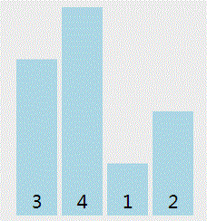

# WebAPI基础

# WebAPI

- API - application   programing   interface 翻译过来叫 `应用编程接口` ;说到底就是别人已经帮我们封装好的对象的属性和方法；
- **javascript组成:**
  - ECAMAScript：js的语法规范；简称es；
  - DOM - document object model 文档对象模型 -  把整个页面看成一个对象;
  - BOM - browser object model     浏览器对象模型 -  把浏览器看成一个对象；

# DOM

## 介绍

- 节点：树形结构里面的每个交叉点（标签），被称为节点，也叫DOM节点；
- 认知的节点包括： 标签本身、标签上的属性（src、id、class、style等）、标签内文本；

## 注册事件 

- **on事件名**
  - 本质相当于是把一个函数存储到 了 on 这个属性里面 ， 后面被重复赋值了，on的方式注册，
  - 无法多次注册；团队协作时，有可能别人写的代码，会把你的覆盖了。
- addEventListener：添加事件监听，可以多次注册事件,不会前后覆盖；

### 1Click(点击)

- **作用**：注册给谁：元素对象（DOM节点）；用于和用户交互的动作，尤其是鼠标的点击本质为浏览器里面一种触发响应的一种机制；注册就是为了就是为了和用户交流互动;

```js
// btn 事件源：通过谁要触发这个事件，也就是元素对象；
// click 事件类型：用户通过什么行为,去触发一件事；
btn.onclick = function(){
console.log('被点击了');}
```

### 2.Focus、Blur(获取/失去焦点)

- #### 语法

  - focus：聚焦；blur：模糊；
  - 注册给谁？有光标的标签input textarea;
  - 事件类型：
    - 有光标时：获得焦点 focus；
    - 无光标时：失去焦点 blur；

```js
input.onfocus = function(){
  // 当你想要让鼠标光标在输入框里面的时候要做什么事，就使用这个事件即可
}
input.onblur =  function(){
  // 当你希望处理鼠标光标失去的时候所做的事情，就在这里做
}
```

### 3.AddEventListener(添加事件监听)

- **优点**：添加事件监听，可以多次注册事件,不会被覆盖；

```js
var btn = document.querySelector('#btn');
//  参数： 事件类型 - 字符串； 事件处理程序 - function 
// 返回值：undefined
btn.addEventListener('click', function() {
console.log(123);
```

### 4.keydown、Keyup(键盘事件)

#### 1.事件类型：

- 按键按下：keydown;
- 按键谈起：keyup;

#### 2.键盘码

- **事件对象.keyCode**：被称为键盘码，按键对应的数字不一样，需要判断数字知道按下的按键；
- 例如：keyCode==13 回车键；keyCode==16 shift键；
- ctrl属性：**事件对象属性ctrlKey；如果是true，按下了ctrl键；**

#### 3.实现

- **获取元素：文本域；**
- 注册事件：keydown；（组合键）；
- 按下键盘：判断e.ctrlKey && e.keyCode=== 13 全部成立；

```js
text.onkeydown = function(e) {
    console.log(e.keyCode, e.ctrlKey);
    // 判断是否同时按下ctrl和回车；
    if (e.ctrlKey && e.keyCode === 13) {
      btn.onclick();//在代码中执行按钮点击；
    }}
```

### 5.Mousedown、Mousemove、Mouseup(点击鼠标触发)

- **mousedown**：当鼠标的按键被点下的时候触发;
- **mousemove**：鼠标在某个元素身上移动的时候触发;
- **mouseup **：当鼠标的按键被松开的时候触发;

```js
案例:盒子跟随鼠标移动mousemove
步骤:
	1.鼠标移动：给document注册事件，mousemove;
	2.跟着移动：给img盒子设置：pageX,pageY;
	 document.onmousemove = function(e) {
    // 鼠标在当前窗口的位置
    var x = e.clientX;
    var y = e.clientY;
    // 鼠标相对于 body 左上角的位置；
    // var x = e.pageX;
    // var y = e.pageY;
    img.style.top = y + 'px';
    img.style.left = x + 'px';	}
```

### 6.Mouseover、Mouseout(鼠标移入)

- **mouseover**：鼠标移入时出发事件；

- **mouseout**：鼠标移除时触发事件；

  ```js
  <div class="box" index=0></div>
  // 鼠标移入时触发
  var box = document.querySelector('.box');
  // 对象属性，
  box.a = 0;
  box.b = 1;
  box.onmouseover = function() {
      // 获取自定义属性
      this.getAttribute("index");    
      // 添加节点对象属性，随便添加；
      console.log(this.a);//当鼠标移入时打印0；
  }
      // 鼠标移除时触发
  box.onmouseout = function () {
      this.getAttribute("index");
      console.log(this.b);//当鼠标移除时打印1；
  }
  ```

### 7.Transitionend、Animationend(动画结束事件)

- 动画结束事件：专门是指c3里面的动画结束会触发的事件，c3动画有两种，结束动画事件也有两个；
- **transitionend**：元素的过渡动画结束的时候触发；
- **animationend**：会在帧动画结束的时候触发；

```js
var box = document.querySelector('.box');
box.addEventListener('transitionend/animationend',function(){
  console.log(1);
});
```

**注意**:

- 不能使用on的方式注册，只能使用addEventListener的方式注册；

- 如果帧动画是无限次的，不会触发该事件；

### 8.Touch（触摸事件【移动端】）

- 移动端不使用click的：，移动端会在**点下的瞬间需要知道到底是单击还是双击**，有一个短暂的延迟才会执行click事件，但是这个对于用户来说不是太友好。
- 触摸事件在pc端是不会触发的，必须是在移动端才可以；推荐使用addEventListener注册；
- **移动端事件：触摸事件**
  - **touchstart**：会在手指触摸到屏幕的时候触发；
  - **touchmove**：会在手指触摸到屏幕，移动的过程中触发；
  - **touchend**：会在手指离开屏幕的瞬间触发；

- **事件对象属性：触摸点**
  - 事件对象.touches - 屏上面的触摸点；
  - 事件对象.targetouches - 元素上面的触摸点；
  - 事件对象.changedTouches - 变化的触摸点；

## 操作属性

​	含义:我们可以通过拿到的DOM节点，对DOM节点的上的这些属性直接进行操作（获取和修改）;

### 1.标准属性(style)

- **标准属性含义**：属于某个标签的下面，设置后会有各个方向不同的表现，有的是管图片的显示，有的是管样式，这些都叫标准属性；像img标签内有src，盒子有id和class,a有href，大家都有style。
- **style属性**：

1. style属性里面的内容其实是多个**键值对**，js帮我们把它们以对象的方式管理起来；
2. 获取：只需要  `元素对象.style.样式属性名；`如果样式属性名是多个单词的，需要把样式属性的`-` 去掉，修改为驼峰命名；

```js
// 页面中body只有一个，获取body这个DOM节点;
var dom_div = document.getElementById("div");
// 注册事件完成；
dom_div.onclick = function() {
// 响应的内容；
document.body.style.backgroundColor = "#000"; };// 页面的背景色变色；
```

#### 1.Checked(选择)

- 开关属性： checked/selected/disabled ，这种只有两种状态的属性；
- 赋值：两个状态的值，布尔类型；
- 什么DOM节点时有这样的属性：`<input type="checkbox" name="check" id="ck"  />`;

```js
var ck = document.getElementById('ck');
ck.checked = true;
ck.checked = false;
```

#### 2.Value(值)

案例:通过DOM节点上value属性值，判断当前DOM节点不同的状态；不同的情况分支走不同的设置；

```js
  <div class="box">
    <input type="button" value="关灯" id="btn">
  </div>
btn.onclick = function(){
  // 判断当前的文字是否为关灯
  var text = btn.value;
  if(text == '关灯'){
    // 把灯关掉
    document.body.style.backgroundColor = '#000';
    // 把文字变成开灯
    btn.value = '开灯';
  }
  // 开灯状态，我要关灯，设置为关灯；
  else {
    // 文字是开灯，把灯打开
    document.body.style.backgroundColor = '#fff'; 
    //把文字修改为关灯
    btn.value = '关灯';
  }1
}
```

#### 3.Disabled：设置按钮是否禁用

#### 4.Selected：设置下拉菜单是否禁用

- 设置true时为禁用,设置false时启用;

#### 5.Src(图片地址)

### 2.类样式属性(classList)

- classList：DOM元素对象的一个**属性对象**；管理着所有类名；

- add：给元素对象添加一个或者多个类名，不会影响原来的类名；

- ```js
  // 参数：多个类名，之间用逗号隔开;
  box.classList.add(类名1,类名2...)
  ```

- remove： 给元素删除一个或者多个类名;

  ```js
  // 参数：多个类名，可以是多个，多个之间用逗号隔开;
  box.classList.remove(类名1,类名2...)
  ```

- toggle：切换类名;

```js
// 参数： 要切换的类名;
box.classList.toggle(类名)
```

- 案例：优化搜索区显示隐藏;

```js
// 注册获得焦点事件
search.onfocus = function(){
  // 给搜索历史添加一个类名 （show）
  list.classList.add('show');
}
// 注册焦点的失去事件
search.onblur = function(){
  // 把show这个类名移除
  list.classList.remove('show');
}
```

### 3.自定义属性

- 自定义属性：开发者依据自己的需要，把数据存储到对应元素身上时使用的属性，可以自己命名，没有什么功能，就是自己需要；

####  1.data-属性名

```js
// 命名: 在标签上已自定义属性 以 data-属性名;
<input type="button" value="美女" data-src="./images/01.jpg" />   
// 获取：以 data- 开头的自定义属性，都存储在了 元素.dataset 这个对象里面;
ipt.dataset.src
```

####  2.GetAttribute(根据属性名获取属性值)

- 语法：这个操作属性更为灵活。一般情况下是操作自定义属性多一些；
- 自定义属性：往DOM节点标签内设置自己需要的属性；

```js
// 作用： 根据属性名获取属性值;
// 参数： 要获取的属性名,标准属性和自定义属性都可以。而且自定义属性不再限制于 data-属性 的格式要求
// 返回值：返回获取属性的值；
元素.getAttribute(属性名)

// data-key
// 获取：DOM.dataset.key
// 作用：添加或者修改属性的值;
// 参数：都是字符串；
元素.setAttribute(属性名,属性值)

// 作用：删除某个属性
元素.removeAttribute(属性名)
```

### 4.单一操作属性

#### ClassName(添加类名)

- 操作谁：元素对象，DOM节点；
- 类样式：DOM节点上的class**属性**；
- 操作类样式的效果：可以添加或修改我们已经写好的类名；快熟的更换样式；

```js
console.log(元素.className); // 正常输出元素的class属性
// 如果要修改类样式，只需要把className修改一下就行了；
// 但是会直接覆盖
box.className = '新的类名';
// 解决：在原来的基础上进行添加类名
box.className += '新的类名';
```

## 获取元素对象

### 1.获取元素对象方法

####   1.ById（元素ID）

- 根据**元素的ID**的字符串获取元素；

```js
// 该方法：返回当前节点对象，也是我们在页面上看见节点
// 若是没有找到这个标签，返回为null， null对象类型，代表空；
var closeBtn = document.getElementById('close');
document.body // 获取body，因为body比较特别；永远只有一个；
```

####   2.QuerySelector(选择器)

- 根据**指定的选择器**获取元素；


```js
// 作用： 根据指定的选择器获取从上到下的第一个元素，获取不到返回个null对象；
document.querySelector(css选择器);
// 作用：根据选择器获取所有满足条件的元素，这个使用的比较多；
// 参数：多个css选择器，以逗号隔开，都是字符串
// 返回值：伪数组；for，但是上面有forEach方法
document.querySelectorAll(css选择器1,css选择器2...);
```

####   3.ByTagName（标签名）

- 根据**标签名**获取元素

```js
// 参数： tagname - 标签名 - 必须是字符串
// 返回值：伪数组 - 里面包含有所有满足条件的元素
// 伪数组：可以遍历；
document.getElementsByTagName(tagname);
```

####   4.ByClassName（元素类名）

- 根据**元素类名**获取元素;

```js
// 参数： classname - 类名 - 必须是字符串
// 返回值： 伪数组 - 里面包含有所有满足条件的元素
// 伪数组：可以遍历；
document.getElementsByClassName(classname)
```

### 2.获取元素对象位置（offsetTop/Left）

- 元素对象的位置：**获取到的是数值；**
- offsetTop：元素相对于定位父级元素顶部内框的距离；
- offsetLeft：元素相对于定位父级元素左内框的距离；

```js
// 得到的是某个元素距离他的offsetParent元素的水平距离
// 元素.offsetLeft = marginLeft + left
元素.offsetLeft 

// 得到的是某个元素距离他的offsetParent元素的垂直距离
// 元素.offsetTop = marginTop + top
元素.offsetTop 

// 找到一个有定位的父亲元素进行参考，如果亲生父亲没有定位，会一直往上找，直到找打有定位的父亲，或者body；
元素的offsetParent
```

### 3.获取元素对象实际宽高（Offset or Client区别）

#### 1. offsetWidth/Height

- **元素的实际宽高 = border+padding+content（width和height）；**
- 特点 ：**只能进行获取； 返回值为数值；**

```js
元素.offsetWidth    // 元素的实际宽度；
元素.offsetHeight  // 元素的实际高度；
dom.style.width  // 获取和设置宽高；
```

#### 2. clientWidth/Height

- **元素.clientWidth - 可视区域的宽度;**
- **元素.clientHeight - 可视区域的高度;**

### 4.Offset总结

- 元素.offsetTop: 得到元素距离它的offsetParent的垂直距离;
- 元素.offsetLeft: 得到元素距离它的offsetParent的水平距离;
- 元素.offsetParent: 得到一个距离我最近的定位的前代元素,如果前代元素都没有定位,得到body上;
- 元素.offsetWidth: 元素的实际宽度 = border+padding+width;
- 元素.offsetHeight: 元素的实际高度 = border+padding+height;

## DOM节点

### 1.修改节点(属性)

#### 1. innerHTML（获取和设置元素内容）

- **可以获取和设置元素的内部的结构;**
- **会把旧的结构覆盖掉,亦可创建节点;**

```js
// 元素.innerHTML = '是满足html语法的标签结构';
ul.innerHTML = '<li>狗蛋</li>';
```

#### 2. innerText（获取和设置元素文本信息）

- **获取和设置元素对象(DOM节点)的文本信息;**
- **对于页面上已存在的,或者即将新创建的节点都适用;**

```js
console.log(ul.innerText);//打印:狗蛋; 获取的文本信息;
```

### 2.创建节点(方法)

#### 1. document.write();

- 把页面已经存在的HTML结构覆盖;
- 该方法亦可解析HTML结构,且多次写入多次输出;

#### 2. document.createElement

- **根据指定的标签名,创建一个新的元素;**
- 该方法创建的元素，是不会自动进入结构里面的，需要自己**手动添加;**

```js
// 参数：要创建的新的标签的标签名
// 返回值：一个元素对象 DOM节点；
document.createElement('标签名');
```

### 3.添加节点(方法)

#### 1. appendChild

- 给一个父元素,追加子元素,**作为最后一个子元素,从后添加一个子元素;**
- **语法：父元素.appendChild(子元素);**

```js
var li = document.createElement('li');//创建新的元素对象;
li.innerText = "我是一个li"            //在元素对象中添加文本内容;
ul.appendChild(li);                  //给ul添加新子元素li;
```

#### 2.insertBefore

- **在某个子元素之前插入新的子元素;**
- **语法：父元素.insertBefore(新的子元素,旧的子元素);**

```js
var second = document.querySelector('.second');//给旧的子元素命名,在其前面插入;
ul.insertBefore(li,second);                   //在second元素前面插入新元素li;
```

**注:上面两个方法都是操作DOM节点(对象)在HTML结构中的真实位置,其变动影响着HTML结构;**

### 4.根据DOM节点 获取DOM节点(属性)

####   1. children(获取子元素) 

- 可以得到某个元素之下对的**所有子元素的集合,一个伪数组**;

- **语法：父元素.children;**

- ```js
  var first = ul.children[0]; //利用数组下标,获得数组第一个元素;
  ```

#### 2.childrenNode(获取子元素及其文本)

- 可以得到某个元素之下对的**所有子元素的集合及其文本,一个伪数组**;
- **语法：父元素.childrenNode;**

####   3. parentNode(获取父元素)

- 获取父元素,**只返回一个元素**;
- **语法：子元素.parentNode;**

- ```js
  var ul =li.parentNode;	//打印li的父元素;
  ```


####   4.ElementSibling(获取兄弟元素)

- **语法：元素.nextElementSibling  -  得到下一个兄弟元素;**
- **语法：元素.previousElementSibling - 得到上一个兄弟元素;**

### 5.删除节点(removechild)

* **语法：父元素.removeChild(要删除的子元素);**

```js
var first = ul.children[0];
// 调用方法，移除
ul.removeChild(first);//删除ul下first元素;
```

### 6.获取DOM节点样式（Byid or getComputedStyle）

#### getComputedStyle

- **语法：window.getComputedStyle(元素对象)；**
- **属性：与Byid的区别：Byid只能获取行内的属性；而getComputeStyle无论是行内的还是CSS样式设置的，都可以获取到；输出类型是：字符串；**

```js
// 返回值： 当前作用在这个元素身上的所有样式的集合对象  BOM的方法；
var res = window.getComputedStyle(box);
console.log(res.width);
// Byid只能操作行内属性；
var res=document.getElementById('bx');
console.log(res.width);//输出underfind，找不到；
```

## Web Api补充方法

### 1.confirm（显示模态对话框方法）

`Window.confirm()` 方法显示一个具有一个可选消息和两个按钮(确定和取消)的模态对话框 。

```html
result = window.confirm(message);
```

- message 是要在对话框中显示的可选字符串。
- result 是一个布尔值，表示是选择确定还是取消 (true表示OK)。

### 2.URLSearchParams API  (处理URL之中查询字符串)

`RLSearchParams` `API` 用于处理 `URL` 之中的查询字符串，即问号之后的部分。

## 事件

### 1.事件三阶段

####   捕获与冒泡

- 事件发生的时候，存在这三个传播的阶段：**捕获、到达目标、冒泡；**
  - 捕获：从根部往目标DOM节点上，一层一层的找，捕获是用户点击了那个DOM节点；
  - 冒泡：从目标节点到跟接单；
  - 冒泡执行：**事件默认是在冒泡阶段执行**；当我们目标DOM节点注册了事件，冒泡往上的DOM节点也注册了同样的事件话，也会执行；

**冒泡案例：**



```js
JavaScript数组实现冒泡排序：
实现原理
数组中有 n 个数，比较每相邻两个数，如果前者大于后者，就把两个数交换位置；
这样一来，第一轮就可以选出一个最大的数放在最后面；那么经过 n-1（数组的 length - 1） 轮，就完成了所有数的排序。
1.好的，我们先来实现找数组中的最大数，并把他放到数组最后。
var arr = [3,4,1,2];
// 遍历数组，次数就是arr.length - 1
for (var i = 0; i < arr.length - 1; i++) {
    // 如果前一个数 大于 后一个数 就交换两数位置
    if (arr[i] > arr[i + 1]) {
        var temp = arr[i];
        arr[i] = arr[i + 1];
        arr[i + 1] = temp;
    }
}
console.log(arr)  // [3, 1, 2, 4]

2.我们能找到数组中最大的数，放到最后，这样重复 arr.length - 1 次，便可以实现数组按从小到大的顺序排好了。

var arr = [3,4,1,2];
// 遍历数组，次数就是arr.length - 1
for (var j = 0; j < arr.length - 1; j++) {
    // 这里 i < arr.length - 1 ，要思考思考合适吗？我们下面继续说
    for (var i = 0; i < arr.length - 1; i++) {
        if (arr[i] > arr[i + 1]) {
            var temp = arr[i];
            arr[i] = arr[i + 1];
            arr[i + 1] = temp;
        }
    }
}
console.log(arr)  // [1,2,3,4]

总结
1、外层 for 循环控制循环次数；
2、内层 for 循环进行两数交换，找每次的最大数，排到最后；
3、设置一个标志位，减少不必要的循环；
```

####   阻止冒泡

- 阻止冒泡是因为有事用户只想点击当前的反应就行，上面的不需要执行；

- 想要阻止下当前事件处理程序里面调用即可，在**函数里的前后位置无所谓**；
- Propagation：传播；阻止冒泡是**阻止父亲们**辈的事件执行，不是阻止自己执行；
- **阻止冒泡方法：事件对象.stopPropagation();**
- **一定要传入形参，e;**

```js
// 要阻止冒泡，需要先得到事件对象，给处理程序添加一个形参就行
erzi.addEventListener('click',function(e){
  // 调用阻止事件冒泡的方法进行阻止
  
  // 事件对象 e 把该次点击这个行为看成一个对象
  e.stopPropagation();
  console.log('我是你儿子');
});
```

### 2.事件对象

- **事件对象**：万物皆对象，把一次**事件行为**也看成对象；
- **对象：**属性和方法的集合；

```js
// 获取事件对象
事件源.on+事件类型 = function(event){   
}
事件源.addEventListener(事件类型,function(e){});
```

#### 1.属性（鼠标位置）

#####   1.client（可视区域）

​	**语法**：事件对象.clientX、clientY;

​	**可视区域坐标系**：以浏览器的可视区域的左上角为原点的;

​	**可视区域**：就是元素用来显示内容的区域;

#####      2.page（Body左上角）

​	**语法**：事件对象.pageX 、pageY;

​	**页面坐标系**：以body的左上角作为原点；

####    2.target（点击目标）

​	**语法**：事件对象.target；

​	**作用**：事件的目标对象，用户点击到谁上面了；用于事件委托；

#####      currentTarget

​	**语法**：e.currentTarget==this -----> true；

​	**作用**：事件的绑定对象，就是是绑定在哪个DOM节点上 和 this一样；前面说的事件源；

#### 3.方法

#####    1.阻止冒泡

​	**语法**：事件对象.stopPropagation();

#####    2.阻止默认行为

​	**语法**：事件对象.preventDefault();

#####    3.页面右键事件 查看右键菜单

```js
语法：document.oncontextmenu = function(e){
	e.preventDefault();
}
```
#####    4.阻止a标签跳转

​	1. 把a标签的href属性设置为 javascript:void(0);

​	2. 在a标签的点击事件里面，return false;

​	3 使用事件对象.preventDefault();

```js
dom_a.addEventListener('click', function(e) {
    e.preventDefault();
});
```

### 3.事件解绑

-  案例：抽奖只能点击一次

  - 开关思想；

  - 事件解绑；

- 开关思想：

```js
// 一开始，没有点过
var isClick = false;
// 获取按钮，注册点击事件
var begin = document.querySelector('.begin');
var zhizhen = document.querySelector('.zhizhen');
var angle = 0
begin.onclick = function() {
// false证明没有点击过，就可以点
	if (isClick === false) {
	// 点下之后，把开关关掉
		isClick = true;
		// console.log('点击过了');
		angle += Math.random() * 360 * 6;
      // 4 修改指针的transform  transform: rotate(10deg);
      zhizhen.style.transform = 'rotate(' + angle + 'deg)';
    }}
```

- 事件解绑：事件注销；

  - 希望曾经注册了的事件，在触发之后，无法执行对应的事件处理程序了。

  - 事件触发的时候，把事件解绑。那么下次你再次点击的时候，就无效了。

```js
var btn = document.getElementById('btn');
btn.onclick = function(){
  btn.onclick = null;
  console.log('谢谢惠顾');
}
var btn = document.getElementById('btn');
btn.addEventListener('click',function fn(){  
  // 解绑 当前的函数
  btn.removeEventListener('click',fn);
  console.log('抽奖了');
})
```

### 4.事件委托

#####   1.介绍

- **把事件注册在父级元素身上，利用事件冒泡执行，当事件传播到已经注册了的事件的父级元素身上。**

- **判断触发事件的DOM（e.target）节点是否是指定的元素，e.target.nodeName=="LI"；如果是，就执行逻辑，否则什么都不管。**		

##### 2.什么时候用?

- **当我们需要给动态创建（不是一开始写死的，是后期可能会变的元素）的元素实现注册事件的效果的时候。**

# Bom

- Bom：browser object model，是把**浏览器看成一个对象**，就是学习浏览器对象的各种方法和属性；
- 浏览器对象：**window对象；**

## window 对象

- ### 特点

  - 所有window对象的属性和方法，**都可以直接省略  `window.`，而直接使用；**
  - 因为window对象在浏览器中被称为**顶级对象**；
  - **顶级对象**：页面中所有的东西都是依赖于这个对象存在的；
  - 变量与函数：
    - **所有的全局变量和全局函数都是window对象的属性和方法**；
    - 在js代码中,不使用var声明的变量都是隐式全局变量（不推荐使用）,不使用var声明变量不会提升;

```js
// 1.顶级对象
console.log(window.document == document);
// 2.全局变量和函数 都是window上的挂载
var a = 10;
console.log(window.a);
// 3.隐式变量：定义变量，变量赋值；
b = 2;
console.log(window.b);
```

## Onload(属性)

- 作用：页面加载完毕的时候执行；这个方法调用一般用window.onload（不省略window）；
- 页面加载完毕：**页面所需的静态资源**（包括html、css、js文件、图片）全部加载完毕；

```js
window.onload = function(){ }
// 想要获取图片的宽高，就需要等待图片加载完成后才执行后面的函数；
```

## 定时器（方法）

### 1.setTimout（一次性定时器）

- set — 设置；Timeout — 超时；
- **作用： 延迟一定的毫秒之后，调用函数一次;**
- **返回值： 是该定时器的id，id可以用于停止这个定时器；**
- **语法：var 元素对象 = setTimout(函数,延迟的毫秒数)；**
- **清除方法：clearTimeout(元素对象);**

```js
var timer = setTimout(函数,延迟的毫秒数);
// 停止一次性的定时器：清除后，就不会执行这个定时器；
clearTimeout(timer);
```

### 2.setInterval（永久性定时器）

- set — 设置；Interval — 间隔；
- **作用：阶段的时间执行函数；**
- **返回值：就是该定时器的id；**
- **语法：var 元素对象 = setInterval(函数,间隔);**
- **清除方法：clearInterval(元素对象);**

```js
var timer = setInterval(函数,间隔);
// 清除永久定时器
clearInterval(timer);
```

**注**：上面的两个方法都是window对象下的方法；**执行定时器，都是等待自己的间隔才开始执行**；

### 3.案例：获取验证码-倒计时

```js
// 获取按钮
var btn = document.getElementById('getCode');
// 注册点击事件
btn.onclick = function(){
  // 禁用按钮，禁用不能点击了；
  btn.disabled = true;
     
  // 开始倒计时
  var time = 60;
  // 在点击的时候，先改变一次
  btn.value = '获取验证码('+ time +')';
     
  // 设置倒计时
  var timer = setInterval(function(){  
    // 每隔1秒钟，数字要减少1
    time--;  
    // 修改按钮的内容
    btn.value = '获取验证码('+ time +')';   
       
    // 当倒计时到达0的时候，停止定时器
    if(time === 0){
      // 停止的定时器
      clearInterval(timer);
      // 把按钮还原
      // 文字还原
      btn.value = '获取验证码';
      // 可以点击
      btn.disabled = false;
    } 
  },1000);
}
```

## location（属性）

|   属性   |               作用                |
| :------: | :-------------------------------: |
|   hash   |    从井号 (#) 开始的 URL（锚）    |
|   host   |     主机名和当前 URL 的端口号     |
| hostname |         当前 URL 的主机名         |
|   href   |            完整的 URL             |
| pathname |        当前 URL 的路径部分        |
|   port   |         当前 URL 的端口号         |
| protocol |          当前 URL 的协议          |
|  search  | 从问号 (?) 开始的 URL（查询部分） |
|  reload  |         自动刷新当前页面          |

- location：负责管理浏览器地址相关的行为和信息的对象；

- location.href：该属性就是浏览器的地址栏里面的内容；
  - 获取当前浏览器的地址；重新设置页面就会发生跳转；
  
```
  location.search：浏览器的地址栏从问号 (?) 开始的 URL（查询部分）；
  location.href = 'http://www.baidu.com';
```

- location.search：浏览器的地址栏从问号 (?) 开始的 URL（查询部分）；

## localStorage

- 以前的数据我们在页面操作后，页面刷新数据就没有了；这就需要把数据进行**本地储存，**刷新后数据依旧再；
- 本地储存：本地指浏览器；储存指浏览器可以储存数据；
- **存储数据：localStorage.setItem(键,值)**
- **获取数据：localStorage.getItem(键)**
- **删除数据：localStorage.removeItem(键)**
- **全部清空：localStorage.clear()**

```js
// 存储： 后面的值 前面可以放入任何数据类型，保存后为字符串；
// 注意： 如果存储的是对象之类的复杂类型，需要先把复杂类型转换为的字符串，再存进去；
// 多次对一个键进行赋值，会把前面的值覆盖；
  // localStorage.setItem("name", "张三");
  // localStorage.setItem("age", 12);

  // 获取刚才的数据：现在是直接读取浏览器数据
  // var a = localStorage.getItem("name");
  // console.log(a);

  // 没有的值的话，返回一个null;
  // var b = localStorage.getItem("age");
  // console.log(b);

  // 删除数据:某条数据
  // localStorage.removeItem("name");

  // 全部清除
  localStorage.clear();
```

## JSON

- **JSON格式：[] - 表示数组；{} -表示对象；和js学习的对象，数组特别像；**

  - JSON是有一定格式的字符串；

    - BOM的一个方法：将对象类型转为JSON字符串；

    - 所有的键必须使用双引号抱起来，字符串必须要是双引号；
    - 只有数字和字符串两种类型； 只是记录数据；

- JSON方法：JS提供了转JSON方法，里面封装好多JSON操作相关的方法；
- **语法：JSON.stringify(对象)  ：将对象转换为json格式的字符串；**
- **语法：JSON.parse(json格式字符串)：将json格式的字符串转换为对象；**

```js
JSON.stringify(对象);// 将对象转换为json格式的字符串；
// 返回值：一个满足json格式的 字符串；
JSON.parse(json格式字符串);// 将json格式的字符串转换为对象；
// 返回值：依赖于你的json格式字符串，可能返回数组，或者是对象....；
```

