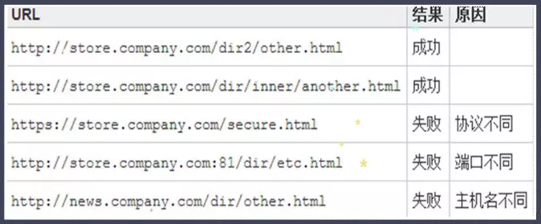
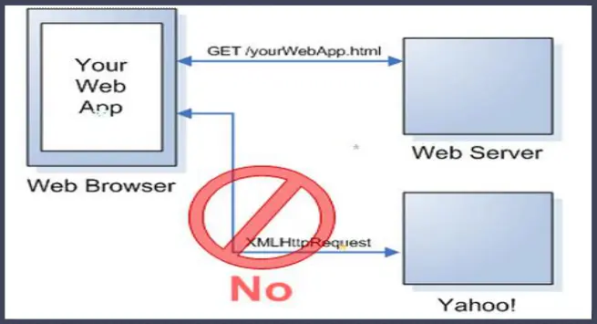
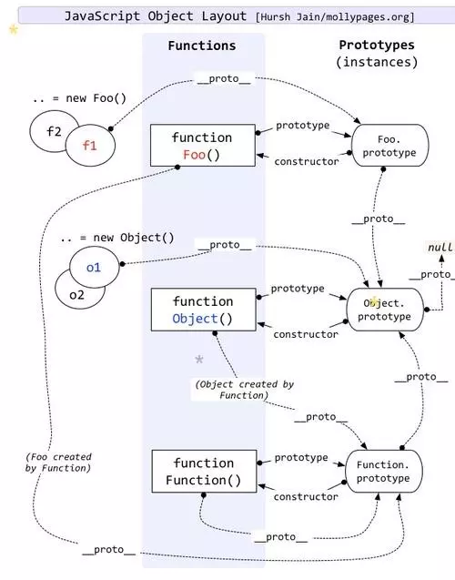
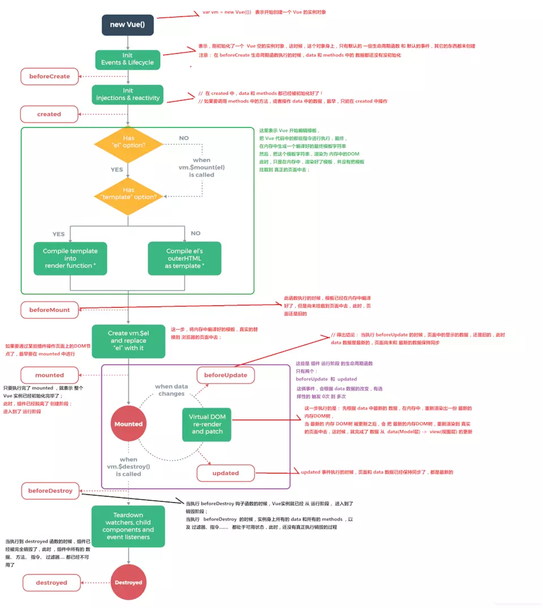
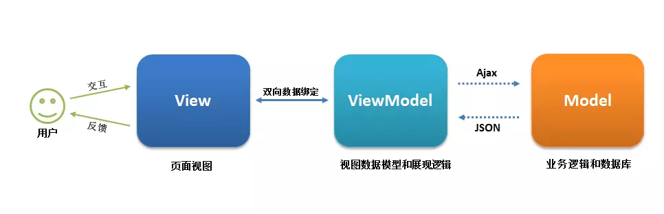
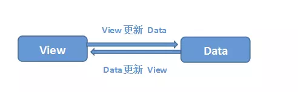
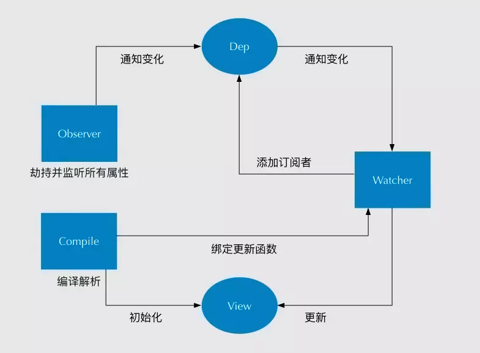

# 一、CSS问题

#### 1.flex布局

> display:flex; 在父元素设置，子元素受弹性盒影响，默认排成一行，如果超出一行，按比例压缩 flex:1; 子元素设置，设置子元素如何分配父元素的空间，flex:1,子元素宽度占满整个父元素align-items:center 定义子元素在父容器中的对齐方式，center 垂直居中justify-content:center 设置子元素在父元素中居中，前提是子元素没有把父元素占满，让子元素水平居中。

#### 2.css3的新特性

> transtion transition-property 规定设置过渡效果的 CSS 属性的名称。

> transition-duration 规定完成过渡效果需要多少秒或毫秒。

> transition-timing-function 规定速度效果的速度曲线。

> transition-delay 定义过渡效果何时开始。

> animation属性可以像Flash制作动画一样，通过控制关键帧来控制动画的每一步，实现更为复杂的动画效果。

> ainimation实现动画效果主要由两部分组成：

> 通过类似Flash动画中的帧来声明一个动画；

> 在animation属性中调用关键帧声明的动画。

> translate 3D建模效果

#### 3.img中alt和title的区别

> 图片中的 alt属性是在图片不能正常显示时出现的文本提示。alt有利于SEO优化

> 图片中的 title属性是在鼠标在移动到元素上的文本提示。

#### 4.用纯CSS创建一个三角形

```
 <style>
    div {
        width: 0;
        height: 0;
        border-top: 40px solid transparent;
        border-left: 40px solid transparent;
        border-right: 40px solid transparent;
        border-bottom: 40px solid #ff0000;
    }
    </style>
</head>
<body>
  <div></div>
</body>
复制代码
```

#### 5.如何理解CSS的盒子模型？

> 标准盒子模型：宽度=内容的宽度（content）+ border + padding

> 低版本IE盒子模型：宽度=内容宽度（content+border+padding)

#### 6.如何让一个div水平居中

> 已知宽度，block元素 ，添加添加margin:0 auto属性。

> 已知宽度，绝对定位的居中 ，上下左右都为0，margin:auto

#### 7.如何让一个div水平垂直居中

```
div {
position: relative / fixed; /* 相对定位或绝对定位均可 */
width:500px;
height:300px;
top: 50%;
left: 50%;
margin-top:-150px;
margin-left:-250px;
 外边距为自身宽高的一半 */
background-color: pink; /* 方便看效果 */
 }

.container {
display: flex;
align-items: center; /* 垂直居中 */
justify-content: center; /* 水平居中 */
 
}
.container div {
width: 100px; /* 可省 */
height: 100px; /* 可省 */
background-color: pink; /* 方便看效果 */
}  
复制代码
```

#### 8.如何清除浮动？

> clear清除浮动（添加空div法）在浮动元素下方添加空div,并给该元素写css样式 {clear:both;height:0;overflow:hidden;}

> 给浮动元素父级设置高度

> 父级同时浮动（需要给父级同级元素添加浮动）

> 父级设置成inline-block，其margin: 0 auto居中方式失效

> 给父级添加overflow:hidden 清除浮动方法

> 万能清除法 after伪类 清浮动（现在主流方法，推荐使用）

```
float_div:after{
content:".";
clear:both;
display:block;
height:0;
overflow:hidden;
visibility:hidden;
}
.float_div{
zoom:1
}
复制代码
```

#### 9.css3实现三栏布局，左右固定，中间自适应

> 圣杯布局/双飞翼布局

```
 <style>
        * {
            margin: 0;
            padding: 0;
        }
        .middle,
        .left,
        .right {
            position: relative;
            float: left;
            min-height: 130px;
        }
        .container {
            padding: 0 220px 0 200px;
            overflow: hidden;
        }
        .left {
            margin-left: -100%;
            left: -200px;
            width: 200px;
            background: red;
        }
        .right {
            margin-left: -220px;
            right: -220px;
            width: 220px;
            background: green;
        }
        .middle {
            width: 100%;
            background: blue;
            word-break: break-all;
        }
    </style>
</head>
<body>
    <div class='container'>
        <div class='middle'></div>
        <div class='left'></div>
        <div class='right'></div>
    </div>
</body>
复制代码
```

#### 10.display:none 和 visibility: hidden的区别

> display:none 隐藏对应的元素，在文档布局中不再给它分配空间，它各边的元素会合拢，就当他从来不存在。

> visibility:hidden 隐藏对应的元素，但是在文档布局中仍保留原来的空间。

#### 11.CSS中 link 和@import 的区别是？

> link属于HTML标签，而@import是CSS提供的页面被加载的时，link会同时被加载，而@import引用的CSS会等到页面被加载完再加载

> import只在IE5以上才能识别，而link是HTML标签，无兼容问题

> link方式的样式的权重 高于@import的权重.

#### 12.position的absolute与fixed共同点与不同点

> 共同点： 改变行内元素的呈现方式，display被置为block 让元素脱离普通流，不占据空间 默认会覆盖到非定位元素上

> 不同点： absolute的”根元素“是可以设置的 fixed的”根元素“固定为浏览器窗口。当你滚动网页，fixed元素与浏览器窗口之间的距离是不变的。

#### 13..transition和animation的区别

> Animation和transition大部分属性是相同的，他们都是随时间改变元素的属性值，他们的主要区别是transition需要触发一个事件才能改变属性， 而animation不需要触发任何事件的情况下才会随时间改变属性值，并且transition为2帧，从from .... to，而animation可以一帧一帧的。

> transition 规定动画的名字  规定完成过渡效果需要多少秒或毫秒  规定速度效果  定义过渡效果何时开始 animation  指定要绑定到选择器的关键帧的名称

#### 14.CSS优先级

```
不同级别：总结排序：!important > 行内样式>ID选择器 > 类选择器 > 标签 > 通配符 > 继承 > 浏览器默认属性
	1.属性后面加!import 会覆盖页面内任何位置定义的元素样式
	2.作为style属性写在元素内的样式
	3.id选择器
	4.类选择器
	5.标签选择器
	6.通配符选择器（*）
	7.浏览器自定义或继承
**同一级别：后写的会覆盖先写的**
复制代码
```

> css选择器的解析原则：选择器定位DOM元素是从右往左的方向，这样可以尽早的过滤掉一些不必要的样式规则和元素

#### 15.雪碧图：

```
        多个图片集成在一个图片中的图
	使用雪碧图可以减少网络请求的次数，加快允许的速度
	通过background-position，去定位图片在屏幕的哪个位置
复制代码
```

#### 16. px和em的区别:

```
相同点：px和em都是长度单位；

异同点：px的值是固定的，指定是多少就是多少，计算比较容易。em得值不是固定的，并且em会继承父级元素的字体大小。
浏览器的默认字体高都是16px。所以未经调整的浏览器都符合: 1em=16px。那么12px=0.75em, 10px=0.625em。
```

# 二、JS问题

#### 0.typeof和instance of 检测数据类型有什么区别？

> 相同点： 都常用来判断一个变量是否为空，或者是什么类型的。

> 不同点： typeof		返回值是一个字符串，用来说明变量的数据类型 instanceof        用于判断一个变量是否属于某个对象的实例.

#### 1.使元素消失的方法

```
visibility:hidden、display:none、z-index=-1、opacity：0
1.opacity：0,该元素隐藏起来了，但不会改变页面布局，并且，如果该元素已经绑定了一些事件，如click事件也能触发
2.visibility:hidden,该元素隐藏起来了，但不会改变页面布局，但是不会触发该元素已经绑定的事件
3.display:node, 把元素隐藏起来，并且会改变页面布局，可以理解成在页面中把该元素删掉
复制代码
```

#### 2.谈一谈深克隆和浅克隆？

> 浅克隆: 只是拷贝了基本类型的数据，而引用类型数据，复制后也是会发生引用，我们把这种拷贝叫做“（浅复制）浅拷贝”，换句话说，浅复制仅仅是指向被复制的内存地址，如果原地址中对象被改变了，那么浅复制出来的对象也会相应改变。

> 深克隆： 创建一个新对象，属性中引用的其他对象也会被克隆，不再指向原有对象地址。 JSON.parse、JSON.stringify()

#### 3.es6的新特性都有哪些？

> let定义块级作用域变量 没有变量的提升，必须先声明后使用 let声明的变量，不能与前面的let，var，conset声明的变量重名

> const 定义只读变量 const声明变量的同时必须赋值，const声明的变量必须初始化，一旦初始化完毕就不允许修改 const声明变量也是一个块级作用域变量 const声明的变量没有“变量的提升”，必须先声明后使用 const声明的变量不能与前面的let， var ， const声明的变量重 const定义的对象\数组中的属性值可以修改,基础数据类型不可以

> ES6可以给形参函数设置默认值

> 在数组之前加上三个点（...）展开运算符

> 数组的解构赋值、对象的解构赋值

> 箭头函数的特点 箭头函数相当于匿名函数，是不能作为构造函数的，不能被new 箭头函数没有arguments实参集合,取而代之用...剩余运算符解决 箭头函数没有自己的this。他的this是继承当前上下文中的this 箭头函数没有函数原型 箭头函数不能当做Generator函数，不能使用yield关键字 不能使用call、apply、bind改变箭头函数中this指向 Set数据结构，数组去重

#### 4.==和===区别是什么？

> =赋值

> ==返回一个布尔值；相等返回true，不相等返回false； 允许不同数据类型之间的比较； 如果是不同类型的数据进行，会默认进行数据类型之间的转换； 如果是对象数据类型的比较，比较的是空间地址

> === 只要数据类型不一样，就返回false；

#### 5.常见的设计模式有哪些？

```
1、js工厂模式
2、js构造函数模式
3、js原型模式
4、构造函数+原型的js混合模式
5、构造函数+原型的动态原型模式
6、观察者模式
7、发布订阅模式
复制代码
```

#### 6.call bind apply 的区别？

> call() 和apply()的第一个参数相同，就是指定的对象。这个对象就是该函数的执行上下文。

> call()和apply()的区别就在于，两者之间的参数。

> call()在第一个参数之后的 后续所有参数就是传入该函数的值。

> apply() 只有两个参数，第一个是对象，第二个是数组，这个数组就是该函数的参数。 bind() 方法和前两者不同在于： bind() 方法会返回执行上下文被改变的函数而不会立即执行，而前两者是	直接执行该函数。他的参数和call()相同。

#### 7.js继承方式有哪些？

> 原型链继承 核心： 将父类的实例作为子类的原型

> 构造继承 核心：使用父类的构造函数来增强子类实例，等于是复制父类的实例属性给子类

> 实例继承 核心：为父类实例添加新特性，作为子类实例返回

> 拷贝继承

> 组合继承 核心：通过调用父类构造，继承父类的属性并保留传参的优点，然后通过将父类实例作为子类原型，实现	函数复用

> 寄生组合继承 核心：通过寄生方式，砍掉父类的实例属性，这样，在调用两次父类的构造的时候，就不会初始化两次实	例方法/属性，避免的组合继承的缺点

#### 8.你怎样看待闭包？

> 个人感觉，简单来说闭包就是在函数里面声明函数，本质上说就是在函数内部和函数外部搭建起一座桥梁，使得子函数可以访问父函数中所有的局部变量，但是反之不可以，这只是闭包的作用之一，另一个作用，则是保护变量不受外界污染，使其一直存在内存中，在工作中我们还是少使用闭包的好，因为闭包太消耗内存，不到万不得已的时候尽量不使用。

#### 9.你是如何理解原型和原型链的？

> 把所有的对象共用的属性全部放在堆内存的一个对象（共用属性组成的对象），然后让每一个对象的 __proto__存储这个「共用属性组成的对象」的地址。而这个共用属性就是原型，原型出现的目的就是为了减少不必要的内存消耗。而原型链就是对象通过__proto__向当前实例所属类的原型上查找属性或方法的机制，如果找到Object的原型上还是没有找到想要的属性或者是方法则查找结束，最终会返回undefined

#### 10.浏览器渲染的主要流程是什么?

> 将html代码按照深度优先遍历来生成DOM树。 css文件下载完后也会进行渲染，生成相应的CSSOM。 当所有的css文件下载完且所有的CSSOM构建结束后，就会和DOM一起生成Render Tree。 接下来，浏览器就会进入Layout环节，将所有的节点位置计算出来。 最后，通过Painting环节将所有的节点内容呈现到屏幕上。

#### 11.从输入url地址到页面相应都发生了什么？

```
1、浏览器的地址栏输入URL并按下回车。
2、浏览器查找当前URL是否存在缓存，并比较缓存是否过期。3、DNS解析URL对应的IP。
4、根据IP建立TCP连接（三次握手）。
5、HTTP发起请求。
6、服务器处理请求，浏览器接收HTTP响应。
7、渲染页面，构建DOM树。
8、关闭TCP连接（四次挥手）
复制代码
```

#### 12.session、cookie、localStorage的区别

> 相同点 都是保存在浏览器端，且同源的。

> 不同点

- cookie数据始终在同源的http请求中携带，即cookie在浏览器和服务器间来回传递。
- 而sessionStorage和localStorage不会自动把数据发给服务器，仅在本地保存。
- cookie数据还有路径（path）的概念，可以限制cookie只属于某个路径下。 存储大小限制也不同，cookie数据不能超过4k，同时因为每次http请求都会携带cookie，所以cookie只适合保存很小的数据。
- sessionStorage和localStorage 虽然也有存储大小的限制，但比cookie大得多，可以达到5M或更大。 数据有效期不同，sessionStorage：仅在当前浏览器窗口关闭前有效，自然也就不可能持久保持；
- localStorage：始终有效，窗口或浏览器关闭也一直保存，因此用作持久数据；
- cookie只在设置的cookie过期时间之前一直有效，即使窗口或浏览器关闭。 作用域不同，sessionStorage不在不同的浏览器窗口中共享，即使是同一个页面；
- localStorage 在所有同源窗口中都是共享的；cookie也是在所有同源窗口中都是共享的。

#### 13.js中跨域方法

> 同源策略（协议+端口号+域名要相同）

> 1、jsonp跨域(只能解决get） 原理：动态创建一个script标签。利用script标签的src属性不受同源策略限制，因为所有的src属性和href属性都不受同源策略的限制，可以请求第三方服务器资源内容
>
> > 步骤： 1).去创建一个script标签 2).script的src属性设置接口地址 3).接口参数，必须要带一个自定义函数名，要不然后台无法返回数据 4).通过定义函数名去接受返回的数据

> 2、document.domain 基础域名相同 子域名不同

> 3、window.name 利用在一个浏览器窗口内，载入所有的域名都是共享一个window.name

> 4、服务器设置对CORS的支持 原理：服务器设置Access-Control-Allow-Origin HTTP响应头之后，浏览器将会允许跨域请求

> 5、利用h5新特性window.postMessage()

#### 14.前端有哪些页面优化方法?

- 减少 HTTP请求数
- 从设计实现层面简化页面
- 合理设置 HTTP缓存
- 资源合并与压缩
- 合并 CSS图片，减少请求数的又一个好办法。
- 将外部脚本置底（将脚本内容在页面信息内容加载后再加载）
- 多图片网页使用图片懒加载。
- 在js中尽量减少闭包的使用
- 尽量合并css和js文件
- 尽量使用字体图标或者SVG图标，来代替传统的PNG等格式的图片
- 减少对DOM的操作
- 在JS中避免“嵌套循环”和 “死循环”
- 尽可能使用事件委托（事件代理）来处理事件绑定的操作

#### 15.Ajax的四个步骤

> 1.创建ajax实例

> 2.执行open 确定要访问的链接 以及同步异步

> 3.监听请求状态

> 4.发送请求

#### 16.数组去重的方法

> ES6的set对象 先将原数组排序，在与相邻的进行比较，如果不同则存入新数组

```
function unique(arr){
    var arr2 = arr.sort();
    var res = [arr2[0]];
    for(var i=1;i<arr2.length;i++){
        if(arr2[i] !== res[res.length-1]){
        res.push(arr2[i]);
    }
}
return res;
}
利用下标查询
 function unique(arr){
    var newArr = [arr[0]];
    for(var i=1;i<arr.length;i++){
        if(newArr.indexOf(arr[i]) == -1){
        newArr.push(arr[i]);
    }
}
return newArr;
}
复制代码
```

#### 17.ajax中get和post请求的区别

- get 一般用于获取数据
- get请求如果需要传递参数，那么会默认将参数拼接到url的后面；然后发送给服务器；
- get请求传递参数大小是有限制的；是浏览器的地址栏有大小限制；
- get安全性较低
- get 一般会走缓存，为了防止走缓存，给url后面每次拼的参数不同；放在?后面，一般用个时间戳
- post 一般用于发送数据
- post传递参数，需要把参数放进请求体中，发送给服务器；
- post请求参数放进了请求体中，对大小没有要求；
- post安全性比较高；
- post请求不会走缓存；
- 

#### 18.ajax的状态码

> 2开头

- 200 : 代表请求成功；

> 3开头

- 301 : 永久重定向；
- 302: 临时转移
- 304 : 读取缓存 [表示浏览器端有缓存，并且服务端未更新，不再向服务端请求资源]
- 307:临时重定向

> 以4开头的都是客户端的问题；

- 400 :数据/格式错误
- 401: 权限不够；（身份不合格，访问网站的时候，登录和不登录是不一样的）
- 404 : 路径错误，找不到文件

> 以5开头都是服务端的问题

- 500 : 服务器的问题
- 503: 超负荷；

#### 19.移动端的兼容问题

- 给移动端添加点击事件会有300S的延迟 如果用点击事件，需要引一个fastclick.js文件，解决300s的延迟 一般在移动端用ontouchstart、ontouchmove、ontouchend
- 移动端点透问题,touchstart 早于 touchend 早于click,click的触发是有延迟的，这个时间大概在300ms左右，也就是说我们tap触发之后蒙层隐藏， 此时 click还没有触发，300ms之后由于蒙层隐藏，我们的click触发到了下面的a链接上 尽量都使用touch事件来替换click事件。例如用touchend事件(推荐)。 用fastclick，[github.com/ftlabs/fast…](https://github.com/ftlabs/fastclick) 用preventDefault阻止a标签的click 消除 IE10 里面的那个叉号 input:-ms-clear{display:none;}
- 设置缓存 手机页面通常在第一次加载后会进行缓存，然后每次刷新会使用缓存而不是去重新向服务器发送请求。如果不希望使用缓存可以设置no-cache。

- 圆角BUG 某些Android手机圆角失效 background-clip: padding-box; 防止手机中网页放大和缩小 这点是最基本的，做为手机网站开发者来说应该都知道的，就是设置meta中的viewport

- 设置用户截止缩放，一般写视口的时候就已经写好了。
- 

#### 20.JS中同步和异步,以及js的事件流

> 同步：在同一时间内做一件事情

> 异步：在同一时间内做多个事情 JS是单线程的，每次只能做一件事情，JS运行在浏览器中，浏览器是多线程的，可以在同一时间执行多个任务。

#### 21.JS中常见的异步任务

> 定时器、ajax、事件绑定、回调函数、async await、promise

#### 22.TCP的三次握手和四次挥手

> 三次握手

- 第一次握手：客户端发送一个SYN码给服务器，要求建立数据连接；
- 第二次握手： 服务器SYN和自己处理一个SYN（标志）；叫SYN+ACK（确认包）；发送给客户端，可以建立连接
- 第三次握手： 客户端再次发送ACK向服务器，服务器验证ACK没有问题，则建立起连接；

> 四次挥手

- 第一次挥手： 客户端发送FIN(结束)报文，通知服务器数据已经传输完毕；
- 第二次挥手: 服务器接收到之后，通知客户端我收到了SYN,发送ACK(确认)给客户端，数据还没有传输完成
- 第三次挥手： 服务器已经传输完毕，再次发送FIN通知客户端，数据已经传输完毕
- 第四次挥手： 客户端再次发送ACK,进入TIME_WAIT状态；服务器和客户端关闭连接；

#### 23.为什么建立连接是三次握手，而断开连接是四次挥手呢?

> > 建立连接的时候， 服务器在LISTEN状态下，收到建立连接请求的SYN报文后，把ACK和SYN放在一个报文里发送给客户端。 而关闭连接时，服务器收到对方的FIN报文时，仅仅表示对方不再发送数据了但是还能接收数据，而自己也未必全部数据都发送给对方了，所以己方可以立即关闭，也可以发送一些数据给对方后，再发送FIN报文给对方来表示同意现在关闭连接，因此，己方ACK和FIN一般都会分开发送，从而导致多了一次。

#### 24.DOM diff原理

> - 如果元素类型发生变化，直接替换
> - 如果是文本，则比较文本里面的内容，是否有差异，如果是元素就需要比较当前元素的属性是否相等,会先比较key， 在比较类型 为什么 react中循环 建议不要使用索引 ,如果纯为了展示 那可以使用索引

#### 25.作用域

> 全局作用域

- 浏览器打开一个页面时，浏览器会给JS代码提供一个全局的运行环境，那么这个环境就是全局作用域 一个页面只有一个全局作用域，全局作用域下有一个window对象 window是全局作用域下的最大的一个内置对象（全局作用域下定义的变量和函数都会存储在window下） 如果是全局变量，都会给window新增一个键值对；属性名就是变量名，属性值就是变量所存储的值 如果变量只被var过，那么存储值是undefined 在私有作用域中是可以获取到全局变量的，但是在全局作用域中不能获取私有变量

> 私有作用域

- 函数执行会形成一个新的私有的作用域（执行多次，形成多个私有作用域） 私有作用域在全局作用域中形成，具有包含的关系； 在一个全局作用域中，可以有很多个私有作用域 在私有作用域下定义的变量都是私有变量 形参也是私有变量 函数体中通过function定义的函数也是私有的，在全局作用域不能使用；

> 块级作用域

- es6中新引入的一种作用域 在js中常见到的if{}、for{}、while{}、try{}、catch{}、switch case{}都是块级作用域 var obj = {} //对象的大括号不是块级作用域 块级作用域中的同一变量不能被重复声明（块级下var和function不能重名，否则会报错） 作用域链

> 上级作用域

- 函数在哪里定义，他的上一级作用域就是哪，和函数在哪个作用域下执行没有关系 作用域链：当获取变量所对应的值时，首先看变量是否是私有变量，如果不是私有变量，要继续向上一级作用域中查找，如果上一级也没有，那么会继续向上一级查找，直到找到全局作用域为止；如果全局作用域也没有，则会报错；这样一级一级向上查找，就会形成作用域链 当前作用域没有的，则会继续向上一级作用域查找 当前函数的上一级作用域跟函数在哪个作用域下执行没有关系，只跟函数在哪定义有关（重点）

#### 26.Promise处理异步

> 他是ES6中新增加的一个类（new Promise）,目的是为了管理JS中的异步编程的，所以把他称为“Promise设计模式” new Promise 经历三个状态：padding(准备状态：初始化成功、开始执行异步的任务)、fullfilled(成功状态)、rejected(失败状态)== Promise本身是同步编程的，他可以管理异步操作的（重点），new Promise的时候，会把传递的函数立即执行 Promise函数天生有两个参数，resolve(当异步操作执行成功，执行resolve方法),rejected(当异步操作失败，执行reject方法) then()方法中有两个函数，第一个传递的函数是resolve,第二个传递的函数是reject ajax中false代表同步，true代表异步，如果使用异步，不等ajax彻底完成

#### 27.map和forEach的区别

> 相同点

- 都是循环遍历数组中的每一项 forEach和map方法里每次执行匿名函数都支持3个参数，参数分别是item（当前每一项）、index（索引值）、arr（原数组），需要用哪个的时候就写哪个 匿名函数中的this都是指向window 只能遍历数组

> 不同点

- map方法返回一个新的数组，数组中的元素为原始数组调用函数处理后的值。(原数组进行处理之后对应的一个新的数组。) map()方法不会改变原始数组 map()方法不会对空数组进行检测 forEach()方法用于调用数组的每个元素，将元素传给回调函数.(没有return，返回值是undefined）

> > **注意**：forEach对于空数组是不会调用回调函数的。

#### 28.async await函数

> async/await函数是异步代码的新方式

> async/await是基于promise实现的

> async/await使异步代码更像同步代码

> await 只能在async函数中使用，不能再普通函数中使用，要成对出现

> 默认返回一个promise实例，不能被改变

> await下面的代码是异步，后面的代码是同步的

#### 29.this指向

> - 全局作用域下的this指向window
> - 如果给元素的事件行为绑定函数，那么函数中的this指向当前被绑定的那个元素
> - 函数中的this，要看函数执行前有没有 . , 有 . 的话，点前面是谁，this就指向谁，如果没有点，指向window
> - 自执行函数中的this永远指向window
> - 定时器中函数的this指向window
> - 构造函数中的this指向当前的实例
> - call、apply、bind可以改变函数的this指向
> - 箭头函数中没有this，如果输出this，就会输出箭头函数定义时所在的作用域中的this

#### 30.原型

> > 所有的函数数据类型都天生自带一个prototype属性，该属性的属性值是一个对象 prototype的属性值中天生自带一个constructor属性，其constructor属性值指向当前原型所属的类 所有的对象数据类型，都天生自带一个_proto_属性，该属性的属性值指向当前实例所属类的原型

#### 31.异步回调（如何解决回调地狱）

```
promise、generator、async/await

promise： 1.是一个对象，用来传递异步操作的信息。代表着某个未来才会知道结果的时间，并未这个事件提供统一的api，供进异步处理
	  2.有了这个对象，就可以让异步操作以同步的操作的流程来表达出来，避免层层嵌套的回调地狱
	  3.promise代表一个异步状态，有三个状态pending（进行中），Resolve(以完成），Reject（失败）
	  4.一旦状态改变，就不会在变。任何时候都可以得到结果。从进行中变为以完成或者失败
		promise.all() 里面状态都改变，那就会输出，得到一个数组
		promise.race() 里面只有一个状态变为rejected或者fulfilled即输出
		promis.finally()不管指定不管Promise对象最后状态如何，都会执行的操作（本质上还是then方法的特例）
复制代码
```

#### 32.前端事件流

```
事件流描述的是从页面中接受事件的顺序，事件 捕获阶段 处于目标阶段 事件冒泡阶段 addeventListener 最后这个布尔值参数如果是true，表示在捕获阶段调用事件处理程序；如果是false，表示在冒泡阶段调用事件处理程序。
  1、事件捕获阶段：实际目标div在捕获阶段不会接受事件，也就是在捕获阶段，事件从document到<html>再到<body>就停止了。
      2、处于目标阶段：事件在div发生并处理，但是事件处理会被看成是冒泡阶段的一部分。
      3、冒泡阶段：事件又传播回文档
   阻止冒泡事件event.stopPropagation()
	  function stopBubble(e) {
    		if (e && e.stopPropagation) { // 如果提供了事件对象event 这说明不是IE浏览器
      		e.stopPropagation()
    		} else {
      		window.event.cancelBubble = true //IE方式阻止冒泡
    	      }
  		   }
   阻止默认行为event.preventDefault()
 function stopDefault(e) {
    if (e && e.preventDefault) {
      e.preventDefault()
    } else {
      // IE浏览器阻止函数器默认动作的行为
      window.event.returnValue = false
    }
  }
复制代码
```

#### 33.事件如何先捕获后冒泡？

> 在DOM标准事件模型中，是先捕获后冒泡。但是如果要实现先冒泡后捕获的效果， 对于同一个事件，监听捕获和冒泡，分别对应相应的处理函数，监听到捕获事件，先暂缓执行，直到冒泡事件被捕获后再执行捕获事件。

- 哪些事件不支持冒泡事件：鼠标事件：mouserleave  mouseenter 焦点事件：blur focus UI事件：scroll resize

#### 34. 如何判断一个变量是对象还是数组（prototype.toString.call()）。

```
千万不要使用typeof来判断对象和数组，因为这种类型都会返回object。
复制代码
```

> typeOf()是判断基本类型的Boolean,Number，symbol, undefined, String。 对于引用类型：除function，都返回object   null返回object。

> installOf() 用来判断A是否是B的实例，installof检查的是原型。

> toString() 是Object的原型方法，对于 Object 对象，直接调用 toString()  就能返回 [Object Object] 。而对于其他对象，则需要通过 call / apply 来调用才能返回正确的类型信息。

> hasOwnProperty()方法返回一个布尔值，指示对象自身属性中是否具有指定的属性，该方法会忽略掉那些从原型链上继承到的属性。

> isProperty()方法测试一个对象是否存在另一个对象的原型链上。

#### 35.setTimeout 和 setInterval的机制

```
因为js是单线程的。浏览器遇到etTimeout 和 setInterval会先执行完当前的代码块，在此之前会把定时器推入浏览器的
待执行时间队列里面，等到浏览器执行完当前代码之后会看下事件队列里有没有任务，有的话才执行定时器里的代码
复制代码
```

#### 36.splice和slice、map和forEach、 filter()、reduce()的区别

```
 1.slice(start,end):方法可以从已有数组中返回选定的元素，返回一个新数组，
 包含从start到end（不包含该元素）的数组方法
	注意：该方法不会更新原数组，而是返回一个子数组
 2.splice():该方法想或者从数组中添加或删除项目，返回被删除的项目。（该方法会改变原数组）
	splice(index, howmany,item1,...itemx)
		·index参数：必须，整数规定添加或删除的位置，使用负数，从数组尾部规定位置
		·howmany参数：必须，要删除的数量，
		·item1..itemx:可选，向数组添加新项目
3.map()：会返回一个全新的数组。使用于改变数据值的时候。会分配内存存储空间数组并返回，forEach（）不会返回数据
4.forEach(): 不会返回任何有价值的东西，并且不打算改变数据，单纯的只是想用数据做一些事情，他允许callback更改原始数组的元素
5.reduce(): 方法接收一个函数作为累加器，数组中的每一个值（从左到右）开始缩减，最终计算一个值，不会改变原数组的值
6.filter(): 方法创建一个新数组，新数组中的元素是通过检查指定数组中符合条件的所有元素。它里面通过function去做处理	
复制代码
```

### 1. 闭包

> **1. 涉及面试题：什么是闭包？**

闭包的定义其实很简单：函数 A 内部有一个函数 B，函数 B 可以访问到函数 A 中的变量，那么函数 B 就是闭包。

```
function A(){                 
    let a=1;                 
    window.B=function(){                     
        console.log(a)                 
    }            
}            
A();            
B();//1复制代码
```

很多人对于闭包的解释可能是函数嵌套了函数，然后返回一个函数。其实这个解释是不完整的，就比如我上面这个例子就可以反驳这个观点。

在 JS 中，闭包存在的意义就是让我们可以间接访问函数内部的变量。

> **2. 经典面试题：循环中使用闭包解决`var `定义函数的问题；**

需求：每隔一秒输出一个数字，从 0 - 5；

```
for(var i=0;i<=5;i++){            
    setTimeout(function timer(){                
        console.log(i)            
    },i*1000)        
}        
console.log(i)复制代码
```

输出结果：立即输出一个6，然后每隔一秒输出一个6；

首先因为 `setTimeout` 是个异步函数，所以会先把循环全部执行完毕，这时候 `i` 就是 6 了，所以会输出一堆 6。

解决办法有3种，

**第一种是利用闭包的方式：**

```
for(var i=0;i<=5;i++){            
    (function(j){                
        setTimeout(function timer(){                    
            console.log(j)                
        },j*1000)            
    })(i)        
}复制代码
```

在上述代码中，我们首先使用了立即执行函数将 `i` 传入函数内部，这个时候值就被固定在了参数 `j`上面不会改变，当下次执行 `timer` 这个闭包的时候，就可以使用外部函数的变量 `j`，从而达到目的。

**第二种就是使用** `**setTimeout**` **的第三个参数，这个参数会被当成** `**timer**` **函数的参数传入。**

```
for(var i=0;i<=5;i++){           
    setTimeout((j) => {                
        console.log(j);            
    },i*1000,i)        
}复制代码
```

`setTimeout`还允许更多的参数。它们将依次传入推迟执行的函数（回调函数）。

```
setTimeout((a,b,c) => {            
    console.log(a,b,c)        
}, 2000, "my", "name", "is starsion");
//my name is starsion复制代码
```

**更多关于setTimeOut的用法，请参考阮一峰老师的 异步操作 之 定时器**

**第三种就是使用** `**let**` **定义** `**i**` **了来解决问题了，这个也是最为推荐的方式**

```
for(let i=0;i<=5;i++){                
    setTimeout(() => {                    
        console.log(i)                
    },i*1000)            
}复制代码
```

**更多关于let和var的区别，请**[**参考阮一峰老师的 let命令**](http://es6.ruanyifeng.com/#docs/let)

### 2. JS作用域

ES6 之前 JS 没有块级作⽤域。例如 

```
if (true) {
    var name = 'zhangsan'
}
console.log(name)复制代码
```


从上⾯的例⼦可以体会到作⽤域的概念，**作⽤域就是⼀个独⽴的地盘，让变量不会外泄、暴露出去。** 上⾯的 name 就被暴露出去了，因此，JS 没有块级作⽤域，只有全局作⽤域和函数作⽤域。

但是 ES6 中开始加⼊了块级作⽤域，使⽤ let 定义变量即可

```
if (true) {
 let name1 = 'zhangsan'
}
console.log(name1) // 报错，因为let定义的name是在if这个块级作⽤域复制代码
```

**1.       js作用域（全局作用域 和 函数作用域）内部可以访问外部，但外部的不能访问内部的**

```
var a=10;        
function aaa(){             
    alert(a);        
};        
aaa();//10复制代码
```

```
function aaa(){            
    var a=10;          
};        
aaa();        
console.log(a)//Uncaught ReferenceError: a is not defined复制代码
```

```
var a=10;         
function aaa(){             
    console.log(a);//10        
};                    
function bbb(){            
    var a=20;            
    aaa();        
}        
bbb();//10复制代码
```

```
function aaa(){            
    a=10;         
}        
aaa();        
function aaa(){            
    var a=b=10;         
}      
aaa();      
console.log(b)//10    
console.log(a)//Uncaught ReferenceError: a is not defined复制代码
```

**2. 不用var 定义变量时，会默认为是全局变量（不规范，不推荐）**

```
function aaa(){            
    a=10;         
}        
aaa();        
function aaa(){            
    var a=b=10;         
}        
aaa();        
console.log(b)        
console.log(a)复制代码
```

**3.** **变量的查找是就近原则去寻找，定义的****var****变量；**

变量的声明被提前到作用域顶部，赋值保留在原地，如下 domo ;

```
function aaa(){            
console.log(a);//undefined            
var a=20;        
}        
aaa(); 复制代码
```

```
var a=10;        
function aaa(){            
    console.log(a);//undefined            
    var a=20;        
}        
aaa();复制代码
```

```
var a=10;        
function aaa(a){             
    console.log(a);//10            
    var a=20;  //因为 a 是形参，优先级高于 var a; 所以 局部变量a的声明其实被忽略了。        
}         
aaa(a);复制代码
```

### 3. 作用域链

⾸先认识⼀下什么叫做 **⾃由变量** 。如下代码中，` console.log(a)` 要得到 `a` 变量，但是在当前的作 ⽤域中没有定义 `a` （可对⽐⼀下 `b` ）。当前作⽤域没有定义的变量，这成为 **⾃由变量** 。⾃由变量如 何得到 —— 向⽗级作⽤域寻找。

```
var a = 100;
function fn() {
    var b = 200;
    console.log(a);
    console.log(b);
};
fn();复制代码
```

如果⽗级也没呢？再⼀层⼀层向上寻找，直到找到全局作⽤域还是没找到，就宣布放弃。这种⼀层⼀ 层的关系，就是 **作⽤域链** 。

```
var a = 100;
function F1() {
    var b = 200;
    function F2() {
        var c = 300;
        console.log(a) // ⾃由变量，顺作⽤域链向⽗作⽤域找
        console.log(b) // ⾃由变量，顺作⽤域链向⽗作⽤域找
        console.log(c) // 本作⽤域的变量
    };
    F2();
};
F1();复制代码
```

### 作用域附加题：

**1. 判断输出结果，并且解释原因？**

```
var a = 1;        
(function a () {            
    a = 2;            
    console.log(a);        
})();
// 输出结果
ƒ a () {
           a = 2;
           console.log(a);
       }复制代码
```

这道题，猛地一看，很多人都会觉得，console.log(a) 的值为 2，其实不然，

立即调用的函数表达式（IIFE） 有一个 自己独立的 作用域，如果函数名称与内部变量名称冲突，就会永远执行函数本身；所以上面的结果输出是函数本身；

如果将函数名字改一下，比如改为 x

```
var a = 1;        
(function x () {            
    a = 2;            
    console.log(a);        
})();
// 2复制代码
```

函数表达式中的函数名称，只有自己独立的作用域可以拿到，不会影响全局

```
var a = 1;        
(function a () {            
    a = 2;            
    console.log(window.a);        
})();
// 1复制代码
var a = 1;        
(function x () {            
    a = 2;            
    console.log(a);        
})();
// 2复制代码
```

## JS 基础面试题

### 1.介绍下 js 中关于arguments 。 

【考点：函数arguments】

在函数代码中，使用特殊对象 arguments，开发者无需明确指出参数名，就能访问它们。

例如，在函数 sayHi() 中，第一个参数是 message。用 arguments[0] 也可以访问这个值，即第一个参数的值（第一个参数位于位置 0，第二个参数位于位置 1，依此类推）。

因此，无需明确命名参数，就可以重写函数：

```
function sayHi() {  
    if (arguments[0] == "bye") {    
        return;  
    }  
    alert(arguments[0]);
}复制代码
```

**点击查看关于 arguments 对象**

### 2.看以下JavaScript程序问：执行以上程序后，num的值为（    D   ）

【考点：数据类型】

```
var num;              
num=5+true;                     
A、true  B、false  C、5  D、6复制代码
```

**解析：true 的值为1，false 的值为0；如下代码**

```
console.log(true==1)//true
console.log(true===1)//false
console.log(false==0)//true
console.log(false===0)//false复制代码
```


### 3、看以下JavaScript程序【考点：switch语句,break】

```
var   x=prompt("请输入1-5的数字","");                     
switch (x) {                            
    case “1”:alert(“one”);                            
    case “2”:alert(“two”);                            
    case “3”:alert(“three”);                            
    case “4”:alert(“four”);                            
    case “5”:alert(“five”);                            
    default:alert(“none”);
}复制代码
```

运行以上程序，在提示对话框中输入“4”，依次弹出的对话框将输出: （    B      ）

```
A、four,none   B、four,five,none     C、five    D、five,none复制代码
```

**解析：因为执行完之后，没有加break，会一直往下执行代码。**

### 4、分析下面的JavaScript代码段

输出结果是(B).(选择一项) 【考点：for循环】

```
a=new Array(2,3,4,5,6);
sum=0;
for(i=1;i<a.length;i++ )   
sum +=a[i];
document.write(sum);          
A.  20  B.  18  C.  14  D. 12复制代码
```

**注意：i 是从 1 开始循环的，不要掉到坑里。**

### 5、在HTML中，Location对象的()属性用于设置或检索URL的端口号。（B）  


​      【考点：location对象】

```
A.  hostname   B.  Port    C. pathname  D.  href复制代码
```

**解析：**`**Location**`**对象提供以下属性。**

- `Location.href`：整个 URL。
- `Location.protocol`：当前 URL 的协议，包括冒号（`:`）。
- `Location.host`：主机，包括冒号（`:`）和端口（默认的80端口和443端口会省略）。
- `Location.hostname`：主机名，不包括端口。
- `Location.port`：端口号。
- `Location.pathname`：URL 的路径部分，从根路径`/`开始。
- `Location.search`：查询字符串部分，从问号`?`开始。
- `Location.hash`：片段字符串部分，从`#`开始。
- `Location.username`：域名前面的用户名。
- `Location.password`：域名前面的密码。
- `Location.origin`：URL 的协议、主机名和端口。

**更多关于**[ **location对象的知识，请点击查看。**](https://wangdoc.com/javascript/bom/location.html)

### 6、分析下面的javascript代码： 【考点：+ 的用法，加法和连接符】

```
x=11;
y="number";
m= x+y ;
m的值为（A）   
A. 11number  B.  number C.  11  D.  程序报错复制代码
```

### 7、setInterval("alert('welcome');",1000);【考点：定时器的用法】

```
这段代码的意思是(D)     
A.  等待1000秒后，再弹出一个对话框     
B.  等待1秒钟后弹出一个对话框     
C.  语句报错,语法有问题  
D. 每隔一秒钟弹出一个对话框复制代码
```

### 8、分析下面的JavaScript代码段：【考点：Math对象的方法使用，round 四舍五入】

```
var a=15.49;
document.write(Math.round(a));
输出的结果是(A)        
A.  15  B. 16  C.  15.5 D.  15.4复制代码
```

解析：`Math.ceil()` 执行向上舍入

`Math.floor() `执行向下舍入

`Math.round() `执行标准舍入（四舍五入）

**更多****关于math对象的知识点击查看 Math对象**  

**阮一峰的 标准库 math对象**

### 9、分析如下的JavaScript代码片段, b的值为(C ) 

【考点：parseInt取整】

```
var a = 1.5,b; 
b=parseInt(a);     
A.  2  B. 0.5  C.  1   D. 1.5复制代码
```

**解析：parseInt()函数将字符串转化为整数，他从字符串的开头开始解析，在第一个非整数位停止解析，并且返回前面读到的所有整数，如果字符串不以整数开头，将返回NaN(Not a Number：非数字值)。**

**点击查看 parseInt() 用法**

### 10、在表单(form1)中有一个文本框元素(fname)，用于输入电话号码，格式如：010-82668155，要求前3位是010，紧接一个“-”，后面是8位数字。要求在提交表单时，根据上述条件验证该文本框中输入内容的有效性，

【考点：substr（） 截取字符串的使用，isNaN 判断是否为数字】

```
var str= form1.fname.value;        
if(str.substr(0,4)!="010-" ||str.substr(4).length!=8 || isNaN(parseFloat(str.substr(4))))
alert("无效的电话号码！");复制代码
```

**解析：**

**substr(m,n) 截取一段字符，两个参数m，n，表示从m位开始（不包括m），向后边截取n位；如果只写一个参数m，会从这个参数后边全部截取；**

**isNaN判断是否NaN（不是数字），如果该字符里不是全数字，则返回true；如果是全数字，则返回false。**

### 11、以下哪个单词不属于javascript保留字：（b）

【考点：javascript保留字，防止命名出现使用保留字而产生错误】

```
A.with      B.parent     C.class     D.void复制代码
```

```
关键字26
breakcase  catch  continue  debugger  default  delete  doelsefinally  for  function  
if  in  instance  new  return  switch  this   throw  try  typeofvar  voidwhile  with

保留字
abstract  boolean  bytechar class  const  double  enum   export   extends  final float
goto  implements   import  int  interface  long  native  package  private  protected 
public  short   static  super  synchronized  throws  transient  volatile复制代码
```

**在JavaScript引擎中使用关键字做标识符会导致"Identifier Expected"错误**

### 12、请选择结果为真的表达式：（  C   ） 

【考点：对null，undefined，NaN的理解】

```
A.null instanceof Object //false
B.null === undefined  //false
C.null == undefined //true
D.NaN == NaN //false复制代码
```

**解析：点击查看 NaN的运算规则  null和undefined**

### 13、以下哪个运算符不属于逻辑运算符？（ C  ）

【考点：逻辑运算符和位运算符】

```
1.A、&&        B、||          C、^         D、!复制代码
```

**解析：布尔运算符用于将表达式转为布尔值，一共包含四个运算符。前三个称为逻辑运算符**

- **取反运算符：**`**!**`
- **且运算符：**`**&&**`
- **或运算符：**`**||**`
- **三元运算符：**`**?:**`

**点击查看更多 关于运算符的知识**

### 14、下面定义变量中错误的是（  D  ）。

【考点：变量定义规则】

```
A、 eee      B、 _abc      C、box_1    D、 2point复制代码
```

**解析：**

- 变量由字母，数字，下划线或者美元符号$组成；
- 第一个字符可以是字母，下划线或美元符号 $ ；
- 后续的字符可以使字母、数字、下划线或美元符号
- 变量名称区分大小写
- 保留字、关键字、JavaScript预定义了很多全局变量和函数不能用作自定义变量名和函数名
- 约定俗称：标识符要见名知意；

  驼峰式命名法：又叫小驼峰式命名法。一般用来命名变量，用来解释描述变量

  例如：`var planeBulletSpeed; //飞机子弹的速度`

### 15、下面语句var x= -10, y; x=2*x; y=x+15;计算后y的结果是（  C  ）。

【考点：四则运算】

```
A.-15      B、10        C、-5      D、5复制代码
```

### 16、下列表达式运算结果为真的是（ B D   ）。

【考点：逻辑运算】点击查看 **逻辑运算符**

```
A、1<2 && "5" !=5   //false
B、2>2*1 || "5" ==5  //true
C、2>2*1 && 5 ==5   //false
D、1<2 && "5" ==5  //true复制代码
```

### 17、以下程序段，执行的结果是（  C  ）。

【考点：while循环，避免出现死循环，除非有需要】

```
var x=-1; 
do{   
    x=x*x;  
}
while(!x);
A、是死循环          B、循环执行二次      C、循环执行一次       D、有语法错误复制代码
```

**解析：!1 的值为false，就是说满足循环体满足 为false 的是时候的执行代码块**

### 18.执行语句for(i=1;i++<10; );后变量i的值是（  C  ）。

【考点：for循环，什么时候跳出循环】

```
A、9            B、10             C、11              D、不定复制代码
```

**解析：**

```
for(var i=1;i++<10;){    
console.log(i)}
console.log(i)//11
// 2 3 4 5 6 7 8 9 10 11复制代码
```

### 19、键盘事件中不包括的是（ B   ）。

【考点：键盘事件】

```
A、keydown         B、keyover         C、keypress          D、keyup复制代码
```

**解析：点击查看 鼠标事件  键盘事件**

**键盘事件由用户击打键盘触发，主要有keydown、keypress、keyup三个事件，它们都继承了KeyboardEvent接口。**

### 20、执行以下脚本语句在页面输出（  true  ）。

【考点：四则运算和逻辑运算综合应用】

```
var a=3;
a+=8*2;
alert(a>10&&a<=20);复制代码
```

### 21、预测以下代码片段的输出结果 var str ;（      B    ）

 **alert(typeof str);** 【考点：变量的定义和typeof 操作符的使用】

```
A;string    B:undefined     C:Object      D:String复制代码
```

### 22.以下哪项不属于Javascript的特征？ 

【考点：JavaScript语言特性】C

```
A.Javascript是一种脚本语言 
B.Javascript是事件驱动的 
C.Javascript代码需要编译以后才能执行
D.Javascript是独立于平台的复制代码
```

**解析：JavaScript是一门脚本语言。弱数据类型，基于对象，基于事件驱动的语言。**

### 23.阅读下面的JavaScript代码： 

【考点：函数调用】B

```
function f(y) {
    var x=y*y;
    return x;
}
for(x=0;x<5;x++) {
    y=f(x);
    document.writeln(y);
}
A.0 1 2 3 4     B.0 1 4 9 16      C.0 1 4 9 16 25       D.以上答案都不对复制代码
```

### 24、关于Javascript中数组的说法中，不正确的是：（A） 

【考点：数组的理解，包括创建，长度，元素的类型等概念】

```
A.数组的长度必须在创建时给定，之后便不能改变 
B.由于数组是对象，因此创建数组需要使用new运算符 
C.数组内元素的类型可以不同
D.数组可以在声明的同时进行初始化复制代码
```

### 25、考察以下程序片段: 

 【考点：toFixed 保留小数位数的使用】

```
var n = new Number(3456);
alert(n.toFixed(2));
以下选项正确的是：(C)
A.输出34  B.输出 56       C.输出3456.00        D.输出345600复制代码
```

### 26、察以下程序片段以下选项正确的是 （ C   ）   :

【考点：注意：如果 end 未被规定，那么 slice() 方法会选取从 start 到数组结尾的所有元素】

```
var str = “32px”;
var str1 = str.slice(-2);
alert(str);
alert(str1);
A依次输出”px” “px”       
B依次输出”32” “32” 
C依次输出”32px” “px”     
D依次输出”32px” “32px”复制代码
```

解析：`slice`方法用于提取目标数组的一部分，返回一个新数组，原数组不变。

```
arr.slice(start, end);复制代码
```

`-2`表示倒数计算的第二个位置，`-1`表示倒数计算的第一个位置。

**点击查看更多关于 数组slice方法 的知识。**

### 27、考察以下程序片段以下选项正确的是( A )

【考点：字符串的方法indexof的使用，之一返回的是下标】**:**

```
var str = “12px”;
var s = str.indexof(“2”);
alert(s);
A.输出1     B.输出 2     C.输出 p      D.输出 12复制代码
```

### 28、在JavaScript中，下列哪段代码能够在1秒之后执行表达式expression( D )

【考点：setTimeout 的使用，注意时间的表达，以毫秒计，1秒应写为1000毫秒】

```
A.window.setTimeout(1000，expression)； 
B.window.setTimeout(expression，1)；
C.window.setTimeout(1，expression)； 
D.window.setTimeout(expression，1000)；复制代码
```

**点击查看更多关于 setTimeOut 的用法**

### 29、在JavaScript中，如果不指明对象直接调用某个方法，则该方法默认属于哪个对象： （B）

【考点：方法的调用，一般如果没有明确对用者，则是window对象】

```
A.document     B.Window   C.form    D.Location复制代码
```

### 30、history从属于window,下列能访问前一页面方法是：(   D    )  

【考点：history对象使用】

```
A.back(-1)    B.back(1)     C.forward(1)     D.go(-1)复制代码
```

**解析：**`**window.history**`**属性指向 History 对象，它表示当前窗口的浏览历史。**

```
// 后退到前一个网址
history.back()
// 等同于
history.go(-1)复制代码
```

**点击查看更多关于 history 的知识。**

### 31、有语句“var x=0;while(____) x+=2;”，要使while循环体执行10次，空白处的循环判定式应写为：( C )

```
A．x<10         B.x<=10         C.x<20         D.x<=20复制代码
```

【考点：while循环】

### 32、以下( )表达式产生一个0~7之间(含0,7)的随机整数.( C )

```
A.Math.floor(Math.random()*6)   
B.Math.floor(Math.random()*7)    
C.Math.floor(Math.random()*8)  
D.Math.ceil(Math.random()*8)复制代码
```

【考点：随机数产生，注意**左包右不包**，随机数日后会经常用到，需熟练掌握】

### 33、在HTML页面中包含如下所示代码，则编写Javascript函数判断是否按下键盘上的回车键正确的编码是（C）

【考点：键盘事件，获取按键编码 **event.keyCode**】

```
<input name=”password” type=”text” onkeydown="myKeyDown()">
A.   function myKeyDown(){
        if (window.keyCode==13)        
        alert(“你按下了回车键”);
B.   function myKeyDown(){
        if (document.keyCode==13)        
        alert(“你按下了回车键”);
C.   function myKeyDown(){
        if (event.keyCode==13)        
        alert(“你按下了回车键”);
D.  function myKeyDown(){
        if (keyCode==13)
        alert("你按下了回车键")
复制代码
```

### 34、在HTML页面上，当按下键盘上的任意一个键时都会触发Javascript的（D）事件

```
A.onFocus  B.onBlur C.onSubmit   D.onKeyDown复制代码
```

### 35、看以下JavaScript程序 【考点： ++ 运算符的使用，什么时候先加后赋值，什么时候先赋值后++】

```
var x,y;              
x=10；              
y=x++；                           
运行以上程序后，变量y的值为   10     。复制代码
```

**解析：自增和自减运算符有一个需要注意的地方，就是放在变量之后，会先返回变量操作前的值，再进行自增/自减操作；放在变量之前，会先进行自增/自减操作，再返回变量操作后的值。**

### 36、看以下JavaScript程序【考点： && 运算符】

```
var i,j;              
i=0；              
j=i&&(++i)；                          
运行以上程序后，变量i的值为0     。复制代码
```

解析：

```
console.log(0&&1)//0复制代码
```

### 37、看以下JavaScript程序 【考点： do while 语句，先执行一次，在判断条件】

```
var i;              
i=8；              
do{                     
    i++;              
}
while(i>100);                          
运行以上程序后，变量i的值为9。复制代码
```

### 38、看以下JavaScript程序 【考点： continue 和break的使用】

```
for(var i=1;i<=10;i++){                     
    if(i==5) 
    continue;                     
    if(i==8) 
    break;                     
    alert(i);              
}                           
运行以上程序后，弹出的对话框依次输出的值为 1,2,3,4,6,7           。复制代码
```

**解析：continue 是接着执行，但是不执行下边的语句了。**

### 39、编写程序实现去除数组重复元素

【考点：程序逻辑，简单的算法实现功能，一题多解】

```
function unique1(array){             
    var n=[]; //一个新的临时数组             
    //遍历当前数组             
    for(var i=0;i<array.length;i++){              
    //如果当前数组的第i已经保存进了临时数组，那么跳过， 否则把当前项push到临时数组里面                     
        if(n.indexOf(array[i])==-1) 
        n.push(array[i]);             
    }             
    return n;            
}复制代码
```

### 40

```
var k;       
for(var i=0;i<5;i++){              
    for (var j=0;j<10 ;j++){                     
        k=i+j;              
    }       
}       
alert(k) //13
【考点：for循环，注意何时跳出循环】复制代码
```

**解析：i=5 时跳出循环，此时k=4+9=13。**

### 41

```
var a=0;       
test();       
function test(){              
    var a = 6              
    b()                
}       
function b(){              
    alert(a)       
}       
结果为： 0 【考点：变量的作用域，此处容易出错】复制代码
```

**解析：在 test() 调用函数 b 的时候，b内的 alert(a),此时a的作用域为全局作用域，a=0。**

### 42  

```
function foo(){
    alert("aaaa");
    a = setTimeout(foo,100);
}
foo();  
无限循环调用复制代码
```

【考点：setTimeout，以及递归调用】

### 43、window对象的方法中，（ A ）方法是用于弹出确认对话框，可让选择“确定”或“取消” 【考点：confirm】

```
A、confirm() B、alert() C、prompt() D、open()复制代码
```

**解析：**`confirm(“提示信息”)`:出现一个确认框（提示信息、确认按钮、取消按钮）;

`prompt(“提示信息”)`：出现一个输入框，提示用户输入信息的，开发时不用；

`window.alert(“提示信息”)`：使用窗口的提示框功能输出提示信息。

注： a)` alert`阻塞之后的代码执行。   b) `window`可以省略。c) `alert`中提示信息的换行

### 44、用JavaScript实现打开一个新窗口，地址为abc.html,正确的方法是（A）

【考点：BOM 中open()方法】

```
A、window.open(“abc.html”，“”，“”)；
B、window.open(“”，“abc.html”，“”)；
C、window.open(“”，“”，“abc.html”)；
D、window.open(“”，“”，“”)；复制代码
```

解析：`window.open`方法用于新建另一个浏览器窗口，类似于浏览器菜单的新建窗口选项。它会返回新窗口的引用，如果无法新建窗口，则返回`null`。`open`方法一共可以接受三个参数。

```
window.open(url, windowName, [windowFeatures])复制代码
```

- `url`：字符串，表示新窗口的网址。如果省略，默认网址就是`about:blank`。
- `windowName`：字符串，表示新窗口的名字。如果该名字的窗口已经存在，则占用该窗口，不再新建窗口。如果省略，就默认使用`_blank`，表示新建一个没有名字的窗口。另外还有几个预设值，`_self`表示当前窗口，`_top`表示顶层窗口，`_parent`表示上一层窗口。
- `windowFeatures`：字符串，内容为逗号分隔的键值对（详见下文），表示新窗口的参数，比如有没有提示栏、工具条等等。如果省略，则默认打开一个完整 UI 的新窗口。如果新建的是一个已经存在的窗口，则该参数不起作用，浏览器沿用以前窗口的参数。

**更多关于 window.open 的用法请点击查看；**

### 45、在JavaScript程序中加入注释，方法有（AB）【js注释】

```
A、//注释内容      B、/*注释内容*/    
C、/注释内容     D、/*注释内容复制代码
```

### 46、以下JavaScript变量名不合法的有（ABC） 【变量名，标识符规则】

```
A、4Myvariable   B、My@variable   C、function   D、Myvariable4复制代码
```

解析：

- 变量由字母，数字，下划线或者美元符号$组成；
- 第一个字符可以是字母，下划线或美元符号 $ ；
- 后续的字符可以使字母、数字、下划线或美元符号；
- 变量名称区分大小写
- 保留字、关键字、JavaScript预定义了很多全局变量和函数不能用作自定义变量名和函数名
- 约定俗称：标识符要见名知意；
- 驼峰式命名法：又叫小驼峰式命名法。一般用来命名变量，用来解释描述变量
- 例如：`var planeBulletSpeed; //飞机子弹的速度`

### 47、看下列代码，将会输出什么?(变量声明提升)

```
var foo = 1;
function(){    
    console.log(foo);    
    var foo = 2;    
    console.log(foo);
}
答案：输出 undefined 和 2。复制代码
```

### 48、求y和z的值是多少？两个undefined    

```
var x = 1;
var y = 0;
var z = 0;
function add(n){
    n=n+1;
}
y = add(x);
function add(n){
    n=n+3;
}
z = add(x);复制代码
```

**解析：首先，有两个同名函数，后边的函数会覆盖掉前面的函数，其次，一个函数没有返回值的情况下，执行完输出的结果都是 undefined**

###  49、写出函数DateDemo的返回结果，系统时间假定为今天 

```
function DateDemo(){  
    var d, s="今天日期是：";  
    d = new Date();  
    s += d.getMonth() +1 +"/";  
    s += d.getDate() + "/";  
    s += d.getYear();  
    return s;
}
console.log( DateDemo() )
结果：今天日期是：当前系统日期复制代码
```

### 50、写出程序运行的结果？

```
for(i=0, j=0; i<10, j<6; i++, j++){  
    k = i + j;
}复制代码                                                                                                         
```

结果：10（小心陷阱）  

### 51、编写一个程序将数组扁平化去并除其中重复部分数据，最终得到一个升序且不重复的数组

**var arr = [ [1, 2, 2], [3, 4, 5, 5], [6, 7, 8, 9, [11, 12, [12, 13, [14] ] ] ], 10];**

**第一种方法：**

```
arr.toString().split(",").sort((a,b) => { return a - b}).map(Number)复制代码
```

**第二种方法：**

```
Array.prototype.flat= function() {
    return [].concat(...this.map(item => (Array.isArray(item) ? item.flat() :
    [item])));
}
Array.prototype.unique = function() {
    return [...new Set(this)]
}
const sort = (a, b) => a - b;
console.log(arr.flat().unique().sort(sort));复制代码
```

**第三种方法：**

```
function spreadArr(arr=[]){
    if(arr.some(ele=>Array.isArray(ele))){
        let newArr = [];
        arr.forEach((ele) => {
            if(Array.isArray(ele)){
                newArr = newArr.concat(...ele)
            }else{
                if(!newArr.includes(ele))
                newArr.push(ele)
            }
        })
        return spreadArr(newArr);
    }
    return arr.sort((a,b)=> a-b);
}
spreadArr([ [1, 2, 2], [3, 4, 5, 5], [6, 7, 8, 9, [11, 12, [12, 13, [14] ] ] ], 10]);复制代码
```

**第四种方法：**

```
var arr = [2, -5, 6, [6, -5, [2, 5], [8, 10, [6, 8], -3], 2], 5];        
function f (arr) {            
    var newarr = [];            
    function fn (arr) {                
        for (var i = 0; i < arr.length; i++) {                    
            if (arr[i].length) {
                if (Array.isArray(arr[i])) {  //加这步判定的目的是，判断这个元素是否为数组
                    fn(arr[i]);
                } else {
                    newarr.push(arr[i]);             
            }else{                        
                newarr.push(arr[i]);                    
            }                
        }            
    }            
    fn(arr);            
    return newarr;        
}        
var x = f(arr);        
var newarr = [];        
for(var n = 0;n < x.length; n++) {           
    if (newarr.indexOf(x[n]) == -1) {               
        newarr.push(x[n]);           
    }        
}        
newarr.sort((a, b) => a - b)       
console.log(newarr)复制代码
```

### 52、说几条写JavaScript的基本规范？

\1. 不要在同一行声明多个变量。

\2. 请使用 ===/!==来比较true/false或者数值

\3. 使用对象字面量替代new Array这种形式

4.不要使用全局函数。

\5. Switch语句必须带有default分支

\6. 函数不应该有时候有返回值，有时候没有返回值。

\7. For循环必须使用大括号

\8. If语句必须使用大括号

\9. for-in循环中的变量 应该使用var关键字明确限定作用域，从而避免作用域污染。

### 53、JS基本类型和引用类型的区别？

基本类型： undefined，boolean，number，string，null，symbol(ES6)

引用类型：object,arrary,date,RegExp(正则)，Function

基本数据类型是简单的数据段。

引用类型是由多个值构成的对象，其实都是Object的实例。

基本类型可以直接访问，而引用类型的访问是按照对象在内存中的地址，再按照地址去获取对象的值，叫做引用访问。

当从一个变量向另一个变量赋值引用类型的值时，同样也会将存储在变量中的对象的值复制一份放到为新变量分配的空间中。前面讲引用类型的时候提到，

保存在变量中的是对象在堆内存中的地址，所以，与简单赋值不同，这个值的副本实际上是一个指针，而这个指针指向存储在堆内存的一个对象。那么赋值操作后，

两个变量都保存了同一个对象地址，则这两个变量指向了同一个对象。因此，改变其中任何一个变量，都会相互影响，从而引发了对象的深拷贝和浅拷贝的问题。

**可以延伸问一下如何深拷贝。**

### 54、Var 、Let 和 const 的区别。

var 声明的变量会挂载在 window 上，而 let 和 const 声明的变量不会：

var 声明变量存在变量提升，let 和 const 不存在变量提升

let 和 const 声明形成块作用域

同一作用域下 let 和 const 不能声明同名变量，而 var 可以

Const 　1、一旦声明必须赋值,不能使用 null 占位。2、声明后不能再修改 3、如果声明的是复合类型数据，可以修改其属性

### 55、有哪些变量类型？原始类型（值类型）有哪⼏种？null 是对象嘛？

根据 JavaScript 中的 **变量类型** 传递⽅式，分为 **值类型（原始类型） 和 引⽤类型** ，值类型变量包括 Boolean、 Null、Undefined、Number、String，引⽤类型包括了 Object 类的所有，如 Date、Array、 Function 等。在参数传递⽅式上，值类型是按值传递，引⽤类型是按共享传递。

在 JS 中，存在着 6 种原始值，分别是：

- boolean
- null
- undefined
- number
- string
- symbol

⾸先原始类型存储的都是值，是没有函数可以调⽤的，⽐如 undefined.toString()

此时你肯定会有疑问，这不对呀，明明 '1'.toString() 是可以使 ⽤的。其实在这种情况下，'1' 已经不是原始类型了，⽽是被强制 转换成了 String 类型也就是对象类型，所以可以调⽤ toString 函数。

除了会在必要的情况下强转类型以外，原始类型还有⼀些坑

其中 JS 的 number 类型是浮点类型的，在使⽤中会遇到某些 Bug， ⽐如 0.1 + 0.2 !== 0.3，但是这⼀块的内容会在进阶部分讲 到。string 类型是不可变的，⽆论你在 string 类型上调⽤何种 ⽅法，都不会对值有改变。

另外对于 null 来说，很多⼈会认为他是个对象类型，其实这是错误 的。虽然 typeof null 会输出 object，但是这只是 JS 存在的⼀ 个悠久 Bug。在 JS 的最初版本中使⽤的是 32 位系统，为了性能考 虑使⽤低位存储变量的类型信息，000 开头代表是对象，然⽽ null 表示为全零，所以将它错误的判断为 object 。虽然现在的内部类 型判断代码已经改变了，但是对于这个 Bug 却是⼀直流传下来。

### 56、对象类型和原始类型的不同之处？函数参数是对象会 发⽣什么问题？

在 JS 中，除了原始类型那么其他的都是对象类型了。对象类型和原 始类型不同的是，原始类型存储的是值，对象类型存储的是地址（指 针）。当你创建了⼀个对象类型的时候，计算机会在内存中帮我们开 辟⼀个空间来存放值，但是我们需要找到这个空间，这个空间会拥有 ⼀个地址（指针）。 

```
const a = [];复制代码
```


对于常量 a 来说，假设内存地址（指针）为 #001，那么在地址 #001 的位置存放了值 []，常量 a 存放了地址（指针） #001，再 看以下代码

```
const a = [];
const b = a;
b.push(1);复制代码
```

当我们将变量赋值给另外⼀个变量时，复制的是原本变量的地址（指 针），也就是说当前变量 b 存放的地址（指针）也是 #001，当我们 进⾏数据修改的时候，就会修改存放在地址（指针） #001 上的值， 也就导致了两个变量的值都发⽣了改变。

接下来我们来看函数参数是对象的情况

```
function test(person) {
    person.age = 26
    person = {
        name: 'yyy',
        age: 30
    }
    return person
};
const p1 = {
    name: 'yck',
    age: 25
};
const p2 = test(p1);
console.log(p1) // -> ?
console.log(p2) // -> ?复制代码
```

对于以上代码，你是否能正确的写出结果呢？接下来让我为你解析⼀ 番：

- ⾸先，函数传参是传递对象指针的副本 
- 到函数内部修改参数的属性这步，我相信⼤家都知道，当前 p1 的值也被修改了 
- 但是当我们重新为 person 分配了⼀个对象时就出现了分歧，

所以最后 person 拥有了⼀个新的地址（指针），也就和 p1 没有任何关系了，导致了最终两个变量的值是不相同的。

### 57、typeof 是否能正确判断类型？instanceof 能正确 判断对象的原理是什么？

typeof 对于原始类型来说，除了 null 都可以显示正确的类型

```
typeof 1 // 'number'
typeof '1' // 'string'
typeof undefined // 'undefined'
typeof true // 'boolean'
typeof Symbol() // 'symbol'
复制代码
```

typeof 对于对象来说，除了函数都会显示 object，所以说 typeof 并不能准确判断变量到底是什么类型

```
typeof [] // 'object'
typeof {} // 'object'
typeof console.log // 'function'
复制代码
```

如果我们想判断⼀个对象的正确类型，这时候可以考虑使⽤ instanceof，因为内部机制是通过原型链来判断的，在后⾯的章节 中我们也会⾃⼰去实现⼀个 instanceof。

```
const Person = function() {}
const p1 = new Person()
p1 instanceof Person // true
var str = 'hello world'
str instanceof String // false
var str1 = new String('hello world')
str1 instanceof String // true复制代码
```

对于原始类型来说，你想直接通过 instanceof 来判断类型是不⾏ 的，当然我们还是有办法让 instanceof 判断原始类型的

```
class PrimitiveString {
static [Symbol.hasInstance](x) {
return typeof x === 'string'
}
}
console.log('hello world' instanceof
PrimitiveString) // true复制代码
```

你可能不知道 Symbol.hasInstance 是什么东⻄，其实就是⼀个 能让我们⾃定义 instanceof ⾏为的东⻄，以上代码等同于 typeof 'hello world' === 'string'，所以结果⾃然是 true 了。这其实也侧⾯反映了⼀个问题， instanceof 也不是百 分之百可信的。 

### 58、如何正确判断 this？箭头函数的 this 是什么？

```
function a() {
    return () => {
        return () => {
            console.log(this)
        }
    }
}
console.log(a()()())复制代码
```

⾸先箭头函数其实是没有 this 的，箭头函数中的 this 只取决包裹 箭头函数的第⼀个普通函数的 this。在这个例⼦中，因为包裹箭头 函数的第⼀个普通函数是 a，所以此时的 this 是 window。另外对 箭头函数使⽤ bind 这类函数是⽆效的。

最后种情况也就是 bind 这些改变上下⽂的 API 了，对于这些函数 来说，this 取决于第⼀个参数，如果第⼀个参数为空，那么就是 window。

那么说到 bind，不知道⼤家是否考虑过，如果对⼀个函数进⾏多次 bind，那么上下⽂会是什么呢？ 

```
let a = {}
let fn = function () { console.log(this) }
fn.bind().bind(a)() // => ?复制代码
```

如果你认为输出结果是 a，那么你就错了，其实我们可以把上述代码 转换成另⼀种形式

```
// fn.bind().bind(a) 等于
let fn2 = function fn1() {
    return function() {
        return fn.apply()
    }.apply(a)
}
fn2()
复制代码
```

可以从上述代码中发现，不管我们给函数 bind ⼏次，fn 中的 this 永远由第⼀次 bind 决定，所以结果永远是 window。

```
let a = { name: 'yck' }
function foo() {
    console.log(this.name)
}
foo.bind(a)() // => 'yck'复制代码
```

以上就是 this 的规则了，但是可能会发⽣多个规则同时出现的情 况，这时候不同的规则之间会根据优先级最⾼的来决定 this 最终指 向哪⾥。 

⾸先，new 的⽅式优先级最⾼，接下来是 bind 这些函数，然后是 obj.foo() 这种调⽤⽅式，最后是 foo 这种调⽤⽅式，同时，箭 头函数的 this ⼀旦被绑定，就不会再被任何⽅式所改变。

## JS 高级 面试题

### 1、谈谈你对Ajax的理解？(概念、特点、作用)

AJAX全称为“Asynchronous JavaScript And XML”（异步JavaScript和XML） 是指一种创建交互式网页应用的开发技术、改善用户体验，实现无刷新效果。

**优点**

a、不需要插件支持
     b、优秀的用户体验
     c、提高Web程序的性能
     d、减轻服务器和带宽的负担

**缺点**

a、浏览器对XMLHttpRequest对象的支持度不足，几乎所有浏览器现在都支持
     b、破坏浏览器“前进”、“后退”按钮的正常功能，可以通过简单的插件弥补
     c、对搜索引擎的支持不足

### 2. 什么是跨域，如何实现跨域访问? 

​    跨域是指不同域名之间相互访问。     JavaScript同源策略的限制，A域名下的JavaScript无法操作B或是C域名下的对象





 

**实现：**     (1) JSONP跨域：利用script脚本允许引用不同域下的js实现的，将回调方法带入服务器，返回结果时回调。
     (2) 跨域资源共享（CORS）
 跨域资源共享（CORS）是一种网络浏览器的技术规范，它为Web服务器定义了一种方式，允许网页从不同的域访问其资源。
 **CORS****与JSONP相比:**    a、 JSONP只能实现GET请求，而CORS支持所有类型的HTTP请求。
     b、 使用CORS，开发者可以使用普通的XMLHttpRequest发起请求和获得数据，比起JSONP有更好的错误处理。
     c、 JSONP主要被老的浏览器支持，它们往往不支持CORS，而绝大多数现代浏览器都已经支持了CORS。

### 3. get和post的区别,何时使用post?

(1)、get 是从服务器上获取数据，post 是向服务器传送数据。 get 请求返回 request - URI 所指出的任意信息。
 Post 请求用来发送电子邮件、新闻或发送能由交互用户填写的表格。这是唯一需要在请求中发送body的请求。使用Post请求时需要在报文首部 Content - Length 字段中指出body的长度。
     (2)、get 是把参数数据队列加到提交表单的ACTION属性所指的URL中，值和表单内各个字段一一对应，在URL中可以看到。post是通过HTTP post机制，将表单内各个字段与其内容放置在HTML HEADER内一起传送到ACTION属性所指的URL地址，用户看不到这个过程。
     (3)、对于 get 方式，服务器端用Request.QueryString获取变量的值，对于 post 方式，服务器端用Request.Form获取提交的数据。
     (4)、get 传送的数据量较小，不能大于2KB。post 传送的数据量较大，一般被默认为不受限制。但理论上，IIS4中最大量为80KB，IIS5中为100KB。 用IIS过滤器的只接受get参数，所以一般大型搜索引擎都是用get方式。
     (5)get安全性非常低，post 安全性相对较高。如果这些数据是中文数据而且是非敏感数据，那么使用get；如果用户输入的数据不是中文字符而且包含敏感数据，那么还是使用 post 为好。

### 4. 对比 Flash 与 ajax 哪个好,在使用中如何取舍？

**Ajax的优势：**
        (1)、可搜索性
            普通的文本网页会更有利于SEO。文本内容是搜索引擎容易检索的，而繁琐的swf字节码却是搜索引擎不愿触及的。虽然Google等一些大型的搜索引擎可以检索SWF内部的内容，但是仍然有很多麻烦存在。
        (2)、开放性
            Flash常年以来被Macromedia看的很死。包括Flex、FMS等辅佐技术一直都需要昂贵的安装、维护费用。而JS则没有这样的麻烦。没有人愿意承担法律和版权的风险。费用Flash开发是很昂贵的，因为FlashIDE等环境都是要收费的．而Ajax则不同．虽然有一些便宜的生成swf的工具，但是他们的工能实在无法满足复杂需求。
        (3)、易用性
            Ajax程序有更好的易用性。由于中间有一层Flashplayer代理层，因此许多辅助功能无法被Flash灵活利用。而且Flash在一些方面有着不好的口碑。比如弹出广告、比如恶意代码。
        (4)、易于开发
        人们开发复杂的Ajax和Flash应用程序时，都会借助一些高级的开发工具。普遍来说，Ajax的开发包比Flash简便、容易。
 **Flash的优势：**
     (1)、多媒体处理
     Flash在音频、视频等多媒体领域相比HTML有绝对的优势。现在几乎所有的网站都包含有Flash内容。
     (2)、兼容性
     兼容性好：由于通过了唯一的FlashPlayer“代理”。人们不必像调试JS那样，在不同的浏览器中调试程序。
     (3)、矢量图型
     这是Flash最大的优势，同样处在这一领域的SVG、Canvas element以及Direct完全不能与Flash相比。
     (4)、客户端资源调度
     Flash能够更容易的调用浏览器以外的外部资源。比如摄像头、麦克风等。然而这是普通的HTML无法完成的。但是这也许是一个缺点（为什么呢？）

**Ajax的劣势：**
     (1)、它可能破坏浏览器的后退功能 
     (2)、使用动态页面更新使得用户难于将某个特定的状态保存到收藏夹中 ，不过这些都有相关方法解决。
 **Flash的劣势：**     (1)二进制格式 
     (2)格式私有
     (3)flash 文件经常会很大，用户第一次使用的时候需要忍耐较长的等待时间 
     (4)性能问题

### 5.同步和异步的区别？

​      举个例子：普通B/S模式（同步）AJAX技术（异步） 

**同步：**提交请求->等待服务器处理->处理完毕返回 这个期间客户端浏览器不能干任何事 

**异步:** 请求通过事件触发->服务器处理（这是浏览器仍然可以作其他事情）->处理完毕 

ajax.open方法中，第3个参数是设同步或者异步。

prototype等js类库一般都默认为异步，即设为true。先说下同步的情况下，js会等待请求返回，获取status。不需要onreadystatechange事件处理函数。而异步则需要 onreadystatechange事件处理，且值为4再正确处理下面的内容。

```
//同步传输模式 

function RequestByGet(nProducttemp,nCountrytemp) { 
    var xmlhttp 
    if (window.XMLHttpRequest) { 
         //isIE = false; 
         xmlhttp = new XMLHttpRequest(); 
    }else if (window.ActiveXObject) { 
         //isIE = true; 
        xmlhttp = new  
        ActiveXObject("Microsoft.XMLHTTP"); 
    }             
    //Web page location.      
    var URL="http://www.baidu.com/; 
    xmlhttp.open("GET",URL, false); 
    //xmlhttp.SetRequestHeader("Content-Type","text/html;charset="utf-8") 
    xmlhttp.send(null); 
    var result = xmlhttp.status; 
    //OK 
    if(result==200){ 
       document.getElementById("div_RightBarBody").innerHTML=xmlhttp.responseText; 
    } 
    xmlhttp = null; 
}复制代码
```

```
//异步传输模式 
var xmlhttp 
function RequestByGet(nProducttemp,nCountrytemp) { 
    if (window.XMLHttpRequest) { 
         //isIE = false; 
         xmlhttp = new XMLHttpRequest(); 
    } else if (window.ActiveXObject) { 
         //isIE   =  true; 
         xmlhttp  =   new ActiveXObject("Microsoft.XMLHTTP"); 
    } 
                
    //Web page location. 
    var URL="http://www.baidu.com/"; 
    xmlhttp.open("GET",URL, true); 
    xmlhttp.onreadystatechange = handleResponse; 
    //xmlhttp.SetRequestHeader("Content-Type","text/html;charset=UTF-8") 
    xmlhttp.send(null); 
} 

function handleResponse() { 
    if(xmlhttp.readyState == 4 && xmlhttp.status==200) { 
       document.getElementById("div_RightBarBody").innerHTML=xmlhttp.responseText; 
       xmlhttp = null; 
    } 
}  复制代码
```

###         6.根据你的理解,请简述JavaScript脚本的执行原理?

   JavaScript是一种动态、弱类型、基于原型的语言，通过浏览器可以直接执行，当浏览器遇到<script> 标记的时候，浏览器会执行之间的javascript代码。嵌入的js代码是顺序执行的，每个脚本定义的全局变量和函数，都可以被后面执行的脚本所调用。 变量的调用，必须是前面已经声明，否则获取的变量值是undefined。

### 7. 说说你对json的理解?

**回答一：**

JSON(JavaScript Object Notation) 是一种轻量级的数据交换格式。
 它是基于JavaScript的一个子集。数据格式简单, 易于读写, 占用带宽小.
 json简单说就是javascript中的对象和数组，所以这两种结构就是对象和数组。           

  **a****、**JSON对象：以“{”开始，以“}”结束，里面则是一系列的键（key）值（value）对，键和值用“:”分开，每对键值对之间用“,”分开。参考以下语法结构：{key1:value1,key2:value2,key3:value3…}其中键（key）是字符串，而值（value）可以是字符串，数值，true,false,null,对象或数组，也就是说某个键（key）的值（value）可以是一个数组，数组里面又是一些JSON对象，这种表示稍微复杂一些，但是参照这些理解可以很容易分辨出来。
     **b**、**JSON数组：以”[”开始，”]”结束，如同程序语言一样，例如C#，Button[] btnArray,则BtnArray是一个Button类型的数组，里面就存放Button类型的对象，那么JSON数组也一样，里面存放的也是JSON对象.

**回答二：**       **a**、**JSON 指的是 JavaScript 对象表示法（JavaScript Object Notation）
     **b**、**JSON 是轻量级的文本数据交换格式，并不是编程语言
     **c**、**JSON 独立于语言存在
     **d**、JSON 具有自我描述性，更易理解
     **e**、JSON 可以将 JavaScript 对象中表示的一组数据转换为字符串，然后就可以在函数之间轻松地传递这个字符串，或者在异步应用程序中将字符串从 Web 客户机传递给服务器端程序。这个字符串看起来有点儿古怪，但是JavaScript很容易解释它，而且 JSON 可以表示比"名称 / 值对"更复杂的结构。例如，可以表示数组和复杂的对象，而不仅仅是键和值的简单列表

### 8.谈谈你对闭包的理解?    

(1)、使用闭包主要是为了设计私有的方法和变量。闭包的优点是可以避免全局变量的污染，缺点是闭包会常驻内存，会增大内存使用量，使用不当很容易造成内存泄露。
   **(2)、闭包有三个特性：**     a、函数嵌套函数     b、函数内部可以引用外部的参数和变量     c、参数和变量不会被垃圾回收机制回收

### 9. 谈谈你This对象的理解?

**回答一：**       (1)、js的this指向是不确定的，也就是说是可以动态改变的。call/apply 就是用于改变this指向的函数，这样设计可以让代码更加灵活，复用性更高
     (2)、this 一般情况下，都是指向函数的拥有者。
     (3)、在函数自执行里，this 指向的是 window 对象。
 扩展：关于this，还有一个地方比较让人模糊的是在dom事件里，通常有如下3种情况：
     a、使用标签属性注册事件，此时this指向的是window对象。
     b、对与a，要让this指向input，可以将this作为参数传递。
     c、使用addEventListener等注册事件。此时this也是指向 input。

**回答二：**

**（1）、处于全局作用域下的this：在全局作用域下this默认指向window对象。**

```
this;/*window*/
var a = {name:this}/*window*/
var b =[this];/*window*/复制代码
```

**(2)****、处在函数中的this，又分为以下几种情况：

a、一般定义的函数，然后一般的执行：this还是默认指向window。

```
var a = function(){
    console.log(this);
}
a();/*window*/复制代码
```

b、一般定义，用new调用执行：这时候让this指向新建的空对象，我们才可以给空对象初始化自有变量

```
var a = function(){
    console.log(this);
}
new a();/*新建的空对象*/复制代码
```

c、作为对象属性的函数，调用时：这时候this指向调用f函数的a对象。

```
var a = {
    f:function(){
        console.log(this)
    }
}
a.f();/*a对象*/复制代码
```

**(3)**、通过call()和apply()来改变this的默认引用：

```
var b = {id: 'b'};
var a = {
    f:function(){
        console.log(this)　
    }
}
a.f.call(b);  //{id: "b"}复制代码
```

所有函数对象都有的call方法和apply方法，它们的用法大体相似，f.call(b)的意思是，执行f函数，并将f函数执行期活动对象里的this指向b对象，这样标示符解析时，this就会是b对象了。不过调用函数是要传参的。所以，f.call(b, x, y); f.apply(b, [x, y]);以上就是用call方法执行f函数，与用apply方法执行f函数时传参方式，它们之间的差异，大家一目了然：apply通过数组的方式传递参数，call通过一个个的形参传递参数。

**(4)**一些函数特殊执行情况this的指向问题：

a、setTimeout()和setInverval():

```
var a = function(){
    console.log(this);
}
setTimeout(a,0);/*window*/复制代码
```

setInterval()类似。

b、dom模型中触发事件的回调方法执行中活动对象里的this指向该dom对象。

### 10. JavaScript对象的几种创建方式?

  **(1)****通过new 方法**

```
var obj = new Object(); 复制代码
```

   **(2)** **工厂模式**

```
function Parent(){
    var Child = new Object();
    Child.name="欲泪成雪";
    Child.age="20";
    return Child;
};
var x = Parent()复制代码
```

引用该对象的时候，这里使用的是 var x = Parent()而不是 var x = new Parent();因为后者会可能出现很多问题（前者也成为工厂经典方式,后者称之为混合工厂方式），不推荐使用new的方式使用该对象

**(2)****构造函数方式**

```
function Parent(){　　
this.name="欲泪成雪";　　
this.age="20";
};
var x =new Parent();复制代码
```

**(3)** **原型模式**

```
function Parent(){};
Parent.prototype.name="欲泪成雪";
Parent.prototype.age="20";
var x =new Parent();复制代码
```

(4)混合的构造函数，原型方式（推荐）

```
function Parent(){　　
    this.name="欲泪成雪";　　
    this.age=22;
};
Parent.prototype.lev=function(){　　
    return
    this.name;
};
var x =new Parent();复制代码
```

**(5)**动态原型方式

```
function Parent(){　　
    this.name="欲泪成雪";　　
    this.age=22;
    if(typeofParent._lev=="undefined"){
        Parent.prototype.lev=function(){　　
        return this.name;
    }       
    Parent._lev=true;    
}}
var x =new Parent();复制代码
```

### 11. 请写出js内存泄漏的问题?

**回答一：**    (1)、IE7/8 DOM对象或者ActiveX对象循环引用导致内存泄漏
        a、多个对象循环引用
        b、循环引用自己
     (2)、基础的DOM泄漏
        当原有的DOM被移除时，子结点引用没有被移除则无法回收。
     (3)、timer定时器泄漏
         这个时候你无法回收buggyObject,解决办法，先停止timer然后再回收
 **回答二：**    内存泄漏指任何对象在您不再拥有或需要它之后仍然存在。
     垃圾回收器定期扫描对象，并计算引用了每个对象的其他对象的数量。如果一个对象的引用数量为 0（没有其他对象引用过该对象），或对该对象的惟一引用是循环的，那么该对象的内存即可回收。
     setTimeout 的第一个参数使用字符串而非函数的话，会引发内存泄漏。
 闭包、控制台日志、循环（在两个对象彼此引用且彼此保留时，就会产生一个循环）也会引发内存泄漏问题。

### 12. 请你解释一下事件冒泡机制?

a、在一个对象上触发某类事件（比如单击onclick事件），如果此对象定义了此事件的处理程序，那么此事件就会调用这个处理程序，如果没有定义此事件处理程序或者事件返回true，那么这个事件会向这个对象的父级对象传播，从里到外，直至它被处理（父级对象所有同类事件都将被激活），或者它到达了对象层次的最顶层，即document对象（有些浏览器是window）。
     b、冒泡型事件：事件按照从最特定的事件目标到最不特定的事件目标(document对象)的顺序触发
     c、js冒泡机制是指如果某元素定义了事件A，如click事件，如果触发了事件之后，没有阻止冒泡事件，那么事件将向父级元素传播，触发父类的click函数。

阻止冒泡时间方法，兼容ie(e.cancleBubble)和ff(e.stopProgation)

```
function stopBubble(e){
    var evt = e||window.event;
    evt.stopPropagation?evt.stopPropagation():(evt.cancelBubble=true);//阻止冒泡
    evt.preventDefault
}复制代码
```

### 13. 说说你对Promise的理解?

ES6 原生提供了 Promise 对象。
     所谓 Promise，就是一个对象，用来传递异步操作的消息。它代表了某个未来才会知道结果的事件（通常是一个异步操作），并且这个事件提供统一的 API，可供进一步处理。
 **Promise 对象有以下两个特点。**
        (1)、对象的状态不受外界影响。Promise 对象代表一个异步操作，有三种状态：Pending（进行中）、Resolved（已完成，又称 Fulfilled）和 Rejected（已失败）。只有异步操作的结果，可以决定当前是哪一种状态，任何其他操作都无法改变这个状态。这也是 Promise 这个名字的由来，它的英语意思就是「承诺」，表示其他手段无法改变。
     (2)、一旦状态改变，就不会再变，任何时候都可以得到这个结果。Promise 对象的状态改变，只有两种可能：从 Pending 变为 Resolved 和从 Pending 变为 Rejected。只要这两种情况发生，状态就凝固了，不会再变了，会一直保持这个结果。就算改变已经发生了，你再对 Promise 对象添加回调函数，也会立即得到这个结果。这与事件（Event）完全不同，事件的特点是，如果你错过了它，再去监听，是得不到结果的。

有了 Promise 对象，就可以将异步操作以同步操作的流程表达出来，避免了层层嵌套的回调函数。此外，Promise 对象提供统一的接口，使得控制异步操作更加容易。

Promise 也有一些缺点。首先，无法取消 Promise，一旦新建它就会立即执行，无法中途取消。其次，如果不设置回调函数，Promise 内部抛出的错误，不会反应到外部。第三，当处于 Pending 状态时，无法得知目前进展到哪一个阶段（刚刚开始还是即将完成）。

### 14. 谈谈你对Javascript垃圾回收机制的理解？

**(1)****、标记清除（mark and sweep）**    这是`JavaScript`最常见的垃圾回收方式，当变量进入执行环境的时候，比如函数中声明一个变量，垃圾回收器将其标记为“进入环境”，当变量离开环境的时候（函数执行结束）将其标记为“离开环境”。
 垃圾回收器会在运行的时候给存储在内存中的所有变量加上标记，然后去掉环境中的变量以及被环境中变量所引用的变量（闭包），在这些完成之后仍存在标记的就是要删除的变量了

**(2)****、引用计数(reference counting)**    在低版本`IE`中经常会出现内存泄露，很多时候就是因为其采用引用计数方式进行垃圾回收。引用计数的策略是跟踪记录每个值被使用的次数，当声明了一个 变量并将一个引用类型赋值给该变量的时候这个值的引用次数就加1，如果该变量的值变成了另外一个，则这个值得引用次数减1，当这个值的引用次数变为0的时 候，说明没有变量在使用，这个值没法被访问了，因此可以将其占用的空间回收，这样垃圾回收器会在运行的时候清理掉引用次数为0的值占用的空间。
 在IE中虽然`JavaScript`对象通过标记清除的方式进行垃圾回收，但BOM与DOM对象却是通过引用计数回收垃圾的，也就是说只要涉及BOM及DOM就会出现循环引用问题。

### 15. 说说你对原型（prototype）理解?

JavaScript是一种通过原型实现继承的语言与别的高级语言是有区别的，像java，C#是通过类型决定继承关系的，JavaScript是的动态的弱类型语言，总之可以认为JavaScript中所有都是对象，在JavaScript中，原型也是一个对象，通过原型可以实现对象的属性继承，JavaScript的对象中都包含了一个" prototype"内部属性，这个属性所对应的就是该对象的原型。

"prototype"作为对象的内部属性，是不能被直接访问的。所以为了方便查看一个对象的原型，Firefox和Chrome内核的JavaScript引擎中提供了"__proto__"这个非标准的访问器（ECMA新标准中引入了标准对象原型访问器"Object.getPrototype(object)"）。

原型的主要作用就是为了实现继承与扩展对象。

### 16. typeof与instanceof的区别是什么？

在 **JavaScript** **中，判断一个变量的类型可以用typeof**    (1)、数字类型， typeof 返回的值是 number。比如说：typeof(1)，返回值是number
     (2)、字符串类型， typeof 返回的值是 string。比如typeof("123")返回值是string。 
     (3)、布尔类型， typeof 返回的值是 boolean 。比如typeof(true)返回值是boolean。
     (4)、对象、数组、null 返回的值是 object 。比如typeof(window)，typeof(document)，typeof(null)返回的值都是object。
     (5)、函数类型，返回的值是 function。比如：typeof(eval)，typeof(Date)返回的值都是function。
     (6)、不存在的变量、函数或者undefined，将返回undefined。比如：typeof(abc)、typeof(undefined)都返回undefined。
     在**JavaScript** **中,instanceof用于判断某个对象是否被另一个函数构造。** 使用 typeof 运算符时采用引用类型存储值会出现一个问题，无论引用的是什么类型的对象，它都返回 "object"。ECMAScript 引入了另一个 Java 运算符 instanceof 来解决这个问题。instanceof 运算符与 typeof 运算符相似，用于识别正在处理的对象的类型。与 typeof 方法不同的是，instanceof 方法要求开发者明确地确认对象为某特定类型。

### 17. 请简要说说你对Javascript面向对象的理解?

为了说明 JavaScript 是一门彻底的面向对象的语言，首先有必要从面向对象的概念着手 , 探讨一下面向对象中的几个概念：
     a、一切事物皆对象
     b、对象具有封装和继承特性
     c、对象与对象之间使用消息通信，各自存在信息隐藏
 以这三点做为依据，C++ 是半面向对象半面向过程语言，因为，虽然他实现了类的封装、继承和多态，但存在非对象性质的全局函数和变量。Java、C# 是完全的面向对象语言，它们通过类的形式组织函数和变量，使之不能脱离对象存在。但这里函数本身是一个过程，只是依附在某个类上。
 然而，面向对象仅仅是一个概念或者编程思想而已，它不应该依赖于某个语言存在。比如 Java 采用面向对象思想构造其语言，它实现了类、继承、派生、多态、接口等机制。但是这些机制，只是实现面向对象编程的一种手段，而非必须。换言之，一门语言可以根据其自身特性选择合适的方式来实现面向对象。所以，由于大多数程序员首先学习或者使用的是类似 Java、C++ 等高级编译型语言（Java 虽然是半编译半解释，但一般做为编译型来讲解），因而先入为主地接受了“类”这个面向对象实现方式，从而在学习脚本语言的时候，习惯性地用类式面向对象语言中的概念来判断该语言是否是面向对象语言，或者是否具备面向对象特性。这也是阻碍程序员深入学习并掌握 JavaScript 的重要原因之一。     

**JavaScript** **语言是通过一种叫做 原型（prototype）的方式来实现面向对象编程的。**下面就来讨论 基于类的（class-based）面向对象和 基于原型的 (prototype-based) 面向对象这两种方式在构造客观世界的方式上的差别。

**基于类的面向对象和基于原型的面向对象方式比较,****在基于类的面向对象方式中****，对象（object）依靠类（class）来产生。而在基于原型的面向对象方式中，对象（object）则是依靠构造器（constructor）利用原型（prototype）构造出来的**。举个客观世界的例子来说明二种方式认知的差异。例如工厂造一辆车，一方面，工人必须参照一张工程图纸，设计规定这辆车应该如何制造。这里的工程图纸就好比是语言中的 类 (class)，而车就是按照这个 类（class）制造出来的；另一方面，工人和机器 ( 相当于 constructor) 利用各种零部件如发动机，轮胎，方向盘 ( 相当于 prototype 的各个属性 ) 将汽车构造出来。
 事实上关于这两种方式谁更为彻底地表达了面向对象的思想，目前尚有争论。但认为原型式面向对象是一种更为彻底的面向对象方式，理由如下：
     (1)、首先，客观世界中的对象的产生都是其它实物对象构造的结果，而抽象的“图纸”是不能产生“汽车”的，也就是说，类是一个抽象概念而并非实体，而对象的产生是一个实体的产生；
     (2)、其次，按照一切事物皆对象这个最基本的面向对象的法则来看，类 (class) 本身并不是一个对象，然而原型方式中的构造器 (constructor) 和原型 (prototype) 本身也是其他对象通过原型方式构造出来的对象。
     (3)、再次，在类式面向对象语言中，对象的状态 (state) 由对象实例 (instance) 所持有，对象的行为方法 (method) 则由声明该对象的类所持有，并且只有对象的结构和方法能够被继承；而在原型式面向对象语言中，对象的行为、状态都属于对象本身，并且能够一起被继承（参考资源），这也更贴近客观实际。
     (4)、最后，类式面向对象语言比如 Java，为了弥补无法使用面向过程语言中全局函数和变量的不便，允许在类中声明静态 (static) 属性和静态方法。而实际上，客观世界不存在所谓静态概念，因为一切事物皆对象！而在原型式面向对象语言中，除内建对象 (build-in object) 外，不允许全局对象、方法或者属性的存在，也没有静态概念。
 所有语言元素 (primitive) 必须依赖对象存在。但由于函数式语言的特点，语言元素所依赖的对象是随着运行时 (runtime) 上下文 context变化而变化的，具体体现在this指针的变化。正是这种特点更贴近“万物皆有所属，宇宙乃万物生存之根本”的自然

### 18. 你对JavaScript函数的理解是?


javascript中的函数就是对象，对象就是“键/值”对的集合并拥有一个连接到原型对隐藏连接。

**(1)****、参数对象 （arguments）**       第一个函数中有一个默认对象叫arguments，类似数组，但不是数组，该对象是传递给函数的参数。
 **(2)****、构造函数**       在javascript中对象构造函数可以创建一个对象。
 **(3)****、函数调用**       a、call：调用一个对象的一个方法，以另一个对象替换当前对象
       b、apply：应用某一对象的一个方法，用另一个对象替换当前对象，与call类似。
       c、caller：在一个函数调用另一个函数时，被调用函数会自动生成一个caller属性，指向调用它的函数对象。如果该函数当前未被调用，或并非被其他函数调用，则caller为null。
       d、Callee：当函数被调用时，它的arguments.callee对象就会指向自身，也就是一个
 对自己的引用。

### 19. 简要说说什么是IIFE？它有什么作用?

IIFE即Immediately-Invoked Function Expression，立即执行函数表达式， 立即执行的函数表达式的执行括号应该写在外包括号内。虽然写在内还是写在外都是有效的，但写在内使得整个表达式看起来更像一个整体，因此推荐这么做。

```
//最常用的两种写法
(function(){ /* code */ }()); // 老师推荐写法
(function(){ /* code */ })(); // 当然这种也可以 
// 括号和JS的一些操作符（如 =&& || ,等）可以在函数表达式和函数声明上消除歧义
// 如下代码中，解析器已经知道一个是表达式了，于是也会把另一个默认为表达式
// 但是两者交换则会报错
var i = function(){ 
    return 10; 
}();
true && function(){ /* code */
}();0, function(){ /* code */ }(); 
// 如果你不怕代码晦涩难读，也可以选择一元运算符!function(){ 
    /* code */ 
}();
~function(){
    /* code */ 
}();
-function(){ 
    /* code */ 
}();
+function(){ 
    /* code */ 
}(); 
// 你也可以这样
new function(){ /* code */ }
new function(){ /* code */ }() // 带参复制代码
```

**IIFE****的作用**    **(1)****、提高性能：**减少作用域查找时间。使用IIFE的一个微小的性能优势是通过匿名函数的参数传递常用全局对象window、document、jQuery，在作用域内引用这些全局对象。JavaScript解释器首先在作用域内查找属性，然后一直沿着链向上查找，直到全局范围。将全局对象放在IIFE作用域内提升js解释器的查找速度和性能。
       **(2)****、压缩空间：**通过参数传递全局对象，压缩时可以将这些全局对象匿名为一个更加精简的变量名
       **(3)****、避免冲突：**匿名函数内部可以形成一个块级的私有作用域。
       **(4)****、依赖加载：**可以灵活的加载第三方插件，当然使用模块化加载更好（AMD,CMD）

### 20. 谈谈你对Function与Object的理解?

**Function**
       函数就是对象,代表函数的对象就是函数对象。所有的函数对象是被Function这个函数对象构造出来的。Function是最顶层的构造器。它构造了系统中所有的对象，包括用户自定义对象，系统内置对象，甚至包括它自已。这也表明Function具有自举性(自已构造自己的能力)。这也间接决定了Function的call和constructor逻辑相同。每个对象都有一个 constructor 属性,用于指向创建其的函数对象。
       a、函数与对象具有相同的语言地位
       b、没有类,只有对象
       c、函数也是一种对象,所谓的函数对象
       d、对象是按引用来传递的
 **Object**
 对于Object它是最顶层的对象，所有的对象都将继承Object的原型，但是你也要明确的知道Object也是一个函数对象，所以说Object是被Function构造出来的。

### 21、JavaScript 原型链



### 22. 请指出 JavaScript中的本地对象、内置对象、宿主对象的区别？

**(1)****、本地对象**
       ECMA-262 把本地对象（native object）定义为“独立于宿主环境的 ECMAScript 实现提供的对象”。
 再来看一下，“本地对象”包含哪些内容：
 Object、Function、Array、String、Boolean、Number、Date、RegExp、Error、EvalError、RangeError、ReferenceError、SyntaxError、TypeError、URIError
 由此可以看出，简单来说，本地对象就是 ECMA-262 定义的类（引用类型）。
 **(2)****、内置对象**       ECMA-262 把内置对象（built-in object）定义为“由 ECMAScript 实现提供的、独立于宿主环境的所有对象，在 ECMAScript 程序开始执行时出现”。这意味着开发者不必明确实例化内置对象，它已被实例化了。
 同样是“独立于宿主环境”。根据定义我们似乎很难分清“内置对象”与“本地对象”的区别。而ECMA-262 只定义了两个内置对象，即 Global 和 Math （它们也是本地对象，根据定义，每个内置对象都是本地对象）。
 如此就可以理解了。内置对象是本地对象的一种。而其包含的两种对象中，Math对象我们经常用到，可这个Global对象是啥东西呢？
 Global对象是ECMAScript中最特别的对象，因为实际上它根本不存在，但大家要清楚，在ECMAScript中，不存在独立的函数，所有函数都必须是某个对象的方法。类似于isNaN()、parseInt()和parseFloat()方法等，看起来都是函数，而实际上，它们都是Global对象的方法。
 **(3)****、宿主对象**       由ECMAScript实现的宿主环境提供的对象，即我们网页的运行环境（操作系统和浏览器），所有的BOM和DOM都是宿主对象。 
 宿主环境提供的全局方法： 
 alert、confirm、prompt、write、writeln(后面的两种是document的方法)
 内置对象是本地对象的一种，本地对象时由官方定义的，而宿主对象相当于由自己定义的对象、DOM对象和BOM对象组成的

### 23. 请解释一下变量声明提升?

**a****、变量定义**             可以使用var定义变量，变量如果没有赋值，那变量的初始值为undefined。
       **b****、变量作用域**
             变量作用域指变量起作用的范围。变量分为全局变量和局部变量。全局变量在全局都拥有定义；而局部变量只能在函数内有效。 
 在函数体内，同名的局部变量或者参数的优先级会高于全局变量。也就是说，如果函数内存在和全局变量同名的局部变量或者参数，那么全局变量将会被局部变量覆盖。 所有不使用var定义的变量都视为全局变量。

### 24. 规避javascript多人开发函数重名问题

命名空间
       封闭空间
       js模块化mvc（数据层、表现层、控制层）
       seajs
       变量转换成对象的属性
       对象化

### 25. javascript面向对象中继承实现

```
function Person(name){
        this.name = name;
}

Person.prototype.showName = function(){
        alert(this.name);
}

function Worker(name, job){
       
Person.apply(this,arguments)
        this.job = job;
}
for(var i in Person.prototype){
        Worker.prototype =
Person.prototype;
}
new Worker('sl', 'coders').showName();复制代码
```

### 26. 写出3个使用this的典型应用

事件： 如onclick  this->发生事件的对象
       构造函数          this->new 出来的object
       call/apply        改变this

### 27. 你如何优化自己的代码？

代码重用
       避免全局变量（命名空间，封闭空间，模块化mvc..）
       拆分函数避免函数过于臃肿
       注释 

### 28. 请尽可能详尽的解释AJAX的工作原理

1）.创建ajax对象（XMLHttpRequest/ActiveXObject(Microsoft.XMLHttp)）
       2）判断数据传输方式(GET/POST)
       3）打开链接 open()
       4）发送 send()
       5） 当ajax对象完成第四步（onreadystatechange）数据接收完成，判断http响应状态（status）200-300之间或者304（缓存）执行回调函数

### 29. 怎么理解js中的事件委托

具体来说，事件委托就是事件目标自身不处理事件，而是把处理任务委托给其父元素或者祖先元素，甚至根元素（document）。jQuery为绑定和委托事件提供了.bind()、.live()和.delegate()方法

1..bind()只能给调用它的时候已经存在的元素绑定事件，不能给未来新增的元素绑定事件在下列情况下，应该使用.live()或.delegate()，而不能使用.bind()：

2.为DOM中的很多元素绑定相同事件；

3.为DOM中尚不存在的元素绑定事件；

### 30. call 和 apply的含义和区别？

apply:方法能劫持另外一个对象的方法，继承另外一个对象的属性.

Function.apply(obj,args)方法能接收两个参数

obj：这个对象将代替Function类里this对象

args：这个是数组，它将作为参数传给Function（args-->arguments）

call:和apply的意思一样,只不过是参数列表不一样.

Function.call(obj,[param1[,param2[,…[,paramN]]]])

obj：这个对象将代替Function类里this对象

params：这个是一个参数列表

在给对象参数的情况下,如果参数的形式是数组的时候,比如apply示例里面传递了参数arguments,这个参数是数组类型,并且在调用Person的时候参数的列表是对应一致的(也就是Person和Student的参数列表前两位是一致的) 就可以采用 apply , 如果我的Person的参数列表是这样的(age,name),而Student的参数列表是(name,age,grade),这样就可以用call来实现了,也就是直接指定参数列表对应值的位置(Person.call(this,age,name,grade));

**apply的一些其他巧妙用法**

调用apply方法的时候,第一个参数是对象(this), 第二个参数是一个数组集合,在调用Person的时候,他需要的不是一个数组,但是为什么他给我一个数组我仍然可以将数组解析为一个一个的参数,

这个就是apply的一个巧妙的用处,可以将一个数组默认的转换为一个参数列表([param1,param2,param3] 转换为 param1,param2,param3) 这个如果让我们用程序来实现将数组的每一个项,来装换为参数的列表,可能都得费一会功夫,借助apply的这点特性,所以就有了以下高效率的方法:

### 31. a、b、c分别输出什么?

```
function fun(n,o) { 
    console.log(o) 
    return {    
        fun:function(m){      
            return fun(m,n);    
        }  
    };
}
var a = fun(0);  
a.fun(1);  
a.fun(2);  
a.fun(3);
var b = fun(0).fun(1).fun(2).fun(3);
var c = fun(0).fun(1);  c.fun(2);  
c.fun(3);
//undefined, 0, 0, 0
//undefined, 0, 1, 2
//undefined, 0, 1, 1复制代码
```

### 32. 看看下面这个会输出什么呢？

```
<ul id="test">
  <li>这是第一条alert(0);</li>
  <li>这是第二条alert(1);</li>
  <li>这是第三条alert(2);</li>
</ul>
<script type="text/javascript">
  var elements = document.getElementById('test').querySelectorAll('li');
  for (var i = 0; i < elements.length; i++) {
    elements[i].onclick = function () {
    　　alert(i);
    }
　 }
</script>//点击每一条都alert：2复制代码
```

### 33.读程序给结果：

```
function A(){　　　　}　　　　
function B(a){　　　　　　
this.a = a;　　　　
}　　　　
function C(a){　　　　　　
if(a){　　　　　　　　
this.a = a;　　　　　　
}　　　　
}　　　　
A.prototype.a = 1;　　　　
B.prototype.a = 1;　　　　
C.prototype.a = 1; 　　　　
console.log(new A().a);　　　　
console.log(new B().a);　　　　
console.log(new C(2).a);
结果：
1、undefined、
2.　 复制代码
```

### 34. 题目是

```
var F = function(){};  
Object.prototype.a = function(){};  
Function.prototype.b = function(){};  
var f = new F();复制代码
```

问：调用f.a( )和f.b( ) 能成功么？

答案：能调用f.a( )但是不能调用f.b( );

### 35. 有一条可爱的小狗(名字叫“小狗狗”)，它的叫声很好听(wow)，每次看到主人的时候就会乖乖叫(yelp)。另一只小狗精力很旺盛（名字叫做“精力旺盛的狗狗”），每隔5秒叫唤(yelp)一声(wow)。

```
使用面向对象的混合模式实现小狗的创建
function Dog() {    
    this.name = '小狗狗';    
    this.wow = 'wow';
}
Dog.prototype.yelp = function() {    
    console.log(this.wow);
} 
function MadDog() {    
    Dog.call(this);   
    this.name = '精力旺盛的狗狗';
}
for (var i in Dog.prototype) {    
    MadDog.prototype[i] = Dog.prototype[i];
};
MadDog.prototype.yelp = function () {    
    var _this = this;    
    setInterval(function(){        
        console.log(_this.wow);    
    }, 5000);
}
var dog = new MadDog();
dog.yelp();复制代码
```

### 36. HTTP状态码知道哪些？

100 Continue继续，一般在发送post请求时，已发送了http header之后服务端将返回此信息，表示确认，之后发送具体参数信息

200 OK 正常返回信息

201 Created请求成功并且服务器创建了新的资源

202 Accepted服务器已接受请求，但尚未处理

301 Moved Permanently请求的网页已永久移动到新位置。

302 Found 临时性重定向。

303 See Other临时性重定向，且总是使用 GET 请求新的 URI。

304 Not Modified自从上次请求后，请求的网页未修改过。

400 Bad Request服务器无法理解请求的格式，客户端不应当尝试再次使用相同的内容发起请求。

401 Unauthorized 请求未授权。

403 Forbidden 禁止访问。

404 Not Found 找不到如何与URI 相匹配的资源。

500 Internal ServerError 最常见的服务器端错误。

503 Service Unavailable服务器端暂时无法处理请求（可能是过载或维护）。

### 37. 你有哪些前端性能优化的方法？

（1） **减少http请求次数**：CSSSprites, JS、CSS源码压缩、图片大小控制合适；网页Gzip，**CDN 托管**，data 缓存 ，图片服务器。

（2） **让ajax可缓存，** 前端模板JS+数据，减少由于HTML标签导致的带宽浪费，前端用变量保存 ajax 请求结果，每次操作本地变量，不用请求，减少请求次数

（3）用 innerHTML 代替 DOM 操作，**减少 DOM 操作次数**，优化 javascript 性能。

（4）当需要设置的样式很多时设置 className 而不是直接操作style。

（5）少用全局变量、缓存 DOM 节点查找的结果。减少 IO 读取操作。

（6） **避免使用 CSSExpression**（css表达式)又称Dynamic properties(动态属性)。

（7）图片预加载，将样式表放在顶部（CSS使用<link>标签放在顶部），**将脚本放在底部** 加上时间戳。

（8）合理使用 HTTP 缓存

（9） JS去除重复脚本

（10） 优化图片、尽量使用PNG

（11） 延迟加载组件

（12） 减少DOM元素的数量

### 38. 哪些常见操作会造成内存泄漏？

内存泄漏指任何对象在您不再拥有或需要它之后仍然存在。

垃圾回收器定期扫描对象，并计算引用了每个对象的其他对象的数量。如果一个对象的引用数量为0（没有其他对象引用过该对象），或对该对象的惟一引用是循环的，那么该对象的内存即可回收。

setTimeout的第一个参数使用字符串而非函数的话，会引发内存泄漏。

闭包、控制台日志、循环（在两个对象彼此引用且彼此保留时，就会产生一个循环）。

### 39. 读程序：

```
 (function() {            
var a = b = 5;        
})();        
console.log(b);        
答案：5复制代码
```

### 40. 执行这段代码，输出什么结果。

```
function test() {       
    console.log(a);     
    console.log(foo());       
    var a = 1;    
    function foo() {          
        return 2;      
    }    
}   
test();复制代码
```

**这段代码的结果是** **undefined** **和** 2。

### 41. 下面的代码会输出什么结果？给出你的答案。

```
var fullname = 'John Doe';   
var obj = {      
    fullname: 'Colin Ihrig',      
    prop: {         
        fullname: 'Aurelio De Rosa',        
        getFullname: function() {           
            return this.fullname;         
        }      
    }   
};    
console.log(obj.prop.getFullname());   
var test = obj.prop.getFullname;  
console.log(test());
答案是Aurelio De Rosa和John Doe。复制代码 
```

### 42. 如何阻止事件冒泡和默认事件

```
e. stopPropagation();//标准浏览器阻止事件冒泡
event.canceBubble=true;//ie9之前阻止默认事件：为了不让a点击之后跳转，我们就要给他的点击事件进行阻止return
falsee.preventDefault();复制代码
```

### 43. new操作符具体干了什么呢?

  1、创建一个空对象，并且 this 变量引用该对象，同时还继承了该函数的原型。

 2、属性和方法被加入到 this 引用的对象中。

 3、新创建的对象由 this 所引用，并且最后隐式的返回 this 。

### 44. 经常看到页面里加载的js与css文件带有参数，这样做的目的是什么？（答案来自百度）

（1）    版本设置

（2）    主要是避免缓存，每次修改css文件后，重新引用更改后面的参数，这样就会重新请求文件，不会使用缓存。

（3）    实现控制某个外部js或者css文件的加载顺序

​     async 表示让立即加载脚本

​     defer表示脚本可以延迟加载，等整个页面加载完以后再加载js或者css。目的就是控制夹杂顺序

### 45. 简述浏览器加载和渲染原理？（答案来自百度）

（1） IE下载的顺序是从上到下，渲染的顺序也是从上到下，下载和渲染是同时进行的

（2）在渲染到页面的某一部分时，其上面的所有部分都已经下载完成（并不是说所有相关联的元素都已经下载完）； 

（3）在下载过程中，如果遇到某一标签是嵌入文件，并且文件是具有语义解释性的（例如：JS脚本，CSS样式），那么此时IE的下载过程会启用单独连接进行下载，并且在下载后进行解析，解析（ JS、CSS中如有重定义，后定义函数将覆盖前定义函数）过程中，停止页面所有往下元素的下载； 

  （4）样式表文件比较特殊，在其下载完成后，将和以前下载的所有样式表一起进行解析，解析完成后，将对此前所有元素（含以前已经渲染的）重新进行样式渲染。并以此方式一直渲染下去，直到整个页面渲染完成。 

### 46. 制作一个访问量很高的大型网站，你会如何来管理所有CSS文件,js 与图片？

答案：涉及到人手、分工、同步

（1） 先期团队必须确定好全局样式，编码模式等

（2） 编写习惯必须一致

（3） 标注样式编写人，各模块都及时标注（标注关键样式调用的地方）

（4） 页面进行标注

（5） Css与html分文件夹并行存放，命名都要统一

（6） Js分文件夹存放，命名以该JS功能为准英文翻译

（7） 图片采用整合的.png格式文件使用，尽量整合在一起，方便将来的管理

### 47、 什么是防抖和节流？有什么区别？如何实现？

**防抖：**触发高频事件后n秒内函数只会执行一次，如果n秒内高频事件再次被触发，则重新计算时间

**思路：**每次触发事件时都取消之前的延时调用方法

```
function debounce (fn) {
    let timeout = null; // 创建一个标记用来存放定时器的返回值
    return function () {
        clearTimeout(timeout); // 每当用户输入的时候把前一个 setTimeout clear 掉
        timeout = setTimeout(() => { 
        // 然后又创建一个新的 setTimeout, 这样就能保证输入字符后的 interval 间隔内
        // 如果还有字符输入的话，就不会执行 fn 函数
            fn.apply(this, arguments);
        }, 500);
    };
}
function sayHi() {
    console.log('防抖成功');
}
var inp = document.getElementById('inp');
inp.addEventListener('input', debounce(sayHi)); // 防抖复制代码
```

**节流：**高频事件触发，但在n秒内只会执行一次，所以节流会稀释函数的执行频率

**思路：**每次触发事件时都判断当前是否有等待执行的延时函数

```
function throttle(fn) {
    let canRun = true; // 通过闭包保存一个标记
    return function () {
        if (!canRun) return; // 在函数开头判断标记是否为true，不为true则return
        canRun = false; // 立即设置为false
        setTimeout(() => { // 将外部传入的函数的执行放在setTimeout中
            fn.apply(this, arguments);
            // 最后在setTimeout执行完毕后再把标记设置为true(关键)表示可以执行下一次循环了。
            //当定时器没有执行的时候标记永远是false，在开头被return掉
            canRun = true;
        }, 500);
    };
}
function sayHi(e) {
    console.log(e.target.innerWidth, e.target.innerHeight);
}
window.addEventListener('resize', throttle(sayHi));复制代码
```

### 48、 讲一下Http 缓存策略

Http 的缓存主要利用 header 里的两个字段来控制：

Cache-control主要包含以及几个字段：

private:则只有客户端可以缓存

public:客户端和代理服务器都可以缓存

max-age:缓存的过期时间

no-cache:需要使用对比缓存来验证缓存数据

no-store:所有内存都不会进行缓存

ETag:即用来进行对比缓存，Etag 是服务端资源的一个标识码

当客户端发送第一次请求时服务端会下发当前请求资源的标识码 Etag，下次再请求时，客户端则会通过 header 里的 If-None-Match 将这个标识码 Etag 带上，服务端将客户端传来的 Etag 与最新的资源 Etag 做对比，如果一样，则表示资源没有更新，返回 304。

通过 Cache-control 和 Etag 的配合来实现 Http 的缓存机制。

## jQuery:

### 1.说说你对延迟对象deferred的理解?

deferred对象是从jQuery 1.5.0版本开始引入的一个新功能。
 **a****、什么是****deferred****对象**
       开发网站的过程中，我们经常遇到某些耗时很长的javascript操作。其中，既有异步的操作（比如ajax读取服务器数据），也有同步的操作（比如遍历一个大型数组），它们都不是立即能得到结果的。
 通常的做法是，为它们指定回调函数（callback）。即事先规定，一旦它们运行结束，应该调用哪些函数。
 但是，在回调函数方面，jQuery的功能非常弱。为了改变这一点，jQuery开发团队就设计了deferred对象。
 简单说，deferred对象就是jQuery的回调函数解决方案。在英语中，defer的意思是"延迟"，所以deferred对象的含义就是"延迟"到未来某个点再执行。
 它解决了如何处理耗时操作的问题，对那些操作提供了更好的控制，以及统一的编程接口。
 **b****、它的主要功能，可以归结为四点：**       (1)、实现链式操作
       (2)、指定同一操作的多个回调函数
       (3)、为多个操作指定回调函数
       (4)、普通操作的回调函数接口

### 2. $.extend与$.fn.extend区别是什么?

**$.extend**
       在jQuery根命名空间下直接调用的方法可以认为是jQuery的静态方法或属性，常常使用方法名来调用，使用.方法名来调用，使用.extend这个静态方法可以完成两个功能:
       a、扩展属性或方法给jQuery
       b、扩展对象
 **$.fn.extend**
       .fn就是jQuery的原型，.fn等于jQuery.prototype，是jQuery的别名。.fn.extend方法的作用是用于扩展jQuery实例对象，也就是我们从页面中获得的jQuery对象。
       .fn扩展了jQuery的原型，让所有的jQuery实例对象都得到的扩展的方法，其它也可以直接修改jQuery.prototype来实现，.fn是jQuery.prototype的简写

### 3. 什么是链式编程?

几乎在所有基于“类型”的语言中如果调用一个方法后将对象作为方法参数返回则就会形成链式编程链式编程是将多个操作（多行代码）通过点号"."链接在一起成为一句代码。 链式代码通常要求操作有返回值， 但对于很多操作大都是void型，什么也不返回，这样就很难链起来了， 当然也有解决办法，可能不太优雅。 链式编程的新思想在jQuery中已流行使用

示例:

```
return $.each(this,function(index, obj) {   
    $("<span/>").html("+").css("cursor","pointer").click(function() {    
        $(obj).width($(obj).width()+ length);   
    }).insertAfter(obj);  
});复制代码
```

上面的示例中当$.each循环完成后返回this对象，返回的仍然是一个jQuery对象，所以可以继续jQuery编程。

```
$("button").SuperPlus(10).height(26).width(100).css("color","blue");复制代码
```

### 4.window.load 和 document ready 的区别。

​      window.load 是整个文档结构和资源都加载完成执行此事件

​      documen ready 是整个文档结构加载完成即可执行

### 5. Jquery的美元符号$有什么作用？

回答：其实美元符号$只是”jQuery”的别名，它是jQuery的选择器，如下代码：

```
   // aaa(a);        
$(document).ready(function(){
    /.../
});复制代码
```

当然你也可以用jQuery来代替$，如下代码：

```
jQuery(document).ready(function(){  
    /.../ 
});复制代码
```

jQuery中就是通过这个美元符号来实现各种灵活的DOM元素选择的，例如$(“#main”)即选中id为main的元素。

### 6. Jquery中有哪几种类型的选择器？

从我自己的角度来讲，可以有3种类型的选择器，如下：

1、基本选择器：直接根据id、css类名、元素名返回匹配的dom元素。

2、层次选择器：也叫做路径选择器，可以根据路径层次来选择相应的DOM元素。

3、过滤选择器：在前面的基础上过滤相关条件，得到匹配的dom元素。

4、请使用jQuery将页面上的所有元素边框设置为2px宽的虚线？

代码如下:

```
<script language="javascript" type="text/javascript">        
    $("*").css("border", "2px dotted red"); 
</script>
```

# 50道JavaScript基础面试题

**1 介绍JavaScript的基本数据类型**
Number、String 、Boolean 、Null、Undefined
Object 是 JavaScript 中所有对象的父对象
数据封装类对象：Object、Array、Boolean、Number 和 String
其他对象：Function、Arguments、Math、Date、RegExp、Error
新类型：Symbol

**2 说说写JavaScript的基本规范？**
1) 不要在同一行声明多个变量
2) 使用 ===或!==来比较true/false或者数值
3) switch必须带有default分支
4) 函数应该有返回值
5) for if else 必须使用大括号
6) 语句结束加分号
7) 命名要有意义，使用驼峰命名法

**3 jQuery使用建议**
1) 尽量减少对dom元素的访问和操作
2) 尽量避免给dom元素绑定多个相同类型的事件处理函数，可以将多个相同类型事件
处理函数合并到一个处理函数，通过数据状态来处理分支
3) 尽量避免使用toggle事件

**4 Ajax使用**
全称 ： Asynchronous Javascript And XML
所谓异步，就是向服务器发送请求的时候，我们不必等待结果，而是可以同时做其他的事情，等到有了结果它自己会根据设定进行后续操作，与此同时，页面是不会发生整页刷新的，提高了用户体验。
创建Ajax的过程：
1) 创建XMLHttpRequest对象（异步调用对象）

```
var xhr = new XMLHttpRequest();
```

2) 创建新的Http请求（方法、URL、是否异步）

```
xhr.open(‘get’,’example.php’,false);
```

3) 设置响应HTTP请求状态变化的函数。
onreadystatechange事件中readyState属性等于4。响应的HTTP状态为200(OK)或者304(Not Modified)。
4) 发送http请求

```
xhr.send(data);
```

5) 获取异步调用返回的数据
注意：
1) 页面初次加载时，尽量在web服务器一次性输出所有相关的数据，只在页面加载完成之后，用户进行操作时采用ajax进行交互。
2) 同步ajax在IE上会产生页面假死的问题。所以建议采用异步ajax。
3) 尽量减少ajax请求次数
4) ajax安全问题，对于敏感数据在服务器端处理，避免在客户端处理过滤。对于关键业务逻辑代码也必须放在服务器端处理。

**5 JavaScript有几种类型的值？你能画一下他们的内存图吗？**
基本数据类型存储在栈中，引用数据类型（对象）存储在堆中，指针放在栈中。
两种类型的区别是：存储位置不同；原始数据类型直接存储在栈中的简单数据段，占据空间小、大小固定，属于被频繁使用数据，所以放入栈中存储；引用数据类型存储在堆中的对象,占据空间大、大小不固定,如果存储在栈中，将会影响程序运行的性能
引用数据类型在栈中存储了指针，该指针指向堆中该实体的起始地址。当解释器寻找引用值时，会首先检索其在栈中的地址，取得地址后从堆中获得实体。

**6 栈和堆的区别？**
栈（stack）：由编译器自动分配释放，存放函数的参数值，局部变量等；
堆（heap）：一般由程序员分配释放，若程序员不释放，程序结束时可能由操作系统释放。

**7 Javascript实现继承的几种方式**
可以参考我的另一篇文章[JavaScript实现类与继承的方法（全面整理）](https://segmentfault.com/a/1190000013253890)

**8 Javascript创建对象的几种方式？**
可以参考我的另一篇文章[JavaScript实现类与继承的方法（全面整理）](https://segmentfault.com/a/1190000013253890)

**9 Javascript作用链域**
作用域链的原理和原型链很类似，如果这个变量在自己的作用域中没有，那么它会寻找父级的，直到最顶层。
注意：JS没有块级作用域，若要形成块级作用域，可通过（function（）｛｝）（）；立即执行的形式实现。

**10 谈谈this的理解**
1) this总是指向函数的直接调用者（而非间接调用者）
2) 如果有new关键字，this指向new出来的那个对象
3) 在事件中，this指向目标元素，特殊的是IE的attachEvent中的this总是指向全局对象window。

**11 eval是做什么的？**
它的功能是把对应的字符串解析成JS代码并运行；应该避免使用eval，不安全，非常耗性能（2次，一次解析成js语句，一次执行）。

**12 什么是window对象? 什么是document对象?**
window对象代表浏览器中打开的一个窗口。document对象代表整个html文档。实际上，document对象是window对象的一个属性。

**13 null，undefined的区别？**
null表示一个对象被定义了，但存放了空指针，转换为数值时为0。
undefined表示声明的变量未初始化，转换为数值时为NAN。
typeof(null) -- object;
typeof(undefined) -- undefined

**14 写一个通用的事件侦听器函数(机试题)**

**15 ["1", "2", "3"].map(parseInt) 答案是多少？**
[1,NaN,NaN]

解析：
Array.prototype.map()
array.map(callback[, thisArg])
callback函数的执行规则
参数：自动传入三个参数
currentValue（当前被传递的元素）；
index（当前被传递的元素的索引）；
array（调用map方法的数组）

parseInt方法接收两个参数
第三个参数["1", "2", "3"]将被忽略。parseInt方法将会通过以下方式被调用
parseInt("1", 0)
parseInt("2", 1)
parseInt("3", 2)

parseInt的第二个参数radix为0时，ECMAScript5将string作为十进制数字的字符串解析；
parseInt的第二个参数radix为1时，解析结果为NaN；
parseInt的第二个参数radix在2—36之间时，如果string参数的第一个字符（除空白以外），不属于radix指定进制下的字符，解析结果为NaN。
parseInt("3", 2)执行时，由于"3"不属于二进制字符，解析结果为NaN。

**16 关于事件，IE与火狐的事件机制有什么区别？ 如何阻止冒泡？**
IE为事件冒泡，Firefox同时支持事件捕获和事件冒泡。但并非所有浏览器都支持事件捕获。jQuery中使用`event.stopPropagation()`方法可阻止冒泡;（旧IE的方法 `ev.cancelBubble = true;`）

**17 什么是闭包（closure），为什么要用它？**
闭包指的是一个函数可以访问另一个函数作用域中变量。常见的构造方法，是在一个函数内部定义另外一个函数。内部函数可以引用外层的变量；外层变量不会被垃圾回收机制回收。
注意，闭包的原理是作用域链，所以闭包访问的上级作用域中的变量是个对象，其值为其运算结束后的最后一个值。
优点：避免全局变量污染。缺点：容易造成内存泄漏。
例子：

```
function makeFunc() {
    var name = "Mozilla";
    function displayName() {
        console.log(name); 
    }
    return displayName;
}
var myFunc = makeFunc();
myFunc();   //输出Mozilla
```

myFunc 变成一个 闭包。闭包是一种特殊的对象。它由两部分构成：函数，以及创建该函数的环境。环境由闭包创建时在作用域中的任何局部变量组成。在我们的例子中，myFunc 是一个闭包，由 displayName 函数和闭包创建时存在的 "Mozilla" 字符串形成。

**18 javascript 代码中的"use strict";是什么意思 ? 使用它区别是什么？**
除了正常模式运行外，ECMAscript添加了第二种运行模式：“严格模式”。
作用：
1) 消除js不合理，不严谨地方，减少怪异行为
2) 消除代码运行的不安全之处，
3) 提高编译器的效率，增加运行速度
4) 为未来的js新版本做铺垫。

**19 如何判断一个对象是否属于某个类？**
使用instanceof 即if(a instanceof Person){alert('yes');}

**20 new操作符具体干了什么呢?**
1) 创建一个空对象，并且 this 变量引用该对象，同时还继承了该函数的原型。
2) 属性和方法被加入到 this 引用的对象中。
3) 新创建的对象由 this 所引用，并且最后隐式的返回 this 。

**21 Javascript中，执行时对象查找时，永远不会去查找原型的函数？**
Object.hasOwnProperty(proName)：是用来判断一个对象是否有你给出名称的属性。不过需要注意的是，此方法无法检查该对象的原型链中是否具有该属性，该属性必须是对象本身的一个成员。

**22 对JSON的了解？**
全称：JavaScript Object Notation
JSON中对象通过“{}”来标识，一个“{}”代表一个对象，如{“AreaId”:”123”}，对象的值是键值对的形式（key：value）。JSON是JS的一个严格的子集，一种轻量级的数据交换格式，类似于xml。数据格式简单，易于读写，占用带宽小。
两个函数：
JSON.parse(str)
解析JSON字符串 把JSON字符串变成JavaScript值或对象
JSON.stringify(obj)
将一个JavaScript值(对象或者数组)转换为一个 JSON字符串
eval('('＋json＋')')
用eval方法注意加括号 而且这种方式更容易被攻击

**23 JS延迟加载的方式有哪些？**
JS的延迟加载有助与提高页面的加载速度。
defer和async、动态创建DOM方式（用得最多）、按需异步载入JS
defer：延迟脚本。立即下载，但延迟执行（延迟到整个页面都解析完毕后再运行），按照脚本出现的先后顺序执行。
async：异步脚本。下载完立即执行，但不保证按照脚本出现的先后顺序执行。

**24 同步和异步的区别?**
同步的概念在操作系统中：不同进程协同完成某项工作而先后次序调整（通过阻塞、唤醒等方式），同步强调的是顺序性，谁先谁后。异步不存在顺序性。
同步：浏览器访问服务器，用户看到页面刷新，重新发请求，等请求完，页面刷新，新内容出现，用户看到新内容之后进行下一步操作。
异步：浏览器访问服务器请求，用户正常操作，浏览器在后端进行请求。等请求完，页面不刷新，新内容也会出现，用户看到新内容。

**25 什么是跨域问题 ，如何解决跨域问题?**
可以参考我的另一篇文章[什么是跨域以及几种简单解决方案](https://segmentfault.com/a/1190000013278814)

**26 页面编码和被请求的资源编码如果不一致如何处理？**
若请求的资源编码，如外引js文件编码与页面编码不同。可根据外引资源编码方式定义为 charset="utf-8"或"gbk"。
比如：http://www.yyy.com/a.html 中嵌入了一个http://www.xxx.com/test.js
a.html 的编码是gbk或gb2312的。 而引入的js编码为utf-8的 ，那就需要在引入的时候
<script src="http://www.xxx.com/test.js&quot; charset="utf-8"></script>
**27 模块化开发怎么做？**
模块化开发指的是在解决某一个复杂问题或者一系列问题时，依照一种分类的思维把问题进行系统性的分解。模块化是一种将复杂系统分解为代码结构更合理，可维护性更高的可管理的模块方式。对于软件行业：系统被分解为一组高内聚，低耦合的模块。
（1）定义封装的模块
（2）定义新模块对其他模块的依赖
（3）可对其他模块的引入支持。在JavaScript中出现了一些非传统模块开发方式的规范。 CommonJS的模块规范，AMD（Asynchronous Module Definition），CMD（Common Module Definition）等。AMD是异步模块定义，所有的模块将被异步加载，模块加载不影响后边语句运行。

**28 AMD（Modules/Asynchronous-Definition）、CMD（Common Module Definition）规范区别？**
AMD 是 RequireJS 在推广过程中对模块定义的规范化产出。CMD 是 SeaJS 在推广过程中对模块定义的规范化产出。
区别：
1) 对于依赖的模块，AMD 是提前执行，CMD 是延迟执行。不过 RequireJS 从 2.0 开始，也改成可以延迟执行（根据写法不同，处理方式不同）。
2) CMD 推崇依赖就近，AMD 推崇依赖前置。
3) AMD 的 API 默认是一个当多个用，CMD 的 API 严格区分，推崇职责单一。

```
// CMD
define(function(require, exports, module) {
    var a = require('./a')
    a.doSomething()
    // 此处略去 100 行
    var b = require('./b') // 依赖可以就近书写
    b.doSomething()
})
// AMD 默认推荐
define(['./a', './b'], function(a, b) { // 依赖必须一开始就写好
    a.doSomething();
    // 此处略去 100 行
    b.doSomething();
})
```

**29 requireJS的核心原理是什么？（如何动态加载的？如何避免多次加载的？如何缓存的？）**
核心是js的加载模块，通过正则匹配模块以及模块的依赖关系，保证文件加载的先后顺序，根据文件的路径对加载过的文件做了缓存。

**30 call和apply**
call（）方法和apply（）方法的作用相同，动态改变某个类的某个方法的运行环境。他们的区别在于接收参数的方式不同。在使用call（）方法时，传递给函数的参数必须逐个列举出来。使用apply（）时，传递给函数的是参数数组。

**31 谈一谈你对ECMAScript6的了解**

**32 documen.write和 innerHTML的区别**
document.write()只能重绘整个页面

```
setTimeout(function(){
       document.write('<p>5 secs later</p>');
}, 5000);
```

或

```
window.onload = function() { document.write("HI");
```

innerHTML可以重绘页面的一部分

**33 回流与重绘**
当渲染树中的一部分(或全部)因为元素的规模尺寸，布局，隐藏等改变而需要重新构建。这就称为回流(reflow)。每个页面至少需要一次回流，就是在页面第一次加载的时候。在回流的时候，浏览器会使渲染树中受到影响的部分失效，并重新构造这部分渲染树。完成回流后，浏览器会重新绘制受影响的部分到屏幕中，该过程成为重绘

**34 DOM操作**
（1）创建新节点
createDocumentFragment() //创建一个DOM片段
createElement() //创建一个具体的元素
createTextNode() //创建一个文本节点
（2）添加、移除、替换、插入
appendChild()
removeChild()
replaceChild()
insertBefore() //在已有的子节点前插入一个新的子节点
（3）查找
getElementsByTagName() //通过标签名称
getElementsByName() //通过元素的Name属性的值(IE容错能力较强，会得到一个数组，其中包括id等于name值的)
getElementById() //通过元素Id，唯一性

**35 数组对象有哪些原生方法，列举一下**
pop、push、shift、unshift、splice、reverse、sort、concat、join、slice、toString、indexOf、lastIndexOf、reduce、reduceRight
forEach、map、filter、every、some

**36 那些操作会造成内存泄漏**
全局变量、闭包、DOM清空或删除时，事件未清除、子元素存在引用

**37 什么是Cookie 隔离？（或者：请求资源的时候不要带cookie怎么做）**
通过使用多个非主要域名来请求静态文件，如果静态文件都放在主域名下，那静态文件请求的时候带有的cookie的数据提交给server是非常浪费的，还不如隔离开。因为cookie有域的限制，因此不能跨域提交请求，故使用非主要域名的时候，请求头中就不会带有cookie数据，这样可以降低请求头的大小，降低请求时间，从而达到降低整体请求延时的目的。同时这种方式不会将cookie传入server，也减少了server对cookie的处理分析环节，提高了server的http请求的解析速度。

**38 响应事件**
onclick鼠标点击某个对象；onfocus获取焦点；onblur失去焦点；onmousedown鼠标被按下

**39 flash和js通过什么类如何交互?**
Flash提供了ExternalInterface接口与JavaScript通信，ExternalInterface有两个方法，call和addCallback，call的作用是让Flash调用js里的方法，addCallback是用来注册flash函数让js调用。

**40 Flash与Ajax各自的优缺点？**
Flash：适合处理多媒体、矢量图形、访问机器。但对css、处理文本不足，不容易被搜索。
Ajax：对css、文本支持很好，但对多媒体、矢量图形、访问机器不足。

**41 有效的javascript变量定义规则**
第一个字符必须是一个字母、下划线（_）或一个美元符号（$）；其他字符可以是字母、下划线、美元符号或数字。

**42 XML与JSON的区别？**
1) 数据体积方面。JSON相对于XML来讲，数据的体积小，传递的速度更快些。
2) 数据交互方面。JSON与JavaScript的交互更加方便，更容易解析处理，更好的数据交互。
3) 数据描述方面。JSON对数据的描述性比XML较差。
4) 传输速度方面。JSON的速度要远远快于XML。

**43 HTML与XML的区别？**
（1）XML用来传输和存储数据，HTML用来显示数据；
（2）XML使用的标签不用预先定义
（3）XML标签必须成对出现
（4）XML对大小写敏感
（5）XML中空格不会被删减
（6）XML中所有特殊符号必须用编码表示
（7）XML中的图片必须有文字说明

**44 渐进增强与优雅降级**
渐进增强：针对低版本浏览器进行构建页面，保证最基本的功能，然后再针对高级浏览器进行效果、交互等改进，达到更好的用户体验。
优雅降级：一开始就构建完整的功能，然后再针对低版本浏览器进行兼容。

**45 Web Worker和Web Socket？**
web socket：在一个单独的持久连接上提供全双工、双向的通信。使用自定义的协议（ws://、wss://），同源策略对web socket不适用。
web worker：运行在后台的JavaScript，不影响页面的性能。
创建worker：var worker = new Worker(url);
向worker发送数据：worker.postMessage(data);
接收worker返回的数据：worker.onmessage
终止一个worker的执行：worker.terminate();

**46 JS垃圾回收机制？**
1) 标记清除：
这个算法把“对象是否不再需要”简化定义为“对象是否可以获得”。
这个算法假定设置一个叫做根（root）的对象（在Javascript里，根是全局对象）。定期的，垃圾回收器将从根开始，找所有从根开始引用的对象，然后找这些对象引用的对象。从根开始，垃圾回收器将找到所有可以获得的对象和所有不能获得的对象。

2) 引用计数：
这是最简单的垃圾收集算法。此算法把“对象是否不再需要”简化定义为“对象有没有其他对象引用到它”。如果没有引用指向该对象（零引用），对象将被垃圾回收机制回收。
该算法有个限制：无法处理循环引用。两个对象被创建，并互相引用，形成了一个循环。它们被调用之后不会离开函数作用域，所以它们已经没有用了，可以被回收了。然而，引用计数算法考虑到它们互相都有至少一次引用，所以它们不会被回收。

**47 web应用从服务器主动推送data到客户端的方式？**
JavaScript数据推送：commet（基于http长连接的服务器推送技术）。
基于web socket的推送：SSE（server-send Event）

**48 如何删除一个cookie？**
1） 将cookie的失效时间设置为过去的时间（expires）

```
document.cookie = ‘user=’+ encodeURIComponent(‘name’) + ';
expires=’+ new Date(0);
```

2） 将系统时间设置为当前时间往前一点时间

```
var data = new Date();
date.setDate(date.getDate()-1);
```

**49 attribute与property的区别？**
attribute是dom元素在文档中作为html标签拥有的属性
property是dom元素在js中作为对象拥有的属性。
所以，对于html的标准属性来说，attribute和property是同步的，是会自动更新的。但对于自定义属性，他们不同步。

**50 Ajax请求的页面历史记录状态问题？**
（1）通过location.hash记录状态，让浏览器记录Ajax请求时页面状态的变化。
（2）通过HTML5的history.pushstate，来实现浏览器地址栏的无刷新改变。

**51 圣杯/双飞翼布局**

圣杯布局与双飞翼布局针对的都是三列左右栏固定中间栏边框自适应的网页布局

- 三列布局，中间宽度自适应，两边定宽
- 中间栏要在浏览器中优先展示渲染
- 允许任意列的高度最高

显示如图：


(1)、浮动布局（float+calc）

```
<!DOCTYPE html>
<html>
<head>
<meta charset="utf-8">
<title>菜鸟教程(runoob.com)</title>
    <style type="text/css">
    .container {
      width: 100%;
      height: 300px;
    }
    .container > div {
        float: left;
    }
    .left, .right {
        width: 60px;
        height: 100%;
    }
    .left {
        background-color:red;
    }
    .right {
        background-color:blue;
    }
    .main {
        width: calc(100% - 120px);
        height: 100%;
        background-color:green;
    }
    </style>
</head>
<body>

<div class="container">
    <div class="left"></div>
    <div class="main"></div>
    <div class="right"></div>
</div>

</body>
</html>
```

(2)、绝对布局（absolute+calc）

```
<!DOCTYPE html>
<html>
<head>
<meta charset="utf-8">
<title>菜鸟教程(runoob.com)</title>
    <style>
        .container{
            width:100%;
            height:300px;
            position:relative;
         }
        .container > div{
            position:absolute;
            height:100%;
         }
        
        .left,.right{
           width:100px;
         }
        .left{
            left:0;
            background-color:green;
         }
        .right{
            right:0;
            background-color:blue;
         }
        .main{
            width: calc(100% - 200px);
            left:100px;
            background-color:red;
         }
    </style>
</head>
<body>

    <div class="container">
        <div class="left"></div>
         <div class="main"></div>
        <div class="right"></div>
    </div>
    
</body>
</html>
```

(3)、flex布局；

```
<!DOCTYPE html>
<html>
<head>
<meta charset="utf-8">
<title>菜鸟教程(runoob.com)</title>
    <style>
        .container{
            width:100%;
            height:300px;
            display:flex;
         }
        .container > div{
            height:100%;
         }
        
        .left,.right{
           width:60px;
         }
        .left{
            background-color:green;
         }
        .right{
            background-color:blue;
         }
        .main{
            flex:1;
            background-color:red;
         }
    </style>
</head>
<body>

    <div class="container">
        <div class="left"></div>
         <div class="main"></div>
        <div class="right"></div>
    </div>
    
</body>
</html>
```

#### 52.web前端开发，如何提高页面性能优化？

内容方面：

1. 减少 HTTP 请求 (Make Fewer HTTP Requests)
2. 减少 DOM 元素数量 (Reduce the Number of DOM Elements)
3. 使得 Ajax 可缓存 (Make Ajax Cacheable)

针对CSS：

1. 把 CSS 放到代码页上端 (Put Stylesheets at the Top)
2. 从页面中剥离 JavaScript 与 CSS (Make JavaScript and CSS External)
3. 精简 JavaScript 与 CSS (Minify JavaScript and CSS)
4. 避免 CSS 表达式 (Avoid CSS Expressions)

针对JavaScript ：
1. 脚本放到 HTML 代码页底部 (Put Scripts at the Bottom)

2. 从页面中剥离 JavaScript 与 CSS (Make JavaScript and CSS External)

3. 精简 JavaScript 与 CSS (Minify JavaScript and CSS)

4. 移除重复脚本 (Remove Duplicate Scripts)

面向图片(Image)：

1. 优化图片
2. 不要在 HTML 中使用缩放图片
3. 使用恰当的图片格式
4. 使用 CSS Sprites 技巧对图片优化

# Vue面试题

## 什么是mvvm？

MVVM分为Model、View、ViewModel三者。

- Model 代表数据模型，数据和业务逻辑都在Model层中定义；
- View 代表UI视图，负责数据的展示；
- ViewModel 负责监听 Model 中数据的改变并且控制视图的更新，处理用户交互操作；
- Model 和 View 并无直接关联，而是通过 ViewModel 来进行联系的，Model 和 ViewModel 之间有着双向数据绑定的联系。这种模式实现了 Model 和 View 的数据自动同步，因此开发者只需要专注对数据的维护操作即可，而不需要自己操作 dom。

## Vue中的diff算法

- 概念：diff算法是一种优化手段，将前后两个模块进行差异化对比，修补（更新）差异的过程叫做patch(打补丁)

- 为什么vue,react这些框架中都会有diff算法呢，我们都知道真实dom的开销是很大的，这个跟性能优化中的重绘意义类似。某些时候我们修改了页面中的某个数据，如果直接渲染到真实DOM中会引起整棵树的重绘，那么我们能不能只让我们改变过的数据映射到真实 DOM,做一个最少的重绘呢，这就是diff算法要解决的事情。

## 1、说说你对 SPA 单页面的理解，它的优缺点分别是什么？

SPA（ single-page application ）仅在 Web 页面初始化时加载相应的 HTML、JavaScript 和 CSS。一旦页面加载完成，SPA 不会因为用户的操作而进行页面的重新加载或跳转；取而代之的是利用路由机制实现 HTML 内容的变换，UI 与用户的交互，避免页面的重新加载。

**优点：**

- 用户体验好、快，内容的改变不需要重新加载整个页面，避免了不必要的跳转和重复渲染；
- 基于上面一点，SPA 相对对服务器压力小；
- 前后端职责分离，架构清晰，前端进行交互逻辑，后端负责数据处理；

**缺点：**

- 初次加载耗时多：为实现单页 Web 应用功能及显示效果，需要在加载页面的时候将 JavaScript、CSS 统一加载，部分页面按需加载；
- 前进后退路由管理：由于单页应用在一个页面中显示所有的内容，所以不能使用浏览器的前进后退功能，所有的页面切换需要自己建立堆栈管理；
- SEO 难度较大：由于所有的内容都在一个页面中动态替换显示，所以在 SEO 上其有着天然的弱势。

## 2、v-show 与 v-if 有什么区别？

**v-if** 是**真正**的条件渲染，因为它会确保在切换过程中条件块内的事件监听器和子组件适当地被销毁和重建；也是**惰性的**：如果在初始渲染时条件为假，则什么也不做——直到条件第一次变为真时，才会开始渲染条件块。

**v-show** 就简单得多——不管初始条件是什么，元素总是会被渲染，并且只是简单地基于 CSS 的 “display” 属性进行切换。

所以，v-if 适用于在运行时很少改变条件，不需要频繁切换条件的场景；v-show 则适用于需要非常频繁切换条件的场景。

## 3、Class 与 Style 如何动态绑定？

Class 可以通过对象语法和数组语法进行动态绑定：

- 对象语法：

```
<div v-bind:class="{ active: isActive, 'text-danger': hasError }"></div>

data: {
  isActive: true,
  hasError: false
}
复制代码
```

- 数组语法：

```
<div v-bind:class="[isActive ? activeClass : '', errorClass]"></div>

data: {
  activeClass: 'active',
  errorClass: 'text-danger'
}
复制代码
```

Style 也可以通过对象语法和数组语法进行动态绑定：

- 对象语法：

```
<div v-bind:style="{ color: activeColor, fontSize: fontSize + 'px' }"></div>

data: {
  activeColor: 'red',
  fontSize: 30
}
复制代码
```

- 数组语法：

```
<div v-bind:style="[styleColor, styleSize]"></div>

data: {
  styleColor: {
     color: 'red'
   },
  styleSize:{
     fontSize:'23px'
  }
}
复制代码
```

## 4、怎样理解 Vue 的单向数据流？

所有的 prop 都使得其父子 prop 之间形成了一个**单向下行绑定**：父级 prop 的更新会向下流动到子组件中，但是反过来则不行。这样会防止从子组件意外改变父级组件的状态，从而导致你的应用的数据流向难以理解。

额外的，每次父级组件发生更新时，子组件中所有的 prop 都将会刷新为最新的值。这意味着你不应该在一个子组件内部改变 prop。如果你这样做了，Vue 会在浏览器的控制台中发出警告。子组件想修改时，只能通过 $emit 派发一个自定义事件，父组件接收到后，由父组件修改。

有两种常见的试图改变一个 prop 的情形 :

- **这个 prop 用来传递一个初始值；这个子组件接下来希望将其作为一个本地的 prop 数据来使用。** 在这种情况下，最好定义一个本地的 data 属性并将这个 prop 用作其初始值：

```
props: ['initialCounter'],
data: function () {
  return {
    counter: this.initialCounter
  }
}
复制代码
```

- **这个 prop 以一种原始的值传入且需要进行转换。** 在这种情况下，最好使用这个 prop 的值来定义一个计算属性

```
props: ['size'],
computed: {
  normalizedSize: function () {
    return this.size.trim().toLowerCase()
  }
}
复制代码
```

## 5、computed 和 watch 的区别和运用的场景？

**computed：** 是计算属性，依赖其它属性值，并且 computed 的值有缓存，只有它依赖的属性值发生改变，下一次获取 computed 的值时才会重新计算 computed  的值；

**watch：** 更多的是「观察」的作用，类似于某些数据的监听回调 ，每当监听的数据变化时都会执行回调进行后续操作；

**运用场景：**

- 当我们需要进行数值计算，并且依赖于其它数据时，应该使用 computed，因为可以利用 computed 的缓存特性，避免每次获取值时，都要重新计算；
- 当我们需要在数据变化时执行异步或开销较大的操作时，应该使用 watch，使用 watch 选项允许我们执行异步操作 ( 访问一个 API )，限制我们执行该操作的频率，并在我们得到最终结果前，设置中间状态。这些都是计算属性无法做到的。

## 6、直接给一个数组项赋值，Vue 能检测到变化吗？

由于 JavaScript 的限制，Vue 不能检测到以下数组的变动：

- 当你利用索引直接设置一个数组项时，例如：`vm.items[indexOfItem] = newValue`
- 当你修改数组的长度时，例如：`vm.items.length = newLength`

为了解决第一个问题，Vue 提供了以下操作方法：

```
// Vue.set
Vue.set(vm.items, indexOfItem, newValue)
// vm.$set，Vue.set的一个别名
vm.$set(vm.items, indexOfItem, newValue)
// Array.prototype.splice
vm.items.splice(indexOfItem, 1, newValue)
复制代码
```

为了解决第二个问题，Vue 提供了以下操作方法：

```
// Array.prototype.splice
vm.items.splice(newLength)
复制代码
```

## 7、谈谈你对 Vue 生命周期的理解？

**（1）生命周期是什么？**

Vue 实例有一个完整的生命周期，也就是从开始创建、初始化数据、编译模版、挂载 Dom -> 渲染、更新 -> 渲染、卸载等一系列过程，我们称这是 Vue 的生命周期。

**（2）各个生命周期的作用**

| 生命周期      | 描述                                                         |
| ------------- | ------------------------------------------------------------ |
| beforeCreate  | 组件实例被创建之初，组件的属性生效之前                       |
| created       | 组件实例已经完全创建，属性也绑定，但真实 dom 还没有生成，$el 还不可用 |
| beforeMount   | 在挂载开始之前被调用：相关的 render 函数首次被调用           |
| mounted       | el 被新创建的 vm.$el 替换，并挂载到实例上去之后调用该钩子    |
| beforeUpdate  | 组件数据更新之前调用，发生在虚拟 DOM 打补丁之前              |
| update        | 组件数据更新之后                                             |
| activited     | keep-alive 专属，组件被激活时调用                            |
| deadctivated  | keep-alive 专属，组件被销毁时调用                            |
| beforeDestory | 组件销毁前调用                                               |
| destoryed     | 组件销毁后调用                                               |

**（3）生命周期示意图**



## 8、Vue 的父组件和子组件生命周期钩子函数执行顺序？

Vue 的父组件和子组件生命周期钩子函数执行顺序可以归类为以下 4 部分：

- 加载渲染过程

  父 beforeCreate -> 父 created -> 父 beforeMount -> 子 beforeCreate -> 子 created -> 子 beforeMount -> 子 mounted -> 父 mounted

- 子组件更新过程

  父 beforeUpdate -> 子 beforeUpdate -> 子 updated -> 父 updated

- 父组件更新过程

  父 beforeUpdate -> 父 updated

- 销毁过程

  父 beforeDestroy -> 子 beforeDestroy -> 子 destroyed -> 父 destroyed

## 9、在哪个生命周期内调用异步请求？

可以在钩子函数 created、beforeMount、mounted 中进行调用，因为在这三个钩子函数中，data 已经创建，可以将服务端端返回的数据进行赋值。但是本人推荐在 created 钩子函数中调用异步请求，因为在 created 钩子函数中调用异步请求有以下优点：

- 能更快获取到服务端数据，减少页面 loading 时间；
- ssr 不支持 beforeMount 、mounted 钩子函数，所以放在 created 中有助于一致性；

## 10、在什么阶段才能访问操作DOM？

在钩子函数 mounted 被调用前，Vue 已经将编译好的模板挂载到页面上，所以在 mounted 中可以访问操作 DOM。vue 具体的生命周期示意图可以参见如下，理解了整个生命周期各个阶段的操作，关于生命周期相关的面试题就难不倒你了。


## 11、父组件可以监听到子组件的生命周期吗？

比如有父组件 Parent 和子组件 Child，如果父组件监听到子组件挂载 mounted 就做一些逻辑处理，可以通过以下写法实现：

```
// Parent.vue
<Child @mounted="doSomething"/>
    
// Child.vue
mounted() {
  this.$emit("mounted");
}
复制代码
```

以上需要手动通过 $emit 触发父组件的事件，更简单的方式可以在父组件引用子组件时通过 @hook 来监听即可，如下所示：

```
//  Parent.vue
<Child @hook:mounted="doSomething" ></Child>

doSomething() {
   console.log('父组件监听到 mounted 钩子函数 ...');
},
    
//  Child.vue
mounted(){
   console.log('子组件触发 mounted 钩子函数 ...');
},    
    
// 以上输出顺序为：
// 子组件触发 mounted 钩子函数 ...
// 父组件监听到 mounted 钩子函数 ...     
复制代码
```

当然 @hook 方法不仅仅是可以监听 mounted，其它的生命周期事件，例如：created，updated 等都可以监听。

## 12、谈谈你对 keep-alive 的了解？

keep-alive 是 Vue 内置的一个组件，可以使被包含的组件保留状态，避免重新渲染 ，其有以下特性：

- 一般结合路由和动态组件一起使用，用于缓存组件；
- 提供 include 和 exclude 属性，两者都支持字符串或正则表达式， include 表示只有名称匹配的组件会被缓存，exclude 表示任何名称匹配的组件都不会被缓存 ，其中 exclude 的优先级比 include 高；
- 对应两个钩子函数 activated 和 deactivated ，当组件被激活时，触发钩子函数 activated，当组件被移除时，触发钩子函数 deactivated。

## 13、组件中 data 为什么是一个函数？

> 为什么组件中的 data 必须是一个函数，然后 return 一个对象，而 new Vue 实例里，data 可以直接是一个对象？

```
// data
data() {
  return {
	message: "子组件",
	childName:this.name
  }
}

// new Vue
new Vue({
  el: '#app',
  router,
  template: '<App/>',
  components: {App}
})

复制代码
```

因为组件是用来复用的，且 JS 里对象是引用关系，如果组件中 data 是一个对象，那么这样作用域没有隔离，子组件中的 data 属性值会相互影响，如果组件中 data 选项是一个函数，那么每个实例可以维护一份被返回对象的独立的拷贝，组件实例之间的 data 属性值不会互相影响；而 new Vue 的实例，是不会被复用的，因此不存在引用对象的问题。

## 14、v-model 的原理？

我们在 vue 项目中主要使用 v-model 指令在表单 input、textarea、select 等元素上创建双向数据绑定，我们知道 v-model 本质上不过是语法糖，v-model 在内部为不同的输入元素使用不同的属性并抛出不同的事件：

- text 和 textarea 元素使用 value 属性和 input 事件；
- checkbox 和 radio 使用 checked 属性和 change 事件；
- select 字段将 value 作为 prop 并将 change 作为事件。

以 input  表单元素为例：

```
<input v-model='something'>
    
相当于

<input v-bind:value="something" v-on:input="something = $event.target.value">
复制代码
```

如果在自定义组件中，v-model 默认会利用名为 value 的 prop 和名为 input 的事件，如下所示：

```
父组件：
<ModelChild v-model="message"></ModelChild>

子组件：
<div>{{value}}</div>

props:{
    value: String
},
methods: {
  test1(){
     this.$emit('input', '小红')
  },
},
复制代码
```

## 15、Vue 组件间通信有哪几种方式？

Vue 组件间通信是面试常考的知识点之一，这题有点类似于开放题，你回答出越多方法当然越加分，表明你对 Vue 掌握的越熟练。Vue 组件间通信只要指以下 3 类通信：父子组件通信、隔代组件通信、兄弟组件通信，下面我们分别介绍每种通信方式且会说明此种方法可适用于哪类组件间通信。

**（1）props / $emit  适用 父子组件通信**

这种方法是 Vue 组件的基础，相信大部分同学耳闻能详，所以此处就不举例展开介绍。

**（2）ref 与 $parent / $children 适用 父子组件通信**

- `ref`：如果在普通的 DOM 元素上使用，引用指向的就是 DOM 元素；如果用在子组件上，引用就指向组件实例
- `$parent` / `$children`：访问父 / 子实例

**（3）EventBus （$emit / $on）  适用于 父子、隔代、兄弟组件通信**

这种方法通过一个空的 Vue 实例作为中央事件总线（事件中心），用它来触发事件和监听事件，从而实现任何组件间的通信，包括父子、隔代、兄弟组件。

**（4）$attrs/$listeners 适用于 隔代组件通信**

- `$attrs`：包含了父作用域中不被 prop 所识别 (且获取) 的特性绑定 ( class 和 style 除外 )。当一个组件没有声明任何 prop 时，这里会包含所有父作用域的绑定 ( class 和 style 除外 )，并且可以通过 `v-bind="$attrs"` 传入内部组件。通常配合 inheritAttrs 选项一起使用。
- `$listeners`：包含了父作用域中的 (不含 .native 修饰器的)  v-on 事件监听器。它可以通过 `v-on="$listeners"` 传入内部组件

**（5）provide / inject 适用于 隔代组件通信**

祖先组件中通过 provider 来提供变量，然后在子孙组件中通过 inject 来注入变量。 provide / inject API 主要解决了跨级组件间的通信问题，不过它的使用场景，主要是子组件获取上级组件的状态，跨级组件间建立了一种主动提供与依赖注入的关系。

**（6）Vuex  适用于 父子、隔代、兄弟组件通信**

Vuex 是一个专为 Vue.js 应用程序开发的状态管理模式。每一个 Vuex 应用的核心就是 store（仓库）。“store” 基本上就是一个容器，它包含着你的应用中大部分的状态 ( state )。

- Vuex 的状态存储是响应式的。当 Vue 组件从 store 中读取状态的时候，若 store 中的状态发生变化，那么相应的组件也会相应地得到高效更新。
- 改变 store 中的状态的唯一途径就是显式地提交  (commit) mutation。这样使得我们可以方便地跟踪每一个状态的变化。

## 16、你使用过 Vuex 吗？

Vuex 是一个专为 Vue.js 应用程序开发的状态管理模式。每一个 Vuex 应用的核心就是 store（仓库）。“store” 基本上就是一个容器，它包含着你的应用中大部分的状态 ( state )。

（1）Vuex 的状态存储是响应式的。当 Vue 组件从 store 中读取状态的时候，若 store 中的状态发生变化，那么相应的组件也会相应地得到高效更新。

（2）改变 store 中的状态的唯一途径就是显式地提交 (commit) mutation。这样使得我们可以方便地跟踪每一个状态的变化。

主要包括以下几个模块：

- State：定义了应用状态的数据结构，可以在这里设置默认的初始状态。
- Getter：允许组件从 Store 中获取数据，mapGetters 辅助函数仅仅是将 store 中的 getter 映射到局部计算属性。
- Mutation：是唯一更改 store 中状态的方法，且必须是同步函数。
- Action：用于提交 mutation，而不是直接变更状态，可以包含任意异步操作。
- Module：允许将单一的 Store 拆分为多个 store 且同时保存在单一的状态树中。

## 17、使用过 Vue SSR 吗？说说 SSR？

> Vue.js 是构建客户端应用程序的框架。默认情况下，可以在浏览器中输出 Vue 组件，进行生成 DOM 和操作 DOM。然而，也可以将同一个组件渲染为服务端的 HTML 字符串，将它们直接发送到浏览器，最后将这些静态标记"激活"为客户端上完全可交互的应用程序。
>
> 即：SSR大致的意思就是vue在客户端将标签渲染成的整个 html 片段的工作在服务端完成，服务端形成的html 片段直接返回给客户端这个过程就叫做服务端渲染。

**服务端渲染 SSR 的优缺点如下：**

**（1）服务端渲染的优点：**

- 更好的 SEO： 因为 SPA 页面的内容是通过 Ajax 获取，而搜索引擎爬取工具并不会等待 Ajax 异步完成后再抓取页面内容，所以在 SPA 中是抓取不到页面通过 Ajax 获取到的内容；而 SSR 是直接由服务端返回已经渲染好的页面（数据已经包含在页面中），所以搜索引擎爬取工具可以抓取渲染好的页面；
- 更快的内容到达时间（首屏加载更快）： SPA 会等待所有 Vue 编译后的 js 文件都下载完成后，才开始进行页面的渲染，文件下载等需要一定的时间等，所以首屏渲染需要一定的时间；SSR 直接由服务端渲染好页面直接返回显示，无需等待下载 js 文件及再去渲染等，所以 SSR 有更快的内容到达时间；

**（2) 服务端渲染的缺点：**

- 更多的开发条件限制： 例如服务端渲染只支持 beforCreate 和 created 两个钩子函数，这会导致一些外部扩展库需要特殊处理，才能在服务端渲染应用程序中运行；并且与可以部署在任何静态文件服务器上的完全静态单页面应用程序 SPA 不同，服务端渲染应用程序，需要处于 Node.js server 运行环境；
- 更多的服务器负载：在 Node.js  中渲染完整的应用程序，显然会比仅仅提供静态文件的  server 更加大量占用CPU 资源 (CPU-intensive - CPU 密集)，因此如果你预料在高流量环境 ( high traffic ) 下使用，请准备相应的服务器负载，并明智地采用缓存策略。

如果没有 SSR 开发经验的同学，可以参考本文作者的另一篇 SSR 的实践文章[《Vue SSR 踩坑之旅》](https://juejin.im/post/5cb6c36e6fb9a068af37aa35)，里面 SSR 项目搭建以及附有项目源码。

## 18、vue-router 路由模式有几种？

vue-router 有 3 种路由模式：hash、history、abstract，对应的源码如下所示：

```
switch (mode) {
  case 'history':
	this.history = new HTML5History(this, options.base)
	break
  case 'hash':
	this.history = new HashHistory(this, options.base, this.fallback)
	break
  case 'abstract':
	this.history = new AbstractHistory(this, options.base)
	break
  default:
	if (process.env.NODE_ENV !== 'production') {
	  assert(false, `invalid mode: ${mode}`)
	}
}
复制代码
```

其中，3 种路由模式的说明如下：

- hash:  使用 URL hash 值来作路由。支持所有浏览器，包括不支持 HTML5 History Api 的浏览器；
- history :  依赖 HTML5 History API 和服务器配置。具体可以查看 HTML5 History 模式；
- abstract :  支持所有 JavaScript 运行环境，如 Node.js 服务器端。如果发现没有浏览器的 API，路由会自动强制进入这个模式.

## 19、能说下 vue-router 中常用的 hash 和 history 路由模式实现原理吗？

**（1）hash 模式的实现原理**

早期的前端路由的实现就是基于 location.hash 来实现的。其实现原理很简单，location.hash 的值就是 URL 中 # 后面的内容。比如下面这个网站，它的 location.hash 的值为 '#search'：

```
https://www.word.com#search
复制代码
```

hash  路由模式的实现主要是基于下面几个特性：

- URL 中 hash 值只是客户端的一种状态，也就是说当向服务器端发出请求时，hash 部分不会被发送；
- hash 值的改变，都会在浏览器的访问历史中增加一个记录。因此我们能通过浏览器的回退、前进按钮控制hash 的切换；
- 可以通过 a 标签，并设置 href 属性，当用户点击这个标签后，URL 的 hash 值会发生改变；或者使用  JavaScript 来对 loaction.hash 进行赋值，改变 URL 的 hash 值；
- 我们可以使用 hashchange 事件来监听 hash 值的变化，从而对页面进行跳转（渲染）。

**（2）history 模式的实现原理**

HTML5 提供了 History API 来实现 URL 的变化。其中做最主要的 API 有以下两个：history.pushState() 和 history.repalceState()。这两个 API 可以在不进行刷新的情况下，操作浏览器的历史纪录。唯一不同的是，前者是新增一个历史记录，后者是直接替换当前的历史记录，如下所示：

```
window.history.pushState(null, null, path);
window.history.replaceState(null, null, path);
复制代码
```

history 路由模式的实现主要基于存在下面几个特性：

- pushState 和 repalceState 两个 API 来操作实现 URL 的变化 ；
- 我们可以使用 popstate  事件来监听 url 的变化，从而对页面进行跳转（渲染）；
- history.pushState() 或 history.replaceState() 不会触发 popstate 事件，这时我们需要手动触发页面跳转（渲染）。

## 20、什么是 MVVM？

Model–View–ViewModel （MVVM） 是一个软件架构设计模式，由微软 WPF 和 Silverlight 的架构师 Ken Cooper 和 Ted Peters 开发，是一种简化用户界面的事件驱动编程方式。由 John Gossman（同样也是 WPF 和 Silverlight 的架构师）于2005年在他的博客上发表

MVVM 源自于经典的 Model–View–Controller（MVC）模式  ，MVVM 的出现促进了前端开发与后端业务逻辑的分离，极大地提高了前端开发效率，MVVM 的核心是 ViewModel 层，它就像是一个中转站（value converter），负责转换 Model 中的数据对象来让数据变得更容易管理和使用，该层向上与视图层进行双向数据绑定，向下与 Model 层通过接口请求进行数据交互，起呈上启下作用。如下图所示：



（1）View 层

View 是视图层，也就是用户界面。前端主要由 HTML 和 CSS 来构建 。

（2）Model 层

Model 是指数据模型，泛指后端进行的各种业务逻辑处理和数据操控，对于前端来说就是后端提供的 api 接口。

（3）ViewModel 层

ViewModel 是由前端开发人员组织生成和维护的视图数据层。在这一层，前端开发者对从后端获取的 Model 数据进行转换处理，做二次封装，以生成符合 View 层使用预期的视图数据模型。需要注意的是 ViewModel 所封装出来的数据模型包括视图的状态和行为两部分，而 Model 层的数据模型是只包含状态的，比如页面的这一块展示什么，而页面加载进来时发生什么，点击这一块发生什么，这一块滚动时发生什么这些都属于视图行为（交互），视图状态和行为都封装在了 ViewModel 里。这样的封装使得 ViewModel 可以完整地去描述 View 层。

MVVM 框架实现了双向绑定，这样 ViewModel 的内容会实时展现在 View 层，前端开发者再也不必低效又麻烦地通过操纵 DOM 去更新视图，MVVM 框架已经把最脏最累的一块做好了，我们开发者只需要处理和维护 ViewModel，更新数据视图就会自动得到相应更新。这样 View 层展现的不是 Model 层的数据，而是 ViewModel 的数据，由 ViewModel 负责与 Model 层交互，这就完全解耦了 View 层和 Model 层，这个解耦是至关重要的，它是前后端分离方案实施的重要一环。

我们以下通过一个 Vue 实例来说明 MVVM 的具体实现，有 Vue 开发经验的同学应该一目了然：

（1）View 层

```
<div id="app">
    <p>{{message}}</p>
    <button v-on:click="showMessage()">Click me</button>
</div>
复制代码
```

（2）ViewModel 层

```
var app = new Vue({
    el: '#app',
    data: {  // 用于描述视图状态   
        message: 'Hello Vue!', 
    },
    methods: {  // 用于描述视图行为  
        showMessage(){
            let vm = this;
            alert(vm.message);
        }
    },
    created(){
        let vm = this;
        // Ajax 获取 Model 层的数据
        ajax({
            url: '/your/server/data/api',
            success(res){
                vm.message = res;
            }
        });
    }
})
复制代码
```

（3） Model 层

```
{
    "url": "/your/server/data/api",
    "res": {
        "success": true,
        "name": "IoveC",
        "domain": "www.cnblogs.com"
    }
}
复制代码
```

## 21、Vue 是如何实现数据双向绑定的？

Vue 数据双向绑定主要是指：数据变化更新视图，视图变化更新数据，如下图所示：



即：

- 输入框内容变化时，Data 中的数据同步变化。即 View => Data 的变化。
- Data 中的数据变化时，文本节点的内容同步变化。即 Data => View 的变化。

其中，View 变化更新 Data ，可以通过事件监听的方式来实现，所以 Vue 的数据双向绑定的工作主要是如何根据 Data 变化更新 View。

Vue 主要通过以下 4 个步骤来实现数据双向绑定的：

实现一个监听器 Observer：对数据对象进行遍历，包括子属性对象的属性，利用 Object.defineProperty() 对属性都加上 setter 和 getter。这样的话，给这个对象的某个值赋值，就会触发 setter，那么就能监听到了数据变化。

实现一个解析器 Compile：解析 Vue 模板指令，将模板中的变量都替换成数据，然后初始化渲染页面视图，并将每个指令对应的节点绑定更新函数，添加监听数据的订阅者，一旦数据有变动，收到通知，调用更新函数进行数据更新。

实现一个订阅者 Watcher：Watcher 订阅者是 Observer 和 Compile 之间通信的桥梁 ，主要的任务是订阅 Observer 中的属性值变化的消息，当收到属性值变化的消息时，触发解析器 Compile 中对应的更新函数。

实现一个订阅器 Dep：订阅器采用 发布-订阅 设计模式，用来收集订阅者 Watcher，对监听器 Observer 和 订阅者 Watcher 进行统一管理。

以上四个步骤的流程图表示如下，如果有同学理解不大清晰的，可以查看作者专门介绍数据双向绑定的文章[《0 到 1 掌握：Vue 核心之数据双向绑定》](https://juejin.im/post/5d421bcf6fb9a06af23853f1)，有进行详细的讲解、以及代码 demo 示例。




## 22、Vue 框架怎么实现对象和数组的监听？

如果被问到 Vue 怎么实现数据双向绑定，大家肯定都会回答 通过 Object.defineProperty() 对数据进行劫持，但是  Object.defineProperty() 只能对属性进行数据劫持，不能对整个对象进行劫持，同理无法对数组进行劫持，但是我们在使用 Vue 框架中都知道，Vue 能检测到对象和数组（部分方法的操作）的变化，那它是怎么实现的呢？我们查看相关代码如下：

```
  /**
   * Observe a list of Array items.
   */
  observeArray (items: Array<any>) {
    for (let i = 0, l = items.length; i < l; i++) {
      observe(items[i])  // observe 功能为监测数据的变化
    }
  }

  /**
   * 对属性进行递归遍历
   */
  let childOb = !shallow && observe(val) // observe 功能为监测数据的变化

复制代码
```

通过以上 Vue 源码部分查看，我们就能知道 Vue 框架是通过遍历数组 和递归遍历对象，从而达到利用  Object.defineProperty() 也能对对象和数组（部分方法的操作）进行监听。

## 23、Proxy 与 Object.defineProperty 优劣对比

**Proxy 的优势如下:**

- Proxy 可以直接监听对象而非属性；
- Proxy 可以直接监听数组的变化；
- Proxy 有多达 13 种拦截方法,不限于 apply、ownKeys、deleteProperty、has 等等是 Object.defineProperty 不具备的；
- Proxy 返回的是一个新对象,我们可以只操作新的对象达到目的,而 Object.defineProperty 只能遍历对象属性直接修改；
- Proxy 作为新标准将受到浏览器厂商重点持续的性能优化，也就是传说中的新标准的性能红利；

**Object.defineProperty 的优势如下:**

- 兼容性好，支持 IE9，而 Proxy 的存在浏览器兼容性问题,而且无法用 polyfill 磨平，因此 Vue 的作者才声明需要等到下个大版本( 3.0 )才能用 Proxy 重写。

## 24、Vue 怎么用 vm.$set() 解决对象新增属性不能响应的问题 ？

受现代 JavaScript 的限制 ，Vue **无法检测到对象属性的添加或删除**。由于 Vue 会在初始化实例时对属性执行 getter/setter 转化，所以属性必须在 data 对象上存在才能让 Vue 将它转换为响应式的。但是 Vue 提供了 `Vue.set (object, propertyName, value) / vm.$set (object, propertyName, value)`  来实现为对象添加响应式属性，那框架本身是如何实现的呢？

我们查看对应的 Vue 源码：`vue/src/core/instance/index.js`

```
export function set (target: Array<any> | Object, key: any, val: any): any {
  // target 为数组  
  if (Array.isArray(target) && isValidArrayIndex(key)) {
    // 修改数组的长度, 避免索引>数组长度导致splcie()执行有误
    target.length = Math.max(target.length, key)
    // 利用数组的splice变异方法触发响应式  
    target.splice(key, 1, val)
    return val
  }
  // key 已经存在，直接修改属性值  
  if (key in target && !(key in Object.prototype)) {
    target[key] = val
    return val
  }
  const ob = (target: any).__ob__
  // target 本身就不是响应式数据, 直接赋值
  if (!ob) {
    target[key] = val
    return val
  }
  // 对属性进行响应式处理
  defineReactive(ob.value, key, val)
  ob.dep.notify()
  return val
}
复制代码
```

我们阅读以上源码可知，vm.$set 的实现原理是：

- 如果目标是数组，直接使用数组的 splice 方法触发相应式；
- 如果目标是对象，会先判读属性是否存在、对象是否是响应式，最终如果要对属性进行响应式处理，则是通过调用   defineReactive 方法进行响应式处理（ defineReactive 方法就是  Vue 在初始化对象时，给对象属性采用 Object.defineProperty 动态添加 getter 和 setter 的功能所调用的方法）

## 25、虚拟 DOM 的优缺点？

**优点：**

- **保证性能下限：** 框架的虚拟 DOM 需要适配任何上层 API 可能产生的操作，它的一些 DOM 操作的实现必须是普适的，所以它的性能并不是最优的；但是比起粗暴的 DOM 操作性能要好很多，因此框架的虚拟 DOM 至少可以保证在你不需要手动优化的情况下，依然可以提供还不错的性能，即保证性能的下限；
- **无需手动操作 DOM：** 我们不再需要手动去操作 DOM，只需要写好 View-Model 的代码逻辑，框架会根据虚拟 DOM 和 数据双向绑定，帮我们以可预期的方式更新视图，极大提高我们的开发效率；
- **跨平台：** 虚拟 DOM 本质上是 JavaScript 对象,而 DOM 与平台强相关，相比之下虚拟 DOM 可以进行更方便地跨平台操作，例如服务器渲染、weex 开发等等。

**缺点:**

- **无法进行极致优化：** 虽然虚拟 DOM + 合理的优化，足以应对绝大部分应用的性能需求，但在一些性能要求极高的应用中虚拟 DOM 无法进行针对性的极致优化。

## 26、虚拟 DOM 实现原理？

虚拟 DOM 的实现原理主要包括以下 3 部分：

- 用 JavaScript 对象模拟真实 DOM 树，对真实 DOM 进行抽象；
- diff 算法 — 比较两棵虚拟 DOM 树的差异；
- pach 算法 — 将两个虚拟 DOM 对象的差异应用到真正的 DOM 树。

如果对以上 3 个部分还不是很了解的同学，可以查看本文作者写的另一篇详解虚拟 DOM 的文章《[深入剖析：Vue核心之虚拟DOM](https://juejin.im/post/5d36cc575188257aea108a74#heading-14)》

## 27、Vue 中的 key 有什么作用？

key 是为 Vue 中 vnode 的唯一标记，通过这个 key，我们的 diff 操作可以更准确、更快速。Vue 的 diff 过程可以概括为：oldCh 和 newCh 各有两个头尾的变量 oldStartIndex、oldEndIndex 和 newStartIndex、newEndIndex，它们会新节点和旧节点会进行两两对比，即一共有4种比较方式：newStartIndex 和oldStartIndex 、newEndIndex 和  oldEndIndex 、newStartIndex 和 oldEndIndex 、newEndIndex 和 oldStartIndex，如果以上 4 种比较都没匹配，如果设置了key，就会用 key 再进行比较，在比较的过程中，遍历会往中间靠，一旦 StartIdx > EndIdx 表明 oldCh 和 newCh 至少有一个已经遍历完了，就会结束比较。具体有无 key 的 diff 过程，可以查看作者写的另一篇详解虚拟 DOM 的文章《[深入剖析：Vue核心之虚拟DOM](https://juejin.im/post/5d36cc575188257aea108a74#heading-14)》

所以 Vue 中 key 的作用是：key 是为 Vue 中 vnode 的唯一标记，通过这个 key，我们的 diff 操作可以更准确、更快速

**更准确**：因为带 key 就不是就地复用了，在 sameNode 函数 `a.key === b.key` 对比中可以避免就地复用的情况。所以会更加准确。

**更快速**：利用 key 的唯一性生成 map 对象来获取对应节点，比遍历方式更快，源码如下：

```
function createKeyToOldIdx (children, beginIdx, endIdx) {
  let i, key
  const map = {}
  for (i = beginIdx; i <= endIdx; ++i) {
    key = children[i].key
    if (isDef(key)) map[key] = i
  }
  return map
}
复制代码
```

## 28、你有对 Vue 项目进行哪些优化？

如果没有对 Vue 项目没有进行过优化总结的同学，可以参考本文作者的另一篇文章[《 Vue 项目性能优化 — 实践指南 》](https://juejin.im/post/5d548b83f265da03ab42471d)，文章主要介绍从 3 个大方面，22 个小方面详细讲解如何进行 Vue 项目的优化。

**（1）代码层面的优化**

- v-if 和 v-show 区分使用场景
- computed 和 watch  区分使用场景
- v-for 遍历必须为 item 添加 key，且避免同时使用 v-if
- 长列表性能优化
- 事件的销毁
- 图片资源懒加载
- 路由懒加载
- 第三方插件的按需引入
- 优化无限列表性能
- 服务端渲染 SSR or 预渲染

**（2）Webpack 层面的优化**

- Webpack 对图片进行压缩
- 减少 ES6 转为 ES5 的冗余代码
- 提取公共代码
- 模板预编译
- 提取组件的 CSS
- 优化 SourceMap
- 构建结果输出分析
- Vue 项目的编译优化

**（3）基础的 Web 技术的优化**

- 开启 gzip 压缩
- 浏览器缓存
- CDN 的使用
- 使用 Chrome Performance 查找性能瓶颈

## 29、对于即将到来的 vue3.0 特性你有什么了解的吗？

Vue 3.0 正走在发布的路上，Vue 3.0 的目标是让 Vue 核心变得更小、更快、更强大，因此 Vue 3.0 增加以下这些新特性：

**（1）监测机制的改变**

3.0 将带来基于代理 Proxy 的 observer 实现，提供全语言覆盖的反应性跟踪。这消除了 Vue 2 当中基于 Object.defineProperty 的实现所存在的很多限制：

- 只能监测属性，不能监测对象
- 检测属性的添加和删除；
- 检测数组索引和长度的变更；
- 支持 Map、Set、WeakMap 和 WeakSet。

新的 observer 还提供了以下特性：

- 用于创建 observable 的公开 API。这为中小规模场景提供了简单轻量级的跨组件状态管理解决方案。
- 默认采用惰性观察。在 2.x 中，不管反应式数据有多大，都会在启动时被观察到。如果你的数据集很大，这可能会在应用启动时带来明显的开销。在 3.x 中，只观察用于渲染应用程序最初可见部分的数据。
- 更精确的变更通知。在 2.x 中，通过 Vue.set 强制添加新属性将导致依赖于该对象的 watcher 收到变更通知。在 3.x 中，只有依赖于特定属性的 watcher 才会收到通知。
- 不可变的 observable：我们可以创建值的“不可变”版本（即使是嵌套属性），除非系统在内部暂时将其“解禁”。这个机制可用于冻结 prop 传递或 Vuex 状态树以外的变化。
- 更好的调试功能：我们可以使用新的 renderTracked 和 renderTriggered 钩子精确地跟踪组件在什么时候以及为什么重新渲染。

**（2）模板**

模板方面没有大的变更，只改了作用域插槽，2.x 的机制导致作用域插槽变了，父组件会重新渲染，而 3.0 把作用域插槽改成了函数的方式，这样只会影响子组件的重新渲染，提升了渲染的性能。

同时，对于 render 函数的方面，vue3.0 也会进行一系列更改来方便习惯直接使用 api 来生成 vdom 。

**（3）对象式的组件声明方式**

vue2.x 中的组件是通过声明的方式传入一系列 option，和 TypeScript 的结合需要通过一些装饰器的方式来做，虽然能实现功能，但是比较麻烦。3.0 修改了组件的声明方式，改成了类式的写法，这样使得和 TypeScript 的结合变得很容易。

此外，vue 的源码也改用了 TypeScript 来写。其实当代码的功能复杂之后，必须有一个静态类型系统来做一些辅助管理。现在 vue3.0 也全面改用 TypeScript 来重写了，更是使得对外暴露的 api 更容易结合 TypeScript。静态类型系统对于复杂代码的维护确实很有必要。

**（4）其它方面的更改**

vue3.0 的改变是全面的，上面只涉及到主要的 3 个方面，还有一些其他的更改：

- 支持自定义渲染器，从而使得 weex 可以通过自定义渲染器的方式来扩展，而不是直接 fork 源码来改的方式。
- 支持 Fragment（多个根节点）和 Protal（在 dom 其他部分渲染组建内容）组件，针对一些特殊的场景做了处理。
- 基于 treeshaking 优化，提供了更多的内置功能。


作者：我是你的超级英雄链接：https://juejin.im/post/5d59f2a451882549be53b170来源：掘金著作权归作者所有。商业转载请联系作者获得授权，非商业转载请注明出处。

#### 1.聊聊对vue的理解

> vue是一个渐进式的JS框架。他易用，灵活，高效； 可以把一个页面分隔成多个组件；当其他页面有类似功能时，直接让封装的组件进行复用； 他是构建用户界面的声明式框架，只关心图层；不关心具体是如何实现的

#### 2.V-model的原理是什么？

> Vue的双向数据绑定是由数据劫持结合发布者订阅者实现的。 数据劫持是通过Object.defineProperty()来劫持对象数据的setter和getter操作。 在数据变动时作你想做的事
>
> - 原理 通过Observer来监听自己的model数据变化，通过Compile来解析编译模板指令，最终利用Watcher搭起Observer和Compile之间的通信桥梁，达到数据变化->视图更新 在初始化vue实例时，遍历data这个对象，给每一个键值对利用Object.definedProperty对data的键值对新增get和set方法，利用了事件监听DOM的机制，让视图去改变数据

#### 3.谈谈对生命周期的理解

- beforeCreate阶段：vue实例的挂载元素el和数据对象data都是undefined，还没有初始化。
- created阶段：vue实例的数据对象data有了，可以访问里面的数据和方法，未挂载到DOM，el还没有
- beforeMount阶段：vue实例的el和data都初始化了，但是挂载之前为虚拟的dom节点
- mounted阶段：vue实例挂载到真实DOM上，就可以通过DOM获取DOM节点
- beforeUpdate阶段：响应式数据更新时调用，发生在虚拟DOM打补丁之前，适合在更新之前访问现有的DOM，比如手动移除已添加的事件监听器
- updated阶段：虚拟DOM重新渲染和打补丁之后调用，组成新的DOM已经更新，避免在这个钩子函数中操作数据，防止死循环
- beforeDestroy阶段：实例销毁前调用，实例还可以用，this能获取到实例，常用于销毁定时器，解绑事件
- destroyed阶段：实例销毁后调用，调用后所有事件监听器会被移除，所有的子实例都会被销毁

#### 4.VUE和REACT有什么区别？

> react整体是函数式的思想，把组件设计成纯组件，状态和逻辑通过参数传入，所以在react中，是单向数据流；

> vue的思想是响应式的，也就是基于是数据可变的，通过对每一个属性建立Watcher来监听，当属性变化的时候，响应式的更新对应的虚拟dom。

#### 5.vuex的流程

```
页面通过mapAction异步提交事件到action。action通过commit把对应参数同步提交到mutation。
mutation会修改state中对于的值。 最后通过getter把对应值跑出去，在页面的计算属性中
通过mapGetter来动态获取state中的值
复制代码
```

#### 6.vuex有哪几种状态和属性

> - state中保存着共有数据，数据是响应式的
> - getter可以对state进行计算操作，主要用来过滤一些数据，可以在多组件之间复用
> - mutations定义的方法动态修改state中的数据，通过commit提交方法，方法必须是同步的
> - actions将mutations里面处理数据的方法变成异步的，就是异步操作数据，通store.dispatch来分发actions，把异步的方法写在actions中，通过commit提交mutations，进行修改数据。
> - modules：模块化vuex

#### 7.vue路由的两种模式

> - hash ——即地址栏URL中的#符号（此hsah 不是密码学里的散列运算） hash 虽然出现URL中，但不会被包含在HTTP请求中，对后端完全没有影响，因此改变hash不会重新加载页面。
> - history ——利用了HTML5 History Interface 中新增的pushState() 和replaceState() 方法
>
> 这两个方法应用于浏览器的历史记录站，在当前已有的back、forward、go 的基础之上，它们提供了对历史记录进行修改的功能。只是当它们执行修改是，虽然改变了当前的URL，但你浏览器不会立即向后端发送请求。

#### 8.vue中 key 值的作用

> 当 Vue.js 用v-for正在更新已渲染过的元素列表时，它默认用“就地复用”策略。 如果数据项的顺序被改变，Vue 将不会移动 DOM 元素来匹配数据项的顺序，而是简单复用此处每个元素，并且确保它在特定索引下显示已被渲染过的每个元素。

> key的作用主要是为了高效的更新虚拟DOM。

#### 9`$route`和`$router`的区别

> - $route是“路由信息对象”，包括path，params，hash，query，fullPath，matched，name等路由信息参数。
> - $router是“路由实例”对象包括了路由的跳转方法，钩子函数等。

#### 10.vue-router守卫

> - 导航守卫 router.beforeEach 全局前置守卫

- to: Route: 即将要进入的目标（路由对象）
- from: Route: 当前导航正要离开的路由
- next: Function: 一定要调用该方法来 resolve 这个钩子。（一定要用这个函数才能去到下一个路由，如果不用就拦截） 执行效果依赖 next 方法的调用参数。
- next(): 进行管道中的下一个钩子。如果全部钩子执行完了，则导航的状态就是 confirmed (确认的)。
- next(false): 取消进入路由，url地址重置为from路由地址(也就是将要离开的路由地址)。

```
// main.js 入口文件
    import router from './router'; // 引入路由
    router.beforeEach((to, from, next) => { 
      next();
    });
    router.beforeResolve((to, from, next) => {
      next();
    });
    router.afterEach((to, from) => {
      console.log('afterEach 全局后置钩子');
    });

复制代码
```

路由独享的守卫 你可以在路由配置上直接定义 beforeEnter 守卫

```
const router = new VueRouter({
  routes: [
    {
      path: '/foo',
      component: Foo,
      beforeEnter: (to, from, next) => {
        // ...
      }
    }
  ]
})
复制代码
```

组件内的守卫 你可以在路由组件内直接定义以下路由导航守卫

```
const Foo = {
  template: `...`,
  beforeRouteEnter (to, from, next) {
    // 在渲染该组件的对应路由被 confirm 前调用
    // 不！能！获取组件实例 `this`
    // 因为当守卫执行前，组件实例还没被创建
  },
  beforeRouteUpdate (to, from, next) {
    // 在当前路由改变，但是该组件被复用时调用
    // 举例来说，对于一个带有动态参数的路径 /foo/:id，在 /foo/1 和 /foo/2 之间跳转的时候，
    // 由于会渲染同样的 Foo 组件，因此组件实例会被复用。而这个钩子就会在这个情况下被调用。
    // 可以访问组件实例 `this`
  },
  beforeRouteLeave (to, from, next) {
    // 导航离开该组件的对应路由时调用，我们用它来禁止用户离开
    // 可以访问组件实例 `this`
    // 比如还未保存草稿，或者在用户离开前，
    将setInterval销毁，防止离开之后，定时器还在调用。
  }
}
复制代码
```

#### 11.axios是什么？怎么使用？描述使用它实现登录功能的流程？

> 请求后台资源的模块。

```
$ npm install axios -S装好
复制代码
```

> 然后发送的是跨域，需在配置文件中config/index.js进行设置。后台如果是Tp5则定义一个资源路由。 js中使用import进来，然后.get或.post。返回在.then函数中如果成功，失败则是在.catch函数中

#### 12.vue修饰符

- stop：阻止事件的冒泡
- prevent：阻止事件的默认行为
- once：只触发一次
- self：只触发自己的事件行为时，才会执行

#### 13.vue项目中的性能优化

> 1.不要在模板里面写过多表达式

> 2.循环调用子组件时添加key

> 3.频繁切换的使用v-show，不频繁切换的使用v-if

> 4.尽量少用float，可以用flex

> 5.按需加载，可以用require或者import()按需加载需要的组件

> 6.路由懒加载

#### 14.vue.extend和vue.component

> - extend 是构造一个组件的语法器。 然后这个组件你可以作用到Vue.component这个全局注册方法里 还可以在任意vue模板里使用组件。 也可以作用到vue实例或者某个组件中的components属性中并在内部使用apple组件。
> - Vue.component 你可以创建 ，也可以取组件。

### 常见的兼容问题

> png24位的图片在iE6浏览器上出现背景 解决方案是做成PNG8.也可以引用一段脚本处理.

> 浏览器默认的margin和padding不同。 解决方案是加一个全局的*{margin:0;padding:0;}来统一。

> IE6双边距bug:块属性标签float后，又有横行的margin情况下，在ie6显示margin比设置的大。

> 浮动ie产生的双倍距离（IE6双边距问题：在IE6下，如果对元素设置了浮动，同时又设置了margin-left或margin-right，margin值会加倍。） #box{ float:left; width:10px; margin:0 0 0 100px;}

#### 三、移动端的性能优化

```
  1、首屏加载和按需加载，懒加载
  2、资源预加载
  3、图片压缩处理，使用base64内嵌图片
  4、合理缓存dom对象
  5、使用touchstart代替click（click 300毫秒的延迟）
  6、利用transform:translateZ(0)，开启硬件GUP加速
  7、不滥用web字体，不滥用float（布局计算消耗性能），减少font-size声明
  8、使用viewport固定屏幕渲染，加速页面渲染内容
  9、尽量使用事件代理，避免直接事件绑定
复制代码
```

#### 四、Vue的SPA 如何优化加载速度

```
1.减少入口文件体积
2.静态资源本地缓存
3.开启Gzip压缩
4.使用SSR,nuxt.js
复制代码
```

#### 五、移动端300ms延迟

```
由来：
300毫米延迟解决的是双击缩放。双击缩放，手指在屏幕快速点击两次。safari浏览器就会将网页缩放值原始比例。由于用户可以双击缩放或者是滚动的操作，
当用户点击屏幕一次之后，浏览器并不会判断用户确实要打开至这个链接，还是想要进行双击操作
因此，safair浏览器就会等待300ms，用来判断用户是否在次点击了屏幕
       
解决方案：1.禁用缩放，设置meta标签 user-scalable=no
	  2.fastclick.js
		原理：FastClick的实现原理是在检查到touchend事件的时候，会通过dom自定义事件立即
		      发出click事件，并把浏览器在300ms之后真正的click事件阻止掉
fastclick.js还可以解决穿透问题
复制代码
```

#### 六、页面的重构；

> 在不改变外部行为的前提下，简化结构、添加可读性

# 服务器端

#### 一、状态码：

```
  2XX（成功处理了请求状态）
      200 服务器已经成功处理请求，并提供了请求的网页
      201 用户新建或修改数据成功
      202 一个请求已经进入后台
      204 用户删除成功
  3XX（每次请求使用的重定向不要超过5次）
      304 网页上次请求没有更新，节省带宽和开销
  4XX（表示请求可能出错，妨碍了服务器的处理）
      400 服务器不理解请求的语法
      401 用户没有权限（用户名，密码输入错误）
      403 用户得到授权（401相反），但是访问被禁止
      404 服务器找不到请求的网页，
  5XX（表示服务器在处理请求的时候发生内部错误）
      500 服务器遇到错误，无法完成请求
      503 服务器目前无法使用（超载或停机维护）     
复制代码
```

#### 二、304的缓存原理（添加Etag标签.last-modified） 304 网页上次请求没有更新，节省带宽和开销

```
1.服务器首先产生Etag,服务器可在稍后使用它来判断页面是否被修改。本质上，客户端通过该记号传回服务器要求服务器验证（客户端）缓存）
2.304是	HTTP的状态码，服务器用来标识这个文件没有被修改，不返回内容，浏览器接受到这个状态码会去去找浏览器缓存的文件
3.流程：客户端请求一个页面A。服务器返回页面A，并在A上加一个Tage客服端渲染该页面，并把Tage也存储在缓存中。客户端再次请求页面A
	并将上次请求的资源和ETage一起传递给服务器。服务器检查Tage.并且判断出该页面自上次客户端请求之后未被修改。直接返回304

last-modified: 客服端请求资源，同时有一个last-modified的属性标记此文件在服务器最后修改的时间
		客服端第二次请求此url时，根据http协议。浏览器会向服务器发送一个If-Modified-Since报头，
		询问该事件之后文件是否被修改，没修改返回304

 有了Last-Modified，为什么还要用ETag？
  1、因为如果在一秒钟之内对一个文件进行两次更改，Last-Modified就会不正确（Last—Modified不能识别秒单位的修改）
  2、某些服务器不能精确的得到文件的最后修改时间
  3、一些文件也行会周期新的更改，但是他的内容并不改变（仅仅改变修改的事件），这个时候我们并不希望客户端认为文件被修改，而重新Get

ETag，为什么还要用Last-Modified？
  1、两者互补，ETag的判断的缺陷，比如一些图片等静态文件的修改
  2、如果每次扫描内容都生成ETag比较，显然要比直接比较修改时间慢的多。


ETag是被请求变量的实体值（文件的索引节，大小和最后修改的时间的Hash值）
  1、ETag的值服务器端对文件的索引节，大小和最后的修改的事件进行Hash后得到的。
复制代码
```

#### 三、get/post的区别

```
1.get数据是存放在url之后，以？分割url和传输数据，参数之间以&相连； post方法是把提交的数据放在http包的Body中
2.get提交的数据大小有限制，（因为浏览器对url的长度有限制），post的方法提交的数据没有限制
3.get需要request.queryString来获取变量的值，而post方式通过request.from来获取变量的值
4.get的方法提交数据，会带来安全问题，比如登录一个页面，通过get的方式提交数据，用户名和密码就会出现在url上
复制代码
```

#### 四、http协议的理解

```
1.超文本的传输协议，是用于从万维网服务器超文本传输到本地资源的传输协议
2.基于TCP/IP通信协议来传递数据（HTML，图片资源）
3.基于运用层的面向对象的协议，由于其简洁、快速的方法、适用于分布式超媒体信息系统
4.http请求信息request：
	请求行（request line）、请求头部（header）,空行和请求数据四部分构成

	请求行，用来说明请求类型,要访问的资源以及所使用的HTTP版本.
	请求头部，用来说明服务器要使用的附加信息
	空行，请求头部后面的空行是必须的
	请求数据也叫主体，可以添加任意的其他数据。
5.http相应信息Response
	状态行、消息报头、空行和响应正文

	状态行，由HTTP协议版本号， 状态码， 状态消息 三部分组成
	消息报头，用来说明客户端要使用的一些附加信息
	空行，消息报头后面的空行是必须的
	响应正文，服务器返回给客户端的文本信息。
复制代码
```

#### 五、http和https

```
https：是以安全为目标的HTTP通道，简单讲是HTTP的安全版本，通过SSL加密
http：超文本传输协议。是一个客服端和服务器端请求和应答的标准（tcp）,使浏览器更加高效，使网络传输减少
复制代码
```

#### 六、http1.0 1.1 2.0的区别

```
长连接：HTTP1.0需要使用keep-alive参数来告知服务器建立一个长连接，而HTP1.1默认支持长连接
节约宽带：HTTP1.1支持只发送一个header信息（不带任何body信息）
host域（设置虚拟站点，也就是说，web server上的多个虚拟站点可以共享同一个ip端口）：HTTP1.0没有host域

1.http2采用的二进制文本传输数据，而非http1文本格式，二进制在协议的解析和扩展更好
2.数据压缩：对信息头采用了HPACK进行压缩传输，节省了信息头带来的网络流量
3.多路复用：一个连接可以并发处理多个请求
4.服务器推送：我们对支持HTTP2.0的web server请求数据的时候，服务器会顺便把一些客户端需要的资源一起推送到客户端，免得客户端再次创建连接发送请求到服务器端获取。这种方式非常合适加载静态资源
复制代码
```

#### 七、web缓存

```
1.web缓存就是存在于客户端与服务器之间的一个副本、当你第一个发出请求后，缓存根据请求保存输出内容的副本
2.缓存的好处
        （1）减少不必要的请求
    （2）降低服务器的压力，减少服务器的消耗
    （3）降低网络延迟，加快页面打开速度（直接读取浏览器的数据）
复制代码
```

#### 八、常见的web安全及防护原理

```
1.sql注入原理：是将sql代码伪装到输入参数中，传递到服务器解析并执行的一种攻击手法。也就是说，
            在一些对server端发起的请求参数中植入一些sql代码，server端在执行sql操作时，会拼接对应参数，
            同时也将一些sql注入攻击的“sql”拼接起来，导致会执行一些预期之外的操作。
		防范：1.对用户输入进行校验
		       2.不适用动态拼接sql
2.XSS（跨站脚本攻击）：往web页面插入恶意的html标签或者js代码。
		        举例子：在论坛放置一个看是安全的链接，窃取cookie中的用户信息
			防范：1.尽量采用post而不使用get提交表单
			      2.避免cookie中泄漏用户的隐式
3.CSRF(跨站请求伪装）：通过伪装来自受信任用户的请求
			举例子：黄轶老师的webapp音乐请求数据就是利用CSRF跨站请求伪装来获取QQ音乐的数据
			防范：在客服端页面增加伪随机数，通过验证码
XSS和CSRF的区别：
   1.XSS是获取信息，不需要提前知道其他用户页面的代码和数据包
   2.CSRF代替用户完成指定的动作，需要知道其他页面的代码和数据包
复制代码
```

#### 九、CDN（内容分发网络）

```
1.尽可能的避开互联网有可能影响数据传输速度和稳定性的瓶颈和环节。使内容传输的更快更稳定。
2.关键技术：内容存储和分发技术中
3.基本原理：广泛采用各种缓存服务器，将这些缓存服务器分布到用户访问相对的地区或者网络中。当用户访问网络时利用全局负载技术
	    将用户的访问指向距离最近的缓存服务器，由缓存服务器直接相应用户的请求（全局负载技术）
复制代码
```

#### 十、TCP三次握手	(客服端和服务器端都需要确认各自可收发）

```
客服端发c起请求连接服务器端s确认，服务器端也发起连接确认客服端确认。
第一次握手：客服端发送一个请求连接，服务器端只能确认自己可以接受客服端发送的报文段
第二次握手： 服务端向客服端发送一个链接，确认客服端收到自己发送的报文段
第三次握手： 服务器端确认客服端收到了自己发送的报文段
复制代码
```

#### 十一、从输入url到获取页面的完整过程  

```
1.查询NDS(域名解析),获取域名对应的IP地址  查询浏览器缓存
2.浏览器与服务器建立tcp链接（三次握手）
3.浏览器向服务器发送http请求(请求和传输数据）
4.服务器接受到这个请求后，根据路经参数，经过后端的一些处理生成html代码返回给浏览器
5.浏览器拿到完整的html页面代码开始解析和渲染，如果遇到外部的css或者js，图片一样的步骤
6.浏览器根据拿到的资源对页面进行渲染，把一个完整的页面呈现出来
复制代码
```

#### 十二、浏览器渲染原理及流程 DOM -> CSSOM -> render -> layout -> print

```
流程：解析html以及构建dom树 -> 构建render树 ->  布局render树 -> 绘制render树
概念：1.构建DOM树： 渲染引擎解析HTML文档，首先将标签转换成DOM树中的DOM node(包括js生成的标签)生成内容树
      2.构建渲染树： 解析对应的css样式文件信息（包括js生成的样式和外部的css）
      3.布局渲染树：从根节点递归调用，计算每一个元素的大小，位置等。给出每个节点所在的屏幕的精准位置
      4.绘制渲染树：遍历渲染树，使用UI后端层来绘制每一个节点

重绘：当盒子的位置、大小以及其他属性，例如颜色、字体大小等到确定下来之后，浏览器便把这些颜色都按照各自的特性绘制一遍，将内容呈现在页面上
	触发重绘的条件：改变元素外观属性。如：color，background-color等
	重绘是指一个元素外观的改变所触发的浏览器行为，浏览器会根据元素的新属性重新绘制，使元素呈现新的外观
注意：table及其内部元素需要多次计算才能确定好其在渲染树中节点的属性值，比同等元素要多发时间，要尽量避免使用table布局

重排（重构/回流/reflow）： 当渲染书中的一部分（或全部）因为元素的规模尺寸，布局，隐藏等改变而需要重新构建，这就是回流。
	每个页面都需要一次回流，就是页面第一次渲染的时候

重排一定会影响重绘，但是重绘不一定会影响重排
复制代码
```

#### 十三、为什么css放在顶部而js写在后面

```
1.浏览器预先加载css后，可以不必等待HTML加载完毕就可以渲染页面了
2.其实HTML渲染并不会等到完全加载完在渲染页面，而是一边解析DOM一边渲染。
3.js写在尾部，主要是因为js主要扮演事件处理的功能，一方面很多操作是在页面渲染后才执行的。另一方面可以节省加载时间，使页面能够更加的加载，提高用户的良好体验

但是随着JS技术的发展，JS也开始承担页面渲染的工作。比如我们的UI其实可以分被对待，把渲染页面的js放在前面，时间处理的js放在后面
复制代码
```

#### 十四、存储方式与传输方式

```
1.indexBD: 是h5的本地存储库，把一些数据存储到浏览器中，没网络，浏览器可以从这里读取数据，离线运用。5m
2.Cookie: 通过浏览器记录信息确认用户身份，最大4kb,这也就限制了传输的数据，请求的性能会受到影响
3.Session: 服务器端使用的一种记录客户状态的机制（session_id存在set_cookie发送到客服端，保存为cookie）
4.localStroage: h5的本地存储，数据永久保存在客服端
复制代码
```

#### cookie，sessionStorage，localStorage

1、cookie，sessionStorage，localStorage是存放在客户端，session对象数据是存放在服务器上 实际上浏览器和服务器之间仅需传递session id即可，服务器根据session-id找到对应的用户session对象 session存储数据更安全一些，一般存放用户信息，浏览器只适合存储一般的数据 2、cookie数据始终在同源的http请求中携带，在浏览器和服务器来回传递，里面存放着session-id sessionStorage，localStorage仅在本地保存 3、大小限制区别，cookie数据不超过4kb，localStorage在谷歌浏览中2.6MB 4、数据有效期不同，cookie在设置的（服务器设置）有效期内有效，不管窗口和浏览器关闭 sessionStorage仅在当前浏览器窗口关闭前有效，关闭即销毁（临时存储） localStorage始终有效

SessionStorage和localStorage区别： 1.sessionStorage用于本地存储一个会话（session）中的数据，这些数据只有在用一个会话的页面中才能被访问（也就是说在第一次通信过程中） 并且在会话结束后数据也随之销毁，不是一个持久的本地存储，会话级别的储存 2.localStorage用于持久化的本地存储，除非主动删除数据，否则不会过期

#### token、cookie、session三者的理解？？？！！！

```
1、token就是令牌，比如你授权(登录)一个程序时,他就是个依据,判断你是否已经授权该软件（最好的身份认证，安全性好，且是唯一的）
    用户身份的验证方式    

2、cookie是写在客户端一个txt文件，里面包括登录信息之类的，这样你下次在登录某个网站，就会自动调用cookie自动登录用户名
    服务器生成，发送到浏览器、浏览器保存，下次请求再次发送给服务器（存放着登录信息）

3、session是一类用来客户端和服务器之间保存状态的解决方案，会话完成被销毁（代表的就是服务器和客户端的一次会话过程）
    cookie中存放着sessionID，请求会发送这个id。sesion因为request对象而产生。
复制代码
```

#### 基于Token的身份验证：（最简单的token: uid用户唯一的身份识别 + time当前事件戳 + sign签名）

```
  1、用户通过用户名和密码发送请求
  2、服务器端验证
  3、服务器端返回一个带签名的token，给客户端
  4、客户端储存token，并且每次用于发送请求
  5、服务器验证token并且返回数据
  每一次请求都需要token
复制代码
```

#### cookie与session区别

```
  1、cookie数据存放在客户的浏览器上，session数据放在服务器上。
  2、cookie不是很安全，别人可以分析存放在本地的COOKIE并进行COOKIE欺骗考虑到安全应当使用session。
  3、session会在一定时间内保存在服务器上。当访问增多，会比较占用你服务器的性能考虑到减轻服务器性能方面，应当使用COOKIE。
  4、单个cookie保存的数据不能超过4K，很多浏览器都限制一个站点最多保存20个cookie。
复制代码
```

#### session与token区别

```
  1、session认证只是把简单的User的信息存储Session里面，sessionID不可预测，一种认证手段。只存在服务端，不能共享到其他的网站和第三方App
  2、token是oAuth Token，提供的是认证和授权，认证针对用户，授权是针对App，目的就是让某APP有权访问某用户的的信息。Token是唯一的，
     token不能转移到其他的App，也不能转到其他用户上。（适用于App）
  3、session的状态是存在服务器端的，客户端只存在session id， Token状态是存储在客户端的
复制代码
```

#### Cookie的弊端有哪些？？？（优势：保存客户端数据，分担了服务器存储的负担）

```
  1、数量和长度的限制。每个特定的域名下最多生成20个cookie（chorme和safari没有限制）
  2、安全性问题。
复制代码
```

# 设计模式

> 一、观察者模式：[juejin.im/post/5a14e9…](https://juejin.im/post/5a14e9edf265da4312808d86)   [juejin.im/post/5af05d…](https://juejin.im/post/5af05d406fb9a07a9e4d2799) 在软件开发设计中是一个对象(subject)，维护一系列依赖他的对象（observer），当任何状态发生改变自动通知他们。强依赖关系 简单理解：数据发生改变时，对应的处理函数就会自动执行。一个Subjet,用来维护Observers,为某些event来通知（notify）观察者

> 二、发布-订阅者  有一个信息中介，过滤 耦合性低 它定义了一种一对多的关系，可以使多个观察者对象对一个主题对象进行监听，当这个主题对象发生改变时，依赖的所有对象都会被通知到。

- -两者的区别： 1.观察者模式中，观察者知道Subject ,两者是相关联的，而发发布订阅者只有通过信息代理进行通信 2.在发布订阅模式中，组件式松散耦合的。正好和观察者模式相反。 3.观察者大部分是同步的，比如事件的触发。Subject就会调用观察者的方法。而发布订阅者大多数是异步的（） 4.观察者模式需要在单个应用程序地址空间中实现，而发布订阅者更像交叉应用模式。

## 打包工具

### Q1: webpack 相关，是否自己配置过

#### Q1-1: webpack 和其他自动化构建工具（gulp、grunt、rollup）有哪些区别（[juejin.im/post/5b10c6…](https://juejin.im/post/5b10c6786fb9a01e7c27761b）)

- webpack 是 module bundle
- gulp 是 tast runner
- Rollup 是在 Webpack 流行后出现的替代品。Rollup 在用于打包 JavaScript 库时比 Webpack 更加有优势，因为其打包出来的代码更小更快。 但功能不够完善，很多场景都找不到现成的解决方案。

#### Q1-2: 模块化解决了前端的哪些痛点

- 命名冲突
- 文件依赖
- 代码复用

#### Q1-3: webpack 的 loader 和 plugin 区别，举几个常用的 loader 和 plugin 并说出作用

- loader 用于对模块的源代码进行转换。loader 可以使你在 import 或"加载"模块时预处理文件。因此，loader 类似于其他构建工具中“任务(task)”，并提供了处理前端构建步骤的强大方法。loader 可以将文件从不同的语言（如 TypeScript）转换为 JavaScript，或将内联图像转换为 data URL。loader 甚至允许你直接在 JavaScript 模块中 import CSS文件！ 因为 webpack 本身只能处理 JavaScript，如果要处理其他类型的文件，就需要使用 loader 进行转换，loader 本身就是一个函数，接受源文件为参数，返回转换的结果。
- Plugin 是用来扩展 Webpack 功能的，通过在构建流程里注入钩子实现，它给 Webpack 带来了很大的灵活性。 通过plugin（插件）webpack可以实 loader 所不能完成的复杂功能，使用 plugin 丰富的自定义 API 以及生命周期事件，可以控制 webpack 打包流程的每个环节，实现对 webpack 的自定义功能扩展。

#### Q1-4: webpack 打包的过程

- 读取文件，分析模块依赖

- 对模块进行解析执行（深度遍历）

- 针对不同的模块使用不同的 loader

- 编译模块，生成抽象语法树（AST）

- 遍历 AST，输出 JS微信小程序必知面试题

  ## 微信小程序必知面试题

  #### 1 请谈谈微信小程序主要目录和文件的作用？

  - project.config.json 项目配置文件，用得最多的就是配置是否开启https校验；
  - App.js   设置一些全局的基础数据等；
  - App.json 底部tab, 标题栏和路由等设置；
  - App.wxss 公共样式，引入iconfont等；
  - pages 里面包含一个个具体的页面；
  - index.json (配置当前页面标题和引入组件等)；
  - index.wxml (页面结构)；
  - index.wxss (页面样式表)；
  - index.js (页面的逻辑，请求和数据处理等)；

  #### 2 请谈谈wxml与标准的html的异同？

  - 都是用来描述页面的结构；
  - 都由标签、属性等构成；
  - 标签名字不一样，且小程序标签更少，单一标签更多；
  - 多了一些 wx:if 这样的属性以及 {{ }} 这样的表达式
  - WXML仅能在微信小程序开发者工具中预览，而HTML可以在浏览器内预览
  - 组件封装不同， WXML对组件进行了重新封装，
  - 小程序运行在JS Core内，没有DOM树和window对象，小程序中无法使用window对象和document对象。

  #### 3 请谈谈WXSS和CSS的异同？

  - 都是用来描述页面的样子；
  - WXSS 具有 CSS 大部分的特性，也做了一些扩充和修改；
  - WXSS新增了尺寸单位，WXSS 在底层支持新的尺寸单位 rpx；
  - WXSS 仅支持部分 CSS 选择器；
  - WXSS 提供全局样式与局部样式

  #### 4 你是怎么封装微信小程序的数据请求的？

  - 在根目录下创建utils目录及api.js文件和apiConfig.js文件；
  - 在apiConfig.js 封装基础的get, post 和 put， upload等请求方法，设置请求体，带上token和异常处理等；
  - 在api中引入apiConfig.js封装好的请求方法，根据页面数据请求的urls, 设置对应的方法并导出；
  - 在具体的页面中导入；

  #### 5 小程序页面间有哪些传递数据的方法？

  - 使用全局变量实现数据传递
  - 页面跳转或重定向时，使用url带参数传递数据
  - 使用组件模板 template传递参数
  - 使用缓存传递参数
  - 使用数据库传递数据

  #### 6 请谈谈小程序的双向绑定和vue的异同？

  大体相同，但小程序直接this.data的属性是不可以同步到视图的，必须调用this.setData()方法！

  #### 7 请谈谈小程序的生命周期函数？

  - onLoad() 页面加载时触发，只会调用一次，可获取当前页面路径中的参数。
  - onShow() 页面显示/切入前台时触发，一般用来发送数据请求；
  - onReady() 页面初次渲染完成时触发, 只会调用一次，代表页面已可和视图层进行交互。
  - onHide() 页面隐藏/切入后台时触发, 如底部 tab 切换到其他页面或小程序切入后台等。
  - onUnload() 页面卸载时触发，如redirectTo或navigateBack到其他页面时。

  #### 8 简述微信小程序原理？

  - 小程序本质就是一个单页面应用，所有的页面渲染和事件处理，都在一个页面内进行，但又可以通过微信客户端调用原生的各种接口；
  - 它的架构，是数据驱动的架构模式，它的UI和数据是分离的，所有的页面更新，都需要通过对数据的更改来实现；
  - 它从技术讲和现有的前端开发差不多，采用JavaScript、WXML、WXSS三种技术进行开发；
  - 功能可分为webview和appService两个部分；
  - webview用来展现UI，appService有来处理业务逻辑、数据及接口调用；
  - 两个部分在两个进程中运行，通过系统层JSBridge实现通信，实现UI的渲染、事件的处理等。

  #### 9 请谈谈原生开发小程序、wepy、mpvue 的对比？

  - 个人认为，如果是新项目，且没有旧的 h5 项目迁移，则考虑用小程序原生开发，好处是相比于第三方框架，坑少。
  - 而如果有 老的 h5 项目是 vue 开发 或者 也有 h5 项目也需要小程序开发，则比较适合 wepy 或者 mpvue 来做迁移或者开发，近期看wepy几乎不更新了，所以推荐美团的mpvue。
  - 而如果如果团队前端强大，自己做一套框架也没问题。